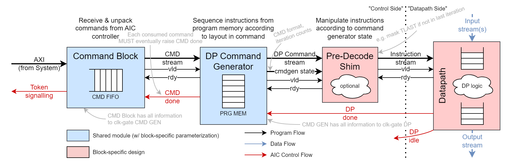
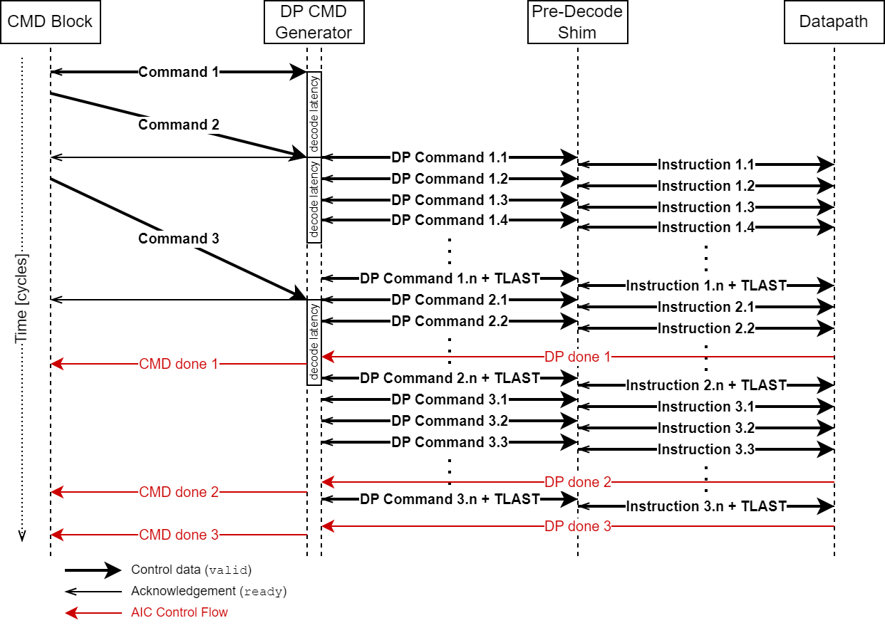
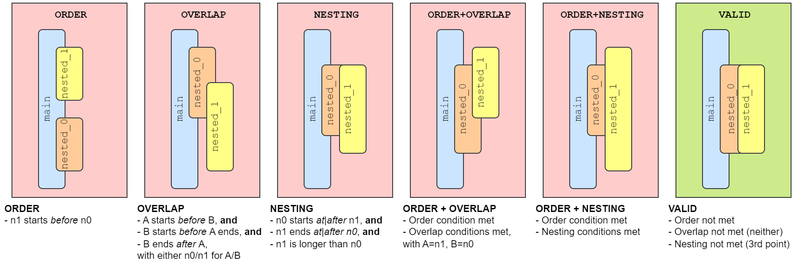
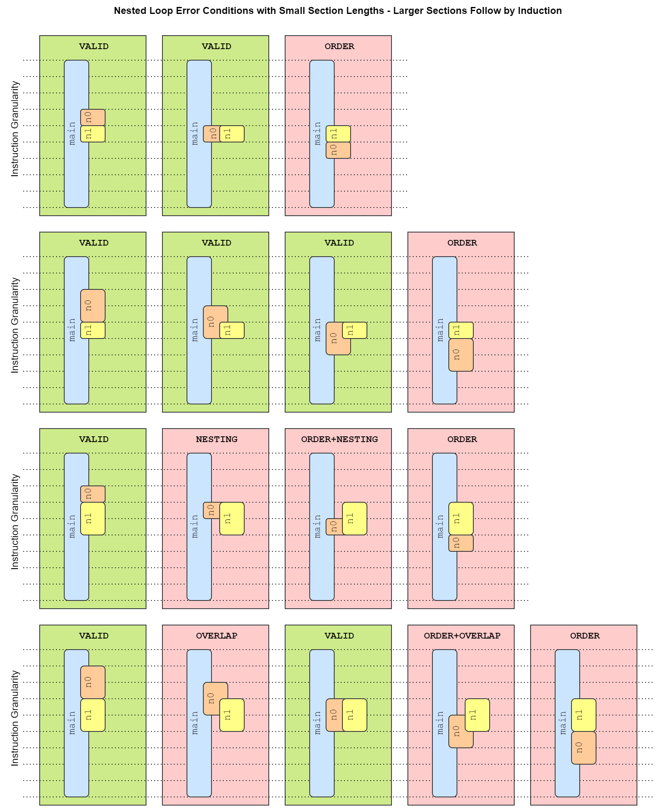

A single implementation for the datapath command generator block [AIC-DP-I2: Unification of Block Program Control (#195)](https://git.axelera.ai/prod/europa/-/issues/195),
the command formats of all purely instruction-based AI Core blocks (MVMExe, DWPU, IAU, DPU) are using these instructions.

!!! note "Specification Git Issues"

    These instructions were specified under these issues. The documentation here is based on them and streamlined:

    - [AIC-DP-F0.2: Unified and extended Instruction Looping](https://git.axelera.ai/prod/europa/-/issues/168)
    - [AIC-CTRL-I1: Review Command Encoding](https://git.axelera.ai/prod/europa/-/issues/189)
    - [AIC-DP-I2: Unification of Block Program Control](https://git.axelera.ai/prod/europa/-/issues/195)

## Architectural Specification

The unified command layouts and capabilities enables a single implementation of the datapath command generator that only
differs in simple block-specific parameterizations of depth/width of the program memory, for example. This allows for
delivering improvements and consistent behavior across all blocks at a reduced verification & implementation effort.

!!! abstract "Requirements"

    - Consistent behavior concerning loop nesting [AIC-DP-F0.2](https://git.axelera.ai/prod/europa/-/issues/168)
    - Variable loop level support [AIC-DP-F0.2](https://git.axelera.ai/prod/europa/-/issues/168)
    - Consistent behavior concerning program memory access
    - Consistent error handling across blocks
    - Consistent and correct behavior concerning cmd_done
    - Improved clock-gating for program memories, command generator, and datapath

The following diagram shows the general proposed program flow between the command block and the datapath.

This specification aims to generalize the "control side" of all AI Core blocks as much as possible while leaving all
block-specific behavior close to the "datapath side" of the block.

The following diagram shows an example control flow between the command block and the datapath, which is further
explained in the subsequent sections.

## Program Flow Signalling

Unifying the various behaviors found across the AI Core blocks, the program flow shall take the following form:

- `Command Block (Shared)`: Receives commands into the command FIFO through the AI Core's control AXI crossbar. Commands
  are defined as per [AIC-CTRL-I1](https://git.axelera.ai/prod/europa/-/issues/189) and
  [AIC-DP-F0.2](https://git.axelera.ai/prod/europa/-/issues/189).
- `DP Command Generator (Shared) (This)`: Sequences its program memory according to the command to produce cycle-by-cycle
  datapath commands.
- `Pre-Decode Shim (Block-Specific)`: Optionally amends/changes individual DP commands using the command generator state
  to produce the actual instructions the datapath will execute. Examples include changing the TLAST flag of
  output-stream-facing operations while the program is not in its last iteration.
- `Datapath (Block-Specific)`: The datapath executes the instructions on a fine-grained scale and has access to the
  input/output streams.

### Command Block / DP Command Generator Interface

The command block produces fully expanded commands as specified in [AIC-DP-F0.2](https://git.axelera.ai/prod/europa/-/issues/189)
as a command (CMD) stream.  In case the command format describes a program structure that does not use all command
fields, the command block fills in all spare fields with sensible defaults, allowing for the interpretation as a valid
fully expanded command.  Outside of detecting the `BYPASS` command, the command format is *not* required for proper
implementation of the DP command generator.

In the current implementation, each beat on the CMD stream signifies an entire program to be executed on the AI Core
block.  The interface is handshaken as per *AXI-Stream* rules.  There is no *TLAST* signal as each beat already contains
a complete program for execution.

### DP Command Generator / Pre-Decode Shim Interface

The DP Command Generator produces a cycle-by-cycle DP command stream as well as the command generator state along each
produced DP command.  The DP command consists of the contents of the program memory which has parametric width and depth
depending on the block.  The command generator state includes:

1. The command format in use to produce the DP commands:
    - The main purpose of providing the command format is only to signal the BYPASS command, and could just as well be
      done via a single flag.
    - The command format could be used in future implementations to communicate custom command formats that are handled
      in the pre-decode shim.
2. The config field from the command header.
3. The extra data present in the command.
4. The actual current loop iteration counters for the current main and all nested loops matching the emission of the DP
   command:
    - Loop iterations are counted in a zero-based fashion, thus the first iteration is iteration 0 and the last
      iteration of a loop is iteration `iter - 1`.
    - The current iteration count of nested loops shall be 0 while they are not being actively executed.
5. A flag indicating that the program is executing its last overall iteration, to be raised when:
    - The execution is in the last non-empty main loop of the program, **and**
    - The program is executing the last iteration of the current loop level, **and**
    - All the loops containing the currently executed loop are also in their last iteration.

The interface is handshaken as per AXI-Stream rules.  The TLAST signal indicates the last DP command in the program.

### Pre-Decode Shim / Datapath Interface

The Pre-Decode Shim produces the actual cycle-by-cyle instruction stream for the datapath.  The instructions can be
identical to the DP commands from the program memory, in which case the shim becomes a transparent pass-through block.
The instructions serve as the interface between the "control side" and "datapath side" of the block.  They hold all the
control data for the datapath for executing the individual steps of the program, and do not have access or any
dependency on the actual input/output stream data.

The interface is handshaken as per `AXI-Stream` rules. The TLAST signal indicates the last instruction in the program.

## AI Core Control Flow

The token system and other specific mechanisms exist to control & synchronize the execution across AI Core blocks.
These include, from the datapath towards the command block:

1. `DP Done`: The datapath signals when it has finished processing all instructions of a command
2. `CMD Done`: The DP command generator signals when a previously accepted command has finished executing

!!! note

    These control flow mechanisms are inherently pessimistic, i.e., they only guarantee that a command has
    finished processing before the time of assertion for synchronization purposes.  They are not precise as to exactly
    pin-pointing the cycle of the completion of a workload, and also don't imply that the datapath would not have been
    available to execute subsequent workloads before the assertion.  As such, they should not be used as the *sole*
    mechanism to determine when to dispatch a subsequent command when no external synchronization requirements exist.

## DMC Done

The aforementioned progress tracking and synchronization tasks are performed by the command block, which requires the
DP command generator to drive a `cmd_done` done signal toward the command block.  The CMD done signal is pulsed high for
one clock cycle once a command has finished processing.  The following requirements must be met:

- Every command that is sent to the DP command generator must eventually result in CMD done being signaled back by the
  DP command generator toward the command block.
- The CMD done **must not** be signaled before the command has finished processing.
- The command is considered as having finished processing if:
    - The datapath has raised dp_done for the program resulting from the command in case the DP command generator had
      emitted DP commands towards the datapath, **and**
    - The required actions for handling the command have been performed by the DP command generator in case emitting DP
      commands towards the datapath is not necessary, **and**
    - The DP command generator is ready to process further commands belonging to a subsequent program.
- The completion of command processing using CMD done must happen strictly in the order in which the commands were
  issued towards the DP command generator.

As such, the DP command generator shall track the number of in-flight programs on the datapath and ensure the correct
order of execution and completion signaling towards the command block.

Note that the above requirements apply to all regular operations on the block as well as cases of recoverable error
conditions that lead to the dropping (non-execution) of a command.  The only violation of these requirements may happen
in non-recoverable error conditions, see the section on [error handling](./#error-handling).

## Performance Requirements

The performance of workloads running on the datapath is influenced by various factors mainly induced by the program
itself and the availability of input/output streams.  Given that all program control flow is also facilitated through
streams, non-blocking latency may be added at will without necessarily degrading performance.  However, the
*control side* of the block program control shall not introduce any undue stalling when executing regular workloads in
a back-to-back fashion.  In particular, we distinguish the performance-criticality of the control side into two sections:

- **Command Side**: At the input side of the DP command generator, control is very granular ass one beat of the CMD
  stream holds an entire program to run.  It is admissible to process this information over multiple clock cycles
  (on the order of a few 10s of cycles even) in a blocking fashion to prepare the sequencing of the DP command generator
  while it is executing the previous command.  Once the preceding program has been sequenced, the already prepared
  waiting command can then immediately be processed.
- **Instruction Side**: At the output side of the DP command generator, control granularity is on a cycle-by-cycle basis,
  and thus each stall that is introduced in the DP command stream directly results in a stall in execution on the
  datapath.  Therefore, there must not be any stalling cycles during the sequencing of a program workload.

## Error Handling

Error conditions can occur at various stages of the program control flow and they shall be handled consistently across
all AI Core blocks as follows.

### CMD Block Errors

The command block FIFO can drop commands as per the command block specification and subsequently will raise a
`CMD_DROPPED` interrupt without sending any command toward the DP command generator.  The command block remains in a
consistent state and continues to serve further commands toward the datapath side.

### DP Command Generator Errors

The DP command generator has to parse the command provided by the command block and ensure it describes a valid and
sound program structure according to [AIC-DP-F0.2](https://git.axelera.ai/prod/europa/-/issues/189).  As such, it
determines the validity of the program before any part of the program is emitted to the datapath or architectural state
changes are made to the system.  It detects the following conditions and raises the respective interrupts:

| Error Name       | Description                                                                                                                         |
|:---------------- |:----------------------------------------------------------------------------------------------------------------------------------- |
| ILLEGAL_FORMAT   | The cmd_format field holds an illegal value.                                                                                        |
| EMPTY_PROGRAM    | The command results in a program with length 0.                                                                                     |
| MAIN0_LENGTH     | The first main loop overruns the program memory.                                                                                    |
| MAIN1_LENGTH     | The second main loop overruns the program memory.                                                                                   |
| MAIN2_LENGTH     | The third main loop overruns the program memory.                                                                                    |
| NESTED0_LENGTH   | The first nested loop overruns the program memory.                                                                                  |
| NESTED1_LENGTH   | The second nested loop overruns the program memory.                                                                                 |
| NESTED0_MAPPING  | The mapping of the first nested loop is illegal (wrong value in map_main field or mapped to an empty main loop).                    |
| NESTED1_MAPPING  | The mapping of the second nested loop is illegal (wrong value in map_main field or mapped to an empty main loop).                   |
| NESTED0_SEGFAULT | The first nested loop (partially) lies outside of its containing main loop.                                                         |
| NESTED1_SEGFAULT | The second nested loop (partially) lies outside of its containing main loop.                                                        |
| NESTED_ORDER     | The two nested loops within the same containing main loop are incorrectly ordered (second nested must not lie before first nested). |
| NESTED_NESTING   | The two nested loops within the same containing main loop are incorrectly nested (second nested must not contain first nested).     |
| NESTED_OVERLAP   | The two nested loops within the same containing main loop partially overlap.                                                        |

The following figures clarify the behaviour of the `NESTED_*` error conditions:

??? example "All Loop Error Combinations"

    

In addition to raising the respective interrupt, all of these conditions result in the DP command generator dropping the
command without executing it, signaling CMD done to the command block, and continuing to execute any further commands
that the command block may issue.  As such, all these conditions are considered recoverable errors as the datapath and
control blocks remain in a defined state.

### Datapath Errors

Error conditions encountered in the datapath are block-specific.  However, the general behavior of handling error
conditions on the datapath side must adhere to the following rules:

- All error conditions raise an interrupt (block-specific implementation).
- In case the error encountered in the datapath is recoverable, meaning that offending instructions can be skipped,
  the execution of the program safely aborted, or otherwise addressed such that all the datapaths in the AI Core remain
  in a consistent state, the datapath shall continue consuming/processing the entire instruction stream and terminate
  its execution by signaling DP done.
- In case the error encountered is unrecoverable, the datapath's behavior is undefined and intervention by the AI Core
  controller will be required (usually some form of reset).  There is currently no unified dedicated reset/flushing
  capability across AI Core blocks.

## Clock Gating Control

### Datapath

The datapath, in addition to signaling DP done upon completion of a program, shall signal a `DP idle` status flag,
which is asserted high iff:

- No in-flight commands or operations are being performed on the datapath, **and**
- No commands are pending in the datapath-internal instruction buffers/FIFOs, **and**
- No data are pending in the datapath-internal output data buffers/FIFOs, **and thus**
- The entire datapath module may safely be clock-gated.

Consequently, it follows that the following must hold in the datapath while DP idle is high:

- There are no valid data at any point of the datapath-internal pipeline
- There are no valid data pending in the datapath's output buffers/FIFOs
- The datapath is not signaling ready to accept more input data at the datapath's input buffers/FIFOs

This signal allows for safely clock-gating the entire datapath module in a self-gated fashion.

### DP Command Generator

Using the control information from tracking outstanding programs that are executing on the datapath and their `DP done`
signaling, in conjunction with the DP idle flag allows the DP command generator to drive a structural clock gate towards
the datapath in case the self-gated option above is not preferred.

### CMD Block

The command block analogously can drive a structural clock gate covering the DP command generator and all downstream
datapath logic by tracking outstanding commands and the respective CMD done signaling.

### Alternatives to Clock Gating

As the implementation tends to be leakage-dominated due to the area & technology node used, reducing the clock frequency
of unused AI Core blocks may be sufficient to achieve significant dynamic power savings comparable to gating the blocks
outright.
