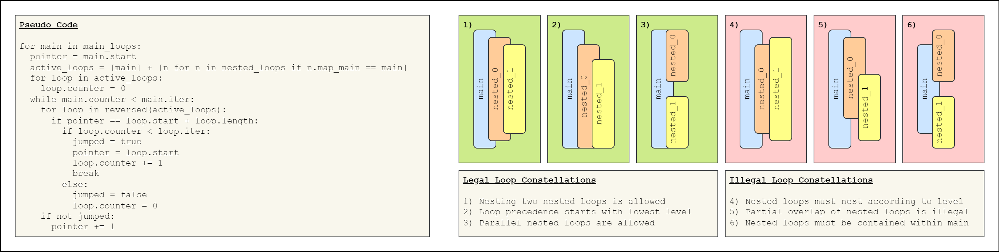
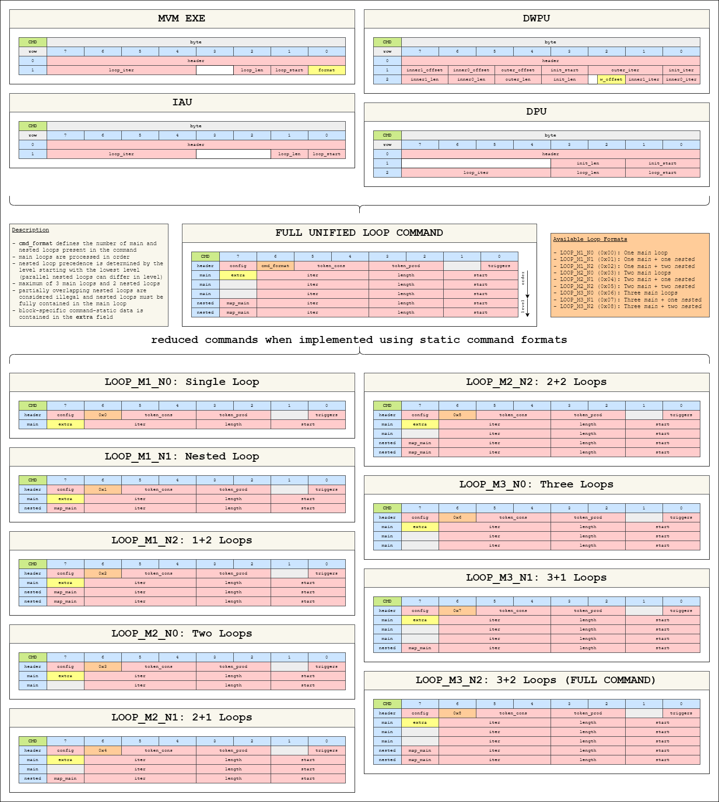

We have several instruction-based AI Core blocks with different looping support.  This enables looping support for
Transformer operations.

## Instruction-Based Loop Support

!!! quote "History of Instruction-based AI Core blocks (MVMExe, DWPU, IAU, DPU)"

    They used to implement all features with slightly differing program structures and implementations while essentially
    following the same operating principle. As such, the way to form commands for each block differed in the past.

The hardware tasked with processing these commands is the command block (cmdblock) which produces the command, and the
datapath command generator [aic_dp_cmd_gen](./microarchitecture/index.md) which interprets the program structure
described by the command and sequences instructions from the instruction memory towards the datapath.

## Specification

The following `AI-Core` blocks use this unified Looping structure:

- `MVMExe`
- `DWPU`
- `IAU`
- `DPU`

### Unified Loop Structure

A loop is defined by three parameters, its starting address in the block's DP command generator program memory (`start`),
the number of DP commands in the loop (`length`), and the number of iterations for which the loop runs (`iter`).
In case either the length or iter fields are `0`, the loop is considered *empty* and skipped.

Up to three independent main loops (labeled `main`) and a per-command total of up to two nested loop levels (labeled
`nested_0` and `nested_1`) can be configured in a unified command format.  The rules for valid loop constellations are
as follows:

- Each nested loop level is linked to exactly one main loop and must be fully contained within that main loop.
  It is considered *"active"* within that main loop. Multiple nested loops can be active in the same main loop.
- If two nested loops are active within the same main loop, they can be:
    - either completely nested within each other according to level (`nested_1` nested inside `nested_0`),
    - **or** completely parallel to each other according to level (`nested_1` after `nested_0`).
- Partially overlapping loops are **not** permitted.

The steps for processing the loops of a unified loop command are as follows:

1. If multiple main loops are present, they are processed sequentially according to their ordering within the command.
2. The processing of the main loop starts at its `start` address and is repeated for `iter` times in total.
3. When processing arrives at the `start` address of a nested loop, that nested loop is repeated for its `iter` times
   before resuming execution of the containing loop.
4. When the `start` address of two nested loops coincides, the lower-level `nested_1` loop is executed first.

These rules are illustrated in the following diagram:

### Unified Command Encoding

The full unified loop command holds descriptors for three main and two nested loops.  The command header is followed by
the command words of all main loops, followed by the command words for all nested loops.  The effective layout of the
program (i.e. which nested loops belong to which main loop) is determined from the `map_main` field in the command words
of the nested loops themselves, which holds the index (`0`, `1`, or `2`) of the respective main loop.

For reducing the size of commands, the reduced unified loop command uses the `cmd_format` field in the command header to
encode the variable number of `main` & `nested` loops possible.  These commands only contain the necessary command words
for the loops actually present in the program, and are subsequently expanded into the full unified loop command
(with 3 main & 2 nested loops) by the command block with unused loops being encoded as *empty* loops.

As such, the command header encodes the length and layout of the program information in the command block storage itself
and can be implemented using the already present static command format feature.

The unified encoding follows the command header unification from [AIC-CTRL-I1](https://git.axelera.ai/prod/europa/-/issues/189).

??? example "Mapping from block-specific Commands"

    

#### LOOP_M1_N0: Single Loop

Command Format: `0x0`

#### LOOP_M1_N1: Nested Loop

Command Format: `0x1`

#### LOOP_M1_N2: 1+2 Loops

Command Format: `0x2`

#### LOOP_M2_N0: Two Loops

Command Format: `0x3`

#### LOOP_M2_N1: 2+1 Loops

Command Format: `0x4`

#### LOOP_M2_N2: 2+2 Loops

Command Format: `0x5`

#### LOOP_M3_N0: Three Loops

Command Format: `0x6`

#### LOOP_M3_N1: 3+1 Loops

Command Format: `0x7`

#### LOOP_M3_N2: 3+2 Loops (FULL COMMAND)

Command Format: `0x8`

#### BYPASS: Bypass

Set the respective datapath into stream bypass mode.

Command Format: `0x9`

