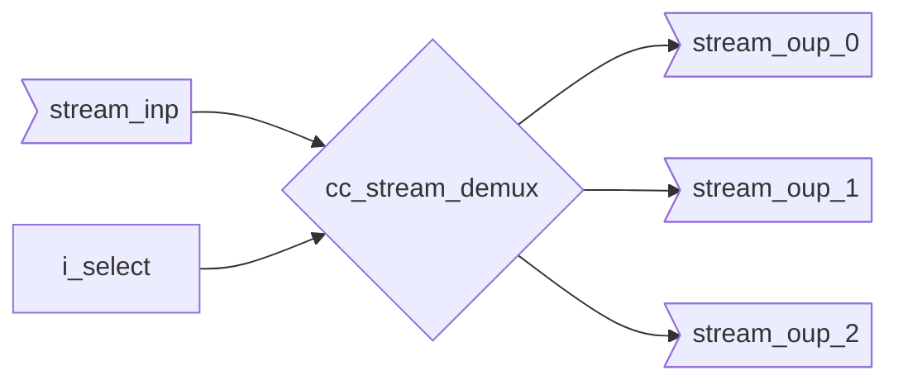

# Stream Demultiplexer (cc_stream_demux{_unpack})

The stream data runns outside the module, as usually it can directly be connected to the respective destination.

The output will switch when `i_select` is not stable in regards to the input handshaking.
The output will only be selected if `i_select` falls in a valid index range.

::: hw/ip/common_cell_library/default/rtl/cc_stream_demux.sv:cc_stream_demux

::: hw/ip/common_cell_library/default/rtl/cc_stream_demux.sv:cc_stream_demux_unpack
