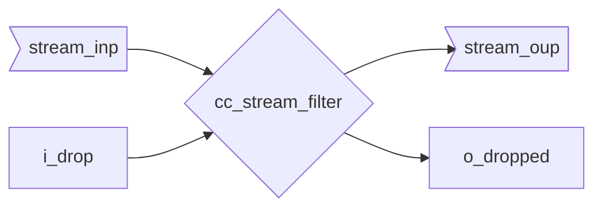

::: hw/ip/common_cell_library/default/rtl/cc_stream_filter.sv:cc_stream_filter

## Operation Principle

The data runs outside the module, as only the handshaking needs to be affected when dropping stream items.

