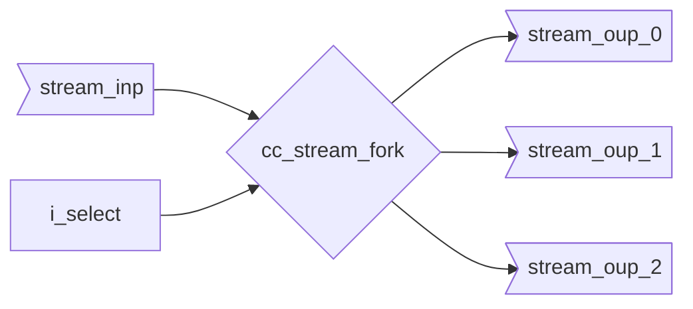

::: hw/ip/common_cell_library/default/rtl/cc_stream_fork.sv:cc_stream_fork

## Operation Principle

The data runs outside the module. A common use case for this is to distribute one stream item to multiple other streams.
The input `o_ready` is only asserted when all respective selected output handshakes `o_valid[i] && i_ready[i]` have
been asserted once.
If an output stream is not selected the respective output handshake does not trigger, even if the respective input
stream is asserted.
