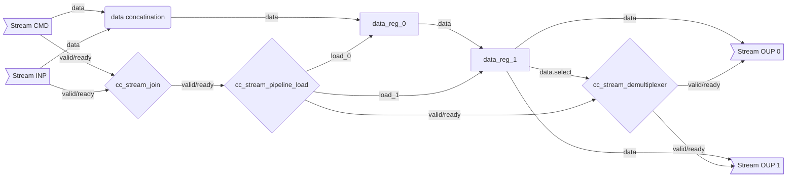

Common generic streaming modules which use an AXI-like valid/ready handshaking.

## Handshake Behavior

A stream is defined as a combination of 3 signals:

* `data_t data`: Payload data transferred from `upstream/source/manager` to `downstream/sink/subordinate`.
  * This signal is desired to be stable when the corresponding `valid` handshake signal is asserted. However depending on the functionality this is not a hard requirement.
* `logic valid`: Handshake signal from `upstream/source/manager` to `downstream/sink/subordinate` to indicate validity to transfer the `data`.
  * This signal when set by a source module (`valid_o`) **must not** depend on the corresponding `ready_i`. This is to prevent deadlocks in the handshaking. However it is allowed to combinatorically depend on another `valid_i` originating upstream.
  * Unlike AXI can be de-asserted when valid. This is a more general assumption and allows for example to implement a flushing capability.
* `logic ready`: Handshake signal from `downstream/sink/subordinate` to `upstream/source/manager` to indicate readiness to transfer the `data`.
  * This signal is allowed to combinatorically depend on the corresponding `valid` signal.

Here few examples how this handshaking plays out:

## Stream Network

These modules are intended to be instantiated together to form all sorts of different streaming networks. Datapath functionality is usually implemented on the outside and can be custom to the respective IP which uses them. An example network could look something like:

A control stream is joined with a data stream. Then the data is pipelined for arithmetic computation. A select signal from the data chooses which output streams the data flows onto.
