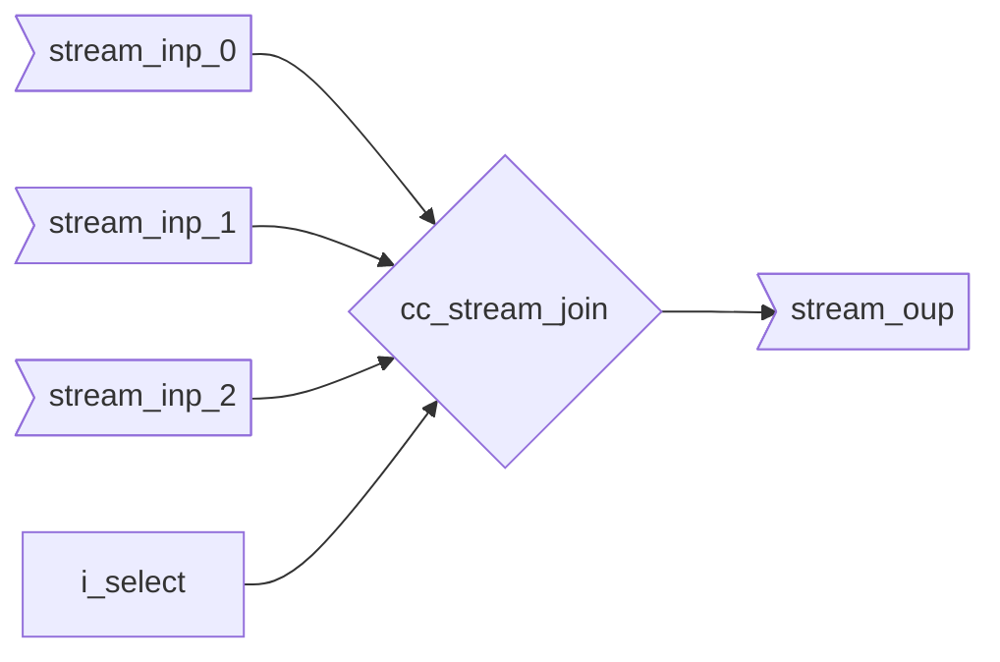

::: hw/ip/common_cell_library/default/rtl/cc_stream_join.sv:cc_stream_join

## Operation Principle

The data runs outside the module. A common use case for this is to cycle synchronize data from multiple input streams into one.
The output `o_valid` is only asserted when all respective selected input `i_valid[i]` are asserted. The ready acknowledgement from downstream happens upstream at the same time.
If an input stream is not selected the handshake does not trigger, even if the respective stream is asserted.
