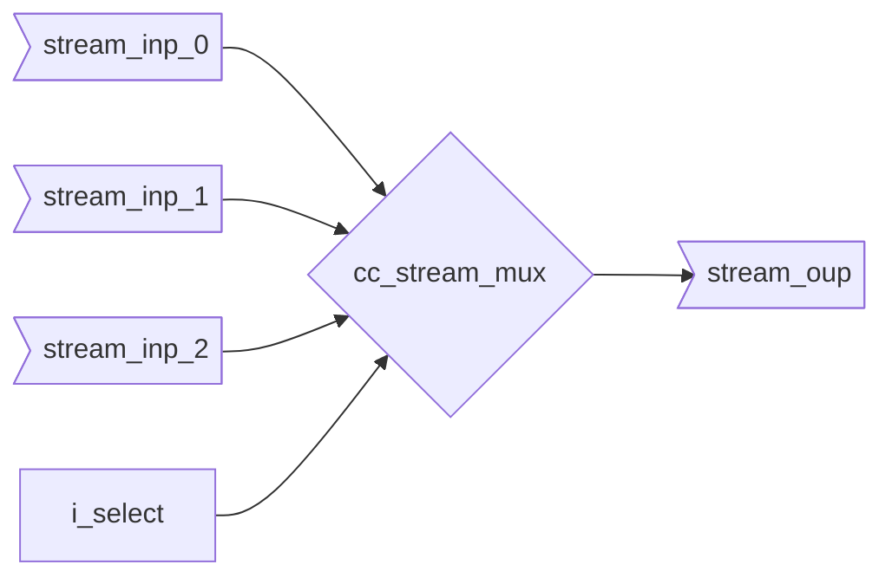

# Stream Multiplexer (cc_stream_mux{_unpack})

The data runs *inside* this module as it needs to be selected. The module makes sure that the output
is always sane regardles of parameterization and incorrect access. So for non-power of 2 number of
input streams, accessing an index outside the mapped range will default onto stream 0 for the data.
The valid will not propagate in this case.
The output will switch when `i_select` is not stable in regards to the input handshaking.

::: hw/ip/common_cell_library/default/rtl/cc_stream_mux.sv:cc_stream_mux

::: hw/ip/common_cell_library/default/rtl/cc_stream_mux.sv:cc_stream_mux_unpack
