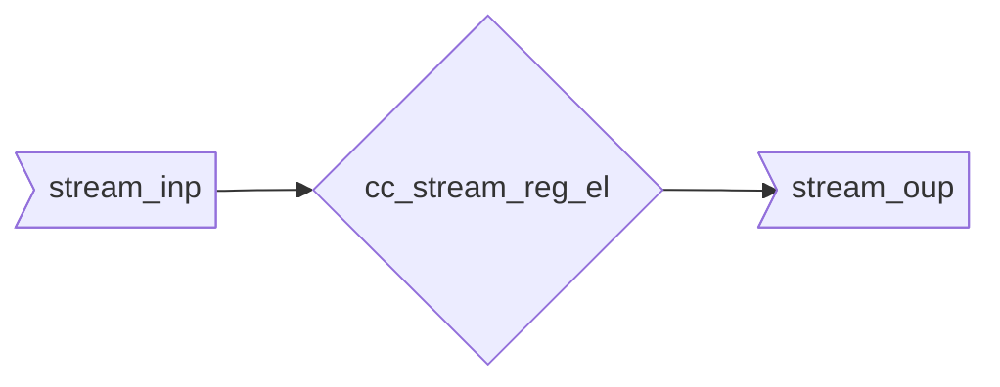

::: hw/ip/common_cell_library/default/rtl/cc_stream_reg_el.sv:cc_stream_reg_el:parameter_table

## Operation Principle

This module does not cut any timing paths between its inputs and outputs.

## Example Waveforms

To illustrate the workings of this fall-through register, the following waves show some example transactions:

