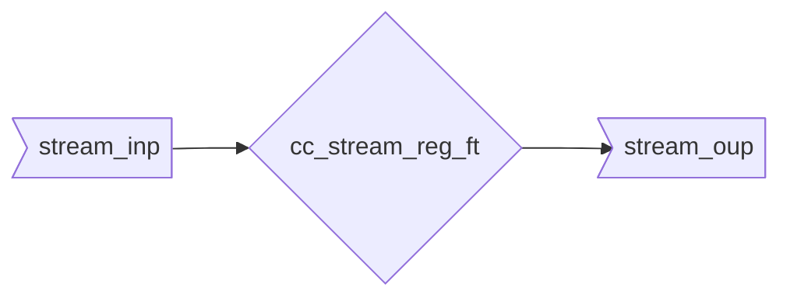

::: hw/ip/common_cell_library/default/rtl/cc_stream_reg_ft.sv:cc_stream_reg_ft

## Operation Principle

This module does cut the timing path on the `ready` signals going from downstream to upstream. There are combinational paths from upstream to downstream.

## Example Waveforms

To illustrate the workings of this fall-through register following waves show three examples of transactions between it's input and output stream.

1. Singe transaction where the downstream acknowledges in the same cycle.
2. Single transaction where the output stream is stalled for one cycle. The data is cunsumed directly, as the upsream ready is driven by the module state.
2. Back to back transactions are possible.

