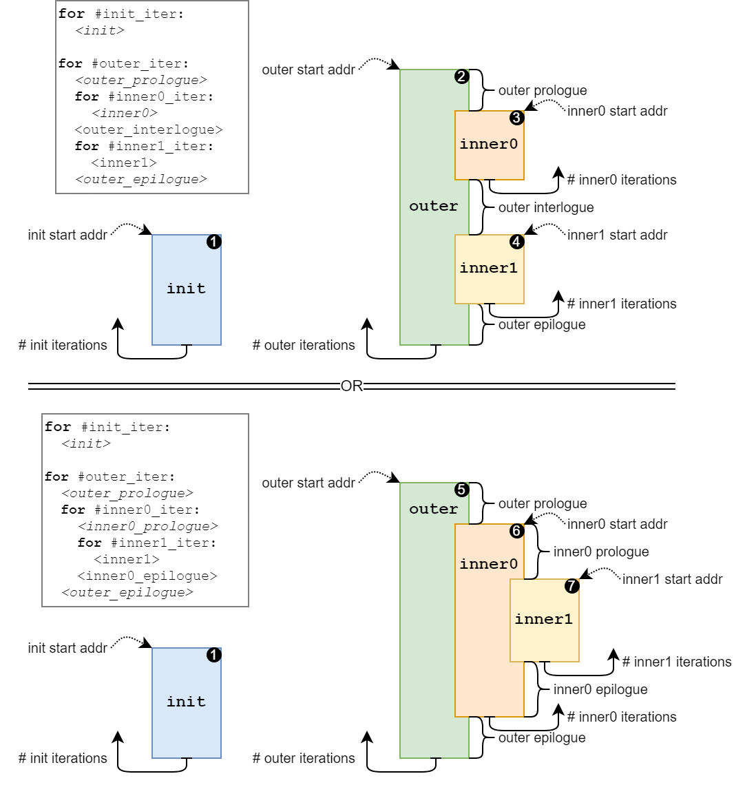

**TODO(@wolfgang.roenninger): Update this when the command generation gets replaced by `aic_dp_cmd_gen`!**

Here the `DWPU's` *instructions* and *commands* are described here.

## Instruction Encoding

DWPU instruction encoding is reduced compared to Alpha and now is laid out as follows (when viewed from the 8-Byte wide
offloading side):

<table class="tg">
<thead>
  <tr>
    <th class="tg-amwm"></th>
    <th class="tg-amwm">Byte 7</th>
    <th class="tg-amwm">Byte 6</th>
    <th class="tg-amwm">Byte 5</th>
    <th class="tg-amwm">Byte 4</th>
    <th class="tg-amwm">Byte 3</th>
    <th class="tg-amwm">Byte 2</th>
    <th class="tg-amwm">Byte 1</th>
    <th class="tg-amwm">Byte 0</th>
  </tr>
</thead>
<tbody>
  <tr>
    <td class="tg-baqh">1</td>
    <td class="tg-baqh" colspan="7">W_SEL</td>
    <td class="tg-baqh">OP_DESC</td>
  </tr>
  <tr>
    <td class="tg-baqh">2</td>
    <td class="tg-baqh" colspan="8">I_SEL</td>
  </tr>
</tbody>
</table>

### `OP_DESC`: Information about the operation

Is packed into one byte and defines as follows:

<table class="tg">
<thead>
  <tr>
    <th class="tg-amwm">Bit 7</th>
    <th class="tg-amwm">Bit 6</th>
    <th class="tg-amwm">Bit 5</th>
    <th class="tg-amwm">Bit 4</th>
    <th class="tg-amwm">Bit 3</th>
    <th class="tg-amwm">Bit 2</th>
    <th class="tg-amwm">Bit 1</th>
    <th class="tg-amwm">Bit 0</th>
  </tr>
</thead>
<tbody>
  <tr>
    <td class="tg-baqh" colspan="2">rsvd</td>
    <td class="tg-baqh">last_push</td>
    <td class="tg-baqh">shift_wb</td>
    <td class="tg-baqh">shift_sp</td>
    <td class="tg-baqh">op_exe</td>
    <td class="tg-baqh" colspan="2">opcode</td>
  </tr>
</tbody>
</table>

* `opcode`: The computational operation to execute, which is one of:
    * `2'h0 - SOP`: Multiply SP and WB operand values and compute the sum of products
    * `2'h1 - SUM`: Sum up SP operand values
    * `2'h2 - MAX`: Determine the maximum SP operand value
    * `2'h3 - MIN`: Determine the minimum SP operand value
* `op_exe`: Enable executing the operation.
    * `1'b1`: The operation in OP is executed and the result is pushed to the output stream.
    * `1'b0`: Nothing is pushed to the output stream.
    * :a: Used to be called push_res in Alpha
* `shift_sp`: Shift all values in `SP` registers to the next higher address, popping a value from the input stream and inserting it at `sp2`.
* `shift_wb`: Shift all values in `WB` registers to the next higher address, popping a value from the input stream and inserting it at `wb0`.
* `last_push`: Controls the TLAST flag when pushing a result to the output stream.
    * Has no effect when op_exe is 1'b0.
* `rsvd`: Reserved for future use

### `W_SEL`: Select from the Weight Buffer

`W_SEL` contains the nine weight operand addresses packed across the remaining 56 bits of the first word:

<table class="tg">
<thead>
  <tr>
    <th class="tg-amwm">63</th>
    <th class="tg-amwm">62</th>
    <th class="tg-amwm">61</th>
    <th class="tg-amwm">60</th>
    <th class="tg-amwm">59</th>
    <th class="tg-amwm">58</th>
    <th class="tg-amwm">57</th>
    <th class="tg-amwm">56</th>
    <th class="tg-amwm">55..14</th>
    <th class="tg-amwm">13</th>
    <th class="tg-amwm">12</th>
    <th class="tg-amwm">11</th>
    <th class="tg-amwm">10</th>
    <th class="tg-amwm">09</th>
    <th class="tg-amwm">08</th>
  </tr>
</thead>
<tbody>
  <tr>
    <td class="tg-baqh" colspan="2">rsvd</td>
    <td class="tg-baqh" colspan="6">w_sel[8]</td>
    <td class="tg-baqh">...</td>
    <td class="tg-baqh" colspan="6">w_sel[0]</td>
  </tr>
</tbody>
</table>

The fields within `W_SEL` are as follows:

* `w_sel[i]`: 6-bit weight buffer address of the weight operand for operand pair *i
* `rsvd`: *Reserved for future use*

### `I_SEL`: Select from the Scratch-Pad Registers

`I_SEL` contains the nine image operand addresses packed across the second 8-byte word:

<table class="tg">
<thead>
  <tr>
    <th class="tg-amwm">63</th>
    <th class="tg-amwm">62</th>
    <th class="tg-amwm">61</th>
    <th class="tg-amwm">60</th>
    <th class="tg-amwm">59</th>
    <th class="tg-amwm">58</th>
    <th class="tg-amwm">57</th>
    <th class="tg-amwm">56</th>
    <th class="tg-amwm">55..07</th>
    <th class="tg-amwm">06</th>
    <th class="tg-amwm">05</th>
    <th class="tg-amwm">04</th>
    <th class="tg-amwm">03</th>
    <th class="tg-amwm">02</th>
    <th class="tg-amwm">01</th>
    <th class="tg-amwm">00</th>
  </tr>
</thead>
<tbody>
  <tr>
    <td class="tg-baqh">rsvd</td>
    <td class="tg-baqh" colspan="7">i_sel[8]</td>
    <td class="tg-baqh">...</td>
    <td class="tg-baqh" colspan="7">i_sel[0]</td>
  </tr>
</tbody>
</table>

The fields within `I_SEL` are as follows:

* `i_sel[i]`: 7-bit scratchpad address of the image operand for operand pair *i*
* `rsvd`: *Reserved for future use*

## Software Instruction FIFO

The software instruction FIFO is used for bypassing the data path command generation block. The 193-bit instructions
are stored in the software instruction FIFO which holds up to `ai_core_pkg::GEN_CMDB_BP_CMD_FIFO_DEPTH` command entries.

The FIFO is implemented using the common command FIFO block IP. Refer to the [CMD Block](TODO:@review were do I find this?) documentation for
implementation details. For switching between regular operation and the software bypass mode, refer to the
[programming flow](TODO:@review were do I find this?) document.

### Software Data Path Command Format

The software instruction FIFO holds 193-bit instructions which mapped into the memory map as shown below. The
instruction consists of the instruction described above with the added `channel_enable` field. From the AXI4
configuration port point of view, each instruction spans 3 consecutive words of memory space. However, from the DWPU
data path point of view, the instruction memory is instruction-addressed and produces the entire 193-bit instruction
data at once.

<table class="tg">
<thead>
  <tr>
    <th class="tg-amwm"></th>
    <th class="tg-amwm">Byte 7</th>
    <th class="tg-amwm">Byte 6</th>
    <th class="tg-amwm">Byte 5</th>
    <th class="tg-amwm">Byte 4</th>
    <th class="tg-amwm">Byte 3</th>
    <th class="tg-amwm">Byte 2</th>
    <th class="tg-amwm">Byte 1</th>
    <th class="tg-amwm">Byte 0</th>
  </tr>
</thead>
<tbody>
  <tr>
    <td class="tg-baqh">1</td>
    <td class="tg-baqh" colspan="7">W_SEL</td>
    <td class="tg-baqh">OP_DESC</td>
  </tr>
  <tr>
    <td class="tg-baqh">2</td>
    <td class="tg-baqh" colspan="8">I_SEL</td>
  </tr>
  <tr>
    <td class="tg-baqh">3</td>
    <td class="tg-baqh" colspan="8">channel_enable</td>
  </tr>
  <tr>
    <td class="tg-baqh">4</td>
    <td class="tg-baqh" colspan="7">unused</td>
    <td class="tg-baqh">TLAST (bit[0])</td>
  </tr>
</tbody>
</table>

The software data path command holds the entire instruction memory entry as shown above. Additionally it provides
fields that would be driven from the data-path command generator.

!!! info "Additional software instruction fields."

    * `channel_enable`: Contains the bitmask for channel enable signals.
    * `TLAST`: Will terminate the command stream if it's LSB is set.

!!! danger "Entering bypass mode is not supported for software instructions."

## Command Descriptor Format

The command descriptor is extended with another loop dimension and changed in layout compared to Alpha with the goal of
reducing the command descriptor size by limiting the ranges of possible values to actually used options.

!!! info "General Program Rules"

    * Addresses / Offsets are limited to 10-bit fields, (max. 1024 instruction depth)
        * Address offsets are now relative to `outer_start` to simplify program relocation
    * Section lengths are limited to 10-bit fields (max. 1024 instruction depth)
        * Sections must not run over the end of the instruction memory (no wraparound)
    * Iterations for initialization and inner loops are limited to 8-bit fields (we usually iterate over a maximum of 126 useable SP slots)
    * Iterations for the outer loop are limited to 16-bit fields (max. 216 PWORDs in L1)
    * The canonical way of disabling sections is setting all its fields to 0, however, fields are handled individually:
        * A `*_len` of `0` causes the section to be skipped over
        * An `*_iter` count of `0` causes the section to be skipped over
        * An `*_offset` of `0` safely places the section within the previous section [if applicable]

### Program Layout Rules

The `DWPU` program consists of four loopable sections: `init`, `outer`, `inner0`, and `inner1`. While `init` and `outer`
are *independent* sections, `inner0` and `inner1` are *contained* within `outer`.

!!! info "The following rules apply to all program sections:"

    * Let `*_start` signify the first instruction within section `X`.
    * Let `*_end` signify the last instruction within section `X`:
        * `*_end` = `*_start` + `*_len` -1.
    * Section `X` must not overrun the instruction memory:
        * `*_end` < `INSTR_MEM_SIZE`
    * Section `X` is considered present if it has non-zero length and iteration count:
        * `X` present iff `*_len` > 0 and `*_iter` > 0.

!!! info "For the contained sections `inner*`, the following applies:"

    * If either `inner*` section is present, `outer` must be present.
    * Both `inner*` sections must be completely contained within `outer`.
    * For `inner1` to be present `inner0` must also be present.
    * `inner1` must occur after `inner0` in the program flow:
        * `inner1_start` >= `inner0_start`
    * To ensure correct behavior, `inner*` sections must not partially overlap:
        * `inner1` must lie completely within `inner0`, or
        * `inner1` must lie completely outside of `inner0`.

### Program Execution Rules

The program execution follows simple rules that only deviate depending on whether sections are contained or independent.

!!! info

    * Only present sections are executed.
    * Independent sections are executed in sequence (first init, then outer).
        * Each independent section X is executed X_iter times before moving on to the next section.
    * Contained sections inner* within outer are treated as follows:
        * Once the program counter reaches the starting address inner*_start of a contained section, it is entered and executed for inner*_iter iterations.
        * If both sections start at the same address, the innermost contained section is entered.

The resulting generalized program structures are shown below:

### Command Header

The command header has the following structure:

<table class="tg">
<thead>
  <tr>
    <th class="tg-7btt"></th>
    <th class="tg-7btt">Byte 07</th>
    <th class="tg-7btt">Byte 06</th>
    <th class="tg-7btt">Byte 05</th>
    <th class="tg-7btt">Byte 04</th>
    <th class="tg-7btt">Byte 03</th>
    <th class="tg-7btt">Byte 02</th>
    <th class="tg-7btt">Byte 01</th>
    <th class="tg-amwm">Byte 00</th>
  </tr>
</thead>
<tbody>
  <tr>
    <td class="tg-c3ow">0</td>
    <td class="tg-c3ow">reserved</td>
    <td class="tg-c3ow">cmd_format</td>
    <td class="tg-c3ow" colspan="2">token_cons</td>
    <td class="tg-c3ow" colspan="2">token_prod</td>
    <td class="tg-c3ow" colspan="2">id</td>
  </tr>
</tbody>
</table>

The complete/standard command has the command format 0. The following additional formats are available.

### `Format 0`: Full command

<table class="tg">
<thead>
  <tr>
    <th class="tg-c3ow"></th>
    <th class="tg-7btt" colspan="2">Byte 7</th>
    <th class="tg-7btt" colspan="2">Byte 6</th>
    <th class="tg-7btt" colspan="2">Byte 5</th>
    <th class="tg-7btt" colspan="2">Byte 4</th>
    <th class="tg-7btt" colspan="2">Byte 3</th>
    <th class="tg-7btt" colspan="2">Byte 2</th>
    <th class="tg-7btt" colspan="2">Byte 1</th>
    <th class="tg-7btt" colspan="2">Byte 0</th>
  </tr>
</thead>
<tbody>
  <tr>
    <td class="tg-c3ow">0</td>
    <td class="tg-c3ow" colspan="16">header</td>
  </tr>
  <tr>
    <td class="tg-c3ow">1</td>
    <td class="tg-c3ow" colspan="3">inner1_offset</td>
    <td class="tg-c3ow" colspan="2">inner0_offset</td>
    <td class="tg-c3ow" colspan="3">outer_offset</td>
    <td class="tg-c3ow" colspan="2">init_start</td>
    <td class="tg-c3ow" colspan="4">outer_iter</td>
    <td class="tg-c3ow" colspan="2">init_iter</td>
  </tr>
  <tr>
    <td class="tg-c3ow">2</td>
    <td class="tg-c3ow" colspan="3">inner1_len</td>
    <td class="tg-c3ow" colspan="2">inner0_len</td>
    <td class="tg-c3ow" colspan="3">outer_len</td>
    <td class="tg-c3ow" colspan="2">init_len</td>
    <td class="tg-c3ow" colspan="2">w_offset</td>
    <td class="tg-c3ow" colspan="2">inner1_iter</td>
    <td class="tg-c3ow" colspan="2">inner0_iter</td>
  </tr>
  <tr>
    <td class="tg-c3ow">3</td>
    <td class="tg-c3ow" colspan="16">channel_enable</td>
  </tr>
</tbody>
</table>

`w_offset` contains the weight offset:

<table class="tg">
<thead>
  <tr>
    <th class="tg-7btt">Bit 07</th>
    <th class="tg-7btt">Bit 06</th>
    <th class="tg-7btt">Bit 05</th>
    <th class="tg-7btt">Bit 04</th>
    <th class="tg-7btt">Bit 03</th>
    <th class="tg-7btt">Bit 02</th>
    <th class="tg-7btt">Bit 01</th>
    <th class="tg-7btt">Bit 00</th>
  </tr>
</thead>
<tbody>
  <tr>
    <td class="tg-c3ow" colspan="2">rsvd</td>
    <td class="tg-c3ow" colspan="6">w_offset</td>
  </tr>
</tbody>
</table>

!!! info "The fields within `w_offset` are a follows:"

    * `w_offset` (*6 bit*): The address offset to apply to all weight buffer addresses found in the program for multi-weight-set computation.
    * `rsvd` (*2 bit*): *Reserved for future use*

!!! info "`init_*` defines the first independent section of the program."

    * `init_start` (*10 bit*): **Instruction address** of the first instruction in the `init` section.
    * `init_len` (*10 bit*): Length of the `init` section in the number of instructions.
    * `init_iter` (*8 bit*): Number of iterations in the `init` section.

!!! info "`outer_*` defines the second independent section of the program."

    * `outer_offset` (*signed 10 bit*): **Offset** to the start of `init` of the first instruction in the outer section:
        * `outer_start` = `init_start` + `outer_offset`, modulo wrapping to instruction memory depth applies
    * `outer_len` (*10 bit*): Length of the `outer` section in the number of instructions.
    * `outer_iter` (*16 bit*): Number of iterations in the `outer` section.

!!! info "`inner0_*` defines the first contained section of the program."

    * `inner0_offset` (*unsigned 10 bit*): **Offset** within `outer` of the first instruction in the `inner0` section:
        * `inner0_start` = `outer_start` + `inner0_offset`
    * `inner0_len` (*10 bit*): Length of the `inner0` section in the number of instructions.
    * `inner0_iter` (*8 bit*): Number of iterations in the `inner0` section.
    * :exclamation: `inner0` must be entirely contained within `outer`:
        * `inner0_start` >= `outer_start` (by design)
        * `inner0_end` <= `outer_end`

!!! info "`inner1_*` defines the first contained section of the program."

    * For `inner1` to be present, `inner0` must be present also.
    * `inner1_offset` (*unsigned 10 bit*): **Offset** within `outer` of the first instruction in the `inner1` section:
        * `inner1_start` = `outer_start` + `inner1_offset`
    * `inner1_len` (*10 bit*): Length of the `inner0` section in the number of instructions.
    * `inner1_iter` (*8 bit*): Number of iterations in the `inner1` section.
    * :exclamation: `inner1` must be entirely contained within `outer`, and not partially overlap `inner0`:
        * `inner0_start` >= `outer_start` (by design)
        * `inner0_end` <= `outer_end`
        * if `inner1_start` inside [`inner0_start`, `inner0_end`], then `inner1_end` <= `inner0_end`

!!! info "`channel_enable` contains a bitmask to individually enable or disable each of the 64 channels in the DWPU for power saving."

### `Format 1`: Bypass-Only

A zero-length descriptor enabels the bypass mode of the DWPU. The datapath forwards the next stream to the output, sign
extending depending on the CSR configuration.

<table class="tg">
<thead>
  <tr>
    <th class="tg-c3ow"></th>
    <th class="tg-7btt" colspan="2">Byte 7</th>
    <th class="tg-7btt" colspan="2">Byte 6</th>
    <th class="tg-7btt" colspan="2">Byte 5</th>
    <th class="tg-7btt" colspan="2">Byte 4</th>
    <th class="tg-7btt" colspan="2">Byte 3</th>
    <th class="tg-7btt" colspan="2">Byte 2</th>
    <th class="tg-7btt" colspan="2">Byte 1</th>
    <th class="tg-7btt" colspan="2">Byte 0</th>
  </tr>
</thead>
<tbody>
  <tr>
    <td class="tg-c3ow">0</td>
    <td class="tg-c3ow" colspan="16">header</td>
  </tr>
</tbody>
</table>

### `Format 2`: Init & Loop

A 1-long descriptor with an initialization section followed by only one loop dimension (`outer`), setting all `inner*`
fields to 0. `outer_iter` is limited to 8 bits. `channel_enable` is set to all ones.

!!! warning "`outer_iter` is limited to 8 bits!"

!!! tip "`channel_enable` is set to all ones!"

<table class="tg">
<thead>
  <tr>
    <th class="tg-c3ow"></th>
    <th class="tg-7btt" colspan="2">Byte 7</th>
    <th class="tg-7btt" colspan="2">Byte 6</th>
    <th class="tg-7btt" colspan="2">Byte 5</th>
    <th class="tg-7btt" colspan="2">Byte 4</th>
    <th class="tg-7btt" colspan="2">Byte 3</th>
    <th class="tg-7btt" colspan="2">Byte 2</th>
    <th class="tg-7btt" colspan="2">Byte 1</th>
    <th class="tg-7btt" colspan="2">Byte 0</th>
  </tr>
</thead>
<tbody>
  <tr>
    <td class="tg-c3ow">0</td>
    <td class="tg-c3ow" colspan="16">header</td>
  </tr>
  <tr>
    <td class="tg-c3ow">1</td>
    <td class="tg-c3ow" colspan="3">outer_len</td>
    <td class="tg-c3ow" colspan="2">outer_offset</td>
    <td class="tg-c3ow" colspan="2">init_len</td>
    <td class="tg-c3ow" colspan="3">init_start</td>
    <td class="tg-c3ow" colspan="2">outer_iter</td>
    <td class="tg-c3ow" colspan="2">init_iter</td>
    <td class="tg-c3ow" colspan="2">w_offset</td>
  </tr>
</tbody>
</table>

### `Format 3`: Nested Loop

A 1-long descriptor with two loop dimensions (`outer` and `inner0`), setting all `init_*` and `inner1_*` fields to 0.

!!! warning "`outer_iter` is limited to 8 bits!"

!!! tip "`channel_enable` is set to all ones!"

<table class="tg">
<thead>
  <tr>
    <th class="tg-c3ow"></th>
    <th class="tg-7btt" colspan="2">Byte 7</th>
    <th class="tg-7btt" colspan="2">Byte 6</th>
    <th class="tg-7btt" colspan="2">Byte 5</th>
    <th class="tg-7btt" colspan="2">Byte 4</th>
    <th class="tg-7btt" colspan="2">Byte 3</th>
    <th class="tg-7btt" colspan="2">Byte 2</th>
    <th class="tg-7btt" colspan="2">Byte 1</th>
    <th class="tg-7btt" colspan="2">Byte 0</th>
  </tr>
</thead>
<tbody>
  <tr>
    <td class="tg-c3ow">0</td>
    <td class="tg-c3ow" colspan="16">header</td>
  </tr>
  <tr>
    <td class="tg-c3ow">1</td>
    <td class="tg-c3ow" colspan="3">inner0_len</td>
    <td class="tg-c3ow" colspan="2">inner0_offset</td>
    <td class="tg-c3ow" colspan="2">outer_len</td>
    <td class="tg-c3ow" colspan="3">outer_offset</td>
    <td class="tg-c3ow" colspan="2">inner0_iter</td>
    <td class="tg-c3ow" colspan="2">outer_iter</td>
    <td class="tg-c3ow" colspan="2">w_offset</td>
  </tr>
</tbody>
</table>

### `Format 4`: Full command on all channels

A 2-long descriptor with all sections found in the full descriptor on all channels active.

!!! tip "`channel_enable` is set to all ones!"

<table class="tg">
<thead>
  <tr>
    <th class="tg-c3ow"></th>
    <th class="tg-7btt" colspan="2">Byte 7</th>
    <th class="tg-7btt" colspan="2">Byte 6</th>
    <th class="tg-7btt" colspan="2">Byte 5</th>
    <th class="tg-7btt" colspan="2">Byte 4</th>
    <th class="tg-7btt" colspan="2">Byte 3</th>
    <th class="tg-7btt" colspan="2">Byte 2</th>
    <th class="tg-7btt" colspan="2">Byte 1</th>
    <th class="tg-7btt" colspan="2">Byte 0</th>
  </tr>
</thead>
<tbody>
  <tr>
    <td class="tg-c3ow">0</td>
    <td class="tg-c3ow" colspan="16">header</td>
  </tr>
  <tr>
    <td class="tg-c3ow">1</td>
    <td class="tg-c3ow" colspan="3">inner1_offset</td>
    <td class="tg-c3ow" colspan="2">inner0_offset</td>
    <td class="tg-c3ow" colspan="3">outer_offset</td>
    <td class="tg-c3ow" colspan="2">init_start</td>
    <td class="tg-c3ow" colspan="4">outer_iter</td>
    <td class="tg-c3ow" colspan="2">init_iter</td>
  </tr>
  <tr>
    <td class="tg-c3ow">2</td>
    <td class="tg-c3ow" colspan="3">inner1_len</td>
    <td class="tg-c3ow" colspan="2">inner0_len</td>
    <td class="tg-c3ow" colspan="3">outer_len</td>
    <td class="tg-c3ow" colspan="2">init_len</td>
    <td class="tg-c3ow" colspan="2">w_offset</td>
    <td class="tg-c3ow" colspan="2">inner1_iter</td>
    <td class="tg-c3ow" colspan="2">inner0_iter</td>
  </tr>
</tbody>
</table>

<!-- Stretch Goal!
### `Format 5`: Compact Parallel Loops

A 1-long descriptor with all sections found in the full descriptor with the following limitations.

!!! warning "**All fields** are limited to 8 bits!"

!!! tip "`channel_enable` is set to all ones!"

<table class="tg">
<thead>
  <tr>
    <th class="tg-7btt"></th>
    <th class="tg-7btt">Byte 7</th>
    <th class="tg-7btt">Byte 6</th>
    <th class="tg-7btt">Byte 5</th>
    <th class="tg-7btt">Byte 4</th>
    <th class="tg-7btt">Byte 3</th>
    <th class="tg-7btt">Byte 2</th>
    <th class="tg-7btt">Byte 1</th>
    <th class="tg-amwm">Byte 0</th>
  </tr>
</thead>
<tbody>
  <tr>
    <td class="tg-c3ow">0</td>
    <td class="tg-c3ow" colspan="8">header</td>
  </tr>
  <tr>
    <td class="tg-baqh">1</td>
    <td class="tg-baqh">inner1_len</td>
    <td class="tg-baqh">inner0_len</td>
    <td class="tg-baqh">init_len</td>
    <td class="tg-baqh">init_start</td>
    <td class="tg-baqh">inner1_iter</td>
    <td class="tg-baqh">inner0_iter</td>
    <td class="tg-baqh">outer_iter</td>
    <td class="tg-baqh">init_iter</td>
  </tr>
</tbody>
</table>

!!! note "`outer` starts directly after the `init` section."

    * `outer_offset` = `init_len`
    * `outer_start` = `init_start` + `init_len`

!!! note "`outer` contains only the two nested `inner*` sections."

    * `outer_len` = `inner0_len` + `inner1_len`

!!! note "`inner0` lies at the beginning of `outer`."

    * `inner0_offset` = 0
    * `inner0_start` = `outer_start`

!!! note "`inner1` lies right after `inner0`."

    * `inner1_offset` = `inner0_len`
    * `inner1_start` = `inner0_start` + `inner0_len`

!!! note "There is no weight set offset."

    * `w_offset` = 0

-->

## DWPU Package (dwpu_pkg)

%% europa/hw/ip/dwpu/default/rtl/pkg/dwpu_pkg.sv:parameter_table %%

%% europa/hw/ip/dwpu/default/rtl/pkg/dwpu_pkg.sv:typedef_table %%
