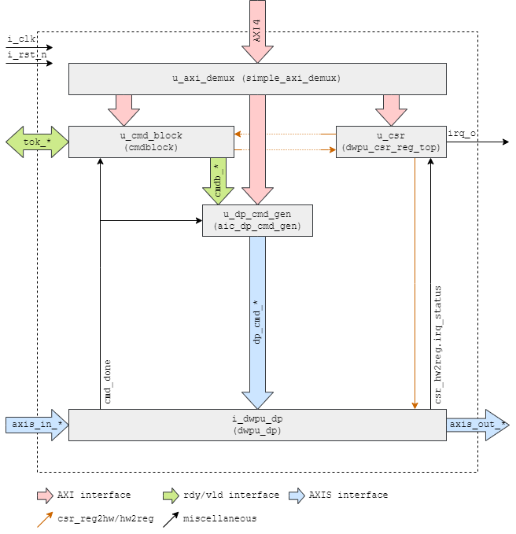

# Microarchitecture

The DWPU block diagram is shown below. It follows the standard approach of all AI core blocks, namely including the
DWPU data path, a CMD Block, a DP Command Generator, a SW Command FIFO, as well as CSRs.

## Hardware Configuration

The DWPU contains one 3rd-party IP block, namely an SRAM cut used for the instruction memory:

| IP Name                                        | Function | Vendor  | Version | Comment                              |
|:---------------------------------------------- |:-------- |:------- |:------- |:------------------------------------ |
| ln05lpe_a00_mc_ra1rwp_hsr_rvt_1024x128m4b2c1r2 | Memory   | Samsung | HS      | Single Port High Speed Register File |

DWPU does not have module parameters that can be adapted to change the architecture. However, the following constants
which reside in `dwpu_pkg.sv` can be changed without breaking the data path architecture – however, the instruction
encoding etc. might require adaptation to suit the new parameters, as indicated in Table 5.

| Parameter / CONSTANT  | Value | Function           | Comment                                                                                      | Impacts Instruction Encoding |
|:--------------------- |:----- |:------------------ |:-------------------------------------------------------------------------------------------- |:---------------------------- |
| `NUM_CHANNELS`        | 64    | Vectorization      | Sets the number of parallel SIMD data paths instantiated for the DWPU                                                 | Yes |
| `IN_PIXEL_WIDTH`      | 8	    | Data width         | Precision of input data and weights                                                                                   | No  |
| `OUT_PIXEL_WIDTH`     | 26	  | Data width         | Precision of result data                                                                                              | No  |
| `INPUT_FIFO_DEPTH`    | 0	    | FIFO depth         | Depth of the FIFO on the input data stream                                                                            | No  |
| `NUM_WB_REGS`         | 64	  | Weight Buffer      | Number of weight buffer registers                                                                                     | Yes |
| `NUM_SP_REGS`         | 128	  | Scratchpad	       | Number of scratchpad registers. Registers 0 & 1 are reserved, thus only NUM_SP_REGS-2 registers are available for use | Yes |
| `NUM_PIPELINE_STAGES` | 2     | Pipelining         | Depth of the computational pipeline (Min = 2)                                                                         | No  |
| `NUM_OPERANDS`        | 9	    | Input Field        | Number of input taps for the computational reduction trees                                                            | Yes |
| `INSTR_MEM_DEPTH`     | 1024	| Instruction Memory | Depth of the instruction memory within the data path command generator                                                | No  |

## Command Block (cmdblock)

The command block contains the command descriptor memory and emits command descriptors upon initiation by the AI core
controller. The 128-bit command descriptors are stored in the command descriptor memory which holds up to
`ai_core_pkg::GEN_CMDB_CMD_FIFO_DEPTH` entries.

The command block is implemented using the common command block IP. Refer to the [CMD Block](TODO:@review were do I find this?)
documentation for implementation details. Refer to the [programming flow](TODO:@review were do I find this?)
document for information about the dispatching of commands.

## Control and Status Registers (dwpu_csr_reg_top)

DWPU features the standard set of CSRs for all AI core sub-blocks, and additionally contains registers that control and
modify the behavior of the data path, as well as interrupt signals for the detection of abnormal conditions. The
data-path specific CSR are:

| CSR Name            | Size (bits) | Reset Value | Description |
|:------------------- |:-----------:|:-----------:|:----------- |
| `weights_sgn`       | `1`         | `0x1`       | When set to `0`, weight register data are considered unsigned integer values for all computations. When set to `1`, weight register data are considered as signed two’s complement integer values for all computations. |
| `image_sgn`         | `1`         | `0x1`       | When set to `0`, image register data are considered unsigned integer values for all computations. When set to `1`, image register data are considered as signed two’s complement integer values for all computations. |
| `skip_illegal_prog` | `1`         | `0x0`       | Controls the behavior upon encountering illegal program conditions, see [here](./25_error_detection_and_interrupts.md) for reference. |
| `dbg_sw_irq`        | `1`         | `0x0`       | Loops back through the data path to the software debug interrupt in the `IRQ_STATUS CSR`, if enabled in the `IRQ_EN` CSR.|

Please note that the data path-modifying CSRs listed above are directly connected to the respective computation
blocks, and as such must only be changed when the data path is in a known idle state. These CSRs are meant as
coarse-grained (per-layer / per-program) modifiers of circuit behavior.

!!! top "For a complete listing of the CSRs in the DWPU, please refer to the generated [register map](./registers.md)."

## Main IPs and Sub-Components

The following pages describe in detail the sub-components of the DWPU.

* [DWPU Command Generator](./21_dwpu_cmd_gen.md): Generates the commands for the data-path and accesses the instruction memory.
* [DWPU Data Path](./22_dwpu_dp.md): Implements the different channels and performs handshaking control.
* [DWPU Channel](./24_dwpu_dp_channel.md): Contains the main processing elements as well as the local data registers.
