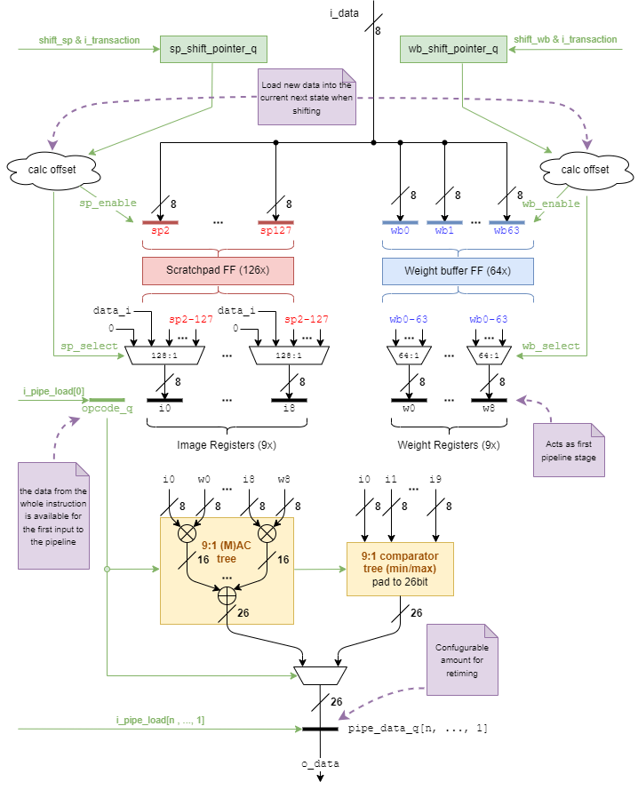

# DWPU Data Path Channel (dwpu_dp_channel)

**TODO(@wolfgang.roennigner): Use the new docstring extraction when it comes online**
%% (page.meta._rtl.sv.dwpu_dp_channel.modules | selectattr('name', '==', 'dwpu_dp_channel') | first).doc %%

The DWPU channel block-diagram is shown below.  The data input `i_data` can be applied to various internal registers,
which in turn feed the computation trees to produce the data output `o_data`.

!!! info "Pipeline loading"
    The control of when pipeline stages are enabled is external to the module and synchronized between all channels.
    There are two enable signals for the internal registers `i_transaction_i` and `i_pipe_load`. The former is activated
    any time a command is executed by the channel, be it shift or calculation. The latter only fires when there is
    output to be computed. The external modules take care of the global handshaking.

The main components of the DWPU channel are:

*	**Scratchpad Register File**: The scratchpad register file consists of `NumSpRegs` registers, prefixed sp.  The first
    two registers (`sp0` and `sp1`) are hardwired to the absorbing element of the operation and the combinatorial data
    input data_in, respectively.  The remaining scratchpad registers can be fed only via a shifting operation
    (`shift_sp`), inserting data at `sp2` and shifting upwards.  The shifting is implemented via a global shift offset
    pointer maintained outside the channel.
* **Weight Buffer Registers**: There are `NumWbRegs` registers available to latch input data for use as the static
    operands in MAC operations. They are filled via shifting operation (`shift_wb`), inserting data at `wb0` and
    shifting upwards.  Like the scratchpad the shifting is implemented via a global offset pointer an maintained outside
    the channel.
* **Image Registers**: There are `NumOperands` image registers serving as the input stage for the dynamic operands of
    the computational reduction trees.  They can be fed from any scratchpad register.
* **Weight Registers**: There are `NumOperands` weight registers serving as the input stage for the static operands of
    the computational reduction trees.  They can be fed from any weight buffer register.
*	**MAC Tree**: A MAC reduction tree fed from `NumOperands` input pairs of (dynamic) image and (static) weight registers.
    The entire operation is performed using `data_oup_t` precision.  Image and weight operands are treated as signed
    or unsigned according to the respective [CSR configurations](./build_reg/dwpu_csr_regs.md).
*	**Comparator Tree**: A comparator tree fed from the `NumOperands` image registers performs either `MIN` or `MAX`
    operations to produce one single comparison result.  The result is sign-extended to `data_oup_t` according to
    the [CSR configuration](./build_reg/dwpu_csr_regs.md).

## Scratchpad Control

The 126 scratchpad registers `sp2-sp127` have their inputs hard wired and can be loaded using the
`i_instruction.op_desc.shift_sp` bit.
The input data is latched into `sp2` and values already present are shifted up.  This differs significantly from the
alpha implementation where there were multiple inputs to these registers.

The first two scratchpad register outputs, `sp0` and `sp1`, are hard-wired to the absorbing element of the operation and
the input data,respectively, and hence are not real architectural registers.

## Weight buffer control

The 64 weight buffer registers `wb0-wb63` have their inputs hard-wired to the input data and can be loaded using the
`i_instruction.op_desc.shift_wb` bit.  The input data is latched into weight buffer register wb0 and values already present
shifted up.  The shifting is implemented using a global shift pointer offset `wb_shift_pointer`.  This pointer implements
an address indirection causing the correcly shifted value to be selecetd.

## Image Operand Selection

The DWPU features a 9-operand data path.  The nine dynamic (image) operands `i0-i8` are selected from the scratchpad
registers using the `i_instruction.i_sel` image selection control signals.  Each dynamic operand `ix` has its own 7-bit
scratchpad address signal `i_instruction.i_sel[x]` to select from `sp0-sp127`.

By using `sp0`, an operand can be effectively silenced (as shown in following table), and by using `sp1`, the input data
`i_data` can be directly used for operations without storing it in a scratchpad register first.

Contents of the absorbing element register `sp0` depening on operation and configuration:

| Operation opcode | Contents of sp0 for image_sgn = 0 | Contents of sp0 for image_sgn = 1 |
|:---------------- |:--------------------------------- |:--------------------------------- |
| SOP              | sp(0) = 0                         | sp(0) = 0                         |
| SUM              | sp(0) = 0                         | sp(0) = 0                         |
| MAX              | sp(0) = 0                         | sp(0) = -128                      |
| MIN              | sp(0) = 255                       | sp(0) = 127                       |

## Weight Operand Selection

Some operations in DWPU use operand pairs of dynamic and static operands.  The nine static (weight) operands `w0-w8` are
selected from the weight buffer registers using the `i_instruction.w_sel` weight selection control signals.  Each static
operand `wx` has its own 6-bit weight buffer address signal `i_instruction.w_sel[x]` to select from `wb0-wb63`.  All weight
selection signals can be offset by the respective command fieled `cmd.w_offset` which is applied to all instructions
fetched by the respective command.

## Computational Operations

The computational operation is selected using the `i_instruction.op_desc.opcode` control signal and performs computation
on the dynamic operands according to:

| **Operation** `opcode` | **Encoding** | **Operation Result** `o_data`                | **Description**               |
|:---------------------- |:------------ |:-------------------------------------------- |:----------------------------- |
| `SOP`                  | `2'h0`       | `o_data = i0 * w0 + i1 * w1 + ... + i8 * w8` | Sum-of-Products (Convolution) |
| `SUM`                  | `2'h1`       | `o_data = i0 + i1 + ... + i8`                | Addition                      |
| `MAX`                  | `2'h2`       | `o_data = max(i0, i1, ..., i8)`              | Maximum                       |
| `MIN`                  | `2'h3`       | `o_data = min(i0, i1, ..., i8)`              | Minimum                       |

The result is made available on the output data port `o_data` and will be pushed downstream if the corresponding flow
control flag is set (`instruction.op_exe`).  In case an operation should not produce output results, dynamic operands
can be silenced to reduce dynamic switching power.

## Module Parameters

**TODO(@wolfgang.roenniner): Update properly when docstring extraction comes online**

%% europa/hw/ip/dwpu/default/rtl/dwpu_dp_channel.sv:parameter_table %%

## IO Description

**TODO(@wolfgang.roenniner): Update properly when docstring extraction comes online**

%% europa/hw/ip/dwpu/default/rtl/dwpu_dp_channel.sv:port_table %%
