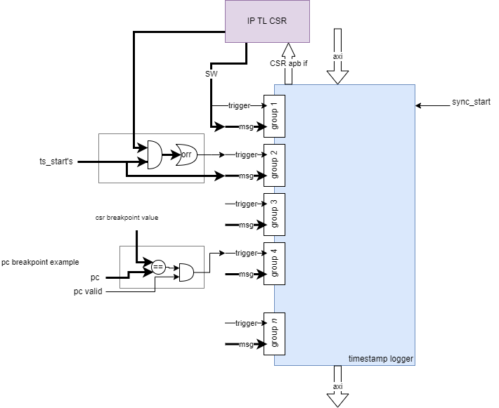
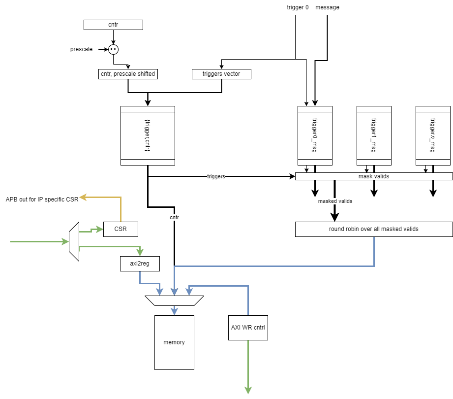

# TimestampLogger

The following describes the architectural requirements of the TimestampLogger.
It provides information regarding the possible configurations and communication protocols as well as details regarding the microarchitecture of the blocks.

## Architectural Overview

## Main Features and Requirements

## Reset & Clock Requirements

The TimestampLogger is completely synchronous with a single clock and without explicit clock-gating inside. It has only one clock and reset.

| Reset     | Reset Requirements             |
|:--------- |:------------------------------ |
| `i_rst_n` | Asynchronous, active-low reset |

The TimestampLogger operates synchronously with and in the AI Core clock domain, fed from its external clock.

| Clock Name | Source   | Target Frequency |
|:---------- |:-------- |:---------------- |
| `i_clk`    | External | 1.2GHz           |

## Bus interfaces

The TimestampLogger has an AXI4 subordinate port for the configuration and internal memory access, and an AXI4 manager port for writing timestamp messages externally if set to do so.

| Interface Name | Source   | Default Configuration              |
|:-------------- |:-------- |:---------------------------------- |
| `axi_s`        | AXI4     | Address Width: 40, Data Width: 64  |
| `axi_m`        | AXI4     | Address Width: 40, Data Width: 64  |

## Interrupts

The TimestampLogger has no interrupt. Once the end of the log is reached the logger will either wrap to the start or drop depending on the setting.

## Address Space

 The TimestampLogger has seperate regions for it's internal memory and the CSRs. By default the relative start addresses are 0 and 'h4000 for the CSR and memory, the address map should be checked to get the instantiated value.

## Register Map

The TimestampLogger has a CSR with general settings, and a space dedicated for IP specifc CSRs. The different CSR descriptions can be found below.

 - [General CSR](build_reg/timestamp_logger_csr_regs)
 - [AI Core specific CSR](build_reg/timestamp_logger_aic_csr_regs)
 - [SDMA specific CSR](build_reg/timestamp_logger_sdma_csr_regs)

## Module Parameters

### Base TimestampLogger
::: hw/ip/timestamp_logger/default/rtl/timestamp_logger.sv:timestamp_logger:parameter_table

### TimestampLogger AI Core
::: hw/ip/timestamp_logger/default/rtl/timestamp_logger_aic.sv:timestamp_logger_aic:parameter_table

### TimestampLogger SDMA
::: hw/impl/europa/blocks/sdma/rtl/timestamp_logger_sdma.sv:timestamp_logger_sdma:parameter_table

## IO Description

### Base TimestampLogger
::: hw/ip/timestamp_logger/default/rtl/timestamp_logger.sv:timestamp_logger:port_table

### TimestampLogger AI Core
::: hw/ip/timestamp_logger/default/rtl/timestamp_logger_aic.sv:timestamp_logger_aic:port_table

### TimestampLogger SDMA
::: hw/impl/europa/blocks/sdma/rtl/timestamp_logger_sdma.sv:timestamp_logger_sdma:port_table
