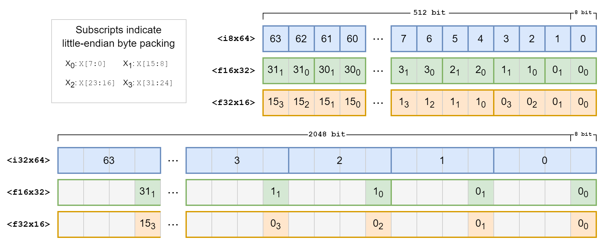
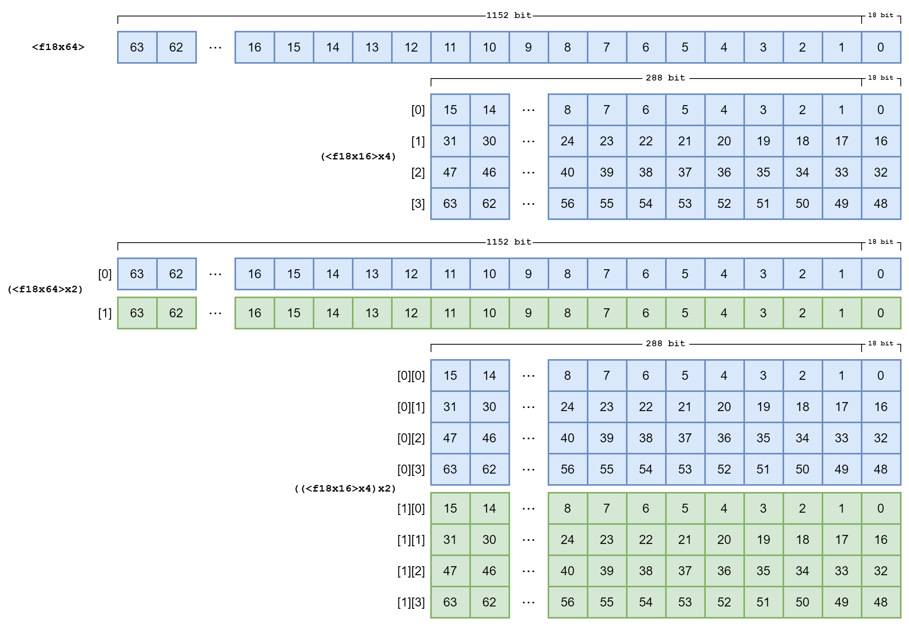
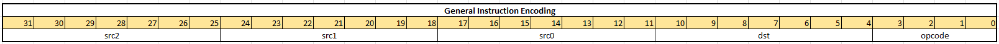
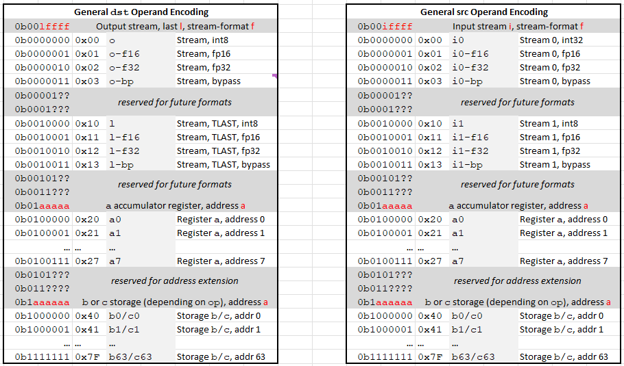
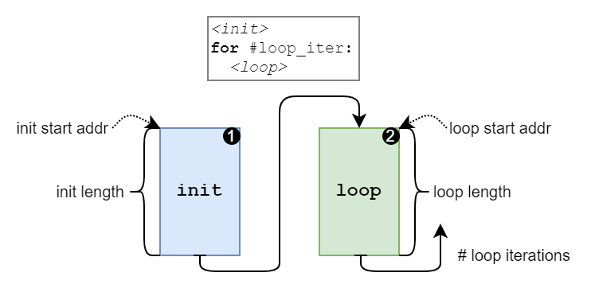
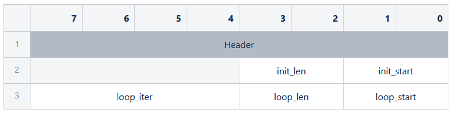
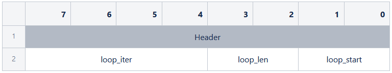

# DPU Instruction Set Architecture Specification

This document contains the canonical specification of the DPU instruction set architecture, including the commands and instructions used.

<!-- omit from toc -->
## Table of Contents
- [Data Formats and Notation](#data-formats-and-notation)
    - [Base Data Formats](#base-data-formats)
    - [PWORD Packing](#pword-packing)
- [DPU Architectural State \& Streams](#dpu-architectural-state--streams)
    - [Architectural State](#architectural-state)
    - [Data Streams](#data-streams)
- [DPU Instructions](#dpu-instructions)
    - [Instruction Overview](#instruction-overview)
    - [Move Operations](#move-operations)
    - [Multiply-Add and Derivatives](#multiply-add-and-derivatives)
    - [Maximum \& Minimum](#maximum--minimum)
    - [Reductions](#reductions)
    - [PReLU](#prelu)
    - [LUT](#lut)
    - [Instruction Encoding](#instruction-encoding)
- [DPU Program Structure](#dpu-program-structure)
    - [Full Command Descriptor](#full-command-descriptor)
    - [Reduced-Length Command Descriptor Layouts](#reduced-length-command-descriptor-layouts)

## Data Formats and Notation

### Base Data Formats

The following data formats are used within DPU and noted as follows:

- `u1`: 1-bit boolean values
- `u2`: 2-bit unsigned integer values
- `i8`: 8-bit signed integer values
- `i18`: 18-bit signed integer values
- `i32`: 32-bit signed integer values
- `f16`: 16-bit IEEE *binary16* floating-point values (1, 5, 10)
- `f18`: 18-bit custom floating-point values (1,7,10)
- `f32`: 32-bit IEEE *binary32* floating-point values (1, 8, 23)

### PWORD Packing

‘PWORD*x*’ describes a packed, vectorized unit of *x* data elements whose type is of one of the above types for all elements within the PWORD unit. Used PWORD formats are noted as follows:

#### Stream PWORD Packing
On streams with 512-bit width, the following packings are used:

- `<i8x64>`: PWORD64 of `i8`
- `<f16x32>`: PWORD32 of `f16`
    - little-endian byte ordering within elements
- `<f32x16>`: PWORD16 of `f32`
    - little-endian byte ordering within elements

On streams with 2048-bit width, the following packings are used:

- `<i32x64>`: PWORD64 of `i32`, big-endian byte ordering within elements
- `<f16x32>`: PWORD32 of `f16`
    - bytewise packed across the elements of a `<i32x64>` PWORD, in the LSB; other bytes are ignored
    - little-endian byte ordering within `f16` elements
- `<f32x16>`: PWORD16 of `f32`
    - bytewise packed across the elements of a `<i32x64>` PWORD, in the LSB; other bytes are ignored
    - little-endian byte ordering within `f32` elements

|  |
| :---------------------------------------------------------------------------------------------------------------------------------: |
|                                  **Stream-facing PWORD packing for 512-bit and 2048-bit streams.**                                  |

#### DPU-Internal PWORD Packing

Internally, the DPU operates on `f18` data with the following packing:
- `<f18x64>`: PWORD64 of `f18` (total width 1152 bit)

Some operations use a subset of the standard `<f18x64>` PWORD, which then acts as a tuple of these smaller PWORDs for indexing purposes:

- <f18x16>: PWORD16 of `f18` (total width 288 bit)
    - a quarter-length subset of the default `<f18x64>` packing
- `(<f18x16>x4)`: 4-Tuple of PWORD16 of `f18` (total width 1152 bit)
    - interpretation of the `<f18x64>` packing for subset indexing purposes
    - `x[0]` indicates the first PWORD16 containing the first quarter of the entire `<f18x64>`

For certain operations or storage resources, two `f18` values are linked together using a common storage index. These values come from two `<f18x64>` in storage which can be viewed in two ways:

- `(<f18x64>x2)`: 2-Tuple of PWORD64 of `f18` (total width 2304 bit)
    - paired values, each side of the pair in a separate complete PWORD64
    - `x[0]` indicates the first PWORD64 containing all values of the left side of the pairs
- `((<f18x16>x4)x2)`: 2-Tuple of 4-Tuple of PWORD16 of `f18` (total width 2304 bit)
    - paired values, each side of the pair interpreted as a quarter-length subset of the default  `<f18x64>` packing for subset indexing purposes
    - `x[0]` indicates the first 4-Tuple of PWORD16 containing all values of the left side of the pairs
    - `x[0][1]` indicates the first PWORD16 containing the second quarter of the entire `<f18x64>` in `x[0]`

|  |
| :------------------------------------------------------------------------------------------------------------------------------------------------------------------------: |
|                                  **DPU-internal PWORD packing showing standard and paired storage with alternate quarter-length views.**                                   |

## DPU Architectural State & Streams
The DPU has access to its architectural state as well as data streams for use in operations.

### Architectural State
The following architectural state is present within the DPU for use in operations:

#### Accumulator Register Storage - `a`

!!! tip inline end "The main use for `a` is to hold and accumulate partial results within the DPU when unrolling operations for latency hiding."

General accumulator registers. Thanks to the multiple read ports, can be used for general operations.

- Notation: `a` + numbered index, e.g., `a0`
- Element Data Format: `<f18x64>`
- Storage Depth: 8
- Access: 1 write port, 3 read ports

!!! info "Present as `REG[0-7]` in Alpha"
??? abstract "Rationale"
    The number of accumulator registers can be kept relatively small, as the number of subsequent non-in-place operations performed in the DPU is very limited (c.f. @Martino Dazzi). Used for composing/chaining larger operations from smaller ones (see LUT specification below).

#### General and Bin Storage - `b`

!!! tip inline end "The main use for `b` is to hold intermediate operation results and look-up tables (see LUT specification below)"

General purpose storage. Due to the single read port, can only be used for one source operand in operations.

- Notation: `b` + numbered index, e.g., `b0`
- Element Data Format: `<f18x64>`
- Storage Depth: 64
- Access: 1 write port, 1 read port

!!! danger "If multiple source operands use b storage, the first such encountered address is used for all operands."
!!! info "Present as `CREG1_[0-47]` in Alpha"

#### Paired Coefficient Storage - `c`

!!! tip inline end "The main use for `c` is to hold scale & offset coefficients in affine transformations"

Paired coefficient storage. Can be used to provide two operands in multiply-add operations.

- Notation: `c` + numbered index, e.g., `c0`
- Element Data Format: `(<f18x64>x2)`
- Storage Depth: 64
- Access: 1 read/write port

!!! info "Present as `CREG2{1,2}_[0-47]` in Alpha"
??? abstract "Rationale"
    The number of coefficients required for processing each channel data element is determined as follows:

    - 2 coefficients per affine transformation (scale + offset), each in `f18`; in
    - 2 affine transformations per data element per channel (dequantization + requantization)

    The largest channel dimension for any layer in the relevant ModelZoo applications is 2048 channels (c.f. @Martino Dazzi), which means that at least 2048 * 2 * 2 = 8192 `f18` coefficients need to be stored to compute the layer transformations without reloading. With `c` storage holding `(<f18x64>x2)` data, the minimum required storage depth is thus 8192 / 2 / 64 = 64.

    Only one shared read/write port is necessary as `c` storage houses static data and cannot be used to store results of computation operations.

### Data Streams

In addition to data storage, the following stream resources are present within the DPU for use in operations. There is a distinction between the *stream-facing* and the *DPU-facing* side of an operation involving stream resources:

- The stream-facing side describes data formats and transactions as observed on the DPU’s input/output ports.
- The DPU-facing side describes the formats as observed when using stream resources as operands for DPU operations.

Stream resources can handle data elements in various formats which will always be converted to/from `f18` on the DPU-facing side of the operations. All stream operands yield/sink `<f18x64>` on the DPU-facing side. Consequently, each DPU-facing stream operand might consume/produce multiple stream beats on the stream-facing side.

!!! note "Note"
    Stream operands that require the consumption of multiple stream beats per DPU-facing operand must provide an adequate number of beats in the stream. Partial values on streams (premature termination using `TLAST`) are illegal.

#### Input Stream 0 - `i0`

The first input stream originates from the IFD0 → MVM/DWPU → IAU chain.

- Notation: `i0` + optional format indicator as noted in the table below
- Stream-Facing Data Width: 2048 bit

!!! danger "If multiple source operands use the `i0` stream, the first such encountered format is used for all operands."

#### Input Stream 1 - `i1`

The second input stream originates from IFD1 directly.

- Notation: `i1` + optional format indicator as noted in the table below
- Stream-Facing Data Width: 512 bit

!!! danger "If multiple source operands use the `i1` stream, the first such encountered format is used for all operands."

#### Output Stream - `o`

The output stream terminates in the ODR.

- Notation: `o` + optional format indicator as noted in the table below
- Stream-Facing Data Width: 512 bit

#### Output Stream with `TLAST` Flag Set - `l`

The output stream terminates in the ODR, with the `TLAST` flag asserted. For multi-beat transactions, only the last beat of the transaction will assert the `TLAST` flag. For `rfs`-flagged moves, only the last beat of the stream will assert the `TLAST` flag.

- Notation: `l` + optional format indicator as noted in the table below
- Stream-Facing Data Width: 512 bit

#### Format Indicators for Stream Resources

| DPU-Facing Format | Stream-Facing Format              | Format Indicator Suffix |
| ----------------- | --------------------------------- | ----------------------- |
| `<f18x64>`        | 1 beat of `<i32x64>` or `<i8x64>` |                         |
| `<f18x64>`        | 2 beats of `<f16x32>`             | `-f16`                  |
| `<f18x64>`        | 4 beats of `<f32x16>`             | `-f32`                  |
| `<i18x64>`        | 1 beat of `<i32x64>` or `<i8x64>` | `-bp`                   |

!!! note "Stream operations on paired data, i.e., `(<f18x64>x2)`, consume twice the number of beats."
!!! warning "The `<i18x64>` type is only for use in movement operations (e.g., for bypassing the unit using f32 data without internal conversion to f18) and shall not be used otherwise."


## DPU Instructions

### Instruction Overview

!!! abstract inline end "Overarching Principles"
    - All instructions in the DPU must execute **in program order**.
    - Any instruction can be issued at any point in the program.
    - In case no resource conflicts exist, instructions shall be issued on every clock cycle.
    - Instructions generally execute **element-wise** and all operands are treated as element-wise (i.e., vectorized along the PWORD dimension), unless explicitly outlined below.

There are multiple operations in the DPU:

- Moves
- Multiply-Add and derivatives:
    - Multiply-Add
    - Multiply
    - Addition
    - Subtraction
    - Negation
- Maximum & Minimum
- Reductions:
    - Maximum-Reduction
    - Minimum-Reduction
    - Sum-Reduction
- PreLU
- LUT

In total, there are 15 instructions defined.

### Move Operations

#### 1. General Move Instruction - `mv`

The general move instruction is intended for all basic data movement in the DPU. It takes one source, the `rfs` flag, and one destination and performs the following operation:

!!! note inline end "The `rfs` Flag"
    If the `rfs` flag is set, the instruction is repeated until the input stream terminates with `TLAST`. The allowed `src` operands with the rfs flag set are restricted to the input streams `i0`, `i1` only. The above-allowed `dst` operands remain:

    - If the destination is `l`, the last output beat will terminate with TLAST.
    - If the destination is not a stream, the destination address is incremented on every subsequent repetition of the instruction (including wraparound) to provide for a simple way of filling coefficients to storage.

`mv dst, src, rfs` [`<f18x64>`, `u1` → `<f18x64>`]:
```py linenums="1"
if rfs == 0:
    *dst ← src
if rfs == 1:
    while True:
        *(dst++) ← src
        if src.last:
            break
```
##### Description
The data from src is moved to dst.

##### Allowed Operands
|                                   | `src` (`rfs` = 0) | `src` (`rfs` = 1) | `dst` |
| --------------------------------: | :---------------: | :---------------: | :---: |
|     Streams `i0`, `i1` / `o`, `l` |        ✅         |        ✅         |  ✅   |
| Accumulation register storage `a` |        ✅         |        ❌         |  ✅   |
|               General storage `b` |        ✅         |        ❌         |  ✅   |
|    Paired coefficient storage `c` |        ❌         |        ❌         |  ❌   |


#### 2. Paired Coefficient Stream Move Instruction - `mvc`

The paired coefficient move instruction moves data from the input streams into the paired coefficient storage. It takes one source, the `rfs` flag, and one destination and performs the following operation:

!!! note inline end "The `rfs` Flag"

    If the `rfs` flag is set, the instruction is repeated until the input stream terminates with `TLAST`.

    The destination address is incremented on every subsequent repetition of the instruction (including wraparound).

`mv dst, src, rfs` [`(<f18x64>x2)`, `u1` → `(<f18x64>x2)`]:
```py linenums="1"
if rfs == 0:
    *dst ← src
if rfs == 1:
    while True:
        *(dst++) ← src
        if src.last:
            break
```

##### Description
The paired data from src is moved to the paired dst.

##### Allowed Operands
|                                   | `src` | `dst` |
| --------------------------------: | :---: | :---: |
|     Streams `i0`, `i1` / `o`, `l` |  ✅   |  ❌   |
| Accumulation register storage `a` |  ❌   |  ❌   |
|               General storage `b` |  ❌   |  ❌   |
|    Paired coefficient storage `c` |  ❌   |  ✅   |

### Multiply-Add and Derivatives

#### 3. General Multiply-Add Instruction - `madd`

The general MADD instruction computes a four-operand element-wise multiply-add. It takes three sources and one destination and performs the following operation:

`madd dst, src0, src1, src2` [`<f18x64>`, `<f18x64>`, `<f18x64>` → `<f18x64>`]:
```py linenums="1"
*dst ← f18(src0 * src1) + src2
```

##### Description
The product of `src0` and `src1` is added to `src2` and stored in `dst`.
!!! warning "The multiplication and addition each incur intermediate rounding to `f18`."

##### Allowed Operands
|                                   | `src0` | `src1` | `src2` | `dst` |
| --------------------------------: | :----: | :----: | :----: | :---: |
|     Streams `i0`, `i1` / `o`, `l` |   ✅   |   ✅   |   ✅   |  ✅   |
| Accumulation register storage `a` |   ✅   |   ✅   |   ✅   |  ✅   |
|               General storage `b` |   ✅   |   ✅   |   ✅   |  ✅   |
|    Paired coefficient storage `c` |   ❌   |   ❌   |   ❌   |  ❌   |

#### 4. Paired Coefficient Multiply-Add Instruction - `maddc`

The paired coefficient MADD instruction computes transformations using scale and offset values from the paired coefficient storage. It takes two sources and one destination and performs the following operation:

`maddc dst, src0, src1` [`<f18x64>`, `(<f18x64>x2)` → `<f18x64>`]:
```py linenums="1"
*dst ← f18(src0 * src1[0]) + src1[1]
```

##### Description
The product of `src0` and the first part of the paired `src1` is added to the second part of the paired `src1` and stored in `dst`.
!!! warning "The multiplication and addition each incur intermediate rounding to `f18`."

##### Allowed Operands
|                                   | `src0` | `src1` | `dst` |
| --------------------------------: | :----: | :----: | :---: |
|     Streams `i0`, `i1` / `o`, `l` |   ✅   |   ❌   |  ✅   |
| Accumulation register storage `a` |   ✅   |   ❌   |  ✅   |
|               General storage `b` |   ✅   |   ❌   |  ✅   |
|    Paired coefficient storage `c` |   ❌   |   ✅   |  ❌   |

#### 5. Multiplication Instruction - `mul`

The multiplication instruction takes two sources and one destination and performs the following operation:

`mul dst, src0, src1` [`<f18x64>`, `<f18x64>` → `<f18x64>`]:
```py linenums="1"
*dst ← src0 * src1
```

##### Description
The product of `src0` and `src1` is stored in `dst`.

##### Allowed Operands
|                                   | `src0` | `src1` | `dst` |
| --------------------------------: | :----: | :----: | :---: |
|     Streams `i0`, `i1` / `o`, `l` |   ✅   |   ✅   |  ✅   |
| Accumulation register storage `a` |   ✅   |   ✅   |  ✅   |
|               General storage `b` |   ✅   |   ✅   |  ✅   |
|    Paired coefficient storage `c` |   ❌   |   ❌   |  ❌   |

#### 6. Addition Instruction - `add`

The addition instruction takes two sources and one destination and performs the following operation:

`add dst, src0, src1` [`<f18x64>`, `<f18x64>` → `<f18x64>`]:
```py linenums="1"
*dst ← src0 + src1
```

##### Description
The sum of `src0` and `src1` is stored in `dst`.

##### Allowed Operands
|                                   | `src0` | `src1` | `dst` |
| --------------------------------: | :----: | :----: | :---: |
|     Streams `i0`, `i1` / `o`, `l` |   ✅   |   ✅   |  ✅   |
| Accumulation register storage `a` |   ✅   |   ✅   |  ✅   |
|               General storage `b` |   ✅   |   ✅   |  ✅   |
|    Paired coefficient storage `c` |   ❌   |   ❌   |  ❌   |


#### 7. Subtraction Instruction - `sub`

The subtraction instruction takes two sources and one destination and performs the following operation:

`sub dst, src0, src1` [`<f18x64>`, `<f18x64>` → `<f18x64>`]:
```py linenums="1"
*dst ← src0 - src1
```

##### Description
The difference of `src0` and `src1` is stored in `dst`.

##### Allowed Operands
|                                   | `src0` | `src1` | `dst` |
| --------------------------------: | :----: | :----: | :---: |
|     Streams `i0`, `i1` / `o`, `l` |   ✅   |   ✅   |  ✅   |
| Accumulation register storage `a` |   ✅   |   ✅   |  ✅   |
|               General storage `b` |   ✅   |   ✅   |  ✅   |
|    Paired coefficient storage `c` |   ❌   |   ❌   |  ❌   |


#### 8. Negation Instruction - `neg`

The negation instruction takes one source and one destination and performs the following operation:

`neg dst, src` [`<f18x64>` → `<f18x64>`]:
```py linenums="1"
*dst ← -src
```

##### Description
The negation of `src` is stored in `dst`.

##### Allowed Operands
|                                   | `src` | `dst` |
| --------------------------------: | :----: | :---: |
|     Streams `i0`, `i1` / `o`, `l` |   ✅   |  ✅   |
| Accumulation register storage `a` |   ✅   |  ✅   |
|               General storage `b` |   ✅   |  ✅   |
|    Paired coefficient storage `c` |   ❌   |  ❌   |

### Maximum & Minimum

#### 9. Maximum Instruction - `max`

The maximum instruction takes two sources and one destination and performs the following operation:

`max dst, src0, src1` [`<f18x64>`, `<f18x64>` → `<f18x64>`]:
```py linenums="1"
*dst ← max(src0, src1)
```

##### Description
The larger of `src0` and `src1` is stored in `dst`.


#### 10. Minimum Instruction - `min`

The minimum instruction takes two sources and one destination and performs the following operation:

`min dst, src0, src1` [`<f18x64>`, `<f18x64>` → `<f18x64>`]:
```py linenums="1"
*dst ← min(src0, src1)
```

##### Description
The smaller of `src0` and `src1` is stored in `dst`.

##### Allowed Operands
|                                   | `src0` | `src1` | `dst` |
| --------------------------------: | :----: | :----: | :---: |
|     Streams `i0`, `i1` / `o`, `l` |   ✅   |   ✅   |  ✅   |
| Accumulation register storage `a` |   ✅   |   ✅   |  ✅   |
|               General storage `b` |   ✅   |   ✅   |  ✅   |
|    Paired coefficient storage `c` |   ❌   |   ❌   |  ❌   |

### Reductions

#### 11. Maximum-Reduction Instruction - `maxr`

The max-reduce instruction allows computing the largest element in a PWORD. It takes one source and one destination and performs the following operation:

`maxr dst, src` [`<f18x64>` → `<f18x64>`]:
```py linenums="1"
*dst[:] ← max(src[0], src[1], ..., src[63])
```

##### Description
The largest of all elements in `src` is stored in all elements of `dst`.

##### Allowed Operands
|                                   | `src` | `dst` |
| --------------------------------: | :----: | :---: |
|     Streams `i0`, `i1` / `o`, `l` |   ✅   |  ✅   |
| Accumulation register storage `a` |   ✅   |  ✅   |
|               General storage `b` |   ✅   |  ✅   |
|    Paired coefficient storage `c` |   ❌   |  ❌   |

#### 12. Minimum-Reduction Instruction - `minr`

The min-reduce instruction allows computing the smallest element in a PWORD. It takes one source and one destination and performs the following operation:

`minr dst, src` [`<f18x64>` → `<f18x64>`]:
```py linenums="1"
*dst[:] ← min(src[0], src[1], ..., src[63])
```

##### Description
The smallest of all elements in `src` is stored in all elements of `dst`.

##### Allowed Operands
|                                   | `src` | `dst` |
| --------------------------------: | :----: | :---: |
|     Streams `i0`, `i1` / `o`, `l` |   ✅   |  ✅   |
| Accumulation register storage `a` |   ✅   |  ✅   |
|               General storage `b` |   ✅   |  ✅   |
|    Paired coefficient storage `c` |   ❌   |  ❌   |

#### 13. Sum-Reduction Instruction - `sumr`

The sum-reduce instruction allows computing inner sums of PWORDs. It takes one source and one destination and performs the following operation:

`sumr dst, src` [`<f18x64>` → `<f18x64>`]:
```py linenums="1"
*dst[:] ← src[0] + src[1] + ... + src[63]
```

##### Description
The inner sum of all elements in `src` is stored in all elements of `dst`.
!!! warning "The additions are performed recursively pairwise over the elements of the PWORD and each addition incurs intermediate rounding to `f18`."

##### Allowed Operands
|                                   | `src` | `dst` |
| --------------------------------: | :----: | :---: |
|     Streams `i0`, `i1` / `o`, `l` |   ✅   |  ✅   |
| Accumulation register storage `a` |   ✅   |  ✅   |
|               General storage `b` |   ✅   |  ✅   |
|    Paired coefficient storage `c` |   ❌   |  ❌   |

### PReLU

#### 14. Standard PReLU Instruction - `prelu`
The standard PReLU instruction computes an element-wise parametric rectified linear unit operation. It takes two sources and one destination and performs the following operation:

`prelu dst, src0, src1` [`<f18x64>`, `<f18x64>` → `<f18x64>`]:
```py linenums="1"
if src0 < 0:
    dst ← src0 * src1
else:
    dst ← src0
```

##### Description
If `src0` is negative, it is multiplied with `src1` and stored in `dst`. Otherwise, `src0` is stored in `dst` directly.

##### Allowed Operands
|                                   | `src0` | `src1` | `dst` |
| --------------------------------: | :----: | :----: | :---: |
|     Streams `i0`, `i1` / `o`, `l` |   ✅   |   ✅   |  ✅   |
| Accumulation register storage `a` |   ✅   |   ✅   |  ✅   |
|               General storage `b` |   ✅   |   ✅   |  ✅   |
|    Paired coefficient storage `c` |   ❌   |   ❌   |  ❌   |

### LUT

#### 15. Packed LUT Instruction - `lut`

The packed LUT instruction computes element-wise transformations, using scale and offset from a global set of packed coefficients into which it element-wise indexes according to its position relative to global monotonously increasing limits.
It takes two sources, and one destination and performs the following operation:

`lut dst, src0, src1` [`<f18x64>`, `(<f18x16>x4)`  → `<f18x64>`]:
```py linenums="1"
bin ← src1[0]  # elements [15:0]
scl ← src1[1]  # elements [31:16]
off ← src1[2]  # elements [47:32]
for i, src in enumerate(src0):
    idx ← first_index(src < bin)  # idx in 0..15 or None
    if idx is not None:
        *dst[i] ← f18(src * scl[idx]) + off[idx]
    else:
        *dst[i] ← 0
```

##### Description
The global (for all operation elements) bins, scales, and offsets are read from the first three elements of `src1` by indexing it as a `(<f18x16>x4)`.

Then, element-wise, `src0` is compared to all entries of the bins, determining the element-wise index `idx` of the first element of bins that is larger than `src0`. This index `idx` is then used to element-wise select coefficients from the scales and offsets. If no match for `idx` was found, scales and offsets are assumed to be 0.

Lastly, `src0` is multiplied with the selected coefficients from scales and added to the selected coefficients from offsets and stored in `dst`.
!!! warning "The multiplication and addition each incur intermediate rounding to `f18`."
!!! danger "The values for the bins in `src1[0]` must be monotononically increasing."

##### Allowed Operands
|                                   | `src0` | `src1` | `dst` |
| --------------------------------: | :----: | :----: | :---: |
|     Streams `i0`, `i1` / `o`, `l` |   ✅   |   ✅   |  ✅   |
| Accumulation register storage `a` |   ✅   |   ✅   |  ✅   |
|               General storage `b` |   ✅   |   ✅   |  ✅   |
|    Paired coefficient storage `c` |   ❌   |   ❌   |  ❌   |


### Instruction Encoding

The DPU uses a general 32-bit instruction encoding for all its instructions:

|  |
| :--------------------------------------------------------: |
|         **General instruction encoding for the DPU.**          |

!!! abstract inline end "Encoding Rationale"

    - Narrower instructions will save space, but the overall instruction memory width will be limited by the widest instruction encoding.
    - All transactions to the instruction memory from the controller side are 64-bit. Multiple instructions can be packed into one transaction if they fit into these 64-bit transactions.
        - Hence not exceeding 32-bit instructions is a desirable design point

The operation flavor to execute is held in the `opcode` field:

| Encoding | Operation | Description          |
| -------: | :-------- | :------------------- |
|    `0x0` | `mv`      | General Move         |
|    `0x1` | `mvc`     | Paired Move          |
|    `0x2` | `madd`    | General Multiply-Add |
|    `0x3` | `maddc`   | Paired Multiply-Add  |
|    `0x4` | `mul`     | Multiply             |
|    `0x5` | `add`     | Addition             |
|    `0x6` | `sub`     | Subtraction          |
|    `0x7` | `neg`     | Negation             |
|    `0x8` | `max`     | Maximum              |
|    `0x9` | `min`     | Minimum              |
|    `0xA` | `maxr`    | Maximum-Reduction    |
|    `0xB` | `minr`    | Minimum-Reduction    |
|    `0xC` | `sumr`    | Sum-Reduction        |
|    `0xD` | `prelu`   | Standard PReLU       |
|    `0xE` | `lut`     | Packed LUT           |
|    `0xF` | -         | reserved             |

Each operand separately encodes its storage (stream, `a`, `b`, or `c`) as well the address within that storage, where applicable, according to the following tables:

|  |
| :---------------------------------------------------: |
|           **Operand encoding for the DPU.**           |

!!! note
    Combinations of operation flavor and operands not listed in the section above are illegal and the behavior is undefined.

## DPU Program Structure

DPU programs consist of two sections, an initialization section (`init`) and a loop section (`loop`). Sections are defined by their starting address in the instruction memory, their length, and their iteration count (if applicable), as shown below:

!!! tip inline end "The `init` and `loop` sections are independent and there are no constraints in terms of their relative placement in instruction memory."

|                                                |
| :------------------------------------------------------------------------------------------------: |
| **Structure of DPU programs consisting of an initialization secition (1) and a loop section (2).** |

The initialization section has a fixed iteration count of one. A section is considered empty if either its length or its number of iterations is zero. Either of the two sections may be empty, however an entirely empty program is illegal.

The DPU program structure is programmed via the *command descriptor* analogously to all other AI core blocks.

### Full Command Descriptor

The command descriptor holds the program structure for the DPU and consists of three 64-bit words:

|  |
| :--------------------------------------------------: |
|       **Full command descriptor for the DPU.**       |

- `init_*` define the initialization section of the program:
    - `init_len`: Length of the initialization section in the number of instructions
    - `init_start`: Offset in the instruction memory of the first instruction in the initialization section.
- `loop_*` define the loop section of the program:
    - `loop_len`: Length of the loop section in the number of instructions
    - `loop_start`: Offset in the instruction memory of the first instruction in the loop section.
    - `loop_iter`: Number of iterations in the loop section.

### Reduced-Length Command Descriptor Layouts

The 64-bit standard command header has the following structure:

|  |
| :------------------------------------------------------: |
|      **The command descriptor header for the DPU.**      |


The complete/standard command has the command format field `cmd_format` set to 0. With the introduction of reduced command descriptor layouts, the following two additional formats are available:

#### Bypass-Only (`cmd_format` = 1)

|  |
| :-----------------------------------------------------------: |
|          **Bypass command descriptor for the DPU.**           |

A zero-length descriptor which puts the DPU into bypass mode. This causes the following single instruction to be executed on the DPU without reading any instructions from the instruction memory:
```asm
mv l-bp, i0-bp, rfs=1
```

#### Loop-Only (`cmd_format` = 2)
|  |
| :-------------------------------------------------------: |
|       **Loop-Only command descriptor for the DPU.**       |

A 1-long descriptor that only executes the loop section by setting all `init_*` fields to 0.
