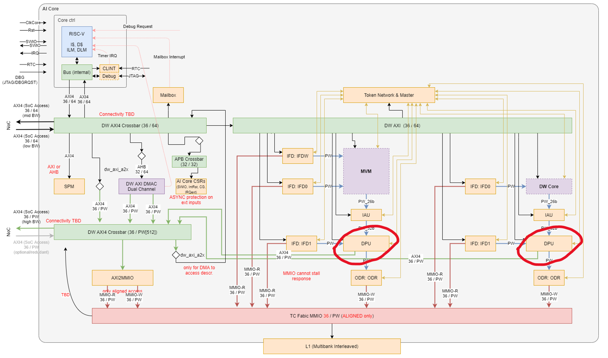
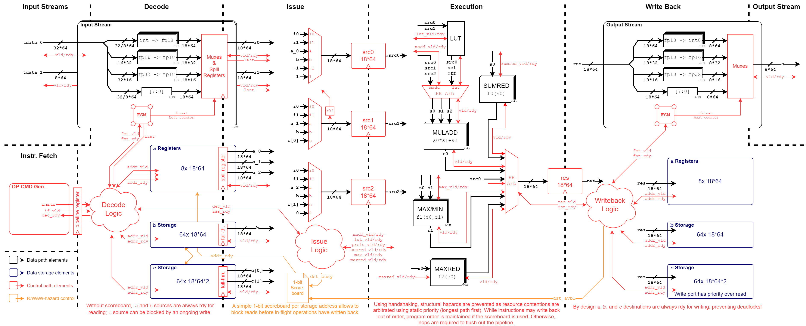

# Data Processing Unit (DPU)

The following describes the architectural requirements of the Data Processing Unit (DPU).
It provides information regarding the possible configurations and communication protocols as well as details regarding the microarchitecture of the blocks.

## Architectural Overview

The DPU is a digital SIMD-vectorized post-processing unit for the MVM and DWPU blocks, meant to perform intra-channel (depth-wise) operations using floating-point (FP) arithmetic. The following **outdated** block diagram shows the two DPU instances in the AI Core, each consuming two data streams, one from the IAU and one directly from the IFD1, and producing a data stream towards the ODR.

|  |
| :-------------------------------------------------------------------------------------------------------------------: |
|                       **OUTDATED AI Core block diagram with the two DPU inctances highlighted**                       |

###	Main Features

The DPU is an instruction based subip, and follows the same control scheme as other AI Core blocks such as DWPU and IAU. As such, it contains an *instruction memory* which is sequenced over by a command generator according to the program structure description inside a Command Block *command*.

!!! abstract "Refer to the [ISA Specification](./10_isa_specification.md) document for a complete listing of operations, formats, and program structure."

#### Operations and Formats

The DPU operates **element-wise** on PWORD64s of *FP18* (1, 7, 10) data internally and features the following operations:

- Multiply-Add and derivatives:
    - Multiply-Add
    - Multiplication
    - Addition
    - Subtraction
    - Negation
- Maximum & Minimum
- Reductions along the PWORD axis:
    - Maximum-Reduction
    - Minimum-Reduction
    - Sum-Reduction
- PReLU
- Piecewise-linear function approximation using a LUT

!!! note inline end
    All DPU-internal operands are 64-element PWORDs of FP18. As such, all input and output stream operations must also consume/produce the equivalent of 64 values in the given stream format.

Input and output data on the streams can be consumed/produced in the following formats, and are **converted** to/from FP18 automatically:

- Integer (signed/unsigned)
- IEEE *binary16* (1, 5, 10)
- IEEE *binary32* (1, 8, 23)

#### Operands

The DPU supports four types of operand sources/destinations in its instructions:
!!! note inline end
    All DPU-internal operands are 64-element PWORDs of FP18. As such, all storage locations are 64 x 18 bit wide (double for paired storage).

- **Streams:** Input/Output streams
- `a` Registers: *8* General-purpose registers for use in all operations for various operands
- `b` Storage: *64* memory values for use as parameter storage and temporary values
- `c` Storage: *64 paired* memory values for use as coefficients for affine transfromations

#### Program Structure

A DPU program consists of an initialization section (`.init`) and a programmable loop section (`.loop`).
The program first executes the instructions in `.init`, and then jumps to execute the instructions in `.loop` for the programmed number of iterations.
There is no conditional or branching control flow.

### Microarchitectural Overview

The DPU features a 5-stage processing pipeline with in-order issue and out-of-order commit. The stages are summarized in below:

- **Instruction Fetch (IF):** Consisting of the instruction sequencer of the DP command generator which provides instructions to the DPU datapath.
- **Instruction Decode (ID):** Responsible for the main control of the DPU. It translates instructions into one or multiple datapath operations and features:
    - Decoding of source and destination operands from the instruction.
    - Recoding the locations of sources and destinations sources if necessary, e.g., for instructions that issue multiple operations to the datapath.
    - Requesting the source operands from the different operand sources, taking data hazards into account.
    - Dispatching the prepared operation to be issued.
- **Operation Issue (ISS):** Applies the produced operands form the various sources to the appropriate input of the execution units while ensuring operation ordering, if required.
- **Execution (EXE):** Contains the execution pipelines of the different operations.
- **Write Back (WB):** Commits the results of operations to internal storage or the output stream.

The following shows a microarchitecture diagram of the DPU datapath:

|  |
| :-------------------------------------------------------------------: |
|                   **DPU Microarchitecture Diagram**                   |

!!! abstract "Refer to the [Microarchitecture Documentation](./20_uarch.md) document for in-depth documentation of the DPU microarchitecture."

## Address Space

Programmable blocks within the DPU – namely the CSRs, the command descriptor memory inside the command block, the instruction memory inside the data path command generator, and the software instruction FIFO – are accessible from the core controller via the AXI4 interface as memory-mapped regions. Please refer to the [generated documentation](TODO) for memory map information.

## Register Map

TO-DO document register map (Europa)

<!--
TODO: Automated documentation
## IO Description

The DPU top-level has the following ports:

%% io_table("dpu") %%
-->
