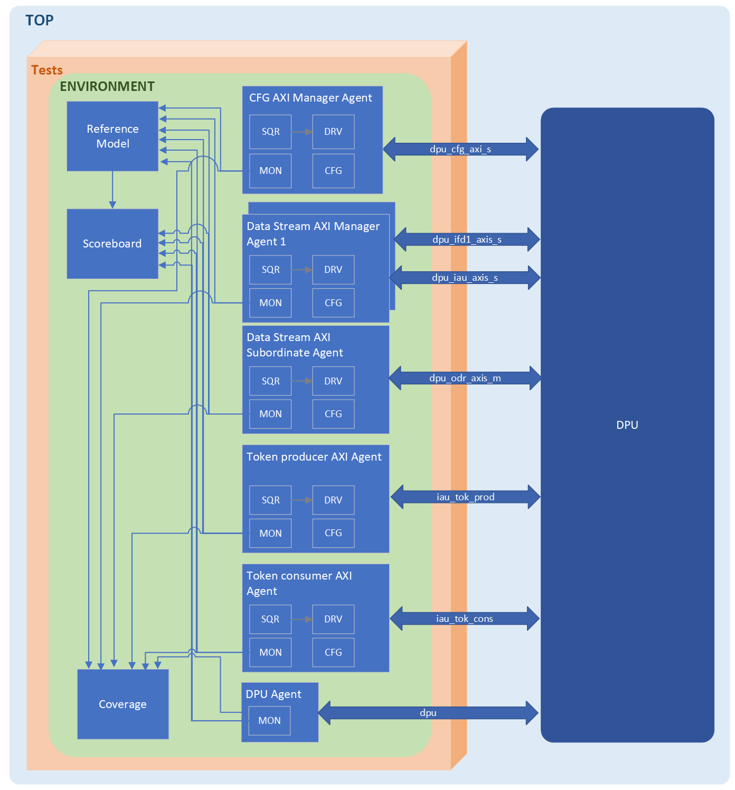

# DPU Verification Specification 

## Introduction
This is the verification specification document for Data Processing Unit (DPU)  testbench.

It receives its data inputs from IAU which provides a stream of pixelwords as a result of computation and from IFD1. The DPU output PW stream flows in to the ODR. 


### Overview
The DPU has four major interfaces:

- Two AXIS input stream, that comes either from IAU and IFD1.
- An AXIS output stream, that send the pixelword stream to ODR.
- An AXI slave interface for controlling and programming DPU.


#### Supported Features
- TBA
- Stream Peek Support **&ast;** (New feature)
- ~~Software Bypass of the command block~~. (Deprecated in Europa)


### Ownership
Who to contact for information

|  Team              | Contact         |
| ------------------ | --------------- |
| ***Architecture*** | stefan.mach@axelera.ai |
| ***Design***       | tiago.campos@axelera.ai |
| ***Verification*** | fernando.yokota@axelera.ai |

### Reference
Where to find the design documentation

| Team               | Specification |
| ------------------ | ------------- |
| ***Architecture*** |[Arch Spec](../20_uarch.md)|
| ***Design***       |[Block Spec](../index.md)|

### Project Planning and Trackinggit config 
Where to find project plans and trackers

|   | Link |
| - | ---- |
| ***Plan*** |[Gitlab Issues Board]()|
| ***Issues*** |[Gitlab Open Issues]()|

## Block Level Testbenches

### Testbench
#### Overview
The image below ilustrates the Testbench Architecture.

Synopsis AXI VIP is used for all the AXI and AXIS interfaces. Some of the AXI agents (connected to axis_s and axis_m interfaces) are going to be configured as a Data Stream. The DPU Reference Model implements the supported features of DPU, and generates the output data to be compared against RTL output in the Scoreboard component.  A coverage component implements all the features as coverpoints, in order to check if they are being exercised by the tests.   

#### TB Diagram


#### How to Run
How to check out and run

```
git clone etc.
source ....
cd ...
make ...
```
#### Regressions
Which regressions to run

| Regression | Description | Source | Link |
| ---------- | ----------- | ------ | ---- |
| regression | description | [Link to Source]() | [Last CI Run]()|

#### Metrics / Coverage Plan
VPlan / Verification IQ excel / csv file

- [Link]()

## Formal Proofs
### Overview
Description of any formal environments

### How To Run

```
git clone etc.
source ....
cd ...
make ...
```

#### Regressions
Which regressions to run

| Regression | Description | Source | Link |
| ---------- | ----------- | ------ | ---- |
| regression | description | [Link to Source]() | [Last CI Run]()|

#### Metrics / Coverage Plan
VPlan / Verification IQ excel / csv file

- [Link]()

## System Level Testcases
Tests to be run at top level / Veloce

| Testcase   | Description | Source | Link |
| --------   | ----------- | ------ | ---- |
| testcase   | description | [Link to Source]()| [Last CI Run]()|
