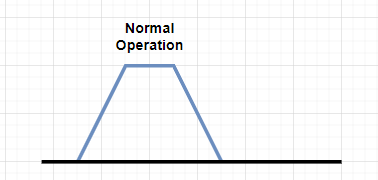
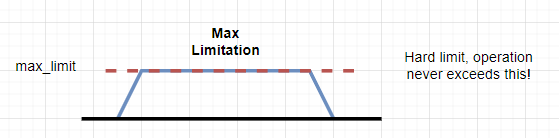
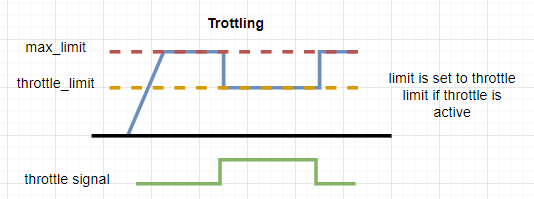
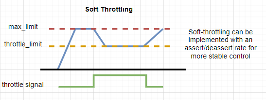
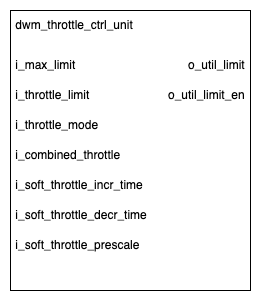

# Goal

The `Throttle Control Unit` adjusts the output data based on the throttle input and the prescale and incremental/decremental settings.

## Overview

The `dwm_throttle_ctrl_unit` provides four different operational modes:

- Disabled (default mode)

- Max limit mode

- Hard throttle mode

- Soft throttle mode

## Implementation

### Throttle Control Unit

#### Throttle Modes

- `mode=2'b00` - **Disabled**: `o_util_limit_en` is set to constant low
- `mode=2'b01` - **Max limit mode**: `o_util_limit_en` is set to constant high and `o_util_limit` is set to constant `i_max_limit`
- `mode=2'b10` - **Hard throttle mode**: `o_util_limit_en` is set to constant high and `o_util_limit` is set to `i_max_limit` if the throttle signal is low else to `i_throttle_limit`
- `mode=2'b11` - **Soft throttle mode**: `o_util_limit_en` is set to constant high and `o_util_limit` is set to `i_max_limit` if the throttle signal is low else to `i_throttle_limit` with the increment and decrement limited by the `i_soft_throttle_incr_time_i` and `i_soft_throttle_decr_time`, respectively

#### Soft Throttle Mechanism

In the soft throttle mode the utilization limit of the MVM transitions gradually depending on several CSR settings:

- `i_soft_throttle_incr_time` (16-bit): baseline cycle time between increments of one for the utilization limit
- `i_soft_throttle_decr_time` (16-bit): baseline cycle time between decrements of one for the utilization limit
- `i_soft_throttle_prescale` (8-bit): pre-scale factor for the baseline cycle times above (multiplier)

Single in-/decrement can thus take from `1 cycle` to roughly `(2^16 * 2^8) = 2^24 cycles` (`14ms` at `1200MHz`).

Cycle times of zero bypass the soft throttle and allow an instantaneous update of the utilization limit.

#### Clock and Reset

This module is a single clock domain with a single asynchronous reset domain.

#### Additional details

::: hw/ip/dwm/default/rtl/dwm_throttle_ctrl_unit.sv:dwm_throttle_ctrl_unit

::: hw/ip/dwm/default/rtl/pkg/dwm_throttle_ctrl_unit_pkg.sv:dwm_throttle_ctrl_unit_pkg
