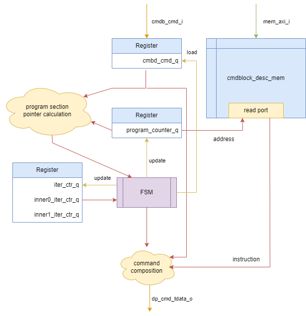
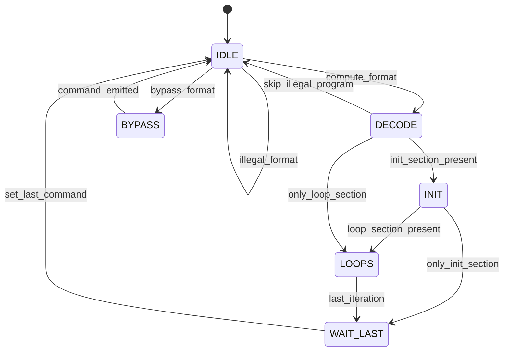

**TODO(@wolfgang.roenninger): Update this when the command generation gets replaced by `aic_dp_cmd_gen`!**

# DWPU Data Path Command Generator (dwpu_dp_cmd_gen)

%% (page.meta._rtl.sv.dwpu_dp_cmd_gen.modules | selectattr('name', '==', 'dwpu_dp_cmd_gen') | first).doc %%

The `dwpu_dp_cmd_gen` module takes data from the command block and the instruction to build the command for the data-path.
The main components to generate the patterns of accessing the instruction memory are below:

!!! info "Handshaking"
    The FSM controls proper handshaking between command-block input stream, internal registers, the instruction memory access and data-path command output stream.

The state machine is responsible for orchestrating the access patterns and implements the loop logic. The main principle
behind the generation is to increase the `program_counter_q` per default and update it to another location in case
special flagged points in the program are reached. For this it takes the command saved in the `cmdb_cmd_q` register and
combinatorically derived pointers to determine the jump addresses and times. For the jump times additional iteration
counters are taken to keep track on the loops to be executed. From the derived pointers some error conditions can also
be determined.

## Instruction Access Pattern Generation

A state machine is responsible for generating the addresses which are fetched from the instruction memory.

### IDLE

Wait for a new command to arrive. If available load into the `cmdb_cmd_q` and perform sanitation or derived field
calculations. Can erly terminate in case of an illegal command format.

### DECODE

Look at the contents of the sanitized command and determine the start location of the program counter. Jump to the
correct next state for performing the initialization or loop execution. This stage can determine if a command
is wrongly formed and terminate execution early.

### BYPASS

Set the data-path into bypass mode. Go back to idle to process the next command as soon as the data-path accepted
its command. This relies on handshake stalling.

### INIT

Run an initialization step if needed. The `iter_ctr_q` keeps track of all loops.

### LOOPS

Perform the loop command. Depending on the `*_iter_ctr_q` and condition derived from the command (aka. program sections)
update the `program_counter_q` accordingly by loading new values as required.
### WAIT_LAST

To prevent a new command overtaking previous commands currently fetching from the instruction memory have this wait state.
It goes back to idle the moment the data-path consumed the last instruction.

## IO Description

%% io_table("dwpu_dp_cmd_gen") %%
