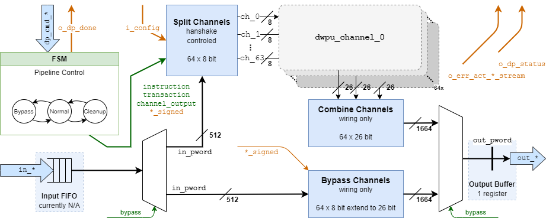
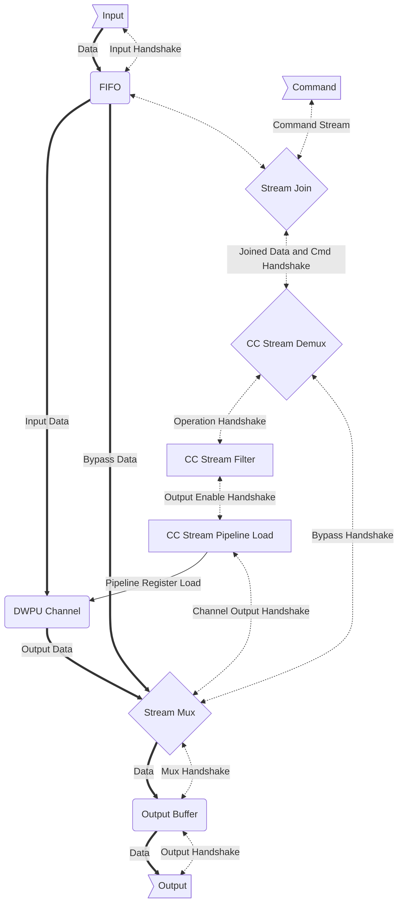

# DWPU Data Path (dwpu_dp)

**TODO(@wolfgang.roennigner): Use the new docstring extraction when it comes online**
%% (page.meta._rtl.sv.dwpu_dp.modules | selectattr('name', '==', 'dwpu_dp') | first).doc %%

## Features

This module implements the functionality of the DWPU. It's features are:

- Multiple calculation channels for SIMD operation.
- Scratchpad and weight buffer registers.
- Logic for calculation of SOP, SUM, MAX and MIN
- Fully pipelined and handshaked in command and data streams.
- Bypass mode to avoid calculation.

The overall data-path architecture is depicted below, for simplicity the handshaking is omitted. Details are found in the next section.

The unit joins the command stream together with the input data-stream, processes it and generates an output stream.
Depending on the command data-stream items are either consumed or generated depending on the command flags. In general
there can be per command stream only one input and/or output stream, as depicted by the tlast stream flags.

## Control & Stream Handling

Handshaking is handled by common `cc_stream_*` modules. Below diagram shows how the handshaking is connected to have
a fully handshake controlled back-pressurizable pipeline:

Depending on the command it will join an item from the data input stream.
The stream filter will prevent activating the channel pipleine when no output is required.
All scratchpad and weigthbuffer can be loaded regardless.

## Module Parameters

**TODO(@wolfgang.roenniner): Update properly when docstring extraction comes online**

%% europa/hw/ip/dwpu/default/rtl/dwpu_dp.sv:parameter_table %%

## IO Description

**TODO(@wolfgang.roenniner): Update properly when docstring extraction comes online**

%% europa/hw/ip/dwpu/default/rtl/dwpu_dp.sv:port_table %%
