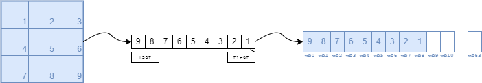
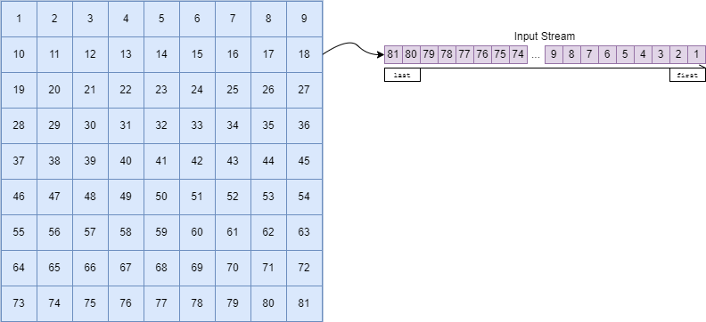
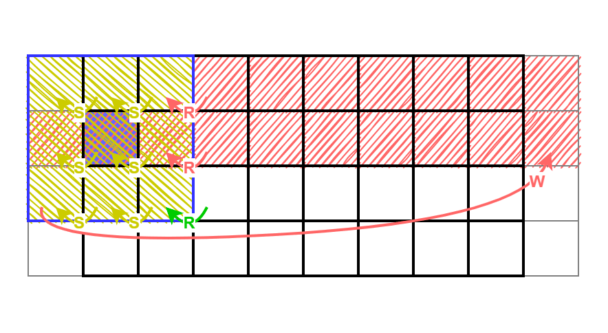

# Application Note / User Guide

This section outlines the general philosophy behind the operating principle of the DWPU and attempts to give some basic
guidance for mapping applications.

While the computational part of DWPU is very straight-forward, most complexity lies in the many possibilities for data
movement in the unit.  Data reuse, placement, and access pattern regularity are the most important aspects to consider
when mapping problems to the DWPU.

## General Operation Principles

Efficient computation on the DWPU is only possible when there is internal data reuse, i.e., if a loaded input value can
be utilized for several operations.  As data throughput on the DWPU is ultimately limited by the input and output streams
(providing and/or sinking 1 value per channel per cycle), reuse can only be achieved with internal storage.  Therefore,
scratchpad registers are used to buffer part of the input stream to keep data on hand for computation.  Conversely, if
every input value is used in exactly one operation, there is no need for buffering data and no performance benefit in
using the DWPU over the IAU or DPU.

!!! info "Operations on the DWPU follow the following principles:"

    1. Load data into scratchpad buffer once.
    2. Keep data in scratchpad buffer until all operations on that data are complete.
    3. Replace expired data with new data.
    4. Efficient execution will read one new data item and/or produce a new output data item on every clock cycle.

Furthermore, the DWPU features specific architectural features to make programming more efficient.  The most important
one is the behavior of the scratchpad as a shift shift-register.

!!! tip "Shifting Scratchpad:"

    It’s possible to keep loading data into the same register address (e.g., `sp_shift = 1'b1`).  Data will advance
    through the registers while the related portions of instruction encoding remain the same in every cycle.  It is not
    possible to use a *location*-based scheme that requires explicitly managing the location (register address) of data
    in every step as in a register file, and instead uses a *discrete time system-based* scheme where the location
    (register address) of data is determined by its “age” in the scratchpad (i.e., how many steps ago was this data
    loaded).

    With this shifting behavior, it is possible to describe computations with static operands in discrete time
    (e.g., with above patterns, `i_sel[x] = sp2` uses the data loaded in the previous step, `i_sel[x] = sp3` uses the
    data loaded two steps ago, etc.).

## Application Mapping Strategy

This section walks through the steps of mapping a 2D depth-wise convolution to the DWPU architecture.  The example
described here uses a 9×9 input image which is convolved with a 3×3 kernel using unit stride and no padding.  This
section includes the considerations for programming the DWPU and assumes data streams are properly provided and
post-processed outside of the unit.

Instructions are given as pseudo-operations for easier understanding, the exact forming of instructions and command
descriptors for this example are given in [Programming Flow](TODO:@review were do I find this?).

In PyTorch terms, the operation we call “depth-wise convolution” is the `torch.nn.Conv2d` method with the following
parameter constraints:

*	groups must be equal to the size of `in_channels`
*	`in_channels` is limited by the PWORD dimension to at most 64
*	The size of `out_channels` is an integer multiple of in_channels

!!! note "Furthermore, in our example, we use:"

    *	`kernel_size` = 3
    *	`groups` = `in_channels` = `out_channels` = 8
    *	`stride` = 1
    *	`padding` = 0
    *	`dilation` = 1

### Architectural Considerations

We shall call the horizontal dimension *width* and the vertical dimension *height* in the following explanations.  In
this example, we assume the processing direction is along the horizontal (width) axis.  In practice, the operating
direction is defined by the configuration of the input feeder (IFD) and output drainer (ODR), with no impact on the
operation of the DWPU.

Due to the finite number of weight buffer and scratchpad registers, there are hardware limitations placed on the
dimensions of the kernel and image, respectively.  The static operands are limited to 64 weight buffer registers, while
the scratchpad registers can buffer up to 126 input values.   Here, we only treat the common case where the weights form
the stationary operands in the weight buffers and the image is provided as the dynamic operands on the input stream and
scratchpad registers.  Furthermore, we assume the kernel fits into the weight buffer registers.  If the image size at
hand exceeds the scratchpad size limitations, it must be divided (*tiled*) accordingly.

A *tile* describes a portion of the input image which is sized to fit into the hardware limitations of the scratchpad.
The *tile* size is limited in the processing direction (width in this example), while the secondary direction (height)
is virtually unbounded.

A *line* is a 1-high slice of the input image which fills the entire tile width.

The convolution is best compiled into two separate programs for weight loading and the actual convolution, each with its
own command descriptor and set of data streams.

### Weight Loading

In a first step, the weights making up the convolutional kernel must be loaded into the weight buffer registers.
The 3×3 kernel consists of 9 weights, which in our example are streamed in line by line and left-to-right
Each weight is stored in a weight buffer register by the `wb_shift` functionality, in our example the consecutive weight
buffer registers `wb0-wb8` are used.

The instruction to load input data into weight buffer register `wbx` requires setting the `wb_shift` bit.  The data-path
expects input data to be streamed. Other fields should be set so that no SP state change and no output push occurs, as
shown below:

| Instruction Entry | Value | Description                                                     |
|:----------------- |:----- |:--------------------------------------------------------------- |
| `opcode`          | `?`   | Don't care on operation.                                        |
| `op_exe`          | `0x0` | No result is produced in this operation.                        |
| `shift_sp`        | `0x0` | Do not load a new value into the scratchpad.                    |
| `shift_wb`        | `0x1` | Shift in a new value into the weight-buffer.                    |
| `last_push`       | `0x0` | No result is produced in this operation.                        |
| `I_SEL`           | `?`   | Don't care on image selection register. Recommended value `0`.  |
| `W_SEL`           | `?`   | Don't care on weight selection register. Recommended value `0`. |

As such, weight loading will consist of 9 instructions consuming an input stream of length 9 carried out on the DWPU as
a loop of 9 shift instructions:

* (Shift all weights up by one register and) load input into weight buffer register 0.

After these operations, the kernel will reside in the weight buffer registers of the DWPU and
the unit is ready to perform convolutions in the following steps.

### Depth-Wise Convolution

After weights have been loaded, the convolution operation per se can be carried out.  Our 9×9 image consists of
81 pixels which again are streamed in line by line and left-to-right.

## Programming Flow

Programming the DWPU in practice requires knowledge of the general AI Core programming flow (see the
[programming flow](TODO:@review were do I find this?) document), usage of the command block (see the [cmdblock](TODO:@review were do I find this?) document), as well as the
chosen [memory map]({{link_repo_file("hw/impl/europa/data/memory_map/memory_map.yml")}}) on the DWPU AXI4 slave control interface.

With the shifting an access pattern like below is easily implementable:

Check archives/dwc_overview.md for some discussion

1. Load weights
2. Start fetching data while filling scratchpad
3. Start computing results while fetching new data as soon as enough data is cached
4. At the end of each line fetch new elements without computing results
