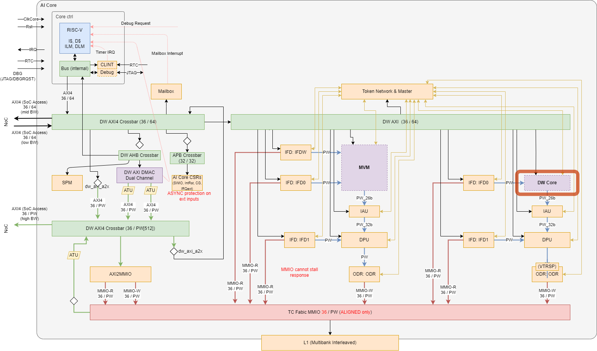

# Depth-Wise Processing Unit (DWPU)

The following describes the architectural requirements of the Depth-Wise Processing Unit (DWPU).
It provides information regarding the possible configurations and communication protocols as well as details regarding the microarchitecture of the blocks.

## Architectural Overview

**TODO(@wolfgang.roennigner): Use the new docstring extraction when it comes online**
%% (page.meta._rtl.sv.dwpu.modules | selectattr('name', '==', 'dwpu') | first).doc %%
The unit is meant to process intra-channel (depth-wise) operations which would be inefficient to perform on the MVM unit.

Analogously to the MVM unit, the DWPU forms the main processing element in its own data path comprised of Input Feeder (IFD), DWPU, Integer Accumulation Unit (IAU), Data Processing Unit (DPU), and output Drainer (ODR). Following shows the block diagram of the entire AI Core system, with the DWPU highlighted in red.

## Main Features and Requirements

The DWPU features a scratchpad register file and a programmable data path fabric which allows implementing various operations and data access patterns.

###	Main Features

* Each channel features:
    * A scratchpad register file (containing 126 registers, parametric) allowing to prefetch data for reuse, as well as
    * A weight buffer register set (containing 64 registers, parametric), both feeding data into
    * A reduction tree (having 9 inputs, parametric) of MAC units and comparators.
* In addition, all channels share a control flow unit which orchestrates in SIMD fashion:
    * Fetching input data from the input stream (coming from IFD)
    * Emitting the next state and enable signals for the internal registers
    * Emitting output data to the output stream (towards the IAU)

###	Design and Implementation Requirements

The reduction tree is laid out to complete the entire reduction in one clock cycle. Pipelining registers can be inserted via parameter for retiming after the tree.

###	Trade-offs

* Size of scratchpad register file: area vs. performance as tile overlap penalties are paid. In extremis this limits the problem size we can efficiently compute.
* Number of weight registers: Area vs. maximum native kernel size.
* Size of MAC tree input field: Area & Path vs. peak throughput.
* Implementation of scratchpad & weight buffer as SRAMs vs. registers  Area vs. control complexity

## Reset & Clock Requirements

The DWPU doesn’t have its own reset generation unit and is reset with the AI Core.

| Reset     | Reset Requirements             |
|:--------- |:------------------------------ |
| `i_rst_n` | Asynchronous, active-low reset |

The DWPU operates synchronously with and in the AI Core clock domain, fed from its external clock.

| Clock Name | Source   | Target Frequency | Comment                                    |
|:---------- |:-------- |:---------------- |:------------------------------------------ |
| `i_clk`    | External | 1.2GHz           | AI Core / DW subsystem clock from CORE_CLK |

## Bus interfaces

The DWPU has two data bus AXI stream interfaces: incoming from IFD0 and outgoing to IAU. Furthermore, an AXI4 configuration interface is present.

| Interface Name | Protocol | Configuration                          | Clock Domain |
|:-------------- |:-------- |:-------------------------------------- |:------------ |
| Config Port    | AXI4     | Address Width: 36, Data Width: 64      | `i_clk`      |
| `axis_in`      | AXI4S    | Data Width: 512, no “strb”, no “keep”  | `i_clk`      |
| `axis_out`     | AXI4S    | Data Width: 1664, no “strb”, no “keep” | `i_clk`      |

The bus interfaces are standardized across AI Core blocks, and thus documented separately.
Refer to the [AXI interfaces document](TODO:@review were do I find this?) for the config port, as well as the [AXI-Stream interfaces](TODO:@review were do I find this?) document for the stream ports.

## Interrupts

The DWPU raises a single level-triggered interrupt when the data path encounters invalid programs. See
[Error Detection and Interrupts](./25_error_detection_and_interrupts.md) for detailed information on which events will
raise an interrupt.

| IRQ Name | Size (bits) | Edge/Level | Polarity | Description       |
|:-------- |:----------- |:---------- |:-------- |:----------------- |
|  `o_irq` | 1           | Level      | High     | Interrupt Request |

## Address Space

Programmable blocks within DWPU – namely the CSRs, the command descriptor memory inside the command block, the
instruction memory inside the data path command generator, and the software instruction FIFO – are accessible from the
core controller via the AXI4 interface as memory-mapped regions. Please refer to the
[generated document]({{link_repo_file("hw/impl/europa/data/memory_map/memory_map.yml")}}) for memory map information.

## Register Map

The full register map for DWPU is available in the triton repository in two flavors: a [machine-readable version]({{link_repo_file("hw/ip/dwpu/default/data/dwpu_csr.hjson")}})
as well as a [human-readable](./build_reg/dwpu_csr_regs.md) version. The source of truth for the RTL implementation is the
machine-readable version and shall be used as a source for any derivative developments. The human-readable text found
in the repository is, however, enforced to be in synch with the machine-readable one.

## Module Parameters

**TODO(@wolfgang.roenniner): Update properly when docstring extraction comes online**

%% europa/hw/ip/dwpu/default/rtl/dwpu.sv:parameter_table %%

## IO Description

**TODO(@wolfgang.roenniner): Update properly when docstring extraction comes online**

%% europa/hw/ip/dwpu/default/rtl/dwpu.sv:port_table %%
