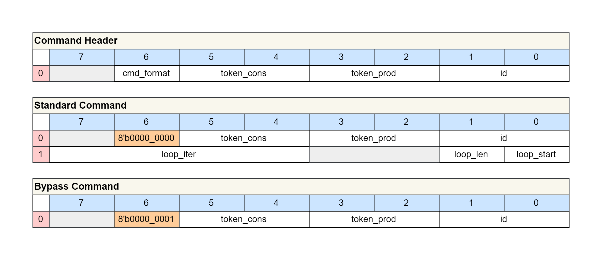
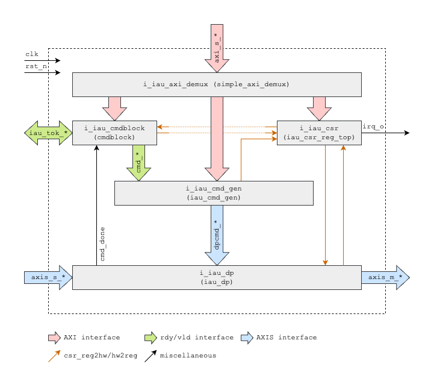
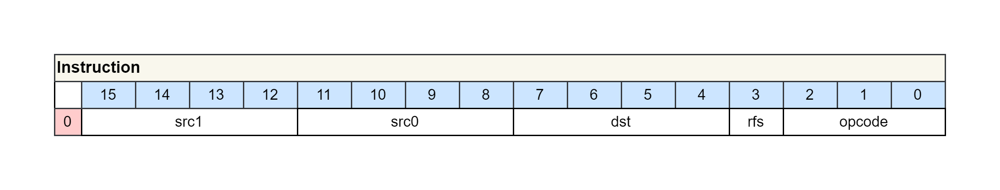
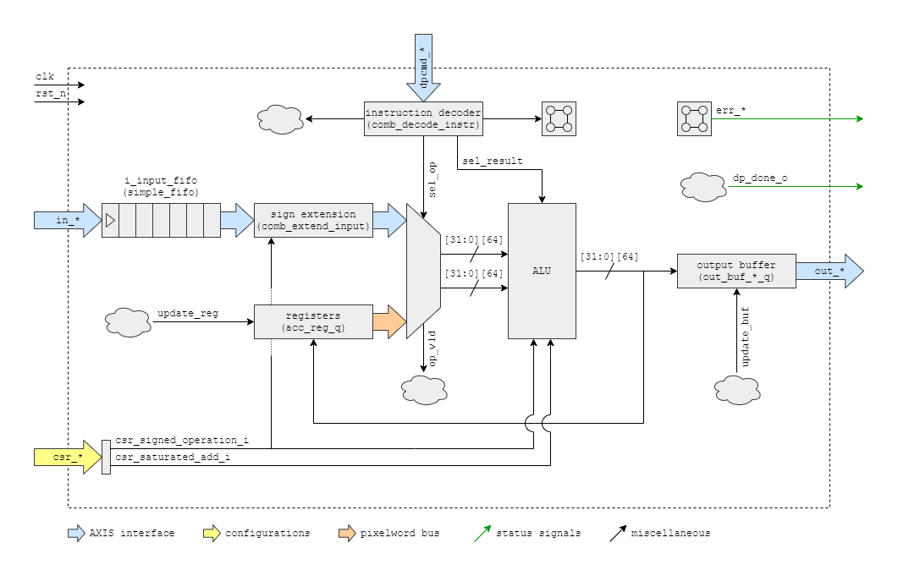

# IAU

<!--
Start with the name of the block and provide author information.
-->

# Table of Contents

- [IAU](#iau)
- [Table of Contents](#table-of-contents)
  - [Acronyms, Abbreviations and Typefaces](#acronyms-abbreviations-and-typefaces)
  - [Overview](#overview)
    - [Architectural Overview](#architectural-overview)
    - [Main Features](#main-features)
    - [Configurations](#configurations)
    - [Register Map](#register-map)
    - [Address Map](#address-map)
    - [Interrupts](#interrupts)
    - [Programming Flow](#programming-flow)
  - [High-Level Requirements](#high-level-requirements)
  - [Top-Level Block Diagram](#top-level-block-diagram)
  - [Parameters and Typedefs](#parameters-and-typedefs)
  - [Interfaces](#interfaces)
  - [Protocols](#protocols)
  - [Clocks](#clocks)
  - [Resets](#resets)
  - [Implementation Details](#implementation-details)
    - [Submodule: iau\_csr\_reg\_top](#submodule-iau_csr_reg_top)
    - [Submodule: iau\_cmd\_gen](#submodule-iau_cmd_gen)
    - [Submodule: iau\_dp](#submodule-iau_dp)
  - [Caveats and Pitfalls](#caveats-and-pitfalls)
    - [Valid Programs](#valid-programs)
    - [Pseudo Stream Registers](#pseudo-stream-registers)
    - [Program Length and Iteration Count of Zero](#program-length-and-iteration-count-of-zero)
    - [RFS Instruction](#rfs-instruction)

## Acronyms, Abbreviations and Typefaces

<!--
Good documentation requires a clear understanding of the acronyms and abbreviations, so
it is important to keep this table updated.
-->

| Abbreviations | Meaning                              |
| ------------- | ------------------------------------ |
| IAU           | Integer Arithmetic Unit              |
| AXI4          | Advanced eXtensible Interface 4      |
| AXIS          | Advanced eXtensible Interface Stream |

## Overview

<!--
1-2 page description of the block. Briefly cover at a high level what it does and show a "birds-eye" black-box view of the top level.
Discuss goals and non-goals, how it is intended to integrate into a larger system, list any standard protocols, highlight important
performance requirements, touch on debugging features, and describe physical design assumptions (floorplanning, timing, area, power,
pin placement, reliability targets) and other relevant silicon considerations.
Outline the design methodology (coding language, in-house and third-party libraries & IPs) and anything else that a verification engineer
should know before writing their first draft of the test plan.
-->

This document describes the Integer Arithmetic Unit (IAU) subip of the AI Core.

### Architectural Overview

The IAU has four major interfaces:

-   An AXIS input stream, that comes either from the MVM or DWPU block.
    The IAU receives a stream of pixelwords (PWORDs) over this
    interface.
-   An AXIS output stream, that goes to the DPU block. The IAU sends a
    stream of pixelwords (PWORDs) over this interface.
-   An AXI slave interface for controlling and programming the IAU.
-   A token interface to be optionally used for a more complex control
    scheme requiring synchronization.

In the basic operation the IAU receives a stream packet on the input
stream interfaces, performs integer operations on the streams and
produces an output stream packet containing the results.

### Main Features

The IAU performs integer operations on the input pixelword (PWORD)
stream to produce an output pixelword stream. Pixelwords are vectors of
64 pixels which vary in bit width throughout the AI Core. In the case of
the IAU, a single input pixel is 26-bit wide and the produced output
pixel is 32-bit wide. This results in the input pixelword to be 1664-bit
wide, and the output pixelword to be 2048-bit wide.

The IAU's integer operations are executed
pixel-wise, i.e., operations are done for each of the 64 pixels of a
pixelword separately. Therefore, pixels located at different pixel
positions in the pixelwords cannot interact in the IAU. Below is a list
of typical integer operations:

-   Stream reduction operations:
    -   Pixel-wise summation across all N pixelwords of the input stream
        to produce a single pixelword at the output stream
    -   Pixel-wise min/max across all N pixelwords of the input stream
        to produce a single pixelword at the output stream

-   Pooling operations:
    -   Pixel-wise summation of a group of 4 pixelwords either
        sequentially or interleaved, e.g., sum of all A/B pixels in a
        sequence AAAABBBB or ABABABAB, respectively
    -   Pixel-wise min/max of a group of 4 pixelwords either
        sequentially or interleaved, e.g., min/max of all A/B pixels in a
        sequence AAAABBBB or ABABABAB, respectively

The IAU has internal 32-bit accumulators and comparators to accomplish
the above-mentioned integer operations. Furthermore, the IAU contains 8
internal pixelword registers to store intermediate results. This is
useful for example in the interleaved summation mentioned above.

The IAU like all subips in the AI Core is an instruction-based subip.
Similar to the other units, it has an instruction memory, where one
or multiple IAU programs can be stored. To kick of the unit, a command
must be sent to the unit, telling the unit which program to run from the
instruction memory. When kicked off, the unit consumes by default one
AXI stream packet from its input and produces one AXI stream packet on the
output.

Or in more detail: The execution of integer operations is thus tied to
the execution of a program of instructions (DPcmd). A program of
instructions can be stored internally in the memory of the DPcmd
generator. To trigger the execution of the program, the system
controller sends out a command to the command block that then sends out
a command descriptor to the DPcmd generator. Next, the DPcmd generator
provides the program's instructions as a stream to the datapath, where
the instructions are then executed cycle by cycle. For further
information regarding the programming flow consult [Programming Flow](#programming-flow).

The IAU supports five different instructions enabling various integer
operations. The instructions can take data from either the input stream
or the internal registers, and either push the result into the output
stream or store it in the internal registers. One destination and up to
two sources are possible. We list all supported instructions below.

| Instructions | Description                                                         |
| ------------ | ------------------------------------------------------------------- |
| NOP          | No operation cycle which can be used to insert one cycle of latency |
| MV           | Move src0 to dst (copy value)                                       |
| MAX          | Compare src0 and src1 and store max value of both in dst            |
| MIN          | Compare src0 and src1 and store min value of both in dst            |
| ADD          | Add src0 and src1 and store sum in dst                              |

Instructions can be executed with an additional Repeat For Stream (RFS)
flag. Such instructions are repeated until the input stream is depleted.
This feature allows the IAU to execute stream reduction operations on
any input stream without knowing its length N a priori. Note, that RFS
instructions need to pop data from the input stream, otherwise the input
stream will not be depleted resulting in an endless repetition of such
instructions.

### Configurations

There are several configurations to alter the behavior of the IAU. There are three additional configurations
for the IAU's datapath.

| Configuration   | Default | Description                                                                                                                                 |
| --------------- | ------- | ------------------------------------------------------------------------------------------------------------------------------------------- |
| SIGNED_OP       | ON (1)  | If set to 1 operands in the datapath are treated as signed instead of unsigned                                                              |
| SAT_OP          | OFF (0) | If set to 1 adders in the datapath saturate instead of overflow                                                                             |
| IGNORE_SEGFAULT | ON (1)  | If set to 1 cmd_gen ignores any program memory segfaults and continues execution by repeating the last valid instruction instead of halting |

The configurations are exposed through the CSRs. For more information on
CSRs see [Register Map](#register-map).

Note, that it is not expected that the IAU should run in any
configuration other than the default configuration.

### Register Map

The CSRs are auto-generated using the reggen tool which requires an
hjson file describing the register map to be generated. 

<!--
The content
of the hjson is provided below.

\{\{ field_table('iau') }}
-->
In the last section of the programming flow documentation found
[here](https://axeleraai.sharepoint.com/sites/AXELERAAI-ResearchandDevelopment/Gedeelde%20documenten/Research%20and%20Development/hw/projects/triton/specifications/AI%20Core/common/programming%20flow/programming_flow.docx),
the usage of the CSRs is described in detail. In summary, the CSRs can
typically be assigned to two types: control and status registers.
Control CSRs are modified by the SW to alter the behavior of the HW, see
also [Configurations](#configurations). Any configuration is
persistent across executions of commands and reverting back to the
initial configuration requires a reset of the control CSRs to their
default value either through SW or an actual reset. The status CSRs
provide insightful information on the status of the HW to the SW in a
read-only manner.

### Address Map

Several sub-blocks in the IAU can be accessed externally by the same AXI
interface: command block, DPcmd generator, and the
CSRs. 

Information on the exact addressing of the control sub-blocks is
provided in the caveats section of the programming flow documentation
found
[here](https://axeleraai.sharepoint.com/sites/AXELERAAI-ResearchandDevelopment/Gedeelde%20documenten/Research%20and%20Development/hw/projects/triton/specifications/AI%20Core/common/programming%20flow/programming_flow.docx).
In summary the control sub-blocks either store data in a FIFO or a
memory-like structure. For FIFOs the local addressing is not relevant
and the AXI transactions simply has to target the address range of the
control sub-block. See also the table below.

| Control Sub-block         | Data Storage | Local Addressing | Readable |
| ------------------------- | ------------ | ---------------- | -------- |
| Command Block             | FIFO         | Not relevant     | No       |
| DPcmd Generator (PRG Mem) | Memory       | Relevant         | Yes      |

Note, that the program memory is indeed a memory. Programs can therefore
be re-used by several commands. Furthermore, great care must be taken
when writing into the program memory to ensure that no currently
executed program is overwritten.

### Interrupts

The IAU has one level-triggered interrupt signal which is raised when at
least one error condition is present. Each error condition is tracked in
the `IRQ_STATUS` CSR and the corresponding interrupt enable bits can be
found in the `IRQ_EN` CSR. By default all interrupts are initially disabled.
Some error conditions are common, i.e., present inall AI Core subips.
Below table lists all the error conditions with their CSR bit position:

| Interrupt                  | Bit | Description                                                                           | Common |
| -------------------------- | --- | ------------------------------------------------------------------------------------- | ------ |
| ERR_ACT_STREAM_IN          | 0   | At the end of program execution no TLAST received at input stream                     | No     |
| ERR_ACT_STREAM_OUT         | 1   | At the end of program execution no TLAST sent at output stream                        | No     |
| ERR_EARLY_TLAST_STREAM_IN  | 2   | Pop is executed after input stream has been fully consumed                            | No     |
| ERR_EARLY_TLAST_STREAM_OUT | 3   | Push is executed after output stream has been fully produced                          | No     |
| ERR_PRG_SEGFAULT           | 4   | Program to be executed would attempt to read outside of the program memory            | No     |
| ERR_PRG_LEN_ZERO           | 5   | Program to be executed has an illegal length of zero                                  | No     |
| ERR_LOOP_ITER_ZERO         | 6   | Program to be executed has an illegal iteration count of zero                         | No     |
| ERR_ILLEGAL_RFS_INSTR      | 7   | RFS instruction without input stream pop encountered                                  | No     |
| CMDBLK_CMD_DROPPED         | 8   | Command block FIFO had to drop at least one command because the FIFO was already full | Yes    |
| DBG_SW_INTERRUPT           | 32  | Triggerable via SW using the CSR bit DBG_SW_IRQ in the DP_CTRL CSR                    | Yes    |

The data stream error conditions (`ERR_ACT_STREAM_IN` &
`ERR_ACT_STREAM_OUT`) and the dropped command error condition
(`CMDBLK_CMD_DROPPED`) are further explained in the
caveats section of both this documentation and the programming flow
documentation found
[here](https://axeleraai.sharepoint.com/sites/AXELERAAI-ResearchandDevelopment/Gedeelde%20documenten/Research%20and%20Development/hw/projects/triton/specifications/AI%20Core/common/programming%20flow/programming_flow.docx).

For more information in general about the interrupt system implemented
in each AI Core subip also consult the programming flow documentation
found
[here](https://axeleraai.sharepoint.com/sites/AXELERAAI-ResearchandDevelopment/Gedeelde%20documenten/Research%20and%20Development/hw/projects/triton/specifications/AI%20Core/common/programming%20flow/programming_flow.docx).

### Programming Flow

The IAU is an instruction-based subip and its control flow has only been
hinted at throughout the document. Fortunately, the IAU does not deviate
from the standard control flow and thus, one can consult the common
programming flow documentation found
[here](https://axeleraai.sharepoint.com/sites/AXELERAAI-ResearchandDevelopment/Gedeelde%20documenten/Research%20and%20Development/hw/projects/triton/specifications/AI%20Core/common/programming%20flow/programming_flow.docx)
for a detailed discussion.

Below several examples are provided which serve to illustrate how to
control the IAU. The examples are in the form of lists of AXI
transactions to the various control sub-blocks.

The first example demonstrates the execution of a simple program in the
IAU. Again we start by enabling the command block if necessary.
Afterwards we store the program to be executed into the PRG_MEM one 16-bit
instruction at a time. Note, that we could actually store up to four instructions
at once, reducing the programming time overhead significantly.
Finally, we send the command to execute the stored program by indicating
its length and start address and poll until the end of its execution.
The example program provided here sums up the pixelwords of the input
stream transaction and provides the sum as a single pixelword at the
output stream resulting in a stream reduction operation. Note, that
according to the control concept, the input stream transaction must be
fully consumed after the execution of a program, and thus, the input
stream transaction must be of length four.

| R/W   | Address                  | Strobe               | Data                                   | Description                                                                                                  |
| ----- | ------------------------ | -------------------- | -------------------------------------- | ------------------------------------------------------------------------------------------------------------ |
| Write | <nobr>`20'hB0000`</nobr> | <nobr>`8'hFF`</nobr> | <nobr>`64'hXXXX_XXXX_XXXX_XXX1`</nobr> | Start command block of IAU by setting EXEC_EN bit of CMDBLK_CTRL to high (can be skipped if already started) |
| Write | <nobr>`20'hB8000`</nobr> | <nobr>`8'h03`</nobr> | <nobr>`16'h0A01`</nobr>                | Store one 16-bit instruction in PRG_MEM at address 0: `mv acc0 p0`                                           |
| Write | <nobr>`20'hB8002`</nobr> | <nobr>`8'h03`</nobr> | <nobr>`16'h0A04`</nobr>                | Store one 16-bit instruction in PRG_MEM at address 2: `add acc0 p0 acc0`                                     |
| Write | <nobr>`20'hB8004`</nobr> | <nobr>`8'h03`</nobr> | <nobr>`16'h0A04`</nobr>                | Store one 16-bit instruction in PRG_MEM at address 4: `add acc0 p0 acc0`                                     |
| Write | <nobr>`20'hB8006`</nobr> | <nobr>`8'h03`</nobr> | <nobr>`16'h0A94`</nobr>                | Store one 16-bit instruction in PRG_MEM at address 6: `add l0 p0 acc0`                                       |
| Write | <nobr>`20'hB1000`</nobr> | <nobr>`8'hFF`</nobr> | <nobr>`64'h0000_0000_0000_0000`</nobr> | Send command header with command format set to standard command (other fields can be left empty)             |
| Write | <nobr>`20'hB1000`</nobr> | <nobr>`8'hFF`</nobr> | <nobr>`64'h0000_0001_0000_0400`</nobr> | Send command payload to execute program of length 4 starting at address 0 in the PRG_MEM once                |
| Read  | <nobr>`20'hB0008`</nobr> | <nobr>`8'hFF`</nobr> | <nobr>`64'h????_????_????_??01`</nobr> | Simple polling of IDLE bit of CMDBLK_STATUS to determine end of execution                                    |

The example below is again an execution of a program similar to above.
In fact, the execution of the example program is again a stream
reduction operation. Here we also sum up all the pixelwords of an input
stream transaction and provide the sum as a pixelword to the output
stream. However, this time around we use an RFS instruction to sum up an
input stream transaction of any length larger or equal to two without
the need to know the length beforehand.

| R/W   | Address                  | Strobe               | Data                                   | Description                                                                                                       |
| ----- | ------------------------ | -------------------- | -------------------------------------- | ----------------------------------------------------------------------------------------------------------------- |
| Write | <nobr>`20'hB0000`</nobr> | <nobr>`8'hFF`</nobr> | <nobr>`64'hXXXX_XXXX_XXXX_XXX1`</nobr> | Start command block of IAU by setting EXEC_EN bit of CMDBLK_CTRL to high (can be skipped if already started)      |
| Write | <nobr>`20'hB8020`</nobr> | <nobr>`8'h3F`</nobr> | <nobr>`16'h0091_0A0C_0A01`</nobr>      | Store three 16-bit instructions in PRG_MEM at address 32: `mv acc0 p0`, `add_rfs acc0 p0 acc0`, and `mv l0 acc0 ` |
| Write | <nobr>`20'hB1000`</nobr> | <nobr>`8'hFF`</nobr> | <nobr>`64'h0000_0000_0000_0000`</nobr> | Send command header with command format set to standard command (other fields can be left empty)                  |
| Write | <nobr>`20'hB1000`</nobr> | <nobr>`8'hFF`</nobr> | <nobr>`64'h0000_0001_0000_0300`</nobr> | Send command payload to execute program of length 3 starting at address 32 in the PRG_MEM once                    |
| Read  | <nobr>`20'hB0008`</nobr> | <nobr>`8'hFF`</nobr> | <nobr>`64'h????_????_????_??01`</nobr> | Simple polling of IDLE bit of CMDBLK_STATUS to determine end of execution                                         |

The third example shows again the execution of a program with the
addition of repeating said execution 16 times. The program calculates
and outputs the maximum value of four input pixelwords. By repeating it
16 times, an input stream transaction of length 64 yields an output
stream transaction of length 16. This is a max pooling operation of
groups of four consecutive pixelwords. Note, that the last instruction
of the program pushes to the output stream with the TLAST set to high
(l0 as destination). However, only in the last loop iteration of the
program is this effectively the case. This so-called demotion of the
output pseudo stream register is described in more detail in
[Pseudo Stream Registers](#pseudo-stream-registers).

| R/W   | Address                  | Strobe               | Data                                   | Description                                                                                                                        |
| ----- | ------------------------ | -------------------- | -------------------------------------- | ---------------------------------------------------------------------------------------------------------------------------------- |
| Write | <nobr>`20'hB0000`</nobr> | <nobr>`8'hFF`</nobr> | <nobr>`64'hXXXX_XXXX_XXXX_XXX1`</nobr> | Start command block of IAU by setting EXEC_EN bit of CMDBLK_CTRL to high (can be skipped if already started)                       |
| Write | <nobr>`20'hB8000`</nobr> | <nobr>`8'hFF`</nobr> | <nobr>`16'h0A92_0A02_0A02_0A01`</nobr> | Store four 16-bit instructions in PRG_MEM at address 0: `mv acc0 p0`, `max acc0 p0 acc0`, `max acc0 p0 acc0`, and `max l0 p0 acc0` |
| Write | <nobr>`20'hB1000`</nobr> | <nobr>`8'hFF`</nobr> | <nobr>`64'h0000_0000_0000_0000`</nobr> | Send command header with command format set to standard command (other fields can be left empty)                                   |
| Write | <nobr>`20'hB1000`</nobr> | <nobr>`8'hFF`</nobr> | <nobr>`64'h0000_0010_0000_0400`</nobr> | Send command payload to execute program of length 4 starting at address 0 in the PRG_MEM 16 times                                  |
| Read  | <nobr>`20'hB0008`</nobr> | <nobr>`8'hFF`</nobr> | <nobr>`64'h????_????_????_??01`</nobr> | Simple polling of IDLE bit of CMDBLK_STATUS to determine end of execution                                                          |

For the instructions and commands consult [Specifications](#specifications).

Lastly, the examples always use a command header without any token information,
and thus, do not utilize the token system to facilitate synchronization across multiple
AI Core blocks. However, the IAU does not share access to contended resources with
other AI Core blocks, and therefore, the token system is less relevant
here. Nonetheless, more information on the token system can be found in
the token manager documentation
[here](https://axeleraai.sharepoint.com/sites/AXELERAAI-ResearchandDevelopment/Gedeelde%20documenten/Research%20and%20Development/hw/projects/triton/specifications/AI%20Core/ai_core_ls/TokenMGR/TokenMGR.docx)
and the programming flow documentation
[here](https://axeleraai.sharepoint.com/sites/AXELERAAI-ResearchandDevelopment/Gedeelde%20documenten/Research%20and%20Development/hw/projects/triton/specifications/AI%20Core/common/programming%20flow/programming_flow.docx).
The examples also do not consider additional steps such as enabling
error IRQs or changing the configuration of the IAU.

## High-Level Requirements

<!--
In a few paragraphs, outline the key high-level design requirements for this block — carefully distinguish between functionality (behaviour)
and performance.
It may also be helpful to define explicit non-goals.
A non-exhaustive list of things to think about clock frequencies and reset ordering; types of transactions and the interfaces they involve;
transaction concurrency within and across interfaces; side effects from transactions; ordering requirements; flow control mechanisms;
arbitration policies, fairness, and deadlock avoidance guarantees; transaction routing; performance; debuggability.
-->

The IAU is controlled externally by commands sent to the internal
command block. The commands consist of a header and a payload. The
command header contains meta information relevant to the command block.
The command header contains the command format which determines whether
the command instructs the IAU datapath to execute the program
described in its payload. Note, that programs can be looped several times to
reduce program memory usage. The different command formats are listed below.

Below tables list all arguments of the command header.

| Arguments  | Description                                                             |
| ---------- | ----------------------------------------------------------------------- |
| id         | Command ID which was used for the now deprecated static command feature |
| token_prod | Tokens to be produced after the execution of the command                |
| token_cons | Tokens to be consumed prior to the execution of the command             |
| cmd_format | Command format as described in above table                              |

In the case of a standard command the program to be executed must be described with the
following arguments.

| Arguments  | Description                              | Bit Width |
| ---------- | ---------------------------------------- | --------: |
| loop_start | Start address of the program loop        |    8 bits |
| loop_len   | Length of the program loop               |    8 bits |
| loop_iter  | Number of iterations of the program loop |   32 bits |

It is not recommended that standard commands set `loop_len` or `loop_iter` to zero.
The behavior in such a case is detailed in [Program Length and Iteration Count of Zero](#program-length-and-iteration-count-of-zero).

The exact encoding for the IAU commands is shown in the below diagrams.

Programs consist of a list of stored instructions which are explained
in greater detail later in [Submodule: iau\_cmd\_gen](#submodule-iau_cmd_gen).

The command block in the IAU can store multiple outstanding commands.
The token system of the AI Core, which is responsible for the
synchronization of all its subips, determines when an outstanding
command can be executed. The necessary token information is meta data
embedded in the header of the commands. More information on the token
system can be found in the token manager documentation
[here](https://axeleraai.sharepoint.com/sites/AXELERAAI-ResearchandDevelopment/Gedeelde%20documenten/Research%20and%20Development/hw/projects/triton/specifications/AI%20Core/ai_core_ls/TokenMGR/TokenMGR.docx)
and the programming flow documentation
[here](https://axeleraai.sharepoint.com/sites/AXELERAAI-ResearchandDevelopment/Gedeelde%20documenten/Research%20and%20Development/hw/projects/triton/specifications/AI%20Core/common/programming%20flow/programming_flow.docx).

The entire design can be stalled in case of backpressure from the DPU or
lack of input data and/or commands. Therefore, the IAU itself also
exhibits backpressure.

## Top-Level Block Diagram

<!--
The top-level block diagram should indicate the block boundary and all major interfaces.
Draw the top-level submodules and how they connect internally, but avoid showing an excessive amount of internal implementation detail.
The structure of the top-level block diagram should correspond 1:1 with the contents of the top-level RTL module.
Avoid "free-floating" logic at the top level (everything should be encapsulated in submodules).
-->

## Parameters and Typedefs

<!--
Maintain tables of typedefs and design parameters.
Include major package parameters (both block-private and shared), top-level module parameters, and preprocessor macros that set global constants.
Do not include parameters or macros that are calculated from others. Make sure to describe any constraints and any assumptions about reasonable
or default values.
Only define the types that are necessary to fully define the parameters and interfaces.
-->

The IAU has parameters in its own subip package (iau_pkg.sv) listed
below.

| Parameter              | Value | Description              |
| ---------------------- | ----- | ------------------------ |
| IAU_DP_INPUT_FIFO_SIZE | 8     | Depth of input data FIFO |

Not listed are the package parameters regarding the various encodings,
CSRs, and local address map, since they are described in other
documents.

## Interfaces

<!--
Maintain a table of top-level interfaces. Group related ports as a single interface.
Show the ports directions and types, describe what the interface is used for, and follow common naming conventions.
Mention the use of any standard protocols. Avoid excessive abbreviations. The port directions, types, and names should match 1:1 with the RTL ports.
Port directions should be from the block’s perspective (just like in RTL).
-->

A summary of the I/O interfaces is provided below:

| Signal/Bus         | Direction | Data Width  | Address Width | Description                 |
| ------------------ | --------- | ----------- | ------------- | --------------------------- |
| i_clk              | IN        | 1           | N/A           | Clock signal                |
| i_rst_n            | IN        | 1           | N/A           | Active-low reset signal     |
| o_iau_tok_prod_vld | OUT       | NR_TOK_PROD | N/A           | Valid for token production  |
| i_iau_tok_prod_rdy | IN        | NR_TOK_PROD | N/A           | Ready for token production  |
| i_iau_tok_cons_vld | IN        | NR_TOK_CONS | N/A           | Valid for token consumption |
| o_iau_tok_cons_rdy | OUT       | NR_TOK_CONS | N/A           | Ready for token consumption |
| o_irq              | OUT       | 1           | N/A           | Level interrupt signal      |
| o_obs              | OUT       | OBS_W       | N/A           | Observation signals         |
| i_cid              | OUT       | CID_W       | N/A           | AI Core ID                  |
| i_block_id         | IN        | BLOCK_ID_W  | N/A           | AI Core block ID            |

For more information on the AXI and AXIS interfaces consult the common
documentation found
[here](https://axeleraai.sharepoint.com/sites/AXELERAAI-ResearchandDevelopment/Gedeelde%20documenten/Research%20and%20Development/hw/projects/triton/specifications/AI%20Core/common/AXI%20interface/AXI_interface_spec.docx)
and
[here](https://axeleraai.sharepoint.com/sites/AXELERAAI-ResearchandDevelopment/Gedeelde%20documenten/Research%20and%20Development/hw/projects/triton/specifications/AI%20Core/common/AXI-S%20interface/AXI-S_interface_spec.docx),
respectively.

## Protocols

<!--
For all interfaces that use a standard industry protocol or an internal/proprietary protocol, list them here and link to the relevant specifications
that govern those protocols.
If any interfaces use custom protocols that are not defined elsewhere, then define them in detail here, with one subsection per protocol.
Make sure to define any protocols that involve more than one interface.
-->

The IP uses mostly AXI4 and AXIS where the spec can be found [here](https://developer.arm.com/documentation/ihi0022/latest/).

## Clocks

<!--
Maintain a table of clock domains used in the design. For each clock, state its nominal frequency and the supported dynamic range.
Show the same top-level block diagram as before, but this time annotate it to show which submodules are in each clock domain.
Datapath clock domain crossings should be drawn explicitly, and they should be encapsulated within one or more submodules.
For clocks that are used for "backbone" functions that span many submodules (e.g., a CSR bus on its own clock domain), state this clearly and defer
the details to another appropriate document or section.
-->

IAU is a single clock domain IP.

| Clock | Nominal Frequency | Description          |
| ----- | ----------------- | -------------------- |
| i_clk | up to 1.2GHz      | Clock used in the IP |

## Resets

<!--
Maintain a table of reset domains used in the design.
For each reset, state whether it is synchronous or asynchronous; active high or active low; and if synchronous, to which clock.
Show the same top-level block diagram as before, but this time annotate it to show which submodules are in each reset domain.
Datapath reset domain crossings should be drawn explicitly, and they should be encapsulated within one or more submodules.
For resets that are used for "backbone" functions that span many submodules (e.g., a CSR bus on its own reset domain), state this clearly and defer
the details to another appropriate document or section.
If the reset protocol is custom to this block, include a subsection that defines the relevant procedures.
Otherwise, cite other documents that provide these details.
-->

This IP uses a single asynchronous reset.

| Reset   | Kind  | Description                   |
| ------- | ----- | ----------------------------- |
| i_rst_n | async | Active low asynchronous reset |

## Implementation Details

<!--
The remainder of the spec should show the design detail of every significant submodule.
This section may often comprise 50% of the entire document.
Organize the diagrams such that they correspond 1:1 with the RTL.
Ideally, hyperlink diagrams to each other in a tree structure, thus allowing you to avoid overwhelming the reader with excessive details
in any particular diagram and making it easy for the reader to correspond their knowledge of the design with the RTL code organisation.
For complex submodules, describe their implementations. Make note of any standard libraries or IPs and link to their specifications.
-->

The design of the IAU contains several submodules. The following table
describes each submodule and the figure below it depicts how they are
interconnected.

| Instance        | Module           | Common | Description                                   |
| --------------- | ---------------- | ------ | --------------------------------------------- |
| i_iau_axi_demux | simple_axi_demux | Yes    | AXI demux to all AXI accessible submodules    |
| i_iau_cmdblock  | cmdblock         | Yes    | Command block controlling the DPcmd generator |
| i_iau_csr       | iau_csr_reg_top  | No     | Auto-generated CSRs                           |
| i_iau_cmd_gen   | iau_cmd_gen      | No     | DPcmd generator controlling the datapath      |
| i_iau_dp        | iau_dp           | No     | Datapath executing the stream of instructions |

The block diagram shows the two control schemes of instruction-based subips.
The control schemes are discussed in more detail in [Programming Flow](#programming-flow).

The following subsections describe the submodules in the IAU in greater
detail. Common submodules have their own separate documentation, and
thus, are not further discussed here.

### Submodule: iau_csr_reg_top

The iau_csr_reg_top is the auto-generated submodule containing the CSRs.
In addition to the status and control CSRs, it also implements the
level-triggered error conditions in a separate IRQ status CSR. Error
conditions can be cleared from SW by writing a '1' to the corresponding
bit position. For more information on CSRs see [Register Map](#register-map).

### Submodule: iau_cmd_gen

The iau_cmd_gen is the DPcmd generator and accepts the commands
from the command block.

The DPcmd generator contains an internal program memory which can be
accessed externally via the AXI interface. During the execution of a
program, the DPcmd generator continuously reads instructions from the
memory and provides them as a stream to the datapath. A single loop
layer is implemented such that a command can tell the DPcmd generator to
read a program loop several times.

The instructions have a flag that can enable the Repeat For Stream (RFS)
feature. If the flag is set for an instruction, the datapath will repeat
the instruction until the input stream has been fully consumed. Accesses
to input and output streams are encoded in the instructions using
special pseudo register tags that point to the streams. Note, that the
output stream has two pseudo register tags. One encodes a normal push
operation, while the other encodes a push operation with the TLAST set
to high. Below table and diagram shows all arguments of a 16-bit instruction.

| Arguments | Description                                   | Bit Width |
| --------- | --------------------------------------------- | --------: |
| opcode    | Determines the instruction to be executed     |    3 bits |
| rfs       | Flag enabling the “Repeat For Stream” feature |    1 bits |
| dst       | Destination of the instruction’s result       |    4 bits |
| src0      | Source 0 of the instruction                   |    4 bits |
| src1      | Source 1 of the instruction                   |    4 bits |

The opcodes and register encoding can be found in the following tables:

| Instruction | Opcode   | Description                                                         |
| ----------- | -------- | ------------------------------------------------------------------- |
| NOP         | `3'b000` | No operation cycle which can be used to insert one cycle of latency |
| MV          | `3'b001` | Move src0 to dst (copy value)                                       |
| MAX         | `3'b010` | Compare src0 and src1 and store max value of both in dst            |
| MIN         | `3'b011` | Compare src0 and src1 and store min value of both in dst            |
| ADD         | `3'b100` | Add src0 and src1 and store sum in dst                              |

| Register  | Tag  | Encoding  | Description                                  |
| --------- | ---- | --------- | -------------------------------------------- |
| REG0      | acc0 | `4'b0000` | Internal register                            |
| REG1      | acc1 | `4'b0001` | Internal register                            |
| REG2      | acc2 | `4'b0010` | Internal register                            |
| REG3      | acc3 | `4'b0011` | Internal register                            |
| REG4      | acc4 | `4'b0100` | Internal register                            |
| REG5      | acc5 | `4'b0101` | Internal register                            |
| REG6      | acc6 | `4'b0110` | Internal register                            |
| REG7      | acc7 | `4'b0111` | Internal register                            |
| PUSH      | o0   | `4'b1000` | Push to output stream with TLAST set to low  |
| PUSH-LAST | l0   | `4'b1001` | Push to output stream with TLAST set to high |
| POP       | p0   | `4'b1010` | Pop from input stream                        |

Note, that the instructions are 16-bit while the program memory is 64-bit aligned.
This allows us to access up to four instructions at once with the 64-bit AXI interface.
For sub-word accesses the AXI strobe must be correctly set.

Important to keep aware that during the execution of an RFS instruction, the datapath always
forwards the TLAST of the input stream to the output stream, regardless
of the chosen pseudo register tag for the output stream. This ensures
that the TLAST of both streams are always aligned during an RFS
instruction.

### Submodule: iau_dp

The iau_dp is the datapath of the IAU, and executes the instructions
provided by the instruction stream from the DPcmd generator.
The datapath performs integer operations on the
input stream and/or internal accumulation registers, and stores the
result either back in an internal register or in the output buffer,
pushing the result into the output stream. The datapath is depicted
below.

The sign extension is necessary, since the pixel data from the input
stream is in 26-bit instead of 32-bit.

The datapath also outputs error signals for the interrupt generation and
a done signal (dp_done_o) for the command block. The command block uses
the done signal for the token system of the AI Core to ensure
synchronization across all subips.

Note, that the done signal pulses exactly for one cycle during the
execution cycle of the last instruction and not after the last push to
the output stream. Therefore, if the last instruction pushes to the
output stream, the done signal pulses before the data has been actually
pushed to the output stream.

## Caveats and Pitfalls

There are several caveats and pitfalls to the design of the IAU and this
chapter aims to give a comprehensive list of them.

### Valid Programs

The IAU raises an interrupt if it encounters an invalid program as
described
[here](https://axeleraai.sharepoint.com/sites/AXELERAAI-ResearchandDevelopment/Gedeelde%20documenten/Research%20and%20Development/hw/projects/triton/specifications/AI%20Core/common/programming%20flow/programming_flow.docx).
While this prevents programs from having an active input or output
stream at the start or end of the execution of a command, it does not
prevent multiple streams to be consumed or produced. However, this is a
mandatory constraint according to the control concept described in the
programming flow documentation found
[here](https://axeleraai.sharepoint.com/sites/AXELERAAI-ResearchandDevelopment/Gedeelde%20documenten/Research%20and%20Development/hw/projects/triton/specifications/AI%20Core/common/programming%20flow/programming_flow.docx).

Therefore, the constraint dictates, that the number of input stream pops
during the execution of a program must match the length of the input
stream. For the output stream, the programmer must ensure, that only the
last push in the program execution asserts TLAST. To facilitate the
latter, the DPcmd generator downgrades pushes with TLAST set to high to
pushes with TLAST set to low if the last loop iteration has not been
reached yet. In other words, if a program, which contains a push with
TLAST asserted, is looped multiple times, only the last loop iteration
will effectively execute the push with the TLAST asserted and the other
loop iterations will execute a normal push without TLAST asserted.

The below interrupts report a violation on the alignment between the number
of pops/pushes during the execution of a command and the length of the
input/output stream, respectively.
- `ERR_ACT_STREAM_IN`
- `ERR_ACT_STREAM_OUT`
- `ERR_EARLY_TLAST_STREAM_IN`
- `ERR_EARLY_TLAST_STREAM_OUT`

For more information on interrupts, see [Interrupts](#interrupts).

### Pseudo Stream Registers

Stream operations are not separate instructions but instead are inferred
using pseudo stream registers. Below is the list of pseudo stream registers
which encode stream operations.

| Name      | Tag | Encoding  | Description                                  |
| --------- | --- | --------- | -------------------------------------------- |
| PUSH      | o0  | `4'b1000` | Push to output stream with TLAST set to low  |
| PUSH-LAST | l0  | `4'b1001` | Push to output stream with TLAST set to high |
| POP       | p0  | `4'b1010` | Pop from input stream                        |

To issue a pop, use p0 as one of the 'src' registers. Note, that using
p0 in both 'src' registers will still result in one pop with both 'src'
register sharing the same popped value. To issue a push, use either o0
or l0 as the 'dst' register. The latter issues a push with the TLAST
asserted (PUSH-LAST). However, to reiterate the previous pitfall, any
PUSH-LAST found in the program is demoted to a normal PUSH if the
execution of the program did not reach the last loop iteration yet.

### Program Length and Iteration Count of Zero

A program length or iteration count of zero (`loop_len == 0` or `loop_iter == 0`)
is discouraged and such programs will be ignored by the IAU. Furthermore, if enabled,
an interrupt is raised when a zero-length or zero-iteration-count program is encountered.

The below interrupts report any illegal program parameters.
- `ERR_PRG_LEN_ZERO`
- `ERR_LOOP_ITER_ZERO`

For more information on interrupts, see [Interrupts](#interrupts).

### RFS Instruction

Repeat For Stream (RFS) instructions are repeated until the input stream
has been depleted. Therefore, at least one source register has to be the
pseudo input stream register p0 to ensure that the input stream is
eventually fully consumed. Note, that the IAU stalls the execution of an
illegal RFS instruction. In addition, as previously mentioned, during an
RFS instruction the TLAST of the input stream is forwarded to the output stream,
regardless of the chosen pseudo register tag for the output stream.

The interrupt `ERR_ILLEGAL_RFS_INSTR` reports any illegal RFS instruction.
For more information on interrupts, see [Interrupts](#interrupts).

<!--
TODO: @manuel.oliveira - update with PEEK Support
TODO: @tiago.campos - update with int16
-->
