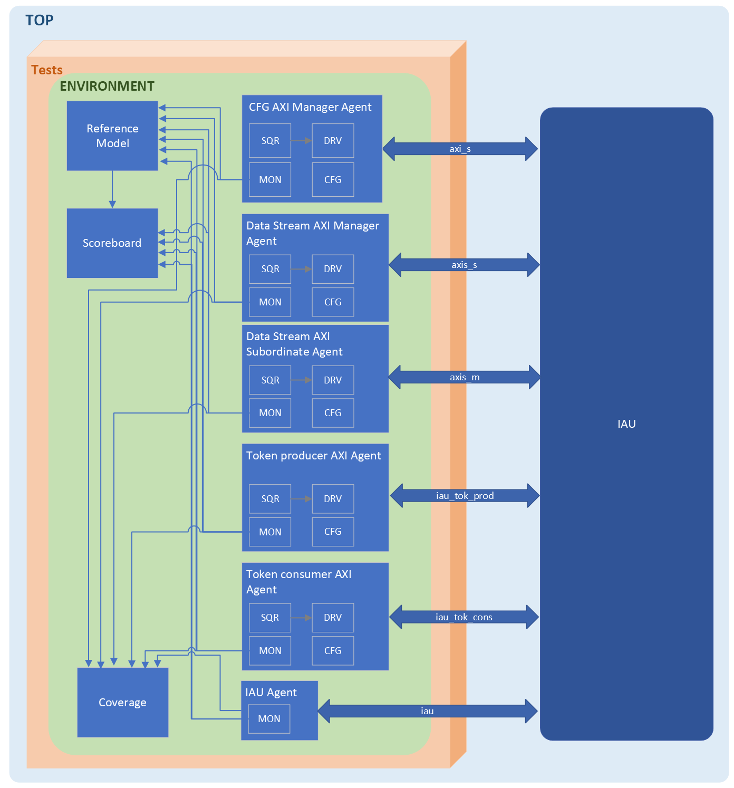

# IAU Verification Specification 

## Introduction
This is the verification specification document for Integer Arithmetic Unit (IAU)  testbench.

The IAU receives a stream of pixelwords from either the MVM or the DWPU (there are two IAUs). It can execute operations on the input stream resulting in an output stream that is then sent to the DPU, which is out of scope for this verification.

### Overview
The IAU has three major interfaces:

- An AXIS input stream, that comes either from the MVM or DWPU block. The IAU receives a stream of pixelwords (PWORDs) over this interface.
- An AXIS output stream, that goes to the DPU block. The IAU sends a stream of pixelwords (PWORDs) over this interface.
- An AXI slave interface for controlling and programming the IAU.

In the basic operation the IAU receives a stream packet on the input stream interfaces, performs integer operations on the streams and produces an output stream packet containing the results.

#### Supported Features
- Eight internal pixelword registers to store intermediate results.  
- Results of executed instructions can either be stored in one of the eight internal registers or in the output buffer, pushing them into the output stream. 
- Supports four different instructions: NOP, MV, ADD and MAX.  
- Input data bypass, directly forwarded to the output stream. 
- Interrupt signals to indicate if input and/or output stream are active after the execution of a command. 
- Signed and unsigned operations. 
- Adders overflow and saturated operations. 
- Instruction Repeat For Stream (RFS) feature, allows to repeat the instruction until the input stream has been fully consumed (TLAST of input stream forwarded to the output stream).  
- Programs can be looped several times, also can set the length and the start address of the program in the Command block memory. 
- Stream Peek Support **&ast;** (New feature)
- ~~Software Bypass of the command block~~. (Deprecated in Europa)


### Ownership
Who to contact for information

|  Team              | Contact         |
| ------------------ | --------------- |
| ***Architecture*** | guahao.khov@axelera.ai |
| ***Design***       | manuel.oliveira@axelera.ai |
| ***Verification*** | fernando.yokota@axelera.ai |

### Reference
Where to find the design documentation

| Team               | Specification |
| ------------------ | ------------- |
| ***Architecture*** |[Arch Spec](Not found)|
| ***Design***       |[Block Spec](Not found)|

### Project Planning and Trackinggit config 
Where to find project plans and trackers

|   | Link |
| - | ---- |
| ***Plan*** |[Gitlab Issues Board]()|
| ***Issues*** |[Gitlab Open Issues]()|

## Block Level Testbenches

### Testbench
#### Overview
The image below ilustrates the Testbench Architecture.

Synopsis AXI VIP is used for all the AXI and AXIS interfaces. Some of the AXI agents (connected to axis_s and axis_m interfaces) are going to be configured as a Data Stream. The IAU Reference Model implements the supported features of IAU, and generates the output data to be compared against RTL output in the Scoreboard component.  A coverage component implements all the features as coverpoints, in order to check if they are being exercised by the tests.   

#### TB Diagram


#### How to Run
How to check out and run

```
git clone etc.
source ....
cd ...
make ...
```
#### Regressions
Which regressions to run

| Regression | Description | Source | Link |
| ---------- | ----------- | ------ | ---- |
| regression | description | [Link to Source]() | [Last CI Run]()|

#### Metrics / Coverage Plan
VPlan / Verification IQ excel / csv file

- [Link]()

## Formal Proofs
### Overview
Description of any formal environments

### How To Run

```
git clone etc.
source ....
cd ...
make ...
```

#### Regressions
Which regressions to run

| Regression | Description | Source | Link |
| ---------- | ----------- | ------ | ---- |
| regression | description | [Link to Source]() | [Last CI Run]()|

#### Metrics / Coverage Plan
VPlan / Verification IQ excel / csv file

- [Link]()

## System Level Testcases
Tests to be run at top level / Veloce

| Testcase   | Description | Source | Link |
| --------   | ----------- | ------ | ---- |
| testcase   | description | [Link to Source]()| [Last CI Run]()|
