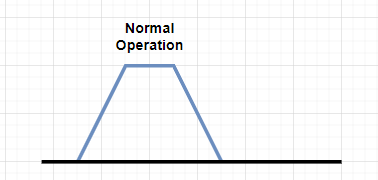
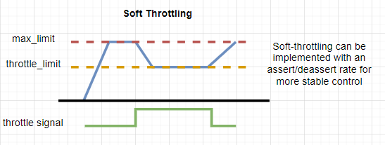
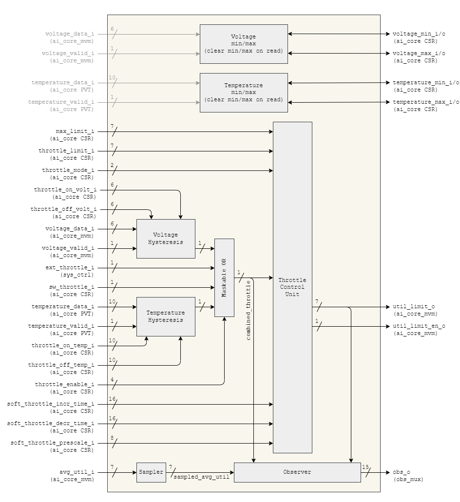
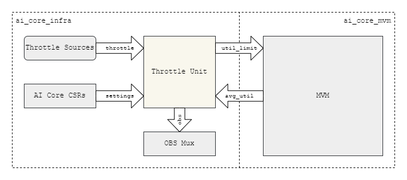
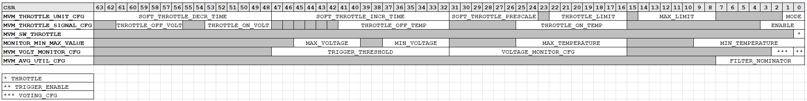

# Throttle Unit

The throttle unit provides control, monitoring and observation interfaces for MVM utilization limiting and throttling. It also includes auxiliary voltage and temperature monitoring functionality.

## Overview

In Omega, the MVM includes a utilization limiter which has the following main control inputs (see https://git.axelera.ai/ai-hw-team/triton/-/issues/1750+):

- Utilization Limit 6-bit
- Utilization Limit Enable 1-bit
- Observation Filter Coefficients (will come for AI Core CSR)

The `mvm_throttle_unit` provides the first two inputs based on several throttle control inputs (see #1233+):

- external throttle signal from `sys_ctrl`
- voltage throttle from mvm voltage monitor readout
- software throttle from `ai_core` CSRs
- temperature throttle from PVT temperature readout

It operates in four different modes:

- Disabled (default mode)

- Max limit mode

- Hard throttle mode

- Soft throttle mode

## Design

### Internal block diagram

### IO description

<!--
%% io_table("mvm_throttle_unit") %%
-->

### Integration block diagram

The `mvm_throttle_unit` is currently instantiated in `ai_core_infra`:

## Throttle Signal

The four different throttle control inputs are fed into a maskable OR to determine the final throttle signal:

  - External throttle signal coming from the `sys_ctrl`: `ext_throttle_i`.
  - Voltage throttle based on `voltage_monitor` data, when below a CSR-programmable limit
  - Temperate throttle based on `pvt` data, when above a CSR-programmable limit
  - SW throttle signal from the `ai_core` CSRs

Hysteresis is applied to the temperature and voltage readouts to determine its throttle signal

## Throttle Modes

- `mode=2'b00` - **Disabled**: `o_util_limit_en` is set to constant low
- `mode=2'b01` - **Max limit mode**: `o_util_limit_en` is set to constant high and `o_util_limit` is set to constant `i_max_limit`
- `mode=2'b10` - **Hard throttle mode**: `o_util_limit_en` is set to constant high and `o_util_limit` is set to `i_max_limit` if the throttle signal is low else to `i_throttle_limit`
- `mode=2'b11` - **Soft throttle mode**: `o_util_limit_en` is set to constant high and `o_util_limit` is set to `i_max_limit` if the throttle signal is low else to `i_throttle_limit` with the increment and decrement limited by the `i_soft_throttle_incr_time_i` and `i_soft_throttle_decr_time`, respectively

## Soft Throttle Mechanism

In the soft throttle mode the utilization limit of the MVM transitions gradually depending on several CSR settings:

- `i_soft_throttle_incr_time` (16-bit): baseline cycle time between increments of one for the utilization limit
- `i_soft_throttle_decr_time` (16-bit): baseline cycle time between decrements of one for the utilization limit
- `i_soft_throttle_prescale` (8-bit): pre-scale factor for the baseline cycle times above (multiplier)

Single in-/decrement can thus take from `1 cycle` to roughly `(2^16 * 2^8) = 2^24 cycles` (`21ms` at `800MHz`). The full ramp up or down of the entire utilization range of `[0-64]` could then be spread across `1.36s`.

Cycle times of zero bypass the soft throttle and allow an instantaneous update of the utilization limit.

### Min max tracking

For both the voltage and temperature data the minimum and maximum value of the data is tracked. These min/max values are readable through CSRs and clear when reading them.

### Registers

Associated CSRs exist in `ai_core_csr` to drive the configuration and control signals of the `mvm_throttle_unit` and additional control signals towards the `ai_core_mvm`:

For more information on these CSRs, check the [Throttle unit registers](registers.md) section.

### Observation

Several signals are exposed to gain visibility on the `mvm_throttle_unit` and the MVM utilization:

- `combined_throttle`: combined throttle decision signal
- `o_util_limit`: utilization limit imposed by `mvm_throttle_unit`
- `sampled_avg_util`: average utilization of the MVM sampled at a low frequency (one sample every 31 cycles) to reduce toggling

| Signal            | Width  |
|-------------------|-------:|
| combined_throttle | 1 bit  |
| o_util_limit      | 7 bits |
| sampled_avg_util  | 7 bits |

Total width of the observation signals is 15-bit.

For more information on observation, refer to the `ai_core_csr` documentation on the `OBS_CTRL` and `OBS_SIG` registers.
