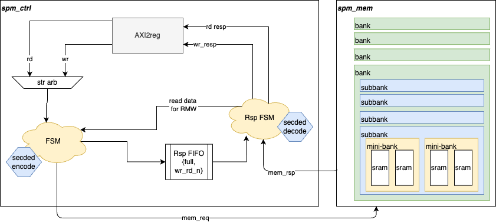
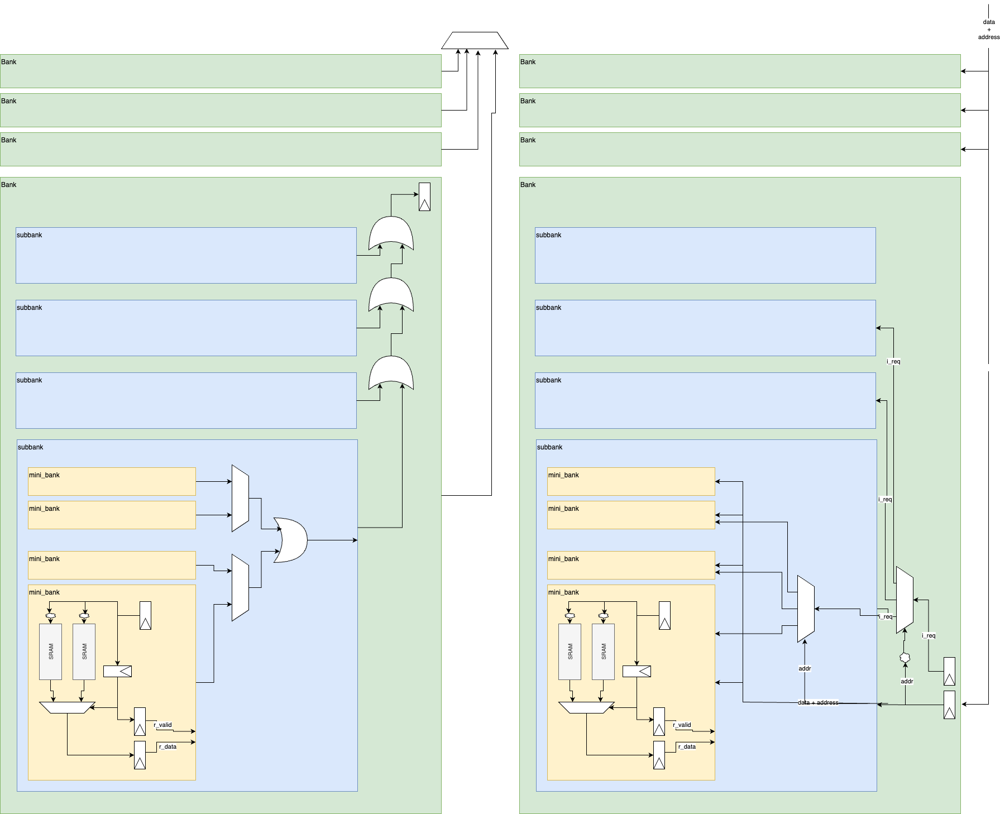

# SPM

## Table of Contents
- [SPM](#SPM)
- [Table of Contents](#table-of-contents)
- [Overview](#overview)
- [Block Definition](#block-definition)
  - [Block Diagram](#block-diagram)
    - [Full SPM](#full-spm)
    - [Memory uArch](#memory-uarch)
  - [Block Interfaces](#block-interfaces)
    - [Clocks & Reset](#clocks--reset)
    - [AXI4](#axi4)
    - [Error interface](#error-interface)
    - [Memory configuration pins](#memory-configuration-pins)
- [Expected configurations](#expected-configurations)
- [Features](#features)
  - [ECC](#ecc)
  - [Atomics](#atomics)

## Overview

The ScratchPad Memory IP is designed to provide ECC-protected memory with support for 1-bit error correction and 2-bit error reporting. It also includes the option for atomics through parameterization.
The IP is flexible and allows for the memory size to be configured up to a maximum of at least 8MiB. The design of the memory ensures high-frequency operation (1.2GHz) with low latency.

## Block Definition

### Block Diagram

#### Full SPM


<!--- TODO(!1774 :: The incoming request is missing from the picture.  Can you maybe create an hierarchy above this to show the IOs?) -->

#### Memory uArch

**Rationale**
The memory portion of the SPM is split into a parameterisable banking structure comprised of Banks, Sub-Banks and Mini-Banks. The user can control:

| Parameter                     | Description |
| ---                           | --- |
| SPM_MEM_SIZE_KB               | Expected total memory size in KB |
| SPM_MEM_MACRO_DEPTH_K         | Depth of the SRAM being instanciated (How many 1000s of words) |
| SPM_NB_BANKS                  | How many Banks are instanciated                   |
| SPM_NB_SUB_BANKS              | How many Sub-Banks per Bank are instanciated      |
| SPM_NB_MINI_BANKS             | How many Mini-Banks per Sub-Bank are instanciated |
| SPM_NB_SRAMS_PER_MINI_BANK    | How many SRAMs per Mini-Bank are instanciated     |

  - **Note** : There's an expectation that this is set to 2 by default and shouldn't need to be changed

**Size Math**
There is an assertion ensuring that the following is true:
```
    8*SPM_MEM_MACRO_DEPTH_K * SPM_NB_BANKS * SPM_NB_SUB_BANKS * SPM_NB_MINI_BANKS * SPM_NB_SRAMS_PER_MINI_BANK == SPM_MEM_SIZE_KB
```

**Pipelining/Latency**

There is a non-parameterisable register around Mini-Bank's SRAMs (one for request/input, then one for response/output)

This banking scheme also includes the possibility to add pipelining to ease timing

| Parameter                     | Description |
| ---                           | --- |
| SPM_NB_REQ_PIPELINE           | Number of registers in the pipeline stages per Bank on the request path |
| SPM_NB_RSP_PIPELINE           | Number of registers in the pipeline stages per Bank on the response path (_only relevant for Read latency_) |

**Block Diagram**




### Block Interfaces

The main interface is a half duplex AXI4 interface.

#### Clocks & Reset
- Single clock and reset.
- Built to operate at Europa's fast_clk frequency of 1.2GHz.

#### AXI4
The AXI4 features and characteristics of the INTF are described in the table below.

| **Interface characteristics** | **Interface Information** |
| ---                           | --- |
| Bus Protocol                  | AXI4 |
| Port Data Width               | 64  |
| Address Width                 | maximum 23 (parameterisable up to 8MB, the width relates to the parameter `SPM_MEM_SIZE_KB`) |
| Address Alignment             | Aligned and Unaligned support |
| ID Width                      | 4 (defined through parameterisation) |
| Max Burst Length              | INCR: 256 / WRAP:16 / FIXED: 16 |
| Burst Type                    | INCR, FIXED, WRAP |
| Transfer size                 | 1 to 8 bytes|
| Transaction Attributes        | None, Modifiable, Bufferable , Read-allocate Write-allocate |
| Burst Cross Boundary          | 4K  |
| Exclusives                    | Supported |
| Narrow Bursts                 | Supported |
| Byte Enable Usage             | Supported |
| Read Response Interleaving    | Not supported |
| Write Interleaving            | Not supported |
| Write Response                | Posted |
| Read-Write Ordering           | Not supported |
| Performance details           | NA  |
| Max Outstanding Transactions  | TBD this will be sized based on the fabrics/DMAs max outs tnx |
| Read/Write Bandwidth          | 9.6GB/sec |

#### Error interface
| **Direction** | **Type** | **Name** | **Description** |
| ---    | --- |                  --- | --- |
| input  | logic                | i_scp_ecc_disable  | Disable ECC error reporting and in flight correction |
| output | spm_error_status_t   | o_scp_error_status | [Description below](#ECC) |
| output | logic                | o_irq              | Error IRQ signal|

#### Memory configuration pins
A structure is used for input and output RAM configuration pins

| **Direction** | **Type** | **Name** | **Description** |
| ---    | --- |                  --- | --- |
| input  | impl_inp_t  | i_impl | Input configuration |
| output | impl_oup_t  | o_impl | Output configuration |

## Expected configurations

The SPM IP shall be integrated at the top level of the Europa SoC as the Sys-SPM block, as well as being integrated into the other Europa SoC blocks: PVE and AIC.

| **Block** | **Memory Size** | **ECC** | **Atomics** |
| --  | --  | --  | --  |
| Sys-SPM | 8MiB    | Yes | No |
| AICore  | 512KiB  | Yes | No |
| PVE     | 256KiB  | Yes | Yes |

## Features

### ECC

The SPM shall be SECDEC ECC protected. Single bit errors should be corrected in-flight while 2-bit errors should raise an IRQ. Both single and double bit errors should be reported through a specific interface.

There is a top level parameter called ECC_PROTECTION_EN. If it is set to 1 (its default valie), then the ECC logic in SPM IP will be enabled as well as the internal data bus to and from the memory will be increased to take into account the ECC data. If ECC_PROTECTION_EN is set to 0, then no ECC logic will be present in SPM IP.

In more detail, an 8-bit ECC code will be generated per 64-bit of data. The ECC code will be written upon every write (full or partial). In a case of partial write, a RmW ( read-modify-write operation) is needed in order to calculate the correct ECC code based on the previous stored data and the newly partial write.

Upon reading the memory the ECC code will be decoded and if the syndrome is different than 0 that will indicate the presence of an ECC error. If the error is 1-bit then the error can be corrected in flight by the dedicated logic. If the error is 2 bit then an IRQ should be raised. In both cases the error needs to be reported via an ERROR interface to a CSR.

Exposed error reporting signals as outputs from SPM IP to the upstream logic:

| **Error interface output**          |        | **Error interface signal description** |
| ---                                 | ---    | --- |
| ecc_err                             | 1-bit  | An ECC error has been reported -- 0: no error present / 1: an error has been seen |
| ecc_err_type                        | 1-bit  | 0: single bit error (CORRECTABLE) / 1 : Double bit error (UNRECOVERABLE) |
| ecc_err_syndrome                    | 8-bit  | The ECC error syndrome. SW can calculate the location of the error based on the syndrome. |
| ecc_err_index                       | 20-bit | 64-bit aligned memory address in which the error occurred. |

A primary input called i_scp_ecc_disable can be used by the upstream logic to disable the ECC error generation by SPM IP. If i_scp_ecc_disable is set high, then ecc_err output will always be de-asserted.

### Atomics

The SPM memory supports AXI atomics accesses. The SPM IP is configurable to support natively atomic memory operations. A top-level parameter called EN_ATOMIC_SUPPORT is used to enable the AXI5 atomic operations. SPM supports AXI5 atomic operations as per A7.4.6 of AMBA Specification with document number ARM IHI 0022.

The atomic support in SPM is realized through re-use and instantiation of the axe_axi_riscv_atomics module. Internally the axe_axi_riscv_atomics module consists of axe_axi_riscv_amos, axe_axi_multicut and axe_axi_riscv_lrsc modules.

The axe_axi_riscv_amos is responsible of handling the atomic memory operations in accordance with A7.4.6 of AMBA AXI Specification. It handles AXI atomic transactions coming from the upstream logic and generates two non-atomic transactions to the downstream logic. The two non-atomic transactions are a single AXI read followed by a single AXI write to the same address to the SPM memory. 

Both non-atomic transactions are generated with AWLOCK signal asserted high on the AXI write request channel to the downstream logic. This requires the axe_axi_riscv_lrsc module also to be used. The axe_axi_riscv_lrsc module is located between axe_axi_riscv_amos and spm_control. It provides proper load reserved, store conditional functionality as expected by axe_axi_riscv_amos module. The axe_axi_riscv_lrsc module adds support for AXI exclusive accesses to a subordinate that natively does not support exclusive accesses. Thus axe_axi_riscv_lrsc takes care of the AWLOCK signal that is asserted by axe_axi_riscv_amos during atomic accesses. This scheme allows spm_control not to have knowledge of the AXI nature of the transactions as it was originally intended. 

The axe_axi_multicut is a flop stage between axe_axi_riscv_amos and axe_axi_riscv_lrsc modules.

The total delay of an atomic transaction through axe_axi_riscv_amos, axi2reg, spm_control and spm_mem is equal to the sum of the delays of an non-atomic AXI write and an non-atomic AXI read transactions.


