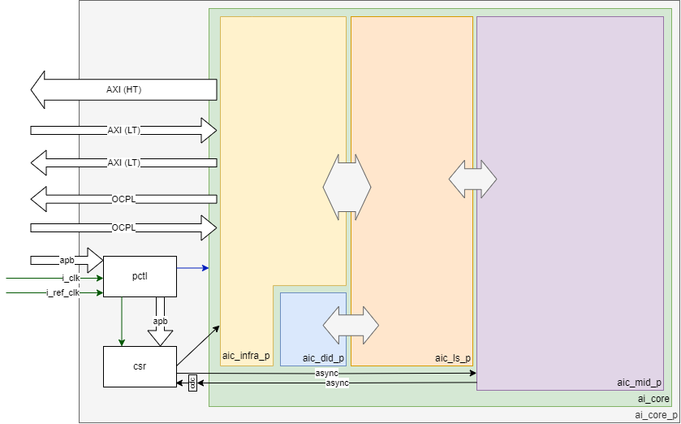
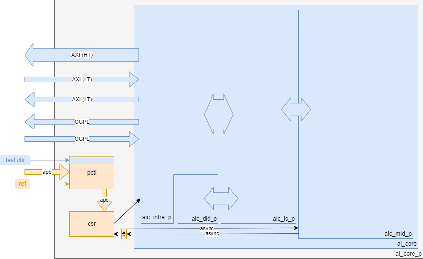

# AI Core

This document has a high level description of the AI Core partition.
The partition contains the sub-partitions AIC Infra, AIC DID, AIC MID, and AIC LS. The content of those partitions is described in their own documentation section.
A high level overview of the AI Core is provided below.

The AI Core is a partition where all the sub-partitions are collected and only has the partition control (pctl), an extra always-on csr, and DFT logic. The connections between the partitions has been chosen such that only the infra partition needs to be balanced with the NoC and LS. LS is then the partition that connects the DID and MID.

## Reset & Clock Requirements

The AIC has two clocks: a clock for the core and a slow clock for the always on CSR's in the wrapper. The partition control will handle the reset synchronization and clock division for the fast clock for the core partitions.

The clock-domains are visualized below.

| Reset            | Reset Requirements                    |
|:---------------- |:------------------------------------- |
| `i_ao_rst_n`     | POR / always On reset, active low     |
| `i_global_rst_n` | Asynchronous global reset, active low |

| Clock Name  | Source   | Target Frequency | Comment                  |
|:----------- |:-------- |:---------------- |:------------------------ |
| `i_clk`     | External | 1.2GHz           | Fast clock               |
| `i_ref_clk` | External | 50MH             | Slow reference APB clock |

There is no SW driven ability to clock-gate certain partitions. The pctl clock divider can be used to lower the frequency in the AI Core to reduce the power if needed.

## Bus interfaces

The main bus interfaces are described here. The AI Core has multiple AXI and OCPL interfaces connected to the NoC. A single APB interface is present for the partition configuration.

### Protocol busses
| Interface Name    | Type  | Configuration                          | Direction   | Clock Domain | Comment                     |
|:----------------  |:----- |:-------------------------------------- |:----------- |:------------ |:--------------------------- |
| `cfg_apb4_s`      | APB   | Address Width: 16, Data Width:  32     | subordinate | `i_ref_clk`  | Partition control interface |
| `noc_ht_axi_m`    | AXI4  | Address Width: 40, Data Width: 512     | manager     | `i_clk`      | High throughput interface   |
| `noc_lt_axi_m`    | AXI4  | Address Width: 40, Data Width:  64     | manager     | `i_clk`      | Low throughput interface    |
| `noc_lt_axi_s`    | AXI4  | Address Width: 40, Data Width:  64     | subordinate | `i_clk`      | Low throughput interface    |
| `tok_prod_ocpl_m` | OCPL  | Address Width:  8, Data Width:   8     | manager     | `i_clk`      | Top token network           |
| `tok_cons_ocpl_s` | OCPL  | Address Width:  8, Data Width:   8     | subordinate | `i_clk`      | Top token network           |

### Other
Other interfaces that do not fit a protocol as described before.

| Interface Name           |  Width  |  Direction   | Functionality                                | Clock Domain  | Synced to   |
|:------------------------ | :-----  | :----------- | :------------------------------------------- |:------------- | :------     |
| `cid`                    |  8      |   in         | Core ID                                      | static        | NA          |
| `noc_async_idle_req`\*   |  2      |  out         | Request fence state transitions              | `i_ref_clk`   | NA          |
| `noc_async_idle_ack`\*   |  2      |   in         | Indicates the reception of the Idle Request  | async         | `i_ref_clk` |
| `noc_async_idle_val`\*   |  2      |   in         | Indicates Fence state                        | async         | `i_ref_clk` |
| `noc_clk_en`             |  1      |  out         | Clock enable as used in the divider          | `i_clk`       | NA          |
| `noc_rst_n`              |  1      |  out         | Reset as driven towards AI Core              | `i_clk`       | NA          |
| `irq`                    |  1      |  out         | Interrupt                                    | `i_clk`       | NA          |
| `aic_obs`                |  16     |  out         | AI Core observation                          | `i_clk`       | NA          |
| `inter_core_sync`        |  1      |   in         | Global sync, edge triggered                  | async         | `i_clk`     |
| `thermal_throttle_async` |  1      |   in         | Thermal throttle                             | async         | `i_clk`     |
| `msip_async`             |  1      |   in         | SW PLIC                                      | async         | `i_clk`     |
| `mtip_async`             |  1      |   in         | PLMT timer IRQ                               | async         | `i_clk`     |
| `debug_int_async`        |  1      |   in         | PLDM: Debug interface                        | async         | `i_clk`     |
| `resethaltreq_async`     |  1      |   in         | PLDM: Debug interface                        | async         | `i_clk`     |
| `stoptime_async`         |  1      |  out         | PLDM: Debug interface                        | `i_clk`       | NA          |
| `hart_unavail_async`     |  1      |  out         | PLDM: Debug interface                        | `i_clk`       | NA          |
| `hart_under_reset_async` |  1      |  out         | PLDM: Debug interface                        | `i_clk`       | NA          |
| `io_ibias_ts`            |  1      |  inout       | Connection to PVT Probe                      | NA            | NA          |
| `io_vsense_ts`           |  1      |  inout       | Connection to PVT Probe                      | NA            | NA          |

\*: bit 0 is for AXI, bit 1 is for the OCP-L interface.
## Partition CSR

The partition specific registers are specified in this section.

### PCTL

AI Core has a single reset, therefor `PPMU_RESET_CONTROL_{1-7}` and `PPMU_RESET_TIMING_CONTROL_{1-7}` are not in use.
The single clock results in `PPMU_CLOCK_GATING_CONTROL_{1-7}` not in use. `MEM_POWER_MODE_{1-3}` and `MEM_POWER_UP_READY_{1-3}` are not in use as there is only a single daisy chain for powering the memories up and down.

The single clock results in `PPMU_CLOCK_GATING_CONTROL_{1-7}` not in use.

All other CSR's as specified in the PCTL documentation are functional.

### AI Core AO CSR

There are a few extra always-on registers specific for the AI Core. Those are specified in the table below.

| Name                      | Description                           | Access type | Reset value |
|:------------------------- |:------------------------------------- |:----------- |:----------- |
| `reset_vector_lsb`        | The lower 32 bits of the reset vector | RW          | 0x0         |
| `reset_vector_msb`        | The upper 8 bits of the reset vector  | RW          | 0x0         |
| `imc_bist_status`         | The status of the IMC Bist.           | RO          | 0x0         |
| `imc_bist_status[0]`      | IMC bist is running                   | RO          | 0x0         |
| `imc_bist_status[1]`      | IMC bist is done                      | RO          | 0x0         |
| `imc_bist_status[2]`      | IMC bist passed                       | RO          | 0x0         |
| `mvm_throttle`            | Throttle the MVM.                     | RW          | 0x0         |

