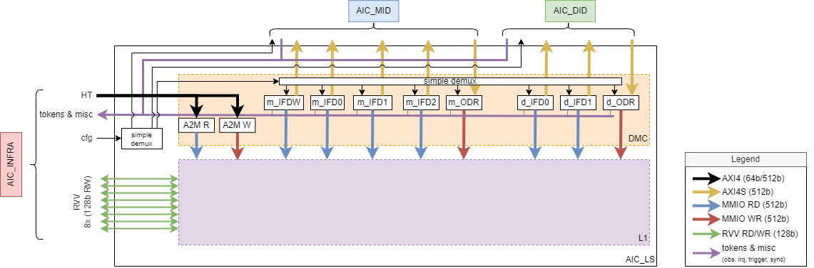

# AIC\_LS

This document has a high level description of the AIC\_LS partition.
The partition contains the DataMovementCluster (DMC), L1 memory, and feedthroughs to connect AIC_INFRA to AIC_DID and AIC_MID via AIC_LS. Simple AXI demuxes are used for the fabric.
A high level overview, including the devices in DMC, is provided below.

The DMC consists of:
 - 6 Input Feeders (IFD) to read data from the memory and produce AXI streams containing the read data. IFD are basically MMIO-to-Stream DMAs.
 - 2 Output Drainers (ODR) to consume an AXI stream and write its data into the memory. ODRs are basically Stream-to-MMIO DMAs.
 - An AXI2MMIO bridge to allow AXI access towards the L1.

All access towards the L1 are via MMIO ports.

## Reset & Clock Requirements

The AIC_LS is completely synchronous with a single clock and without explicit clock-gating inside. It has only one clock and reset.

| Reset     | Reset Requirements             |
|:--------- |:------------------------------ |
| `i_rst_n` | Asynchronous, active-low reset |

| Clock Name | Source   | Target Frequency | Comment                                    |
|:---------- |:-------- |:---------------- |:------------------------------------------ |
| `i_clk`    | External | 1.2GHz           | AI Core / DW subsystem clock from CORE_CLK |

## Bus interfaces

The main bus interfaces are described here. Those added due to the feedthroughs will be described in [Feedthrough Bus Interfaces](#feedthrough-bus-interfaces).
The AIC_LS has multiple AXI stream interfaces: 4 IFD's and one ODR connected AIC_MID and 2 IFD's and one ODR connected to AIC_DID. Furthermore, an AXI4 configuration interface is present, one subordinate connected to AIC_INFRA, and 2 that are connected to AIC_MID and AIC_DID. A high performance wide AXI subordinate is used for writing directly into L1.

The RVV will connect via its 8 memory access ports directly to the L1, without passing through the DMC.

### AXI
| Interface Name  | Configuration                          | Direction   | Clock Domain |
|:--------------  |:-------------------------------------- |:----------- |:------------ |
| `cfg_axi_s`     | Address Width: 40, Data Width: 64      | subordinate | `i_clk`      |
| `hp_axi_s`      | Address Width: 40, Data Width: 512     | subordinate | `i_clk`      |

### AXI4S
| Interface Name | Protocol | Configuration     | Direction   | Clock Domain |
|:-------------- |:-------- |:----------------- |:----------- |:------------ |
| `m_ifd0`       | AXI4S    | Data Width: 512   | manager     | `i_clk`      |
| `m_ifd1`       | AXI4S    | Data Width: 512   | manager     | `i_clk`      |
| `m_ifd2`       | AXI4S    | Data Width: 512   | manager     | `i_clk`      |
| `m_ifdw`       | AXI4S    | Data Width: 512   | manager     | `i_clk`      |
| `d_ifd0`       | AXI4S    | Data Width: 512   | manager     | `i_clk`      |
| `d_ifd1`       | AXI4S    | Data Width: 512   | manager     | `i_clk`      |
| `m_odr`        | AXI4S    | Data Width: 512   | subordinate | `i_clk`      |
| `d_odr`        | AXI4S    | Data Width: 512   | subordinate | `i_clk`      |

### RVV
RVV is accessing the L1 via a memory protocol that is easily matching the MMIO protocol and thus doesn't need a conversion before entering L1.
There is no backpressure on applied by RVV for the return path, so the MMIO response ready will always be set.
| Interface Name | Configuration                          | Direction   | Clock Domain |
|:-------------- |:-------------------------------------- |:----------- |:------------ |
| `rvv_[0-7]`    | Data Width: 128                        | subordinate | `i_clk`      |

### Tokens
A token line consists of a single valid and a ready. Each device with a token connection has a _n_ amount of consumer and _m_ amount of produces lines. The amount depends on what is required by the token manager (TODO: add link to something defining the widht?)

| Interface Name    |  Width  |  Direction   | Clock Domain |
|:--------------    | :-----  | :----------- |:------------ |
| `m_ifd0_tok_prod` |  10     |  manager     | `i_clk`      |
| `m_ifd0_tok_cons` |  10     |  subordinate | `i_clk`      |
| `m_ifd1_tok_prod` |  10     |  manager     | `i_clk`      |
| `m_ifd1_tok_cons` |  10     |  subordinate | `i_clk`      |
| `m_ifd2_tok_prod` |  10     |  manager     | `i_clk`      |
| `m_ifd2_tok_cons` |  10     |  subordinate | `i_clk`      |
| `m_ifdw_tok_prod` |  10     |  manager     | `i_clk`      |
| `m_ifdw_tok_cons` |  10     |  subordinate | `i_clk`      |
| `d_ifd0_tok_prod` |  10     |  manager     | `i_clk`      |
| `d_ifd0_tok_cons` |  10     |  subordinate | `i_clk`      |
| `d_ifd1_tok_prod` |  10     |  manager     | `i_clk`      |
| `d_ifd1_tok_cons` |  10     |  subordinate | `i_clk`      |
| `m_odr_tok_prod`  |  10     |  manager     | `i_clk`      |
| `m_odr_tok_cons`  |  10     |  subordinate | `i_clk`      |
| `d_odr_tok_prod`  |  10     |  manager     | `i_clk`      |
| `d_odr_tok_cons`  |  10     |  subordinate | `i_clk`      |

### Other
Other interfaces that do not fit a protocol as described before.

| Interface Name    |  Width  |  Direction   | Functionality         | Clock Domain |
|:--------------    | :-----  | :----------- | :-------------------- |:------------ |
| `dmc_obs`         |  8*8    |  out         | Observation           | `i_clk`      |
| `dmc_ts_start`    |  8      |  out         | Timestamp start       | `i_clk`      |
| `dmc_ts_end`      |  8      |  out         | Timestamp end         | `i_clk`      |
| `dmc_acd_sync`    |  8      |  out         | ACD sync              | `i_clk`      |
| `irq`             |  8      |  out         | Interrupt per IFD/ODR | `i_clk`      |

## Feedthrough Bus Interfaces
There are several busses going in and out of LS that is only used for feedthrough. There is no other functionality besides pipelining for these.
One small exception are the configuration AXI-ports, a bus is inserted in the AIC_LS that connects the cfg_axi_s port to (internal) DMC, AIC_MID and AIC_DID.

In the tables only a single direction is provided, namely the one that connects to AIC_MID / AIC_DID.
The direction for the one connecting to AIC_INFRA is the opposite.
### AXI
As mentioned before these AXI ports only consist towards AIC_MID/AIC_DID. The connection to AIC_INFRA is via the `axi_cfg_s` bus.

| Interface Name  | Configuration                          | Direction   | Clock Domain |
|:--------------  |:-------------------------------------- |:----------- |:------------ |
| `mid_cfg_axi_m` | Address Width: 40, Data Width: 64      | manager     | `i_clk`      |
| `did_cfg_axi_m` | Address Width: 40, Data Width: 64      | manager     | `i_clk`      |
### Tokens
For the feedthroughs there is a pair, one connected to AIC_MID/AIC_DID and one connected to AIC_INFRA.
The mentioned direction is as seen by the LS connected to AIC_MID/AIC_DID. So if it says manager it means that the LS towards AIC_INFRA would have been subordinate.

| Interface Name         |  Width  |  Direction   | Clock Domain |
|:---------------------- | :------ | :----------- |:------------ |
| `mid_mvm_exe_tok_prod` |  2      |  manager     | `i_clk`      |
| `mid_mvm_exe_tok_cons` |  2      |  subordinate | `i_clk`      |
| `mid_mvm_prg_tok_prod` |  2      |  manager     | `i_clk`      |
| `mid_mvm_prg_tok_cons` |  2      |  subordinate | `i_clk`      |
| `mid_iau_tok_prod`     |  1      |  manager     | `i_clk`      |
| `mid_iau_tok_cons`     |  1      |  subordinate | `i_clk`      |
| `mid_dpu_tok_prod`     |  1      |  manager     | `i_clk`      |
| `mid_dpu_tok_cons`     |  1      |  subordinate | `i_clk`      |
| `did_dwpu_tok_prod`    |  1      |  manager     | `i_clk`      |
| `did_dwpu_tok_cons`    |  1      |  subordinate | `i_clk`      |
| `did_iau_tok_prod`     |  1      |  manager     | `i_clk`      |
| `did_iau_tok_cons`     |  1      |  subordinate | `i_clk`      |
| `did_dpu_tok_prod`     |  1      |  manager     | `i_clk`      |
| `did_dpu_tok_cons`     |  1      |  subordinate | `i_clk`      |

### Other
Other interfaces that do not fit a protocol as described before.

| Interface Name     |  Width  |  Direction   | Functionality             | Clock Domain |
|:--------------     | :-----  | :----------- | :--------------------     |:------------ |
| `mid_mvm_exe_obs`  |  8      |  in          | Observation MVM Exe       | `i_clk`      |
| `mid_mvm_prg_obs`  |  8      |  in          | Observation MVM Prg       | `i_clk`      |
| `mid_iau_obs`      |  8      |  in          | Observation IAU           | `i_clk`      |
| `mid_dpu_obs`      |  8      |  in          | Observation DPU           | `i_clk`      |
| `mid_tu_obs`       |  8      |  in          | Observation Throttle Unit | `i_clk`      |
| `mid_ts_start`     |  3      |  in          | Timestamp start           | `i_clk`      |
| `mid_ts_end`       |  3      |  in          | Timestamp end             | `i_clk`      |
| `mid_acd_sync`     |  3      |  in          | ACD sync                  | `i_clk`      |
| `mid_irq`          |  3      |  in          | Interrupt                 | `i_clk`      |
| `did_dwpu_obs`     |  8      |  in          | Observation DWPU          | `i_clk`      |
| `did_iau_obs`      |  8      |  in          | Observation IAU           | `i_clk`      |
| `did_dpu_obs`      |  8      |  in          | Observation DPU           | `i_clk`      |
| `did_ts_start`     |  3      |  in          | Timestamp start           | `i_clk`      |
| `did_ts_end`       |  3      |  in          | Timestamp end             | `i_clk`      |
| `did_acd_sync`     |  3      |  in          | ACD sync                  | `i_clk`      |
| `did_irq`          |  3      |  in          | Interrupt                 | `i_clk`      |

## DMC
The DMC is the collection of the devices connecting the L1: IFD, ODR and the AXI2MMIO.

There are a few features depending on the IFD / ODR and those are listed in the table below. These features are a transpose unit (VTRSP) and decompression unit (Decomp)

| Device    | Has VTRSP | Has Decomp |
| --------- | --------- | ---------- |
| `m_ifd0`  | no        | no         |
| `m_ifd1`  | no        | no         |
| `m_ifd2`  | no        | no         |
| `m_ifdw`  | yes       | yes        |
| `m_odr`   | yes       | no         |
| `d_ifd0`  | no        | no         |
| `d_ifd1`  | no        | no         |
| `d_odr`   | yes       | no         |
