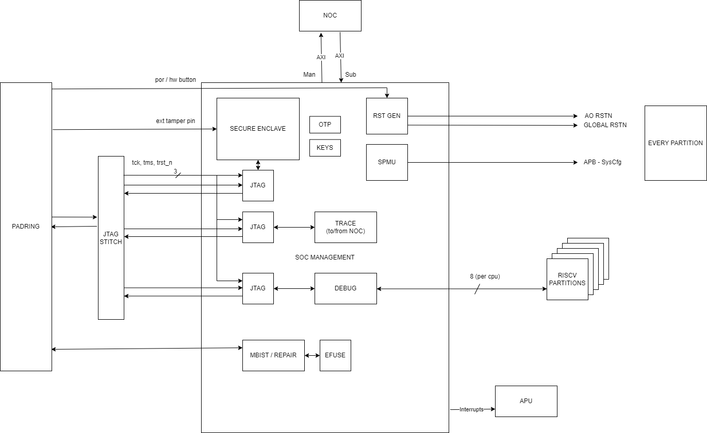

# SOC_MGMT Functional Spec

## Introduction

### Overview

SOC_MGMT is the collection of IP that are the central hub for system wide functions, for example, for booting, SOC_MGMT contains system PLLs, resetgen for primary device resets and the root of trust security enclave. For debug, there is the system debug unit, system trace buffering IP, and boot observability.

### System Diagram

## Functional Description

Break down design into features. 

For each feature, explain it's purpose.

Describe the SW <> HW interface. 

This section should be detailed enough for verification to determine a test plan for the block and it's features.

### Performance Requirements

List all measurable performance requirements.

### CSR Details

Insert a table of CSR and memory maps.

## Implementation Description

### Block Diagram

### Clocks and Resets

| Clock      |  Target Freq  |  Uses                                  |
| ---------- | ------------- | -------------------------------------- |
| 32k        | 32 KHz        | Real Time Counter (run at ref?)        |
| ref_clk    | 20 MHz        | PLL Reference Clock, OTP static clock, Sys Cfg APB interface, ResetGen |
| periph_clk | 100 MHz       | RoT                                    |
| tck        | 100 MHz       | JTAG infrastructure                    |
| fast_clk   | 1.2 GHz       | Fast AES enc / dec DMA   (TBD)         |        

### IO and Interfaces

| I/F           | Protocol   | Clock            | Description                            |
| ------------- | ---------- | ---------------- | -------------------------------------- |
| NOC In        | AXI4 S     | fast_clk         | Inbound LT NOC port                    |
| NOC Out       | AXI4 M     | fast_clk         | Outbound LT NOC port                   |
| SysCfg        | APB M      | ref_clk          | SysCfg to partition AO CSR             |
| Debug         | HART       | Async            | Per CPU: 2 out (debugint, resethaltreq), 4 in (hart_unavail, hart_under_reset, stoptime, mtip) |
| JTAG          | JTAG       | tck              | I/F for each JTAG unit: RoT, debug, trace |
| PORn          | Active low | Async            | Power on reset from pad                |
| HWButton      | Active hi  | Async            | Hw reset - as PORn                     |
| AORst_n       | Active low | Async            | Reset AO CSR in all partitions         |
| GlobalRst_n   | Active low | Async            | Reset PPMU in all partitions           |
| Interrupts    | Active hi  | Async            | Interrupts to APU INTC                 |

### Physical Considerations

#### Memory Details

- Sizes
- Groupings

#### Floorplanning considerations

- Large Buses connected to which sub blocks.

#### Special DFT Requirements

Are there any structures that DFT need to be aware of? 

### Timing Exceptions

If your constraints need an exception, draw the logic, the named cells and the exception that falls out.

