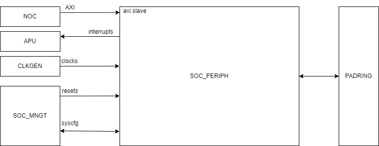
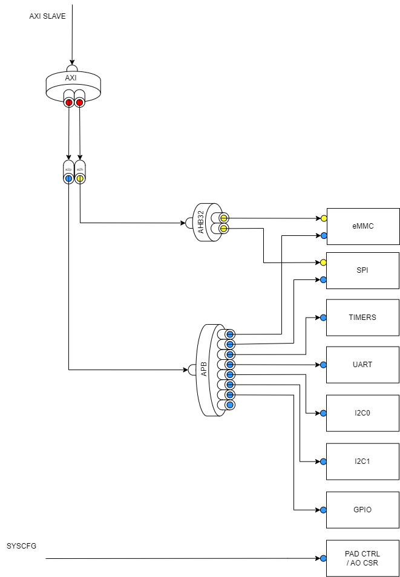

# SOC_PERIPH Functional Spec

## Introduction

### Overview

The SOC_PERIPH block contains all slow IO peripherals.

There are some complex timing exceptions associated with IO timings so separating these out early for a PD visibility as well as better placement near the relevant pads should help close out build.

### System Diagram

## Functional Description

All functional modules in this block are from a 3rd party IP provider, namely Synopsys.

Documentation for these IP can be found here:

| IP       | Documentation |
| -------- | ------------- |
| dw_spi   |               |
| dw_i2c   |               |
| dw_timer |               |
| dw_uart  |               |
| dw_gpio  |               |
| dw_emmc  |               |

For each feature, explain it's purpose.

Describe the SW <> HW interface. 

This section should be detailed enough for verification to determine a test plan for the block and it's features.

### Performance Requirements

There are no performance requirements for this block.

### CSR Details

Insert a table of CSR and memory maps.

## Implementation Description

### Block Diagram

Block Diagram detailing the full interface and the internal architecture.

### Clocks and Resets

List clocks, resets, and draw out their networks.

- Peripheral Clock (100MHz)
- Ref Clock (20MHz)

(no info on emmc or ufs requirements)

### IO and Interfaces

#### NOC I/F

- AXI Slave interface for all NOC connectivity.

#### SLOW IO Protocols

- I2C (x2) 
- SPI
- UART
- GPIO

#### INTERRUPTS

- Interrupts to platform interrupt controller (APU)
- Minimise IP interrupts (e.g. reduce existing 17 of I2C to a single interrupt)

#### PAD CTRL

- Pad ctrl signals to padring

#### SPMU

- SPMU interface to partition clock, reset and config CSRs (wrapper)

### Physical Considerations

#### Memory Details

| RAM Type     | Width (sub word) | Depth | Num Insts | Usage   |
| ------------ | ---------------- | ----- | --------- | ------- |
| SRAM (2port) | 10 (10)          | 16    | 1         | UART RX |
| SRAM (2port) | 8 (8)            | 16    | 1         | UART TX |

#### Floorplanning considerations

- Large Buses connected to which sub blocks.

#### Special DFT Requirements

Are there any structures that DFT need to be aware of? 

### Timing Exceptions

If your constraints need an exception, draw the logic, the named cells and the exception that falls out.

