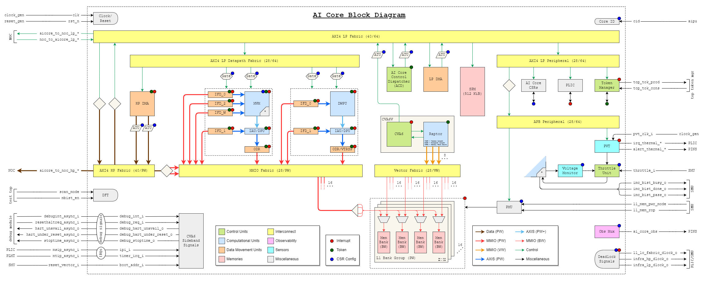

# AI Core

## Architectural Requirements

| Requirement ID        | Criticality | Owner | Description |
|-----------------------|-------------|-------|-------------|






| {{ id }} | {{ criticality_style }} | {{ requirement.owner }} | {{ requirement.description }} |


## Block Definition

### Block Diagram

Outdated state from 16.02.2024:

