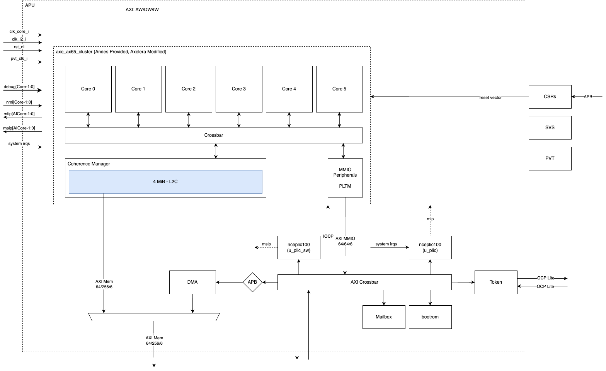

# APU - Application Processing Unit

The application processing unit (APU) is a coherent multi-core RISC-V system
that allows Europa to run system level applications and general workloads such
as UNIX-style operating systems and other frameworks that build on top.

## Requirements

## Architectural Requirements

| Requirement ID | Criticality | Owner | Description |
| -------------- | ----------- | ----- | ----------- |






| {{ id }} | {{ criticality_style }} | {{ requirement.owner }} | {{ requirement.description }} |


## Block Definition

### Block Description

The APU will be the primary means of controlling the Europa chip. This is a
natural evolution from the system controller in Metis.

### Block Parameters

| Parameter   | Concrete Value | Description                                    |
| ----------- | -------------- | ---------------------------------------------- |
| `NrCores`   | `6`            | Number of RISC-V cores within the APU cluster. |
| `NrAICores` | `8`            | Number of AI Cores.                            |

#### Control and Status Register

There shall be one control and status register (CSR) that allows system SW to
configure various timing uncritical side-band signals. Those include:

| Register              | Reset            | Description                                                                 |
| --------------------- | ---------------- | --------------------------------------------------------------------------- |
| `boot_addr [NrCores]` | Base of bootrom. | Per core boot address from where the cores should fetch their instructions. |
| `clock_en [NrCores]`  | `0`              | Per core clock_en. After reset the clock will be un-gated.                  |

The control and status register live in the parition wrapper.

### Block Interfaces

| Interface            | Direction | Definition                                                                                                               | Characteristic                                                                                                 |
| -------------------- | --------- | ------------------------------------------------------------------------------------------------------------------------ |
| `apu_targ_lt`        | BiDir     | Address: 40, Data: 64, IDW: 10                                                                                           | Full AXI support. Peripheral access.  Infrequent access to APU internal peripherals (PLICs, PLTM, etc.). |
| `apu_init_lt`        | BiDir     | Address: 40, Data: 64, IDW: 8                                                                                            | Full AXI support. Peripheral access.                                                                           |
| `apu_init_mt`        | BiDir     | Address: 40, Data: 256, IDW: 10                                                                                          | Full AXI support. Targets DDR. Cache-line refills (WRAP bursts).                                               |
|                      |           |                                                                                                                          |                                                                                                                |
| `clk_core_i`         | In        | 1.2 GHz                                                                                                                  |                                                                                                                |
| `clk_l2_i`           | In        | 1.2 GHz                                                                                                                  |                                                                                                                |
| `rst_n`i             | In        |                                                                                                                          | Low-active, async, reset                                                                                       |
| `debug[NrCores-1:0]` | In        | Debug interrupt for each core.                                                                                           |                                                                                                                |
| `Other Debug`        | Bidir     | Other asynchronous debug status signals.                                                                                 |                                                                                                                |
| `nmi`                | In        | Non-maskable interrupts. Interrupt source for interrupts which are not recoverable. Expose to top-level but tie to zero. |                                                                                                                |
| `mtip[NrAICores]`    | Out       | Timer interrupt to AI Cores.                                                                                             |                                                                                                                |
| `system irqs`        | In        | Interrupts coming from the system.                                                                                       |                                                                                                                |
| `msip[NrAICores]`    | Out       | Software interrupts going to AI Core                                                                                     |                                                                                                                |  |

### Block Diagram

## Block Integration

The block sits on the top-level NoC and must have access to all the memory space
in the system, except for the security subsystem. The CPU shall have full
throughput (min 256-bits/cycle, full-duplex) to all LPDDR memories (assuming no
contention) from its refill port (AXI Mem Refill).

## Description of use-cases

### General Description

The APU is the central managing agency that runs mainline, full-distro Linux.
That also includes support for upstream RISC-V ported SW (such as Python,
`ffmpeg`, etc.). The APU will be required to boot further stages (such as
U-Boot, UEFI, Grub, and Linux - exact boot flow to be decided). The APU will
need to have support for the secure boot as well.

### Memory Usage

| **Data Type** | **Description**   | **Comment**                           |
| ------------- | ----------------- | ------------------------------------- |
| 1             | Linux kernel.     | Main memory, LPDDR.                   |
| 2             | Root file system. | Non-volatile memory.                  |
| 3             | Shared L2 Cache   | Caches accesses to cacheable regions. |
| 4             | Private L1 Cache  | Private caches to cacheable regions.  |

### Booting

The CPUs boot after resetting from the boot vector, which will be driven by a
CSR from within the specific block. The APU will booted independently of the
secure element from its own internal bootrom.

The APU will perform subsequent booting stages. This most likely involving
OpenSBI and U-Boot. Subsequent stages of booting can be verified using the
Kudelski RoT. The exact boot scenario is defined in the boot strategy.

### Interrupt Handling

The APU shall be the place of interrupt aggregation and handling of most of the
interrupt periphery. That includes all system-level interrupts, i.e., interrupts
that are dedicated to system managament (peripheral interrupts, dead-lock
interrupts, high-speed interface interrupts, etc.). The system interrupts are
routed twoards the PLIC which aggregates, priortizes, and routes interrupts to
the respective APU cores.

Furthermore, the APU also contains a platform timer that generates a common
time-base for APU cores and the RISC-V cores present in the AI Cores. This is to
provide feature backwards compatability with Metis.

Finally, the SW PLIC enables inter-processor interrupts for the APU cores and
the RISC-Vs in the AI Core.

### Runtime Interactions

The APU off-loads (OpenCL) kernels to the AI Core and the PVE units as part of
their `gstreamer` pipeline. Dedicated `gstreamer` plugins need to be developed
to that end.

The APU will interact with the decoder as outlined in
[https://axeleraai.atlassian.net/wiki/spaces/archrd/pages/406355988/Decoder#General-Description](https://axeleraai.atlassian.net/wiki/spaces/archrd/pages/406355988/Decoder#General-Description)
.

### Power management

Cores can be individually clocked and their frequency is independent of the L2.
Not all cores might be used for booting Linux. The exact strategy is to be
defined by the firmware team and is not covered in the architectural
specification which allows all use-cases. Cores can also be excluded from their
respective coherence domain and powered down individually. Exact mechanism TBC
with the overall clock-gating strategy.
