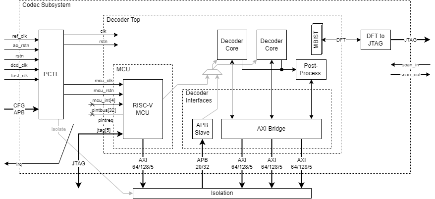
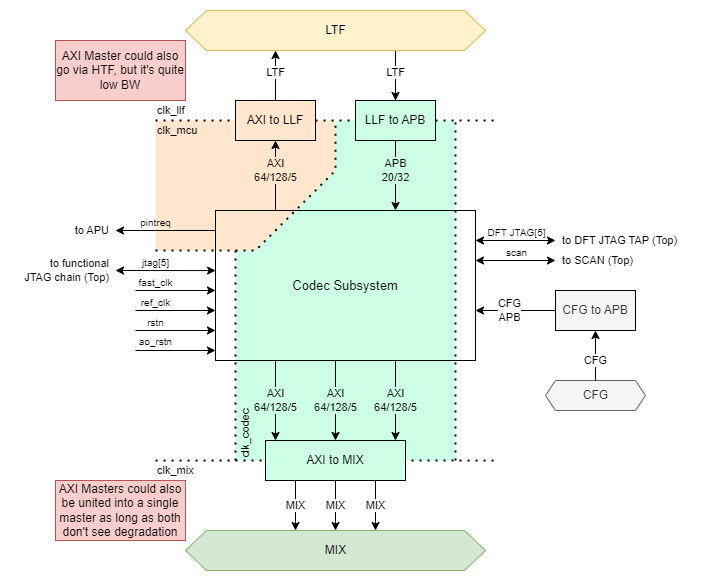

# Decoder

Ownership [Stefan Mach](https://axeleraai.atlassian.net/wiki/people/62610e8f60d67c0068d99f81?ref=confluence)

This page will gather all the requirements and the architecture for the Decoder block as well as its integration into the Europa system.

> [!WARNING]
> The Decoder is a third-party IP provided by Allegro. Final IP DELIVERY is pending.

- [Decoder](#decoder)
    - [Requirements](#requirements)
    - [Block Definition](#block-definition)
        - [Block Description](#block-description)
        - [Block Diagram](#block-diagram)
        - [Block Interfaces](#block-interfaces)
    - [Block Integration](#block-integration)
        - [Memory Error Detection \& Correction](#memory-error-detection--correction)
    - [Description of use-cases](#description-of-use-cases)
        - [General Description](#general-description)
        - [Memory Usage](#memory-usage)
        - [Booting](#booting)
        - [Configuration](#configuration)
        - [Runtime Interactions](#runtime-interactions)
        - [Power management](#power-management)
    - [Deliveries](#deliveries)

## Requirements

Choice of the requirements ID is done based on the following.

| **Requirements**                 | **ID**  |
| -------------------------------- | ------- |
| Related to use cases             | DEC_0xx |
| Related to subsystem             | DEC_1xx |
| Related to top-level integration | DEC_2xx |
| Related to design (FE/PD)        | DEC_3xx |
| Related to PPA                   | DEC_4xx |

| **Requirement ID** | **Description** | **Comment** | **Review status** |
| --- | --- | --- | --- |
| DEC_000 | The Decoder supports decoding bitstreams encoded with H.264 (AVC) using the *high* preset (8-bit color depth, 4:2:0 chroma format) | [Decoder Requirements for Europa](https://axeleraai.atlassian.net/wiki/spaces/archrd/pages/383352891/Decoder+Requirements+for+Europa) | SIGNED OFF |
| DEC_001 | The Decoder supports decoding bitstreams encoded with H.265 (HEVC) using the *main* preset (8-bit color depth, 4:2:0 chroma format) | [Decoder Requirements for Europa](https://axeleraai.atlassian.net/wiki/spaces/archrd/pages/383352891/Decoder+Requirements+for+Europa) | SIGNED OFF |
| DEC_002 | The Decoder supports decoding bitstreams encoded with JPEG using the *baseline* preset (8-bit color depth, 4:2:0 chroma format) | [Decoder Requirements for Europa](https://axeleraai.atlassian.net/wiki/spaces/archrd/pages/383352891/Decoder+Requirements+for+Europa) | SIGNED OFF |
| DEC_003 | The Decoder supports resolutions of up to 4K (3820x2160 px) and at least 256x128 px | [Decoder Requirements for Europa](https://axeleraai.atlassian.net/wiki/spaces/archrd/pages/383352891/Decoder+Requirements+for+Europa) | SIGNED OFF |
| DEC_004 | The Decoder supports a total pixel rate of up to ~~1 Gpx/s, equivalent to 4K@120fps | [Decoder Requirements for Europa](https://axeleraai.atlassian.net/wiki/spaces/archrd/pages/383352891/Decoder+Requirements+for+Europa) | SIGNED OFF |
| DEC_005 | The Decoder supports up to 64 concurrent streams at a proportionally reduced pixel rate | [Decoder Requirements for Europa](https://axeleraai.atlassian.net/wiki/spaces/archrd/pages/383352891/Decoder+Requirements+for+Europa) | SIGNED OFF |
| DEC_006 | The Decoder supports a single-stream pixel rate of up to ~500 Mpx/s, equivalent to 4K@60fps | [Decoder Requirements for Europa](https://axeleraai.atlassian.net/wiki/spaces/archrd/pages/383352891/Decoder+Requirements+for+Europa) | SIGNED OFF |
| DEC_007 | The Decoder produces video frame data either in native YUV or as rasterized RGB | Planar or semi-planar RGB confirmed | SIGNED OFF |
| DEC_008 | The Decoder can apply resizing and cropping post-processing operations to the rasterized frame output | Option #PP2 in [Allegro PPA Document](https://axeleraai.sharepoint.com/:b:/r/sites/AXELERAAI-ResearchandDevelopment/Gedeelde%20documenten/Research%20and%20Development/hw/doc/vendors/Allegro/2024-03-28_Allegro-AxeleraAI_TechnicalDiscussion_v6.pdf?csf=1&web=1&e=IZkFU4) | SIGNED OFF |
| DEC_009 | The Decoder can apply rotate (90° increments) and mirroring post-processing operations to the rasterized frame output | Option #PP2 in [Allegro PPA Document](https://axeleraai.sharepoint.com/:b:/r/sites/AXELERAAI-ResearchandDevelopment/Gedeelde%20documenten/Research%20and%20Development/hw/doc/vendors/Allegro/2024-03-28_Allegro-AxeleraAI_TechnicalDiscussion_v6.pdf?csf=1&web=1&e=IZkFU4) | SIGNED OFF |
| ~~DEC_010~~ | ~~The Decoder~~ *~~may be able to~~* ~~apply dewarping post-processing operations to the rasterized frame output~~ | [~~Pre/Post Proc Slides~~](https://axeleraai.sharepoint.com/:b:/r/sites/AXELERAAI-ResearchandDevelopment/Gedeelde%20documenten/Research%20and%20Development/hw/doc/vendors/Allegro/2023-06-01%20Allegro%20DVT%20Pre%20and%20Post%20Processing%20IP.pdf?csf=1&web=1&e=PSwSfl) | REMOVED |
|     |     |     |     |
| DEC_100 | The APU manages the Decoder power states and initialization | System SW is available as C code & Linux drivers. | SIGNED OFF |
| DEC_101 | The APU runs the control software for the Decoder and orchestrates its operation. This happens on a frame-by-frame basis over APB as well as interrupts. | System SW is available as C code & Linux drivers. | SIGNED OFF |
| ~~DEC_102~~ | ~~The PVE DMA~~ *~~may be able to~~* ~~efficiently perform rasterized image rotation and mirroring post-processing by adequate transfer granularity and striding capability.~~ | ~~Nice to have, Decoder already contains rotation and mirroring add-ons~~ | REMOVED |
|     |     |     |     |
| DEC_200 | The Decoder’s core AXI masters need high-throughput access to DDR and L2 memories, with at least 32 outstanding transactions per master | On the order of 10GB/s *per AXI master* | SIGNED OFF |
| DEC_201 | The Decoder’s APB slave must be accessible from the APU | At regular speeds | SIGNED OFF |
| DEC_202 | The Decoder sends interrupts to the APU | At least 1 interrupt line, possibly more signals for interrupt source communication | SIGNED OFF |
| DEC_203 | The Decoder’s RISC-V MCU can be debugged via JTAG |     | SIGNED OFF |
| DEC_204 | The Decoder’s MCU AXI master needs low-latency access to DDR and L2 memories | For accessing code & data in a defined block of memory | SIGNED OFF |
| DEC_205 | AXI requests initiated by the Decoder’s AXI masters are serviced within 500 IP clock cycles. | Detailed performance requirements pending final IP DELIVERY | SIGNED OFF |
|     |     |     |     |
| DEC_300 | The Decoder is a soft IP consisting of an RTL delivery with placeholder models for technology-specific cells such as SRAMs, clock gates, etc. |     | SIGNED OFF |
| DEC_301 | The Decoder IP requires single-ported and two-ported SRAM macros, both with and without word-enable options | [Integration Document](https://axeleraai.sharepoint.com/:b:/r/sites/AXELERAAI-ResearchandDevelopment/Gedeelde%20documenten/Research%20and%20Development/hw/doc/vendors/Allegro/Eval%20Delivery/integration.pdf?csf=1&web=1&e=7VYvH7) | SIGNED OFF |
| DEC_302 | The floorplanning and all other relevant physical design tasks shall follow the integration documentation of the Decoder IP if possible | [Integration Document](https://axeleraai.sharepoint.com/:b:/r/sites/AXELERAAI-ResearchandDevelopment/Gedeelde%20documenten/Research%20and%20Development/hw/doc/vendors/Allegro/Eval%20Delivery/integration.pdf?csf=1&web=1&e=7VYvH7) | SIGNED OFF |
| ~~DEC_303~~ |     |     | REMOVED |
| DEC_304 | Memory error detection or correction: No ECC or EDC in the Codec Subsystem. Internal memories are excluded from ECC coverage. MBIST still applies! | Was done before by some customers. Guidance around important memories and their usage is available from Allegro | SIGNED OFF |
| DEC_305 | The Codec Subsystem has its own *controllable* clock domains, controlled from the APU. | See DEC_4xx requirements  See [europa#135](https://git.axelera.ai/prod/europa/-/issues/135) | SIGNED OFF |
|     |     |     |     |
| DEC_400 | The Codec Subsystem achieves a clock frequency of at least 600 MHz and is driven by its own programmable clock | More is better, directly proportional to pixel rate | SIGNED OFF |
| DEC_401 | The MCU inside the Decoder IP achieves a clock frequency of at least 1.2 GHz, and is driven by its own programmable clock | Becomes critical when dealing with high FPS (small resolution, many concurrent streams) | SIGNED OFF |
| DEC_402 | The Codec Susbsytem can be disabled and **isolated** from the rest of the system, to reduce power or system interference. | According to Codec IP clock-enable functionality.  Isolation for non-functional IP. | SIGNED OFF |
| DEC_403 | The clock sources for the Codec Subsystem can be throttled to achieve frequency scaling according to workloads | Typical range 350-500 MHz | SIGNED OFF |
| DEC_404 | The clock sources for the Codec Subsystem can be disabled to minimize power draw when unused. |     | SIGNED OFF |

## Block Definition

### Block Description

The Decoder is a block for the decoding of encoded video streams and images to obtain raw pixel data for processing in the Europa system. It is a third-party soft IP block that we integrate ourselves.

### Block Diagram

The Decoder lives in the *Codec Subsystem* top-level block. Currently, it is the only block in this sub-system, and “Decoder” and “Codec Subsystem” are used interchangeably.

The final IP configuration is comprised of the following options in the [Allegro PPA document](https://axeleraai.sharepoint.com/:b:/r/sites/AXELERAAI-ResearchandDevelopment/Gedeelde%20documenten/Research%20and%20Development/hw/doc/vendors/Allegro/2024-03-28_Allegro-AxeleraAI_TechnicalDiscussion_v6.pdf?csf=1&web=1&e=IZkFU4):

*   Decoder IP configuration **#D3**
*   MCU add-on **#RISC-V**
*   Post-Processing add-on **#PP2**

This block diagram shows the final IP configuration.

### Block Interfaces

These interfaces represent the current state of the IP shown above, using the preliminary materials available. Final IP DELIVERY is pending.

#### Decoder Core AXI Master (3x)

| **Interface characteristics** | **Interface Information**     |
| ----------------------------- | ----------------------------- |
| Bus Protocol                  | AXI4                          |
| Port Data Width               | 128                           |
| Address Width                 | 64                            |
| Address Alignment             | Aligned and Unaligned support |
| Max Burst Length              | 512 Bytes (`AxLEN`\=31)       |
| Burst Type                    | INCR                          |
| Burst size                    | up to 16 (128 bit)            |
| Transaction Attributes        | none, `AxPROT`\=`0b000`       |
| Performance details           |                               |
| Max Outstanding Transactions  | at least 32                   |
| Read Bandwidth                | 4 GB/s peak                   |
| Write Bandwidth               | 4 GB/s peak                   |

#### MCU AXI Master

| **Interface characteristics** | **Interface Information**        |
| ----------------------------- | -------------------------------- |
| Bus Protocol                  | AXI4                             |
| Port Data Width               | 128                              |
| Address Width                 | 64, *40 internally at MCU*       |
| Address Alignment             | Aligned and Unaligned support    |
| Max Burst Length              | *unknown, assume full AXI4 spec* |
| Burst Type                    | *unknown, assume full AXI4 spec* |
| Burst size                    | *unknown, assume full AXI4 spec* |
| Transaction Attributes        | none, `AxPROT`\=`0b000`          |
| Performance details           |                                  |
| Max Outstanding Transactions  | *unknown*                        |
| Read Bandwidth                | *unknown, assume low*            |
| Write Bandwidth               | *unknown, assume low*            |

#### APB Slave

| **Interface characteristics** | **Interface Information** |
| ----------------------------- | ------------------------- |
| Bus Protocol                  | APB                       |
| Port Data Width               | 32                        |
| Address Width                 | 20                        |

#### Interrupts to APU

| **Interface characteristics** | **Interface Information**                                            |
| ----------------------------- | -------------------------------------------------------------------- |
| Bus Protocol                  | Level-Sensitive Interrupts                                           |
| Port Data Width               | 1 IRQ  (optionally 32 interrupt lines, also observable in reg) |

#### Debug

| **Interface characteristics** | **Interface Information**                                                |
| ----------------------------- | ------------------------------------------------------------------------ |
| Bus Protocol                  | JTAG (regular 4-wire, no SRST)                                           |
| Performance details           | JTAG signals must have a period of at least 2x the Codec Subsystem Clock |

## Block Integration

The Codec subsystem block is integrated at the top level of the Europa architecture and connects to the top-level NoC.

### Memory Error Detection & Correction

The Decoder IP **does not** provide any native memory error correction or detection mechanism. Most memories in the IP lie on the critical paths, so integrating ECC is practically infeasible in most cases. Furthermore, despite the possibility of support from the vendor, the internal build-up of the IP poses too many unknowns to reasonably scope an effort to integrate error correction capability on our side.

Given that it is a soft IP, all DFT & MBIST methods performed by us apply to the codec subsystem. As such, the error mitigation strategy for the Codec Subsystem is as follows:

*   Static memory faults are covered by infield repair (MBIST) analogously to our in-house IP.
*   Transient faults should be detectable by the system software (e.g. timeout).

In general, failures of the Codec Subsystem should be treated by isolating the subsystem from the rest of the SoC and treating the decoding capabilities as inoperative.

## Description of use-cases

### General Description

The typical use case dataflow for the Decoder is given as follows:

For each stream and each video frame:

1.  The encoded bitstream lies in system memory (DRAM)
2.  The APU configures and instructs the Decoder to decode the next frame into an allocated memory buffer in system memory (DRAM or L2)
3.  The Decoder performs its operation and accesses system memory (DRAM) to load/store intermediate data used for its operation as well as the reconstructed picture data
4.  [Optional] The Decoder also performs post-processing operations and writes a rasterized image into system memory (DRAM or L2)
5.  The Decoder notifies the APU via Interrupt that the frame decoding is completed

### Memory Usage

| **Data Type** | **Description** | **Comment** |
| --- | --- | --- |
| 1   | Decoder-initiated data flows to the system: *Inputs* - command list and status - start code detector bitstream input - slice data bitstream input - intermediate buffer data input (header and residual data) - reference frames pixel data - co-located motion vectors - various tables (weighted prediction, scaling lists, POC lists) *Outputs* - reconstructed frame pixel data (with optional secondary raster output) - motion vectors - intermediate buffer data output (header and residual data) - start code detector output - decoded picture | DRAM or L2 |
| 2   | Decoder-managed internal data flows | Decoder-internal SRAM (inaccessible externally) |
| 3   | Firmware / ROM of Decoder MCU (FreeRTOS) | DRAM |
| 4   | Data memory space for Decoder MCU | DRAM |
| 5   | MCU I$ | MCU-internal private SRAM (inaccessible externally) |
| 6   | MCU D$ | MCU-internal private SRAM (inaccessible externally) |
| 7   | APB register configuration space | IP-internal register space (accessible externally) |

### Booting

The MCU’s data and instruction memory map is determined via configuration registers. The MCU boots into its firmware upon being started via configuration from the APU.

### Configuration

The APU is responsible for the Decoder configuration and operation and configures the Decoder IP via a register interface accessible through the system bus via APB. The initialization for the Decoder IP after a hard reset consists of:

1.  Enabling the clock signals
2.  Performing a soft reset
3.  Configuring the clock gating control
4.  Configuring interrupts
5.  Setting one or several commands by writing into the core-level registers or by using an external
    command list (in system memory)
6.  Starting the command

### Runtime Interactions

Refer to the general description at the beginning of this section.

*   The Decoder interacts with the APU by raising interrupts.
*   The Decoder is being interacted with by the APU through memory-mapped configuration register accesses.

### Power management

The IP offers two means of power reduction by clock-gating:

*   RTL synthesis-inserted automatic clock gating achieved through good clock gating coverage
*   Manual clock gating control to disable individual decoder IP cores completely, controlled by the APU via configuration registers.

## Deliveries

The following is the schedule for IP DELIVERY as indicated by the vendor in the preliminary contract. Efforts are ongoing to streamline delivery to help unblock parts of the integration.

|     |     |     |
| --- | --- | --- |
| **Date** | **Milestone** | **Description** |
| **Already delivered as evaluation RTL (RTL 0.0)**  (Without post processing features) | RTL 0.1 | **First drop of the IP:**  - First drop of the RTL design to start integration with: -- Final I/O ports -- Synthesizable RTL design, synthesis script -- Preliminary interfaces and memory list, useful for area estimation and memory design -- Preliminary integration tests     - Not final maturity - Preliminary IP documentation - No post processing features |
| **PO + 2 months** | RTL 0.5 | **Intermediate drop of the IP:**  - This drop includes RTL design with all new functionalities but not fully validated: -- Synthesizable RTL design, synthesis script -- Final interfaces -- Final memory list -- Intermediate integration tests     - IP Documentation |
| **PO + 4 months**  (RTL1.0 will only be released on condition of receiving written confirmation of Licensee receiving Rev B funding) | RTL 1.0 | **Final drop of the IP:**  - This drop includes RTL design with all functionalities fully validated: -- Synthesizable RTL design, synthesis script -- Final interfaces and memory list -- Final integration tests     - Final content, final maturity -- IP meets synthesis timing requirements -- IP passes 100% of integration tests - validation tests - gate-level tests         - Full IP documentation -- specification -- integration guide -- verification report -- performance vs. latency tolerance report |
