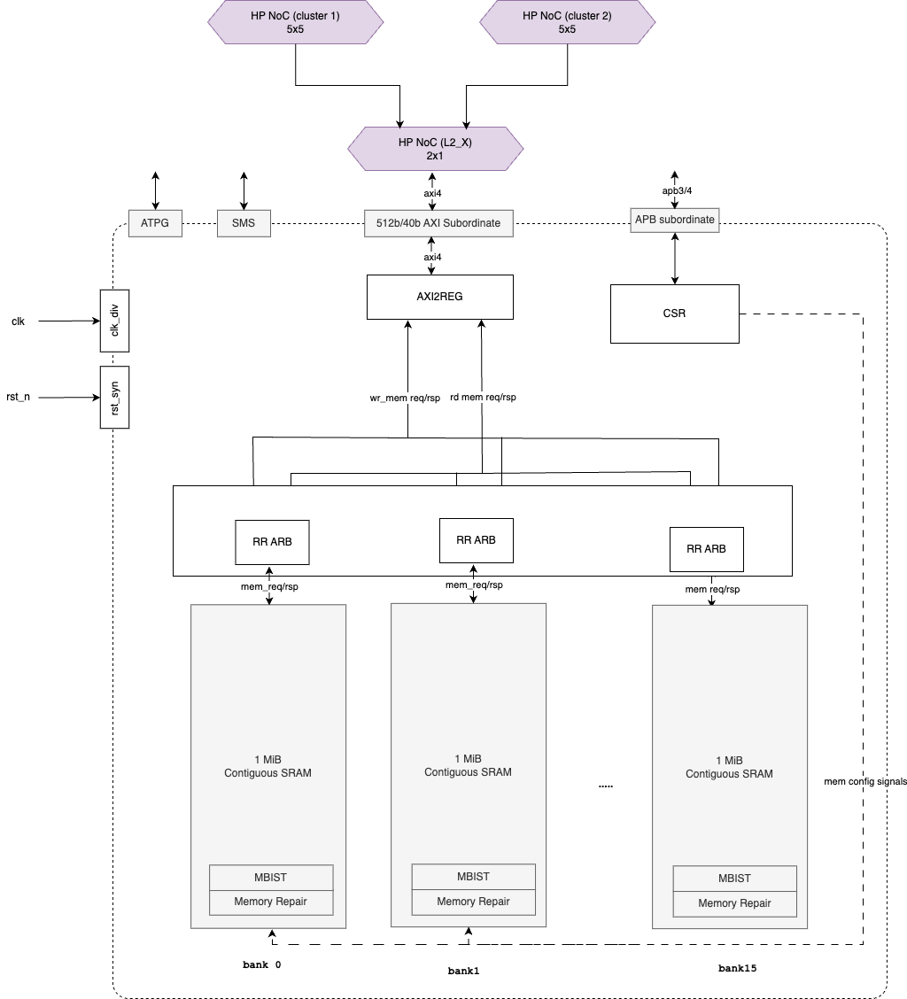

# L2

Ownership [Spyridoula Koumousi](https://axeleraai.atlassian.net/wiki/people/62610e829e7c190069e821bc?ref=confluence)

This page will gather all the requirements and the architecture for the L2 module as well as L2 memory hierarchy.

## Table of contents

*   [Table of contents](#table-of-contents)
*   [Requirements](#requirements)
*   [Block Definition](#block-definition)
    *   [Block Description](#block-description)
*   [Block Diagram](#block-diagram)
    *   [Block Interfaces](#block-interfaces)
*   [Block Integration](#not-block-integration)
*   [Use cases](#use-cases)
    *   [General Description](#general-description)
    *   [Memory Usage](#memory-usage)
    *   [Booting](#booting)
    *   [Configuration](#configuration)
    *   [Runtime Interactions](#runtime-interactions)
    *   [Power management](#power-management)

## Architectural Requirements

| Requirement ID        | Criticality | Owner | Description |
|-----------------------|-------------|-------|-------------|






| {{ id }} | {{ criticality_style }} | {{ requirement.owner }} | {{ requirement.description }} |


## Block Definition

### Block Description

The 128MiB of L2 memory will be split into 8 modules of 16MiB each.

From the point of view of the memory space the 16MiB will be seen as a contiguous memory address space, however internally each L2 module will be split into 16 separate banks of 1MiB each. Each bank can be accesses in parallel by the 512-bit wide Full duplex AXI port.

The AXI channel needs to be first converted into a MEM INTF protocol with decoupled RD and WR channels. A RR arbiter per bank will arbitrate the RD/WR MEM requests towards the bank. On a given cycle only a read or write operation can take place for each of the banks. Simultaneous accesses to the same bank are not required therefore the bank can be composed by single port RAMs.

Each of the banks will be composed by further physical subbanks in order to form the full granule for the access for the 512-bit wide rams. The full implementation details can be found in the L2 IP design document.

## Block Diagram

### Block Interfaces

The main interface is a full duplex AXI4 interface that is connected to the NoC.

The AXI4 features and characteristics of the INTF are described in the table below.

| **Interface characteristics** | **Interface Information** |
| --- | --- |
| Bus Protocol | AXI4 |
| Port Data Width | 512 |
| Address Width | 40 (24-bit truncated) |
| Address Alignment | Aligned and Unaligned support |
| Max Burst Length | INCR: 256  WRAP:16  FIXED: 16 |
| Burst Type | INCR, WRAP, FIXED |
| Burst size | 1 to 128 |
| Transaction Attributes | None, Modifiable, Bufferable  Read-allocate Write-allocate |
| Burst Cross Boundary | 4K  |
| Exclusives | Not Supported |
| Narrow Bursts | Supported |
| Byte Enable Usage | Supported |
| Read Response Interleaving | Not supported on the module level but it is supported if we see the complete L2 as a whole |
| Write Interleaving | Not supported on the module level but it is supported if we see the complete L2 as a whole |
| Write Response | Posted |
| Read-Write Ordering | Not maintained |
| Performance details |     |
| Max Outstanding Transactions | TBD this will be sized based on the fabrics/DMAs max outs tnx |
| Read Bandwidth | 77.1 GB/s peak |
| Write Bandwidth | 77.1 GB/s peak |

## Block Integration

The diagram below illustrates how the L2 memory is split into 8 memory modules, each connected to the HP NoC through it’s 512b AXI interface and to the LP NOC through it’s APB slave interface.

The diagram should highlight any other integration aspects:

*   Connection of the block to the toplevel HP and LP NOC:
    
    *   L2 interleaved address space. The NoC should support 3 modes:
        
        *   4k interleaved mode (address space of L2 interleaved at 4k granularity)
            
        *   1k interleaved mode (address space of L2 interleaved at 1k granularity)
            
        *   Contiguous mode (address spaces of L2 modules stacked)
            
        *   2x4k interleaved mode (address space of L2 split into two contiguous ranges with 4k interleaving)
            
*   Connection of the block to the soc-mgmt module:
    
    *   Clock interface
        
    *   Test interface
        
    *   RST connections
        
    *   rst isolation requirements and integration with the NoC Fencing mechanism
        

## Use cases

### General Description

The Europa architecture will have a **data-dedicated L2 memory** optimised for high throughput, in order to store (1 ) NN coefficients, (2) NN feature maps , (3) input images, (4) output data, (5) intermediate data in pre- and post-processing and (6) decoder intermediate data. All types 1-6 can also be stored in DDR (or L1), depending on their size and memory planning choices made by the system compiler. The following data transfers are considered default use-cases and are optimised to achieve peak throughput in uncongested scenarios (full duplex bandwidth of the link should be maxed out, when only one transfer is active) and optimised for maximum throughput in fully congested scenarios (when all possible transfers are active):

*   Data will be transferred between the DDR<->L2 via **SDMA** transfers
    
*   Data will be transferred from the DDR<->L2 via **AIC-DMA** transfers
    
*   Data will be transferred from AIC-L1<->L2 via **AIC-DMA** transfers
    
*   Data will be transferred from the DDR<->L2 via **PVE-DMA** transfers
    
*   Data will be transferred from PVE-L1<->L2 via **PVE-DMA** transfers
    
*   Data will be transferred between CODEC<->L2 via **CODEC** transfers
    
*   Data will be transferred between HOST<->L2 via **PCIE** transfers
    

The L2 can also be used as a **reserve memory** in order to store other data needed by (7) SW such as TLB pagetables, PCIE DMA descriptors and AICORE programs but this is not the principal use-case. In fact it is not advised as this data should go into the system-level SPM.

In order to improve performance, the L2 memory will be split into **8 modules with an interleaved address space**. Each module will be a slave to the NoC. The NoC makes sure that functional connectivity to and from all relevant masters (AIC-HP, PVE-HP, CODEC-HP, SDMA-HP) to the L2 is ensured and that performance requirements are met. The NoC is also responsible in generating DEC and SLV error indications when the address does not match the L2 module address range of the 16MiB.

### Memory Usage

| **Data Type** | **Description** | **Comment** |
| --- | --- | --- |
| 1   | **Stream Data:** NN Coefficients | Default use case |
| 2   | **Stream Data:** NN Intermediate feature maps | Default use case |
| 3   | **Stream Data:** Input Images | Default use case |
| 4   | **Stream Data:** Output images or output results | Default use case |
| 5   | **Stream Data:** Intermediate Pre-/Post-Processing Data | Default use case |
| 6   | **Stream Data:** Intermediate Decoder Data | Default use case |
| 7   | **SW Data** such as TLB pagetables, DMA descriptors, AICore programs | Allowed only for backwards compatibility. This data should go in the toplevel SPM. |

### Booting

No Booting requirements for L2 modules.

### Configuration

*   The L2 memory is configured during platform configuration by the APU system controller by writing to it’s local register space over APB, following the global block configuration strategy in [https://git.axelera.ai/prod/europa/-/issues/74](https://git.axelera.ai/prod/europa/-/issues/74).
    
*   The following items are configured:
    
    *   Sleep/Deepsleep Modes
        
    *   SRAM settings
        
    *   …
        

### Runtime Interactions

Default Data Transfers between L2 and other memories happen through **DMA’s.** These paths are optimised for high throughput, allowing 512b full duplex transfers between

*   Data will be transferred between the DDR<->L2 via **SDMA** transfers
    
*   Data will be transferred from the DDR<->L2 via **AIC-DMA** transfers
    
*   Data will be transferred from AIC-L1<->L2 via **AIC-DMA** transfers
    
*   Data will be transferred from the DDR<->L2 via **PVE-DMA** transfers
    
*   Data will be transferred from PVE-L1<->L2 via **PVE-DMA** transfers
    
*   Data will be transferred between CODEC<->L2 via **CODEC** transfers
    
*   Data will be transferred between HOST<->L2 via **PCIE** transfers
    

Other data transfers between any other master and the L2 memory are possible (due to the toplevel strategy that any master can reach any slave), but there are no guarantees and no optimisations on throughput nor latency.

### Power management

*   The L2 memory uses local automated clock gating on all internal pipeline registers and local memories. This mechanism is on by default and cannot be en- or disabled.
    
*   The clock of the L2 memory as a whole can be modulated or disconnected using the global power modulation strategy [https://git.axelera.ai/prod/europa/-/issues/77](https://git.axelera.ai/prod/europa/-/issues/77)
