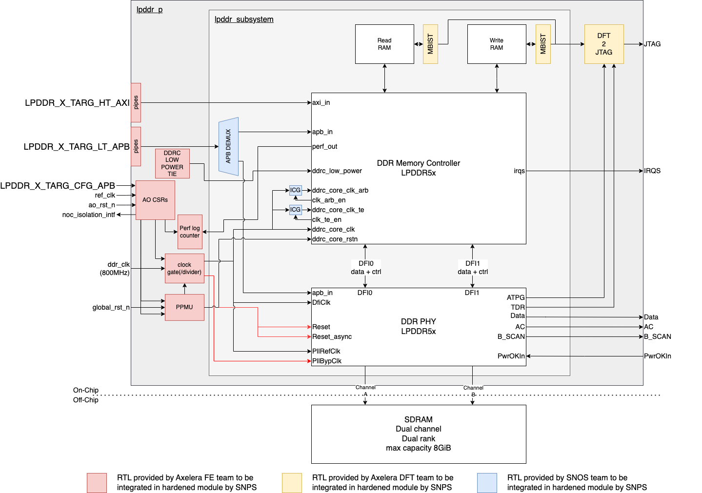
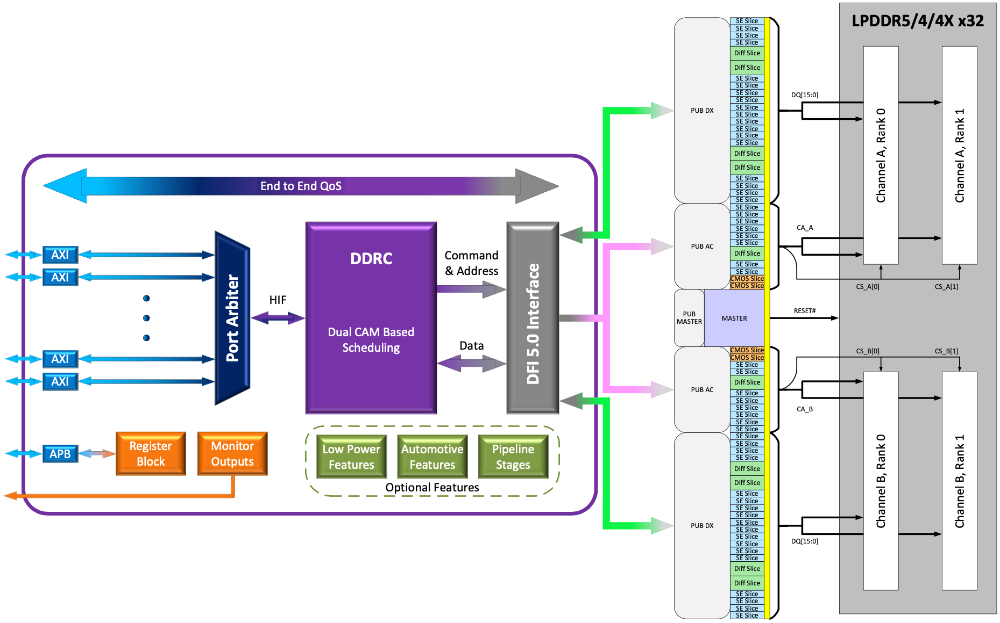
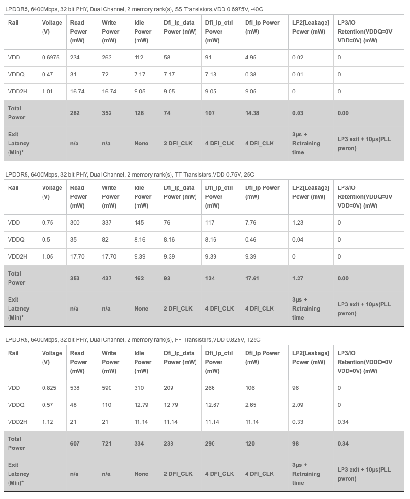
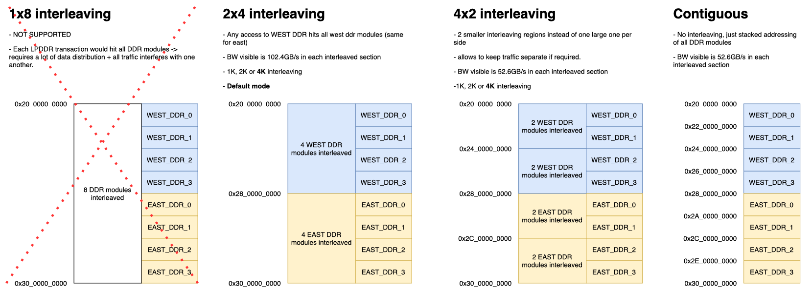
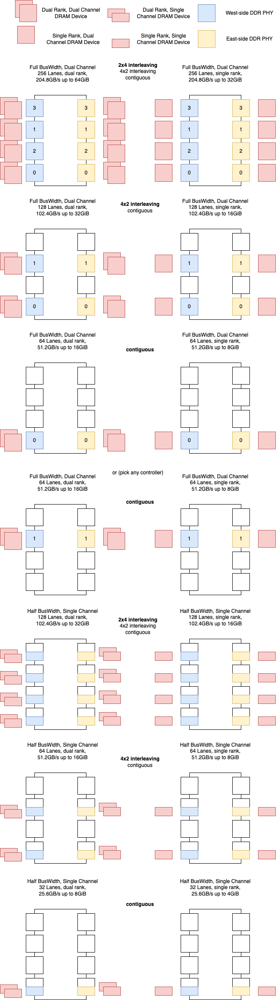
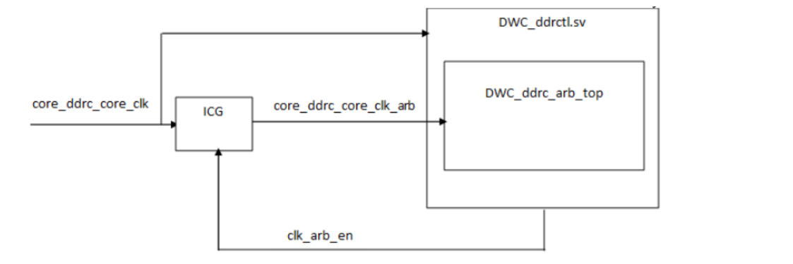
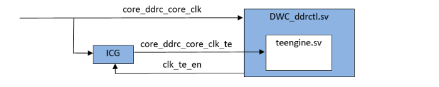
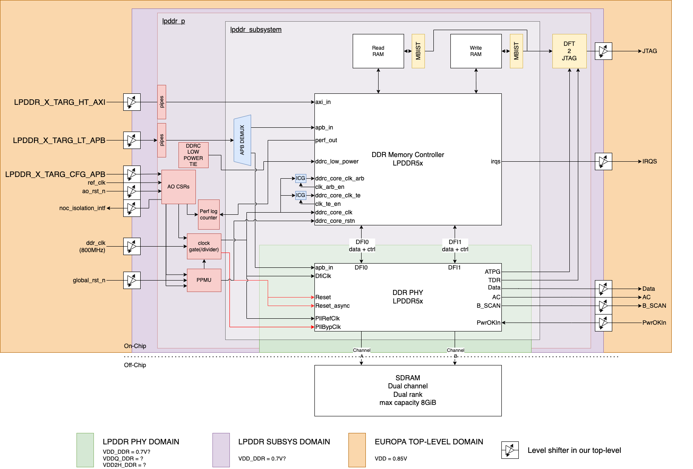
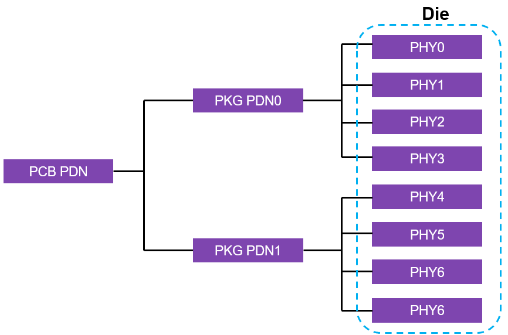
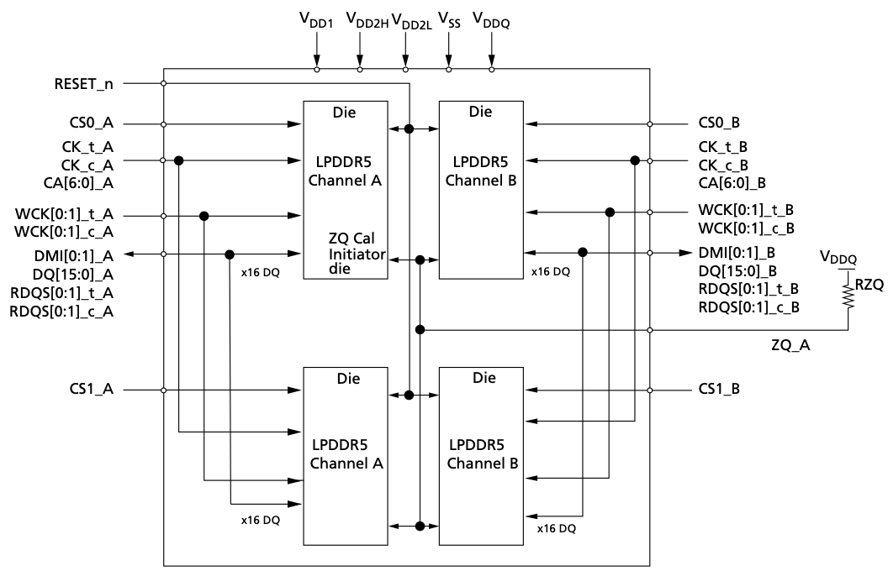

# DDR

This page will gather all the requirements and the architecture for the DDR module.

# Current Opens

- Will SNPS agree to implement some of our wrapper elements in their hard macro?
- Will SNPS provide the counters for the performance monitoring interface in their hard macro?
- Will SNPS agree to provide the DDR low power interface in their hard macro?
- Do we need spread-spectrum clocking? And can the DDR build in PLL handle this?


# Table of contents

- [DDR](#ddr)
- [Current Opens](#current-opens)
- [Table of contents](#table-of-contents)
- [Acronyms](#acronyms)
- [Requirements](#requirements)
- [Block Definition](#block-definition)
  - [Block Diagram](#block-diagram)
    - [Top-Level diagram](#top-level-diagram)
    - [SNPS Diagram of CTRL + PHY](#snps-diagram-of-ctrl--phy)
  - [Block Description](#block-description)
    - [SNPS PHY](#snps-phy)
      - [Power consumption estimate](#power-consumption-estimate)
    - [SNPS Controller](#snps-controller)
      - [ECC](#ecc)
        - [Link ECC](#link-ecc)
        - [Inline ECC](#inline-ecc)
      - [Power Modes](#power-modes)
    - [SNPS PHY placement](#snps-phy-placement)
  - [Block Interfaces](#block-interfaces)
    - [AXI4](#axi4)
    - [APB](#apb)
    - [PHY](#phy)
    - [DDRC Lower power interface](#ddrc-lower-power-interface)
    - [Interrupts](#interrupts)
      - [ECC interrupts](#ecc-interrupts)
      - [DFI interrupts](#dfi-interrupts)
      - [PHY interrupts](#phy-interrupts)
      - [MISC interrupts](#misc-interrupts)
    - [Performance monitoring interface](#performance-monitoring-interface)
- [Block Integration](#block-integration)
  - [Top-level integration](#top-level-integration)
    - [Top-level diagram](#top-level-diagram-1)
    - [Addressing and interleaving modes](#addressing-and-interleaving-modes)
    - [DRAM population options](#dram-population-options)
  - [Core side](#core-side)
    - [Clocks](#clocks)
      - [Clock gating](#clock-gating)
    - [Resets](#resets)
    - [DFT](#dft)
    - [Power Domains](#power-domains)
  - [Package side](#package-side)
    - [Power Distribution](#power-distribution)
      - [Simultaneous Switching Power Impact](#simultaneous-switching-power-impact)
  - [SDRAM](#sdram)
- [Description of Use-Cases](#description-of-use-cases)
  - [General Description](#general-description)
  - [Memory Usage](#memory-usage)
  - [Booting](#booting)
  - [Configuration](#configuration)
  - [Runtime Interactions](#runtime-interactions)
  - [Power Management](#power-management)
    - [PHY power management](#phy-power-management)
    - [CTRL power management](#ctrl-power-management)

# Acronyms

# Requirements

| **Requirement ID** | **Description** | **Comment** | **Review status** |
| --- | --- | --- | --- |
| DDR\_000 | The DDR module is used to connect the AIPU system to extrernal DRAM memory. |     | ✅ |
| DDR\_001 | The DDR module uses the LPDDR5 at 6400MT/s |     | ✅ |
| DDR\_002 | The DDR module enables the usage of lower speed grades. A total of 4 speed grades training data can be stored. These can then be switched among without having to retrain the link. | The switching is called fast frequency change in the controller configuration. | ✅ |
| DDR\_003 | A DDR module receives a dedicated DDR clock to meet its requirements. This clock needs to scale to adapt the speed grade. The effective speed grade = DDR clock freq x 4 x 2<br><br>The default frequency (required to meet 6400MT/s) is 800MHz | Changing the speed grade means changing this frequency and updating the link settings to use the training data for the respective speed grade. | ✅ |
| DDR\_004 | Both the DDR controller (which interfaces with the NoC) and the DDR PHY run on the dedicated DDR clock. |     | ✅ |
| DDR\_005 | The total bandwidth of a single DDR module is 25.6GB/s half-duplex |     | ✅ |
| DDR\_006 | The maximum capacity per module is 8GB. (Dual-rank on dual channel PHY → 2x2x2GB) |     | ✅ |
| DDR\_006A | The DDR module support operating with half bus-width. This effectively reduces the BW and capacity with 2x. The unused addresses wrap around to start of the module’s address range. | This is the same approach as used in Alpha and Omega. And, after discussing with [Rodrigo Gomes Borges](https://axeleraai.atlassian.net/wiki/people/63e6794e010d3563797663ee?ref=confluence), no reason was found to change this. | Exact capacity population modes need to be defined by product |
| DDR\_007 | The memory of the DDR module can be reached by all NoC initiators as described by the NoC specifications and connectivity | [NoC Specifications Europa](https://axeleraai.atlassian.net/wiki/spaces/archrd/pages/364675080/NoC+Specifications+Europa) | ✅ |
| DDR\_008 | The DDR module exposes a 256b AXI plug as memory entry point for the system that operates at the dedicated DDR clock (800 MHz). | 256b at 800MHz exactly meets the 25.6GB/s memory throughput<br><br>When a slower speed grade is used, the interface inherently adapts to meet the lower throughput since it operates with the same scaled DDR clock. | ✅ |
| DDR\_009 | The DDR AXI interface is sync to the DDR core ctrl logic |     | ✅ |
| DDR\_010 | The DDR does not provide exclusive support by itself, the NoC has to provide it. |     | ✅ |
| DDR\_011 | The DDR has a single NIU that supports both read and write. This means the NoC already does some arbitration between read and write, but still allows full duplex data (but not full duplex request + response). | It needs to be a single NIU otherwise the exclusive support from the NoC cannot be used. | ✅ |
| DDR\_012 | At the top-level, the outputs of several DDR modules are interleaved in several address modes.<br><br>*   2x4 (2 groups west/east of 4 interleaved banks)<br>    <br>*   4x2 (4 groups of 2 interleaved banks<br>    <br>*   8x1 (contiguously stacked banks, no interleaving) | Addressing modes are detailed in the [Network-on-Chip](https://axeleraai.atlassian.net/wiki/spaces/archrd/pages/377946231/Network-on-Chip) and shown in a figure further below. | ✅ |
| DDR\_013 | A DDR module can provide inline ECC for specific address ranges. These ranges are programmable and ECC can also be disabled all together. | Inline ECC protects against all types of errors. It cost 12.5% BW and 12.5% capacity in the enabled region. | ✅ |
| DDR\_014 | A DDR module can provide link ECC if the DRAM devices support it and it is enabled in SW | Link ECC protects against noise impact on the DDR traces on PCB. It does not protect against memory storage errors | ✅ |
| DDR\_015 | The DDR module should be able to accept a priority per request using AXQOS signals. | The NoC provides a fixed (CSR controlled) QoS setting through AXUSER bits per initiator. Each initiator can thus get a different quasi static priority configurable through CSRs. | ✅ |
| DDR\_016 | The DDR controller can buffer up to 32 read/write request command, 128 read/write data beats, and 64 write responses | These are the maximum buffer sizes supported by the controller config. | ✅ |
| DDR\_017 | The DDR module is wrapped with a similar strategy as our own IP blocks. This wrapper contains, interface pipelines on AXI and APB, OA CSRs for gating and reset control, PMMU for gating and reset control. |     | ✅ |
| DDR\_018 | The DDR module supports several low power modes and can place the DRAM devices in to a low power state. These low power modes are inherently part of the SNPS IP. | Details on low power modes can be found in the databooks of the controller and PHY. A brief summary is listed further below in this document. | ✅ |
| DDR\_019 | The AO CSR register space is extended to have control over the DDR Low Power interface. | Remains to be seen if SNPS is ok providing this CSR control in the top-level integration module. | ✅ |
| DDR\_020 | The DDR controller exposes performance logging signals. These should be linked to counters that can be read over APB at the DDR integration level. | Remains to be seen if SNPS is ok providing this functionality in the top-level integration module. | ✅ |
| DDR\_021 | The DDR module allows connecting a smaller DRAM device that does not fill its normal capacity of 8GB. This requirement is similar to DDR\_006A, unused addresses wrap around. |     | ✅ |
| DDR\_022 | The DDR will no longer have the system address regions feature like it did in Alpha and Omega. This feature has never been used and the memory map does not provision for it. | This has been discussed with [Rodrigo Gomes Borges](https://axeleraai.atlassian.net/wiki/people/63e6794e010d3563797663ee?ref=confluence) who confirmed that the feature is not used by SW in Alpha, and with [Spyridoula Koumousi](https://axeleraai.atlassian.net/wiki/people/62610e829e7c190069e821bc?ref=confluence) who agrees that our memory map has no need/use for it. Also SW agrees that they do not need this feature | ✅ |
| DDR\_100 | The DDR consist of a single DDR ctrl module that drives two x16 PHYs in lock step. Each PHY connects to one channel of a dual channel DRAM device. |     | ✅ |
| DDR\_101 | During IDLE periods (i.e., when no transactions are received for a set period), the DDR puts the DRAM devices in to a low power mode. | This low power mode is self refresh. | ✅ |
|     |     |     |     |
| DDR\_200 | The DDR module is hardend (CTRL+PHY) by SNPS. We receive a hard macro to integrate in the top-level. This integration should include our wrapper and DFT elements | SNPS has to agree on the wrapper and DFT elements | ✅ |
| DDR\_201 | DDR modules are stacked vertically on the left and right of the die. Their vertical dim has some (10%) stretch margin to precisely fill the available vertical dimension on the die. |     | ✅ |
| DDR\_203 | The DDR modules will be verified using Siemens verification IP to get verification from another source than SNPS |     | ✅ |

# Block Definition

## Block Diagram

### Top-Level diagram



### SNPS Diagram of CTRL + PHY



## Block Description

A DDR block acts as the interfaces between our system and an off-chip memory. It is an IP we buy from a third party (SNPS). It has two major internal blocks.

*   A PHY block that drives the IO pins connected to the off-chip memory dies. This is always a hard (almost analog) macro
    
*   A controller that translates and arbitrates one or more AXI interfaces towards the PHY
    

Several configurations are possible. For now, the following config/specs are chosen.

PHY

*   Protocol: LPDDR5
    
*   Speed: 6400MT/s
    
*   PHY width: 2x x16 (dual channel)
    

SDRAM (external memory dies)

*   Dual rank
    
*   Dual x16 channel
    

This results in 2x16b/T\*6.4GT/s = 204.8Gb/s or 25.6GB/s BW, and 2x2x2GB=8GB capacity per DDR module

Databooks for the IP can be found here

*   [Controller](https://axeleraai.sharepoint.com/:b:/r/sites/AXELERAAI-ResearchandDevelopment/Gedeelde%20documenten/Research%20and%20Development/hw/doc/vendors/Synopsys/doc/DDR/LPDDR5/ctrl/DWC_ddrctl_lpddr54_databook_WM-13210.pdf?csf=1&web=1&e=aRKGY5)
    
    *   [Reference manual](https://axeleraai.sharepoint.com/:b:/r/sites/AXELERAAI-ResearchandDevelopment/Gedeelde%20documenten/Research%20and%20Development/hw/doc/vendors/Synopsys/doc/DDR/LPDDR5/ctrl/DWC_ddrctl_lpddr54_reference.pdf?csf=1&web=1&e=v6u7VI)
        
*   [PHY](https://axeleraai.sharepoint.com/:b:/r/sites/AXELERAAI-ResearchandDevelopment/Gedeelde%20documenten/Research%20and%20Development/hw/doc/vendors/Synopsys/doc/DDR/LPDDR5/phy/dwc_ap_lpddr5x_phy_tsmc5ff12_databook_WM-14565.pdf?csf=1&web=1&e=VBtbDz) (this is for an equivalent PHY in TSMC n7 as the SFA5 PHY is still in development and no manual is available)

### SNPS PHY

*   Memory is accessed using two channels with independent CA busses for maximum stability
    
*   Dual PHY DFI interfaces are accessed with a single controller DFI interface
    
*   Controller treats both memory channels as a single channel
    
*   Solution appears as a single 32-bit channel to the system
    
*   Controller only needs a single AXI interface
    

#### Power consumption estimate

Power estimates generated using [SNPS PHY compiler](https://www.synopsys.com/dw/ddrphy.php). For LP54 PHY in TSMC 7nm, this should be comparable to the LP5x PHY in SF5A 
    
Peak power is 721mW in the worst-case corner.




### SNPS Controller

#### ECC

Fully details in 12.4 and 13.1 in the controller [databook](https://axeleraai.sharepoint.com/:b:/r/sites/AXELERAAI-ResearchandDevelopment/Gedeelde%20documenten/Research%20and%20Development/hw/doc/vendors/Synopsys/doc/DDR/LPDDR5/ctrl/DWC_ddrctl_lpddr54_databook_WM-13210.pdf?csf=1&web=1&e=NobbsI)

##### Link ECC

Data gets encoded in the controller, transmitted to DRAM devices, and decoded/corrected on the DRAM device. Or the other way around if data travels from DRAM to controller.

*   Protects the transfer from any noise impact along the traces on PCB.
    
*   Requires compatible DRAM devices.
    
*   Can be enabled/disabled through SW.
    
*   Active for all transactions
    
*   Cost is additional latency (unclear whether there is a BW loss or additional traces are required)
    

##### Inline ECC

Data gets encoded in the controller, transmitted to DRAM devices, stored, read-back, and decoded/corrected again on the controller.

*   This protects against both link and storage errors.
    
*   Does not required compatible DRAM devices
    
*   Does not require additional PCB traces
    
*   Can be activated through software
    
*   Active on specific address range (selectable protected regions)
    
*   Can target specific memory regions
    
*   Cost
    
    *   12.5% capacity of the entire DRAM device (regardless of the size of the active ECC region)
        
    *   12.5% BW + some latency in protected address ranges
        

The figure below shows the workings of the selectable protected regions, for more details check the datasheet.


#### Power Modes

Full details section 11 in the controller [databook](https://axeleraai.sharepoint.com/:b:/r/sites/AXELERAAI-ResearchandDevelopment/Gedeelde%20documenten/Research%20and%20Development/hw/doc/vendors/Synopsys/doc/DDR/LPDDR5/ctrl/DWC_ddrctl_lpddr54_databook_WM-13210.pdf?csf=1&web=1&e=NobbsI).

See power management section below.

### SNPS PHY placement

Abutting of PHYs vertically is possible. Only marginal spacing (20um) required. Bumps remain within vertical dimension of the PHY → no limit on max stacking. Going to 8 high should work fine. Additionally stretching of PHYs is possible up to 10% to make maximum use of available vertical space (eases package routing)

## Block Interfaces

### AXI4

| **Interface characteristics** | **Interface Information** |
| --- | --- |
| Bus Protocol | AXI4 |
| Port Data Width | 256 |
| Address Width | 33  |
| Address Alignment | Aligned and Unaligned support |
| Max Burst Length | INCR: 256<br><br>WRAP:16<br><br>FIXED: 16 |
| Burst Type | INCR, WRAP, FIXED |
| Burst size | 1 to 256 |
| Transaction Attributes | None, Modifiable, Bufferable<br><br>Read-allocate Write-allocate |
| Burst Cross Boundary | 4K  |
| Exclusives | Not supported (NoC must handle these) |
| Narrow Bursts | Supported |
| Byte Enable Usage | Supported |
| Read Response Interleaving | Supported (software programmable en/disable) |
| Write Interleaving | Not supported |
| Write Response | Posted |
| Read-Write Ordering | Not maintained |
| QoS | Supported |
| Performance details |     |
| Max Outstanding Transactions | TBD based on emulation results |
| Read Bandwidth | 25.6 GB/s peak |
| Write Bandwidth | 25.6 GB/s peak |

### APB

One interface for the settings of the CTRL and PHY (internally split by SNPS), and one interface for our power/reset AO CSRs.

| **Interface characteristics** | **Interface Information** |
| --- | --- |
| Bus Protocol | APB3/4 |
| Port Data Width | 32b |
| Address Width | 40  |

### PHY

Each DDR module houses 2 LPDDR5 PHYs that each connect to a single channel of a dual channel LPDDR DRAM devices. The signals required for this are listed in the table below. Note that these signals are driven from within the LPDDR macro and do not need an IO-cell at top-level. They just need to be connected to the top-level `inout` signals.

| **Channel A** | **Channel B** |
| --- | --- |
| RESET\_n | RESET\_n |
| CS0\_A | CS0\_B |
| CK\_t\_A | CK\_t\_B |
| CK\_c\_A | CK\_c\_B |
| CA\_A\[6:0\] | CA\_B\[6:0\] |
| WCK\_t\_A\[1:0\] | WCK\_t\_B\[1:0\] |
| WCK\_c\_A\[1:0\] | WCK\_c\_B\[1:0\] |
| DMI\_A\[1:0\] | DMI\_B\[1:0\] |
| DQ\_A\[15:0\] | DQ\_B\[15:0\] |
| RDQS\_t\_A\[1:0\] | RDQS\_t\_B\[1:0\] |
| RDQS\_c\_A\[1:0\] | RDQS\_c\_B\[1:0\] |

### DDRC Lower power interface

We would like to control this interface through APB addressable CSRs placed at the intergration level between PHY and CTRL. Remains to be seen if SNPS will support this.

For a detailed description check section 2.27 in the [Reference manual](https://axeleraai.sharepoint.com/:b:/r/sites/AXELERAAI-ResearchandDevelopment/Gedeelde%20documenten/Research%20and%20Development/hw/doc/vendors/Synopsys/doc/DDR/LPDDR5/ctrl/DWC_ddrctl_lpddr54_reference.pdf?csf=1&web=1&e=v6u7VI)

|     |
| --- |
| csysreq\_0 |
| csysack\_0 |
| cactive\_0 |
| csysreq\_ddrc |
| csysmode\_ddrc |
| csysfrequency\_ddrc |
| csysdiscamdrain\_ddrc |
| csysfsp\_ddrc |
| csysack\_ddrc |
| cactive\_ddrc |

### Interrupts

#### ECC interrupts

On fault detection interrupts are fired. Full details in 2.47 [Reference manual](https://axeleraai.sharepoint.com/:b:/r/sites/AXELERAAI-ResearchandDevelopment/Gedeelde%20documenten/Research%20and%20Development/hw/doc/vendors/Synopsys/doc/DDR/LPDDR5/ctrl/DWC_ddrctl_lpddr54_reference.pdf?csf=1&web=1&e=v6u7VI)

```
ecc_corrected_err_intr,
ecc_corrected_err_intr_fault,
ecc_uncorrected_err_intr,
ecc_uncorrected_err_intr_fault,
ecc_ap_err_intr,
ecc_ap_err_intr_fault,
```

#### DFI interrupts

TBD

#### PHY interrupts

TBD

#### MISC interrupts

```
derate_temp_limit_intr
derate_temp_limit_intr_fault
```

### Performance monitoring interface

This is a list of sideband signals that expose performance information. In omega these were not accessible directly on top-level but had to be read through register access via the APB controller interface. We will check with SNPS whether this can be done in a similar way for Europa.

For a detailed description check section 2.30 in the [Reference manual](https://axeleraai.sharepoint.com/:b:/r/sites/AXELERAAI-ResearchandDevelopment/Gedeelde%20documenten/Research%20and%20Development/hw/doc/vendors/Synopsys/doc/DDR/LPDDR5/ctrl/DWC_ddrctl_lpddr54_reference.pdf?csf=1&web=1&e=v6u7VI)

# Block Integration

## Top-level integration

### Top-level diagram


Note that the indexing order for the Physical placement of the modules is 0 2 1 3 from bottom to top. This is to enable easier PCB routing (i.e. not populating neighbouring PHYs) when only 2 DRAM devices populate each side of the die while still complying with the 4x2 interleaving mode.

### Addressing and interleaving modes



### DRAM population options

The figure below show the supported DRAM devices configurations/populations. Depending on the configuration, all, some, or only one of the addressing modes listed above can be used. This is indicated for each mode in the figure.



## Core side

The DDR interfaces will connect to the top-level NoC network. The AXI interface to the High Performance (HP) network, and the APB interface to the Low Performance (LP) network. Once in the NoC, the AXI interfaces from several DDR modules will be interleaved. The interleaving specs are set in the NoC, and shown below only for information

### Clocks

The DDR needs a dedicated clock to meet its requirements. To adapt the speed grade, its clock frequency needs to be adapted independently from the main system clock. Hence a dedicated PLL is required. Both the CTRL and PHY will use this clock. The PHY multiplies it with 4x using its internal PLL to create the required 3.2GHz clock at which the PHY interface operates.

The DDR AXI interface runs on the same clock as the DDR core. The controler might still expose this as a separate clock but it can be tied to the core clock. The NoC will run an NIU at the AXI’s interface clock and use NoC cdcs to cross towards the main 1.2GHz domain.

In this figure, we thus use the sync option.


#### Clock gating
The controller exposes clock gate enable signals + clock inputs for some parts of the controller RTL. The exposed clocks are ment to be driven by a clock gate connected to the single DDR clock. Each clock gate should be driven by the respective exposed enable signal. In other words, the clock gate is implemented outside the RTL hierarchy of the DDR controller. We will ask the SNPS integration team to add the clock gate in their hardening of CTRL + PHY. The figures below show the clock gating signals and the clock inputs for the controller RTL.





### Resets

Both the CTRL and PHY resets will be driven using our PMMU module that allows for either a power on reset, global reset signal, or software reset.

### DFT

Our DFT team will integrated the required logic for MBIST in the controller RTL. These elements will interfaces with the outside world through JTAG.

### Power Domains
The figure below illustrates the different power domains for PHY and CTRL. We will place level shifters to interface with the LPDDR in our top-level logic.


## Package side

The DDR IO pins have to be routed through the package, over the PCB, towards the SDRAM chips. The placement of the DDR modules on the chip must be such that this routing is possible within a limited number of package and PCB layers.

### Power Distribution

The power distribution for the LPDDR has been discussed with SNPS's SiPi team. This results in the following approach.

On the die, each pair of LPDDR PHYs will have its own power domain (for all its different supplies except the VAA for its internal PLL). The LPDDR CTL beloning to this pair will share these power domains for its supply. As a result, SNPS hardening does not need input from our power domain. 

On the Package, the power of the LPDDR modules from each side will be merge together. This results in 2 power domains on the package, one for west, one for east. 

On the PCB, both package power domains are merged in single power domain to supply the LPDDR modules.

The figure below illustrates this.


#### Simultaneous Switching Power Impact

Durign the LPDDR review a concern was raised that since the PHYs run on the same clock, they could potentially switch perfectly simultaneously, and cause power integrity issues in doing so. We checked this with SNPS and as long as each individual PHY meets its decap requirements this should not be an issue. Nevertheless, if we can guarantee a minimal skew between all PHYs this would be beneficial to power integrity.

## SDRAM

The external DRAM modules should have a dual rank, dual channel configuration with maximum density for that configuration. This means 4GB / channel resulting in 8GB per package. We would need at total of 8 packages, each package can be used by a DDR module. This makes for a total of 64GB of DDR space.

An example would be **MT62F2G32D4** from Micron. This has the following array configuration

– 2Gbx32(1Gb16x1Diex2Chx2R) 2G32



# Description of Use-Cases

## General Description

<Summarise the typical use-cases>

A DDR module acts as an interface between the system and the off-chip DDR memory. It is accessed through the NoC. Accesses will mostly be large data bursts of 4kB size, but also short control data transfers are expected. Control data needs ECC protection for which the DDR controller’s inline ECC will be used. This demands that the control data is stored in a predefined region of the DDR space (as we will likely not protect the entire DDR region)

At the top-level, 4 DDR modules placed close to the ai-cores handle mostly ai-core related traffic, and 4 DDR modules placed close to the PVE blocks handle mostly PVE related traffic. Within both clusters, the NoC will interleave DDR modules in either 2x2 mode, 1x4 mode (default), or just not interleaved mode. This results in either 2x51.2GB/s, 1x102.4GB/s, or 4x25.6GB/s of available DDR BW per cluster respectively.

Within the ai-core cluster, the full 2x51.2GB/s BW can be utilised by either

*   Any 2 ai-core
    
*   2 DMAs
    
*   1 ai-core and 1 DMA
    
*   PCIE and 1 ai-core/DMA
    
*   PVE traffic and 1 ai-core/DMA/PCIE
    

Within the PVE cluster, the full 2x51.2GB/s BW can be utilised by either

*   RVV clusters + DEC
    
*   RVV clusters + ai-core traffic
    
*   DEC + ai-core traffic
    
*   Control flow traffic prefetching (assuming control data goes here) + RVV/DEC/AI-core
    

## Memory Usage

<Describe which memories store which data in which scenarios>

DDR modules will be divided in to groups/cluster.

*   4 DDR modules placed at the left of the chip will focus on ai-core traffic → `LPDDR_GRAPH_X_TARG_256b` NoC targets.
    
*   4 DDR modules placed at the right of the chip will focus on PVE traffic → `LPDRR_PPP_X_TARG_256b` NoC targets
    

## Booting

<If the block contains one or multiple cores, describe how they are booted>

After reset, the booting sequence has to trigger the bringup/training of the link between each DDR module and its off-chip DRAM. In Omega this is done in software once the sys-ctrl is up and running. The same strategy should be fine for Europa as well. We might have to see if it is possible to bring up all DDR modules at once, or whether this has to be sequentialised.

## Configuration

<Describe how the block is configured (both local CSR’s and toplevel Sideband)>

The DDR controller and PHY are each configured over the LPDDR\_X\_TARG\_LT\_APB interface. The IP vendor will provide a default configuration, we can adapt based on that.

## Runtime Interactions

<Describe interactions with the (APU,RISC-V,Host) processors in the system, or other system masters>

The DDR modules will only interact with the NoC. They make abstraction of the source of the data that they store.

Yet it is possible to reconfigure the ECC protected regions without reset or retraining. The address region where parity data will end up after the reconfiguration should be wiped though.

## Power Management

<Describe the used clock-gating mechanisms and how they are controlled>

### PHY power management

The SNPS PHY supports two main power modes `Active mode` and `standby mode`.

The `Active mode` supports upto 15 power states `P0`\- `P15` that can be used to switch between different speed/frequency modes (trading speed for power consumption). Using all 15 is not required, but we would like to support around 4 different speed modes.

The `Standby mode` includes several low power states providing different trade-off options between power consumption and wake-up latency. This is described in the [datasheet](https://axeleraai.sharepoint.com/sites/AXELERAAI-ResearchandDevelopment/Gedeelde%20documenten/Forms/AllItems.aspx?id=%2Fsites%2FAXELERAAI%2DResearchandDevelopment%2FGedeelde%20documenten%2FResearch%20and%20Development%2Fhw%2Fdoc%2Fvendors%2FSynopsys%2Fdoc%2FDDR%2FLPDDR5%2Fphy%2Fdwc%5Flpddr54%5Fphy%5Fpub%5Fdatabook%5FWM%2D13209%2Epdf&parent=%2Fsites%2FAXELERAAI%2DResearchandDevelopment%2FGedeelde%20documenten%2FResearch%20and%20Development%2Fhw%2Fdoc%2Fvendors%2FSynopsys%2Fdoc%2FDDR%2FLPDDR5%2Fphy) in table 6-2. It looks like those modes are always baked-in the PHY so they should naturally be supported.

### CTRL power management

From the CTRL [datasheet](https://axeleraai.sharepoint.com/sites/AXELERAAI-ResearchandDevelopment/Gedeelde%20documenten/Forms/AllItems.aspx?id=%2Fsites%2FAXELERAAI%2DResearchandDevelopment%2FGedeelde%20documenten%2FResearch%20and%20Development%2Fhw%2Fdoc%2Fvendors%2FSynopsys%2Fdoc%2FDDR%2FLPDDR5%2Fctrl%2FDWC%5Fddrctl%5Flpddr54%5Fdatabook%5FWM%2D13210%2Epdf&parent=%2Fsites%2FAXELERAAI%2DResearchandDevelopment%2FGedeelde%20documenten%2FResearch%20and%20Development%2Fhw%2Fdoc%2Fvendors%2FSynopsys%2Fdoc%2FDDR%2FLPDDR5%2Fctrl) p248

*   **Power saving opportunities within the SDRAM**. The DDRCTL supports various SDRAM power saving modes such as precharge power-down, self-refresh, deep sleep mode, and support for disabling clock to the DRAM through dfi\_dram\_clk\_disable.
    
    For more information about this, see “SDRAM Power Saving Features” on page 249.
    
*   **Power saving opportunities within the PHY**. For more information about this, see “Power Saving in PHY Through DFI Low-Power Control Interface” on page 259.
    
*   Power saving opportunities from an external SoC low-power controller driven through an external hardware low-power interface (based on AMBA 4 AXI protocol low-power control interface). For more information about this, see “Hardware Low-Power Interfaces” on page 260.
    
*   Power saving opportunities within the internal module BSM (Bank State Machine), whose clock can be gated while SDRAM is idle. For more information, see “BSM Clock Removal” on page 292.
    

To be discussed with the integrator (SNPS) which of these options can be supported. This should at least include the two options in bold.
