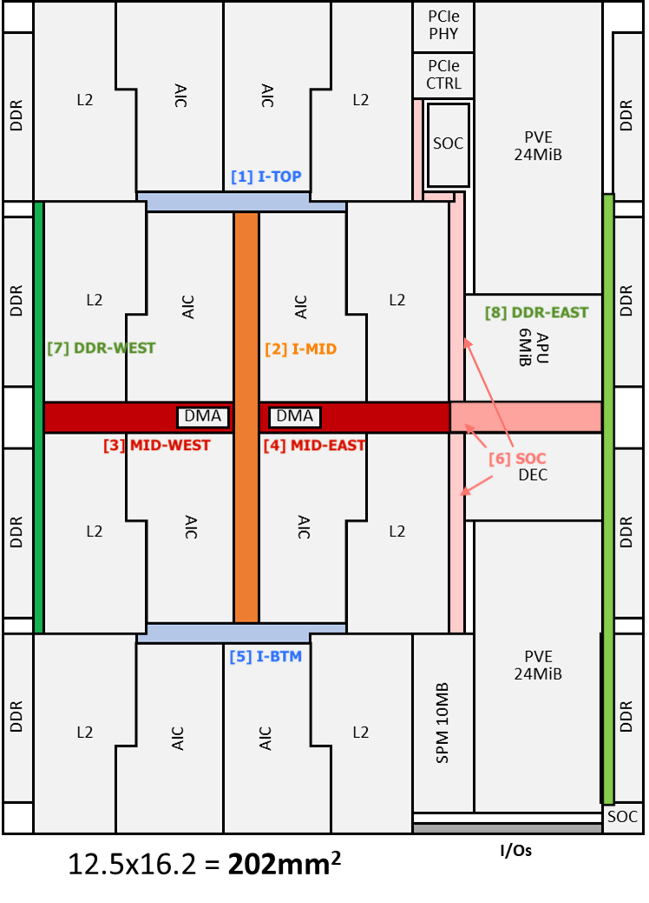

# Network-on-Chip

Ownership [Roel Uytterhoeven](https://axeleraai.atlassian.net/wiki/people/62450375ed4d6b00701328d6?ref=confluence)

This page will gather all the requirements and the architecture for the NoC module.

# Table of contents

- [Network-on-Chip](#network-on-chip)
- [Table of contents](#table-of-contents)
- [Acronyms](#acronyms)
- [Requirements](#requirements)
  - [Additional requirements from other blocks:](#additional-requirements-from-other-blocks)
    - [Decoder](#decoder)
    - [PVE](#pve)
    - [TOKEN (NEEDS UPDATE AFTER TOKEN REVIEW)](#token-needs-update-after-token-review)
- [Block Definition](#block-definition)
  - [Block Description](#block-description)
    - [Different Fabrics/Traffic types](#different-fabricstraffic-types)
    - [Internal Memories](#internal-memories)
    - [Addressing modes](#addressing-modes)
      - [L2 Mapping](#l2-mapping)
      - [LPDDR Mapping](#lpddr-mapping)
    - [Connectivity Matrix](#connectivity-matrix)
    - [Interleaving of Banks (L2 \& DDR)](#interleaving-of-banks-l2--ddr)
    - [QoS](#qos)
    - [Exclusive support](#exclusive-support)
  - [Block Diagram](#block-diagram)
    - [Physical partitions](#physical-partitions)
  - [Block Interfaces](#block-interfaces)
    - [HP Init and Targets](#hp-init-and-targets)
    - [MIX Inits and Targets](#mix-inits-and-targets)
    - [LP Init and Target](#lp-init-and-target)
    - [SYSCFG Inits and Targets](#syscfg-inits-and-targets)
    - [Internal NoC targets](#internal-noc-targets)
- [Description of use-cases](#description-of-use-cases)
  - [Bandwidth and Concurrency Requirements](#bandwidth-and-concurrency-requirements)
    - [Arteris performance simulation.](#arteris-performance-simulation)
    - [HT + MT Traffic Pattern Summary](#ht--mt-traffic-pattern-summary)
      - [AI core side](#ai-core-side)
      - [PVE side](#pve-side)
      - [Visualisation for different Pipelines](#visualisation-for-different-pipelines)
    - [LT Traffic Pattern Summary](#lt-traffic-pattern-summary)
  - [Booting](#booting)
  - [Configuration](#configuration)
    - [Firewall](#firewall)
    - [Tracing](#tracing)
  - [Runtime Interactions](#runtime-interactions)
  - [Power Management](#power-management)
  - [Scenario List](#scenario-list)

# Acronyms

*   HT(F) → High throughput (fabric), a.k.a HP(F) → High Performance (fabric)
    
*   LT(F) → Low throughput (fabric), a.k.a LP(F) → Low Performance (fabric)
    
*   MT(F) → Mixed throughput (fabric)
    
*   SYSCFG → Configuration fabric
    
*   TOK → Token fabric
    
*   PPP → Pre/Post-Processing
    
*   TRC → Tracing
    

# Requirements

Choice of the requirements ID is done based on the following.

| **Requirements** | **ID** |
| --- | --- |
| Related to NoC use cases | NOC\_0xx |
| Related to NoC Module | NOC\_1xx |
| Related to NoC design (FE/PD) | NOC\_2xx |
| Related to NoC PPA | NOC\_3xx |

| **Requirement ID** | **Description** | **Comment** | **Review status** |
| --- | --- | --- | --- |
| NOC\_000 | The NoC connects the protocol interfaces of all toplevel subsystems and blocks according to its connectivity matrix. |     |     |
| NOC\_000A | The connectivity matrix will be mostly fully connected. However, specific links might be removed for various reasons such as deadlock prevention, security, not being relevant,… The exact connectivity is defined by the connectivity matrix document [NoC connectivity sheet](https://axeleraai.sharepoint.com/:x:/r/sites/AXELERAAI-ResearchandDevelopment/_layouts/15/Doc.aspx?sourcedoc=%7B8C2FFF85-C57B-41AB-A951-4CB51E13FA37%7D&file=NoC_connectivity.xlsx&action=default&mobileredirect=true) |     |     |
| NOC\_000B | The NoC inits and targets are categorised in different types, based on interface width and traffic types.  *   High Throughput (HT), AXI 512b, processing data      *   Low Throughput (LT), AXI 64b, ctrl data      *   Mixed Throughput (MT), AXI 128b/256b processing+ctrl data, for interfaces that deal with both processing and ctrl data      *  System Config (SYSCFG), APB 32b, always on connections to configure AO CSR of blocks      *   Token, OCP-Lite interfaces.       The full list of inits and targets is given later in this document. | HT connections are intended to be used for data transfers between memories  LT connections are intended for command and coordination communication between blocks  SYSCFG connections should be always on as they are used to get blocks out of reset or clock gating states. Additionally, they could be used to communicate other block configuration data as well depending on the CSR space attached to the APB port. |     |
| NOC\_000C | The NoC avoids mixing different types of data (i.e. program and data transactions) where possible. Practically this means no mixing on the AIC/L2 side of the die, and controlled mixing on the PPP side of the die. | The APU and DCD implicitly have inits that do both program and data transactions making it impossible to avoid mixing. Further, the LPDDR on the PPP side of the die will need to store both data and program, leading to mixed accesses. |     |
| NOC\_001 | The NoC distributes all data traffic over a high-throughput-fabric (HTF). The HTF guarantees full throughput for traffic scenarios described later in this document. Latency should be minimised, but does not have a specific requirement as long as it does not impede the full throughput requirement. There is no guarantee that endpoints in the same memmap region have exactly the same latency. E.g DDR modules can have different latencies per module. |     |     |
| NOC\_002 | The NOC distributes all control traffic over a low-throughput-fabric (LTF) that only guarantees a limited amount of simultaneous LT traffic. For specific INIT/TARG pairs latency will be optimised.  *   APU (also MIX) ↔︎ SYS-SPM      *   APU (also MIX) ↔︎ LPDDR PPP      *   DCD ↔︎ LPDDR PPP |     |     |
| NOC\_003 | The NoC supports MIX traffic where it is unavoidable that HTF and LTF traffic collide. In these places, specific care will be taken to ensure that both traffic types do not impact each other excessively.  *   HTF performance only degrades with the amount of BW that is taken up by LT transactions on it.      *   LTF latency does not spike because of a single HTF transaction. | SIMULATIONS REQUIRED to check impact on latency of LT transactions when MIX-network is loaded with HT transactions. Specifically DCD has soft realtime constraint. |     |
| NOC\_004 | Tracing (TRC) data enters the NoC through normal LT init ports from blocks that have Siemens tracing infrastructure. In the NoC, this traffic can be separate from other LT traffic to reduce the impact on the LT throughput under tracing conditions. Separation would be done based on destination target since all TRC data needs to be grouped at the SoCMGT block. | SIMULATIONS REQUIRED to check impact of TRC data on NoC performance. |     |
| NOC\_005 | The NoC has an observability network that allows error logging. It raises a single IRQ flag when an error is detected. After which the IRQ handling can read the fault vector and error logger content through the NoC’s internal CSRs | Strategy set by [https://git.axelera.ai/prod/europa/-/issues/558](https://git.axelera.ai/prod/europa/-/issues/558)  1.  Error is detected by an Error Probe      2.  Error information packet is sent to an Internal NoC Observer Target      3.  Observer logs it in CSRs      4.  Observer raises a fault which will be propagated to the IRQ output      5.  SW detects IRQ (or polls CSRs)      6.  SW reads the Error Information      7.  SW clears the Error |     |
| NOC\_005A | The NoC IRQs should be maskable. i.e. SW should be able to configure which IRQ sourceThe NoC IRQs should be maskable. i.e. SW should be able to configure which errors/faults actually lead to the outgoing IRQ flag being raised |     | new |
| NOC\_006 | The NoC supports the following address modes for L2 selectable through its internal CSRs  *   1x8 interleaving (default)      *   2x4 interleaving (top/bottom groups)      *   8x1 (contiguous) | Details on addressing modes further below in this document  Switching address mode is considered a quasi static operation  1x8 is default single L2 cluster  2x4 is dual cluster mode, top/bottom |     |
| NOC\_007 | When interleaving is used for the L2 targets, the NoC supports 3 granularities 4K (default/reset state), 2K and 1K configurable through its internal CSRs. | Different interleaving modes allow the use of different burst length setups. This can help in balancing with MIX traffic type.  Switching interleaving mode is considered a quasi static operation |     |
| NOC\_008 | The NoC supports the following address modes for the LPDDR (MT) targets selectable through the NoC’s internal CSRs  *   2x4 interleaving (default, west/east side groups)      *   4x2 interleaving (west/east split in 2 groups)      *   8x1 (contiguous) | Different modes required for partial population support of LPDDR devices.  Details on addressing modes further below in this document  Switching address mode is considered a quasi static operation |     |
| NOC\_009 | When interleaving is used for the LPDDR targets, the NoC supports 3 granularities 4K (default/reset state), 2K and 1K. These can be configured individually for west and east DDR targets in the NoC’s internal CSRs | Allows for different burst lengths which helps in balancing DCD, PVE, APU and other MIX traffic with HTF.  Switching interleaving mode is considered a quasi static operation |     |
| NOC\_010 | The NoC supports exclusive accesses and locked transactions on memory locations used to store ctrl-data by cpus that use caching.  *   SYS-SPM      *   LPDDR       Support is for all initiators that are driven by a CPU source.  *   LT AI cores      *   LT APU      *   LT PVE | Related implementation issue [https://git.axelera.ai/prod/europa/-/issues/488](https://git.axelera.ai/prod/europa/-/issues/488) |     |
| NOC\_011 | The NoC supports the token network as a mostly standalone network that meets the requirements described in the token manager related requirements below |     |     |
| NOC\_012 | The NoC supports configuring users bits through its internal CSRs for each initiator that encode a priority for that initiator. This priority is used in the LPDDR controller as QoS input to arbitrate between transactions that arrive simultaneously. | Other targets could also use these priority bits if they do an arbitration between transactions. |     |
| NOC\_013 | NoC configuration settings given through its internal CSRs are quasi static. If they are updated while transactions are in flight in the NoC, this can lead to unexpected behaviour. |     |     |
| NOC\_014 | For targets that are not AO targets, the NoC provides fencing capabilities. A fence prohibits transactions from reaching a target when it is not ready to handle transactions. Targets do not see the transaction at all. The fence provides an AXI error response towards the initiator of the transaction. The fence is automatically raised and lowered by the isolation signals coming from the AO CSR of the IP. |     |     |
| NOC\_015 | The NoC’s internal CSRs are reached through an internal NoC target that can be reached from the `APU_LT_INIT` and the `SOC_MGMT_LT_INIT`. |     | new |
| NOC\_100 | The NoC is fully compliant with the ports it is attached to. This means the NoC is compliant with AXI4, APB3, APB4. If specific features are not supported, they need to be explicitly waived. |     |     |
| NOC\_101 | The NoC supports the required protocol settings for each port.  *   max number of outstanding transactions      *   ID width discusssed in [https://git.axelera.ai/prod/europa/-/issues/955](https://git.axelera.ai/prod/europa/-/issues/955#note_209917)      *   exclusive support      *   max burst length      *   FIXED burst support       [https://git.axelera.ai/prod/europa/-/issues/1004](https://git.axelera.ai/prod/europa/-/issues/1004)      *   True full duplex\* | \*By default RD+WR inits of the NoC share the REQ path for RD and WR transaction. A pending request on one, blocks a new request on the other. To avoid this and get ‘true full duplex’ a separate RD init and WR init need to be used in the NoC. In the overview of all inits it is indicated whether they need this or not. |     |
| NOC\_102 | Each initiator in the NoC has a firewall (except for the APU LT, as it needs to unfirewall all others) that needs to be lifted by the APU before it can communicate with Targets. | `APU_LT_INIT` confirmed to do initial config of the firewalls in [https://git.axelera.ai/prod/europa/-/issues/1055](https://git.axelera.ai/prod/europa/-/issues/1055) |     |
| NOC\_103 | Each firewall allows for the following configurations  *   Allow all/no traffic to go through      *   Allow partial access to the address space by defining up to 32 allow-list address regions | This is taken from the Omega setup. Checked with SW that 32 regions suffices for them. |     |
| NOC\_104 | For the PCIE init, the firewall has the “Hide” feature that blocks a transaction but still sends on OKAY response. | This is taken from the Omega setup |     |
| NOC\_105 | All firewall settings are configurable through the NoC’s internal CSRs |     |     |
| NOC\_106 | The NoC subsystem shall have the minimal size required to achieve it’s performance targets. |     |     |
| NOC\_107 | All NoC Initiators and Targets should be properly configure to support the throughput defined in the use-case scenarios below. |     |     |
| NOC\_108 | Any rate-adapting point should be setup such that the full width of the wider link is properly used by buffering the smaller link into wider chunk. Additionally, the smaller link still needs to be able to reach it full throughput. |     |     |
| NOC\_109 | The NoC can be fully configured over its service network using its internal CSRs. Changing these configuration settings should always be done in a quasi static state. There are no functional sideband signals configuring the NoC |     |     |
| ~~NOC\_110~~ | ~~The NoC should allow visibility on Time-Outs to all targets through a (diseablable) watch-dog timer that raises an SoC level interrupt. The timer considers 8K cycles the trigger point.~~ |  Requirement dropped after discussion that having a fixed timout value is not desired, and flexnoc does not allow a programmable one.   |     |
| NOC\_111 | Each NoC partition (see NOC\_207) will be wrapped into an \_p version. The wrapping can include  *   Spill reg on interfaces      *   DFT elements       Depending on the clock division and reset implementation strategy it could include for one or all partitions  *   AO CSRs      *   PPMU       The PPMU is not allowed to permanently gate a NoC partition. All NoC partitions should be always on. |     |     |
| NOC\_112 | ~The clocks used internally in the NoC can be scaled to a lower frequency. The scaling is controlled through the NoC internal CSRs~  The internal NoC elements all run on the same global NoC\_CLK with a max freq of 1.2GHz | In the NoC WG of 25-06-24, a proposal has been made to create a dedicated NoC clock coming out of the SoC-MNGT. The control and scaling of the NoC-CLK would happen in the SoC-MNGT itself allowing the NoC to make abstraction of the scaling requirement |     |
| NOC\_113 | The NIU clocks are synchronous to the clock driving the interface on the connecting IP side. If the IP clock changes, the NIU clock follows automatically. |     |     |
| NOC\_114 | The NoC only supports a single global reset signal that resets all NoC elements driven by the global NoC\_clk. This reset is driven through a dedicated NoC\_rst signal. | The PPMU + CLK div in the SoC-MNGT ensure quasi static deasssertion of the NoC\_rst signal similar to how this is done for other IPs. Further, it has to guarantee that the NoC\_rst is released before other IPs are released out of reset |     |
| NOC\_115 | The NoC should be deadlock free by design provided inits and targets act along their specifications | Added based on comment by Andrew in review meeting. |     |
| NOC\_200 | The LTF (+APU MIX init) is optimized for low-latency core-to-core communication, low-latency polling and as-fast-as-possible cache refilling. | Path between APU and SPM is likely the most latency sensitive of the LTF network.  For the APU also the MIX init should be considered latency critical. |     |
| NOC\_201 | The HTF is optimized for high-throughput core-to-memory, and dma-to-memory transfers. The scenarios described later in this document should be met. |     |     |
| NOC\_202 | The NoC subsystem shall provide an DCD/SLV error when the access doesn’t map to a valid memory region. |     |     |
| NOC\_203 | The NoC shall operate at 1.2GHz internally. However, when an IP operates at a different frequency, the NoC shall adapt the frequency of the connecting NIU to match the IP’s frequency. |     |     |
| NOC\_205 | Traffic traversing from LTF to HTF shall pass through a rate-adapting buffer at full throughput regardless of burst-size (within the 4KiB axi limitation). | The exact cross points between HTF and LTF can be found in the envisioned topology and might/should be changed depending on implementation and simulation findings. |     |
| NOC\_206 | The NoC shall contain memory macro’s for rate-adapter and store-n-forward buffers, while being able to meet timing at 1.2GHz. |     |     |
| NOC\_207 | The NoC design is modular, built out of multiple building blocks containing a maximum equivalent of roughly a 5x5 HTF crossbar to ensure PD feasibility. |     |     |
| NOC\_208 | The NoC design is split into multiple partitions that will be hardened separately by the PD team. The division of noc element/modules over the partitions is outside the scope of the arch requirements and should be driven by PD. | The partitioning of the NoC is detailed in [https://git.axelera.ai/prod/europa/-/issues/382#note\_193596](https://git.axelera.ai/prod/europa/-/issues/382#note_193596). This is briefly described below as well. |     |
| NOC\_208 | The NoC can contain multiple clock domains to allow for flexibility in the PD of the clocking infrastructure. The clock speeds will have to match speeds that guarantee the 100% throughput requirement on HTF links. Generally, this means 1.2GHz is required. Towards DDR targets, a slower speed of 800 MHz can be considered. The exact boundary between both speeds depends on the topology chosen during implementation. For PCIE which runs at 600 MHz the same reasoning applies. | On top of the naturally emerging clock domains based on init/targ operating frequency, additional clock domains can be created to ease skew requirements for physical design. Those do come at a cost of 6 cycles RTT latency and are thus not for free. |     |
| NOC\_209 | The NoC is synchronously connected to all IPs. |     |     |
| NOC\_300 | On the LTF latency is optimised. Specifically between  *   LT APU → SYS-SPM      *   LT APU → SDMA (ctrl)      *   LT APU → LPDDR (east)      *   DCD → SYS-SPM      *   DCD → LPDDR (east) |     |     |
| NOC\_301 | When there is no congestion on the LTF, BW is limited by the init/target, not the NoC |     |     |
| NOC\_302 | On the HTF, first the concurrent throughput requirements must be met, next latency can be optimised. | The round trip latency can have an impact on throughput if buffers do not have sufficient space. |     |
| NOC\_303 | Within a simultaneous traffic scenario, the BW of a transaction is limited by init/target, not by the NoC |     |     |
| NOC\_304 | The NoC (or parts of it) shall be clock gated when not in use. | Arteris automatic clock gating can be used for this. |     |
| NOC\_305 | The NoC memories shall be repairable, both at test-time and in-field by an on-chip controller. |     |     |
| NOC\_306 | The NoC memories shall not be ECC protected |     |     |
| NOC\_307 | The NoC shall have as low as possible power consumption.  Idle sections will only have leakage power consumption. (Arteris clocking inherently provides decent automatic modular clock gating) |     |     |
|     |     |     |     |

## Additional requirements from other blocks:

### Decoder

| **ID** | **Description** | **Comment** | **Review status** |
| --- | --- | --- | --- |
| DCD\_200 | The Decoder’s AXI masters need high-throughput access to DDR and L2 memories, with at least 32 outstanding transactions per master | On the order of 10GB/s in total   added by smach 2024-01-12 | |
| DCD\_201 | The Decoder’s APB slave must be accessible from the APU | added by smach 2024-01-12 |  |
| DCD\_204 | The Decoder’s MCU AXI master needs access to DDR and L2 memories | Probably via LTF, for accessing code & data in a defined block of memory    added by smach 2024-01-31 |  |
| DCD\_205 | AXI requests initiated by the `DCD_DEC_INIT_X_MT` or the `DCD_PPROC_INIT_MT` towards `LPDDR_PPP_X_TARG_MT` need to be serviced within 500 cycles of this interface (i.e. 500 cycles at 600MHz) | Detailed performance requirements pending final IP delivery    added by smach 2024-02-01 |  |

### PVE

| **ID** | **Description** | **Comment** | **Review status** |
| --- | --- | --- | --- |
| PVE\_200 | ~The NoC shall provide connectivity from PVE’s HTF Port initiator port to its LTF subordinate port.~ | added by zarubaf 15 Apr 2024  Decided during review meeting that this requirement would be dropped and the loopback will be placed inside the PVE itself to avoid any deadlock possibility on the NoC itself. |  |
| PVE\_201 | The PVE NoC initiator ports shall have Firewalls in place. | added by zarubaf 15 Apr 2024 |  |

### TOKEN (NEEDS UPDATE AFTER TOKEN REVIEW)

| **ID** | **Description** | **Comment** | **Review status** |
| --- | --- | --- | --- |
| TOK\_MGR\_105 | The Europa token manager shall have 10 OCP-LITE slave interfaces to receive the token information from each initiator source ( 8xAICOREs and 2 SDMAs). | Added by Roel from [TOP TOKEN NETWORK](https://axeleraai.atlassian.net/wiki/spaces/archrd/pages/439288007/TOP+TOKEN+NETWORK) on 2024-6-12 |     |
| TOK\_MGR\_106 | The Europa token manager shall have 10 OCP-LITE master interfaces to produce the token information from each initiator source ( 8xAICOREs and 2 SDMAs). | Added by Roel from [TOP TOKEN NETWORK](https://axeleraai.atlassian.net/wiki/spaces/archrd/pages/439288007/TOP+TOKEN+NETWORK) on 2024-6-12 |     |
| TOK\_MGR\_107 | The token network interconnect in the NoC shall be using the OCP-Lite interface which is composed by the following signals. Each signal of the protocol shall be mapped to indicate the producer or consumer information.  1.  `MAddr`: 8b (to indicate Consumer Target)      2.  `MCmd`: 1b (valid)      3.  `SCmdAccept`: 1b (ready)      4.  `MData`: 8b (to indicate Producer Originator       The response bus will not be used as all Writes shall be treated as posted. | Added by Roel from [TOP TOKEN NETWORK](https://axeleraai.atlassian.net/wiki/spaces/archrd/pages/439288007/TOP+TOKEN+NETWORK) on 2024-6-12 |     |
| TOK\_MGR\_108 | All tokens shall be treated as posted write. If an error response occurs the NoC shall raise an IRQ. | SW can then read NoC CSRs and identify the Error.   Added by Roel from [TOP TOKEN NETWORK](https://axeleraai.atlassian.net/wiki/spaces/archrd/pages/439288007/TOP+TOKEN+NETWORK) on 2024-6-12 |     |

# Block Definition

## Block Description

The NoC ensures the communication required between different blocks on the chip. It provides master interfaces for all traffic initiators, for short *inits*, and it provides slave interfaces for all traffic targets, or just *targets.* In general all inits should be able to reach all targets, but not all possible combinations should be supported at full throughput. I.e., only for specific scenarios the full throughput of simultaneously active inits and targets links should be achieved. [NoC Specifications Europa](https://axeleraai.atlassian.net/wiki/spaces/archrd/pages/364675080/NoC+Specifications+Europa) describes these scenarios.

Inits and targets can generally be divided in two categories, high throughput data interfaces, or low throughput control flow interfaces. The former have most of the BW constraints and are less latency sensitive. The latter, has little to no BW constraints but is expected to be latency sensitive as large delays on distributing commands through the system might limit performance. Since the traffic patterns of both categories differ significantly (continious long bursts versus sporadic short messages), the choice is made to separate the traffic flow as much as possible. This results in a High Throughput Fabric (HTF), and a Low Latency Fabric (LTF).

### Different Fabrics/Traffic types

### Internal Memories

<List all internal memories>

Will depend on implementation details. Memory macros will be used where large buffers are required. It is expected that these will be 4K or 2K SRAM/REG-file macros.

### Addressing modes

The address map is fully contiguously stacked, **except from:**

*   The 8 L2\_X modules which can be either interleaved in on large region of 8 modules, or two regions of 4 modules, or can be stacked contiguously
    
*   The 4 GRAPH(WEST) LPDDR modules, which can be either interleaved in either on large region of 4 modules, or two regions of 2 modules, or can be stacked contiguously
    
*   The 4 PPP(EAST) LPDDR modules, which can be either interleaved in either on large region of 4 modules, or two regions of 2 modules, or can be stacked contiguously
    

This modes can be switched through NoC CSRs. There will be a CSR to control the L2, the LPDDR WEST and the LPDDR EAST addressing modes. When the mode is switched, SW should make sure the NoC is idle. If any transactions are still in flight when this setting is changed, there does not have to be a guarantee the system remains stable. This is intended to be a quasi static setting.

With SW it has been aligned that the address mode will be selected during boot, or be changed at a point where the affected memories no longer have valuable content. Details in [https://git.axelera.ai/prod/europa/-/issues/1058](https://git.axelera.ai/prod/europa/-/issues/1058)

#### L2 Mapping

#### LPDDR Mapping

### Connectivity Matrix

[Connectivity Matrix Document XLS](https://axeleraai.sharepoint.com/:x:/r/sites/AXELERAAI-ResearchandDevelopment/_layouts/15/Doc.aspx?sourcedoc=%7B8C2FFF85-C57B-41AB-A951-4CB51E13FA37%7D&file=NoC_connectivity.xlsx&action=default&mobileredirect=true)

[Markdown extraction](connectivity.md)

### Interleaving of Banks (L2 & DDR)

For targets that are interleaved. The default interleaving granularity is 4K. Further 2K and 1K are supported as well. The interleaving granularity can be configured for L2, LPDDR WEST, and LPDDR EAST individually through CSRs

### QoS

The NoC itself does not have an internal QoS mechanism. NoC Initiators do not use the AXI QoS signals

Yet, the NoC allows to configure a quasi static QoS setting for each initiator through CSR settings. These QoS settings are *not used inside the NoC itself*, but arrive as AXI-user signals on the target side. There, they can be used to drive the AXI QoS signals of the target. This allows to give different initiators different priorities when handled by a slow responding target.

Not on all target these user signals are exposed. For now only the LPDDR targets used them.

### Exclusive support

The CPU type initiators in the design require exclusive accesses to locations where program data will be stored. The tables below list all inits and targets for which this applies.

| **Initiators with Exclusive support** |
| --- |
| AIC\_X\_INIT\_LT |
| PVE\_X\_INIT\_LT |
| APU\_INIT\_LT |

| **Targets with Exclusive support** |
| --- |
| LPDDR\_GRAPH\_X\_TARG\_HT |
| LPDDR\_PPP\_X\_TARG\_MT |
| SYSSPM\_TARG\_LT |

## Block Diagram

The diagram below contains a tab for each of the different topologies (HTF, LTF, MIX, TOK).

### Physical partitions

The NoC is divided in x physical partitions to deal with its size in the physical design tools. Partitions are

1.  I-Shape Top
    
2.  I-Shape Middle
    
3.  Mid-West
    
4.  Mid-East
    
5.  I-Shape Bottom
    
6.  SoC
    
7.  DDR-West
    
8.  DDR-East
    

## Block Interfaces

ID width values taken from [https://git.axelera.ai/prod/europa/-/issues/955](https://git.axelera.ai/prod/europa/-/issues/955)

### HP Init and Targets

Handle stream data transactions. Typically large burst of 4KiB.

|     | **Protocol** | **Init/Target** | **Data Width** | **Address Width** | **ID Width** | **Number of outstanding** | **Frequency (GHz)** | **Duplex** | **Instances** | **Max BW** | **Specific features** |
| --- | --- | --- | --- | --- | --- | --- | --- | --- | --- | --- | --- |
| **AIC\_X\_INIT\_HT** | AXI4 | Initiator | 512 | 40  | 9   | 512 | 1.2 | Full | 8   | RD: 76.8GB/s  WR: 76.8GB/s |     |
| **SDMA\_X\_INIT\_Y\_HT** | AXI4 | Initiator | 512 | 40  | 8   | 256 | 1.2 | Full | 4   | RD: 76.8GB/s  WR: 76.8GB/s |     |
| **PVE\_X\_INIT\_HT** | AXI4 | Initiator | 512 | 40  | 8   | 256 | 1.2 | Full | 2   | RD: 76.8GB/s  WR: 76.8GB/s |     |
| **L2\_X\_TARG\_HT** | AXI4 | Target | 512 | 40  | 4   | 16  | 1.2 | Full | 8   | RD: 76.8GB/s  WR: 76.8GB/s |     |
| **LPDDR\_GRAPH\_X\_TARG\_HT** | AXI4 | Target | 256 | 33  | 8   | 256 | 0.8 | Half | 4   | RD/WR: 25.6GB/s | Inline ECC, exclusive support, QoS via user signals |

### MIX Inits and Targets

Inits and targets where stream data and ctrl data collide. Both short control transactions and long processing transactions can be expected. Potentially, the former needs to get some form of priority over the latter to ensure control transactions do not get severe latency penalties by waiting for long transactions to finish. <This needs some experimenting with different traffic scenarios in the arteris tool>

|     | **Protocol** | **Init/Target** | **Data Width** | **Address Width** | **ID Width** | **Number of outstanding** | **Frequency (GHz)** | **Duplex** | **Instances** | **Max BW** | **Specific features** |
| --- | --- | --- | --- | --- | --- | --- | --- | --- | --- | --- | --- |
| **DCD\_DEC\_INIT\_X\_MT** | AXI4 | Initiator | 128 | 40  | 5   | 32  | 0.6 | **Full** | 4   | RD: 12.8GB/s  WR: 12.8GB/s | 32 outstanding transactions, max 500 cycles latency per request, exclusive support? |
| **DCD\_PPROC\_INIT\_X\_MT** | AXI4 | Initiator | 128 | 40  | 5   | 32  | 0.6 | **Full** | 4   | RD: 12.8GB/s  WR: 12.8GB/s | 32 outstanding transactions, max 500 cycles latency per request, exclusive support? |
| **APU\_INIT\_MT** | AXI4 | Initiator | 256 | 40  | 8   | 256 | 1.2 | Half | 1   | RD/RW: 38.4GB/s | FIXED burst |
| **PCIE\_INIT\_MT** | AXI4 | Initiator | 128 | 40  | 7   | 128 | 0.8? | Full | 1   | RD: 12.8GB/s  WR: 12.8GB/s | Firewall needs hide feature |
| **LPDDR\_PPP\_X\_TARG\_MT** | AXI4 | Target | 256 | 33  | 8   | 256 | 0.8 | Half | 4   | RD/WR: 25.6GB/s | Inline ECC, exclusive support, QoS on user signals |
| **PCIE\_TARG\_MT** | AXI4 | Target | 128 | 40  | 6   | 64  | 0.8 | Full | 1   | RD: 12.8GB/s  WR: 12.8GB/s |     |

### LP Init and Target

Handle control data transactions. For PCIE and LPDDR, this includes interfaces labeled as (CFG). These serve as configuration interfaces for the IP and should not see active traffic when running a context. They can see active traffic when switching context at runtime.

|     | **Protocol** | **Init/Target** | **Data Width** | **Address Width** | **ID Width** | **Number of outstanding** | **Frequency (GHz)** | **Duplex** | **Instances** | **Max BW** | **Specific features** |
| --- | --- | --- | --- | --- | --- | --- | --- | --- | --- | --- | --- |
| **AIC\_X\_INIT\_LT** | AXI4 | Initiator | 64  | 40  | 9   | 512 | 1.2 | Half | 8   | RD/RW: 9.6GB/s | Exclusives, FIXED burst |
| **PVE\_X\_INIT\_LT** | AXI4 | Initiator | 64  | 40  | 8   | 256 | 1.2 | **Full** | 2   | RD: 9.6GB/s  RW: 9.6GB/s | Exclusives |
| **APU\_INIT\_LT** | AXI4 | Initiator | 64  | 40  | 7   | 128 | 1.2 | Half | 1   | RD/RW: 9.6GB/s | Exclusives |
| **DCD\_MCU\_INIT\_LT** | AXI4 | Initiator | 64  | 40  | 5   | 32  | 1.2 | Half | 1   | RD/RW: 9.6GB/s | |
| **SDMA\_X\_INIT\_LT** | AXI4 | Initiator | 64  | 40  | 4   | 16  | 1.2 | Half | 1   | RD/RW: 9.6GB/s | only used for tracing data |
| **SOC\_MGMT\_INIT\_LT** | AXI4 | Initiator | 64  | 40  | 4   | 16  | 1.2 | Half | 1   | RD/RW: 9.6GB/s |     |
| **SOC\_IO\_INIT\_LT** | AXI4 | Initiator | 64  | 40  | 4   | 16  | 1.2 | Half | 1   | RD/RW: 9.6GB/s |     |
| **SDMA\_X\_TARG\_LT** | AXI4 | Target | 64  | 40  | 4   | 16  | 1.2 | Half | 2   | RD/RW: 9.6GB/s |     |
| **AIC\_X\_TARG\_LT** | AXI4 | Target | 64  | 40  | 6   | 64  | 1.2 | Half | 8   | RD/RW: 9.6GB/s |     |
| **PVE\_X\_TARG\_LT** | AXI4 | Target | 64  | 40  | 8   | 256 | 1.2 | Half | 2   | RD/RW: 9.6GB/s |     |
| **APU\_TARG\_LT** | AXI4 | Target | 64  | 40  | 9   | 512 | 1.2 | Half | 1   | RD/RW: 9.6GB/s |     |
| **SYSSPM\_TARG\_LT** | AXI4 | Target | 64  | 40  | 4   | 16  | 1.2 | Half | 1   | RD/RW: 9.6GB/s |     |
| **SOC\_IO\_TARG\_LT** | AXI4 | Target | 64  | 40  | 4   | 16  | 1.2 | Half | 1   | RD/RW: 9.6GB/s |     |
| **SOC\_MGMT\_TARG\_LT** | AXI4 | Target | 64  | 40  | 4   | 16  | 1.2 | Half | 1   | RD/RW: 9.6GB/s |     |
| **LPDDR\_GRAPH\_X\_TARG\_CFG** | APB | Target | 32  | 40  | NA  | NA  | 0.8 | Half | 4   | RD/RW: 3.2GB/s |     |
| **LPDDR\_PPP\_X\_TARG\_CFG** | APB | Target | 32  | 40  | NA  | NA  | 0.8 | Half | 4   | RD/RW: 3.2GB/s |     |
| **PCIE\_TARG\_CFG** | APB | Target | 32  | 40  | NA  | NA  | 0.8 | Half | 4   | RD/RW: 3.2GB/s |     |
| **PCIE\_TARG\_CFG_DBI** | AXI | Target | 32  | 40  | 4  | 16  | 0.8 | Half | 4   | RD/RW: 3.2GB/s |     |
| **DCD\_TARG\_CFG** | APB | Target | 32  | 40  | NA  | NA  | 0.6 | Half | 1   | RD/RW: 2.4GB/s |     |

### SYSCFG Inits and Targets

These interfaces handle setting of quasi static configuration before starting a program. Requirement for BW and latency are low, can be optimised to be light weight. The SYSCFG targets are normally accessed from the LT inits (specifically the SoCMNGT one). The SYSCFG targets are always on as they control power settings for the IPs. Frequency set at 20 MHz.

|     | **Protocol** | **Init/Target** | **Data Width** | **Address Width** | **ID Width** | **Number of outstanding** | **Frequency (GHz)** | **Duplex** | **Instances** | **Max BW** | **Specific features** |
| --- | --- | --- | --- | --- | --- | --- | --- | --- | --- | --- | --- |
| **AIC\_X\_TARG\_SYSCFG** | APB | Target | 32  | 40  | NA  | NA  | 0.05 | Half | 8   | RD/RW: 200MB/s | Always on |
| **L2\_X\_TARG\_SYSCFG** | APB | Target | 32  | 40  | NA  | NA  | 0.05 | Half | 8   | RD/RW: 200MB/s | Always on |
| **SYSSPM\_TARG\_SYSCFG** | APB | Target | 32  | 40  | NA  | NA  | 0.05 | Half | 1   | RD/RW: 200MB/s | Always on |
| **APU\_TARG\_SYSCFG** | APB | Target | 32  | 40  | NA  | NA  | 0.05 | Half | 1   | RD/RW: 200MB/s | Always on |
| **PVE\_X\_TARG\_SYSCFG** | APB | Target | 32  | 40  | NA  | NA  | 0.05 | Half | 2   | RD/RW: 200MB/s | Always on |
| **DCD\_TARG\_SYSCFG** | APB | Target | 32  | 40  | NA  | NA  | 0.05 | Half | 1   | RD/RW: 200MB/s | Always on |
| **LPDDR\_GRAPH\_X\_TARG\_SYSCFG** | APB | Target | 32  | 40  | NA  | NA  | 0.05 | Half | 4   | RD/RW: 200MB/s | Always on |
| **LPDDR\_PPP\_X\_TARG\_SYSCFG** | APB | Target | 32  | 40  | NA  | NA  | 0.05 | Half | 4   | RD/RW: 200MB/s | Always on |
| **PCIE\_TARG\_SYSCFG** | APB | Target | 32  | 40  | NA  | NA  | 0.05 | Half | 1   | RD/RW: 200MB/s | Always on |
| **SOC\_MGMT\_TARG\_SYSCFG** | APB | Target | 32  | 40  | NA  | NA  | 0.05 | Half | 1   | RD/RW: 200MB/s | Always on |
| **SOC\_IO\_TARG\_SYSCFG** | APB | Target | 32  | 40  | NA  | NA  | 0.05 | Half | 1   | RD/RW: 200MB/s | Always on |
| **WEST\_CLKGEN\_TARG\_SYSCFG** | APB | Target | 32  | 40  | NA  | NA  | 0.05 | Half | 1   | RD/RW: 200MB/s | Always on |

### Internal NoC targets

These targets handle internal NoC configuration settings. They do not have an interface towards the outside world, yet they can be reached from initiators that have a connection to them defined in the connectivity matrix.

|     | **Protocol** | **Init/Target** | **Data Width** | **Address Width** | **ID Width** | **Number of outstanding** | **Frequency (GHz)** | **Duplex** | **Instances** | **Max BW** | **Specific features** |
| --- | --- | --- | --- | --- | --- | --- | --- | --- | --- | --- | --- |
| **NOC\_CSR\_TARG\_INT** | INT | Target | ?   | 40  | NA  | NA  | 1.2 | Half | 1   | ?   | Always on |

# Description of use-cases

## Bandwidth and Concurrency Requirements

> [!INFO]
> As a design guideline, Bandwidth should only be limited by the Target and Initiator IPs, not by the link in the NoC. However, if other links are active simultaneously, these might lower the available BW → the BW requirement depends on the traffic scenario.

4 Types of scenarios are considered

*   `unit`: unit-transactions. A single initiator accesses a single target (in case of interleaving, a single target is considered the interleaved banks as a whole, the initiator will thus alternate between the different interleaved banks). The `unit` scenarios are the building blocks for all other scenarios, they set the (uncongested) BW limit between an initiator and target.
    
*   `base` : single initiator type transactions towards multiple target types. A combination of multiple `unit` scenarios that all use the same initiator type (e.g. 4 AICs write to L2)
    
*   `composite`: representations of a (part of a) `pipeline` as defined in [Europa Technical Pipeline Requirements](https://axeleraai.atlassian.net/wiki/spaces/archrd/pages/321355886/Europa+Technical+Pipeline+Requirements). Multiple initiator types but still the same traffic type (i.e. all HTF/MIX, or all LTF) combined with multiple target types of the same traffic type. The `composite` requirements illustrate which datastreams will be simultaneously active, and sets performance targets under heavily congested scenarios for HT/MIX and LT traffic.
    
*   `advanced` : considers the impact of LT traffic on HT traffic in the MIX part of the network → check that transactions do not tank otherwise met `composite` scenarios.
    

The overview of these scenarios is given in the tables at the bottom of this page. They are also used in the Arteris performance simulations discussed next.

### Arteris performance simulation.

The arteris tool provides the ability to setup performance analysis. The traffic scenarios detailed further below will be used to setup critical performance simulations. It should provide closure/confidence on

*   Interleaving/addressing modes
    
*   Number of outstanding transactions
    
*   Rate adapting
    
*   Buffering in the NoC
    
*   NoC topology in general
    

### HT + MT Traffic Pattern Summary

> [!WARNING]
> The section provides an overview of the most important/demanding simultaneous traffic requirements. **It is not meant to be an exhaustive list** (for this the scenario list exists), rather it serves to get a quick understanding of the required simultaneous BW requirements.

For each scenario, the NoC should allow all active initiators/target pairs to operate at 100% throughput unless otherwise indicated. If init/target pairs are both full duplex, scenarios should be considered doing both read and write at the same time between the pairs.

#### AI core side

*   8 AICs → L2
    
*   8 AICs + 2 SDMA → L2 (80% init BW)
    
*   6 AICs + 2 SDMA → L2 & 2 DMA → LPDDR GRAPH
    
*   8 AICS → L2 & 2SDMA → LPDDR GRAPH & 2DMA → LPDDR PPP
    
*   1 AIC + 1 DMA → LPDDR GRAPH & 7 AIC + 1 DMA → L2
    
*   2 AICs (but not neighbours) → LPDDR GRAPH
    
*   1 SDMA → LPDDR GRAPH & 1 SDMA → LPDDR GRAPH & 2 SDMA → L2 & 6 AIC → L2
    
*   1 SDMA → LPDDR GRAPH & 1 SDMA → LPDDR GRAPH & 2 SDMA → L2 & 8 AIC → L2 (80% AIC&SDMA BW)
    

#### PVE side

*   PVE + DCD → LPDDR PPP
    
*   2xPVE → LPDDR PPP
    
*   PVE/DCD → L2 & 8 AIC → L2 (89% init BW)
    
*   PCIE → LPDDR PPP/GRAPH/L2
    
*   PCIE + DCD + PVE → LPDDR PPP
    
*   PCIE + DCD → LPDDR GRAPH
    
*   PCIE + DCD → L2
    
*   PVE/DCD → LPDDR GRAPH & PVE/DCD → LPDDR PPP
    

#### Visualisation for different Pipelines

The figure below contains several tabs. Each tab highlights different traffic scenarios associated with different pipeline stages. Note that this figure is no longer up to date with the latest floorplan and topology status, but it still provides the correct overview of which blocks are active in which pipeline at the same time.

### LT Traffic Pattern Summary

If only a single LTF init/target pair is active, the link should be able to reach 100% of the min BW of the pair. As soon as multiple transactions take place together, 100% throughput is no longer required.

## Booting

<If the block contains one or multiple cores, describe how they are booted>

On boot the NoC should reset to a default configuration that puts the addressing modes for LPDDR and L2 in their default mode. Further upon reset, all target fences should be raised to avoid any attempts to reach blocks that have not come out of reset.

## Configuration

<Describe how the block is configured (both local CSR’s and toplevel Sideband)>

The NoC will control its own status registers through an internal target interface. The LP APU init and LT SoCMGMT init have access to this target.

The exact status registers depend on implementation details.

### Firewall

Each NoC initiator except the APU LT one has a firewall that by default blocks access to any address. After a reset, the APU LT init has to configure the firewalls for each block that needs access to the NoC address space.

Firewalls can be either completely on/off, or allow for 32 programmable ranges to which access is enabled while blocking access to anything outside the programmed ranges. This behaviour is identical to Omega, except the number of regions is increased from 16 to 32.

At startup, all firewalls should be raised as a reset condition. The APU (which does not have one), is responsible for managing the firewall settings of other inits as it has the highest privilege level in the system.

Firewalls operate individually on read/write paths. Meaning that an initiator can be allowed read access to a specific region, but not write access, or the other way around. Both read and write is of course also possible. Details discussed [here](https://git.axelera.ai/prod/europa/-/work_items/1242#note_262714).

For their decision, firewalls will only look at the read/write address of a transaction and not the privilege level encoded in the AXPROT. This has been discussed [here](https://git.axelera.ai/prod/europa/-/work_items/1242#note_254201).

For further details on the firewalls, and how they are intended to be used, please refer to the [security spec doc](https://axeleraai.atlassian.net/wiki/spaces/Silicon/pages/712769542/EUROPA+System+Security+Requirements)

### Tracing

Tracing will be implemented using Siemens/Tessent monitors on all interfaces of the NoC. The tracing data created by these monitors will be communicated over the NoC to shared memories where the Siemens/Tessent debugger can pick it up. This will be implemented in such a way as to minimise the interference of this tracing data with normal NoC traffic.

## Runtime Interactions

<Describe interactions with the (APU,RISC-V,Host) processors in the system, or other system masters>

The NoC interacts with nearly all systems in the design. For details on these interactions consult the traffic scenario tables below.

## Power Management

<Describe the used clock-gating mechanisms and how they are controlled>

The NoC runs at the max/default 1.2GHz chip-level clock. Where required it adapts its frequency to match that of its inits/targets at their interfaces.

The NoC supports clock gating of sections that are not in use. E.g. an endpoint that interfaces with a block that is idle (and also clock gated) should result in maximally clock gating the link towards that endpoint as well. Further, if several targets or initiators are idle/off, the NoC should be able to clock gate crossbars that have now become redundant. This clock gating will be added by the NoC tooling, it remains to be seen to what extend the chosen tool is able to do this.

## Scenario List

> [!WARNING]
> Scenario lists are still work in progress.

[Unit Scenarios](unit_scenarios.md)

[Base Scenarios](base_scenarios.md)

[Composite Scenarios](composite_scenarios.md)

[Advanced Scenarios](advanced_scenarios.md)

[Pipeline Scenarios](pipeline_scenarios.md)
