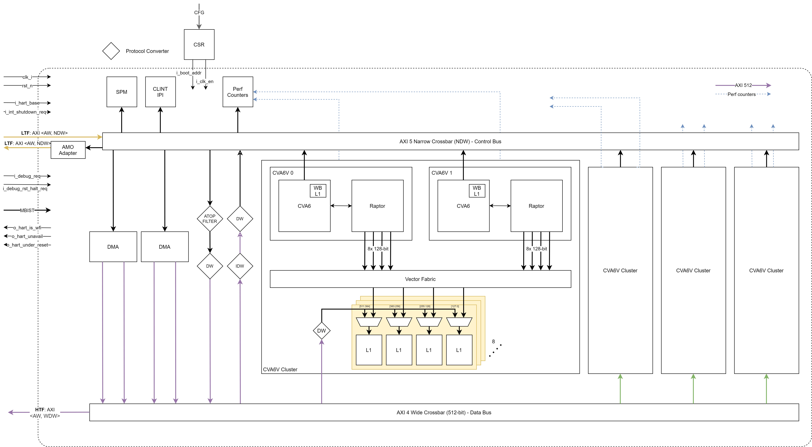
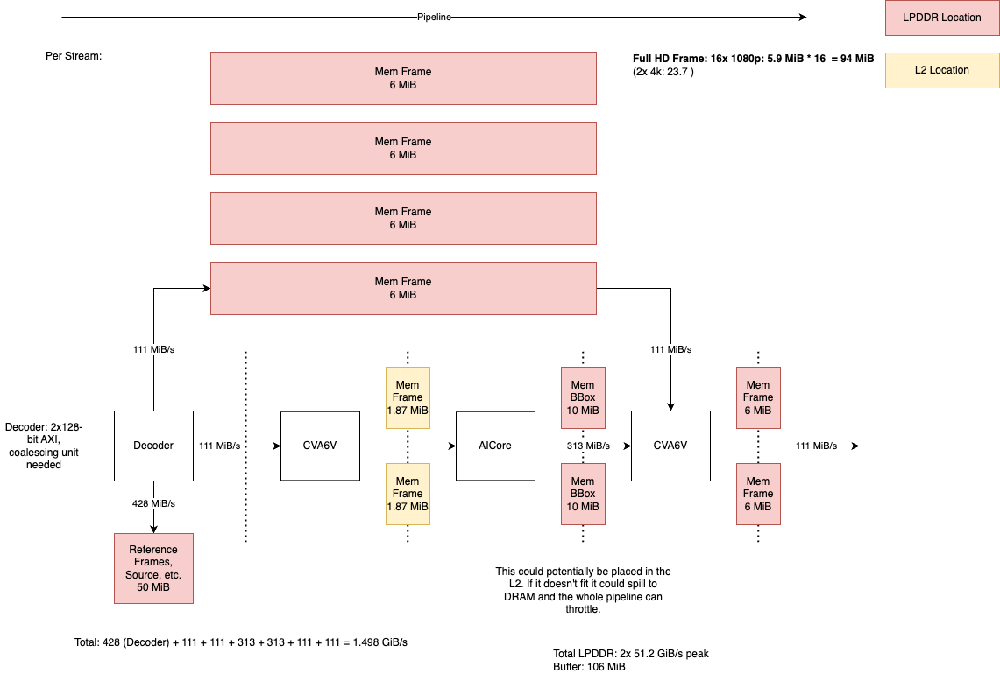

# PVE - Programmable Vector Engine

This page gathers all the requirements and the architecture for the PVE block and its integration into the Europa system.

## Acronyms

| Acronym | Description                                                                                                                                                                                                                                                                                                               |
| ------- | ------------------------------------------------------------------------------------------------------------------------------------------------------------------------------------------------------------------------------------------------------------------------------------------------------------------------- |
| HART    | RISC-V Hardware Thread                                                                                                                                                                                                                                                                                                    |
| LR/SC   | Load-reserved, store-conditional                                                                                                                                                                                                                                                                                          |
| PMP     | Physical Memory Protection, defined in the RISC-V standard those are means of providing address base and bound checks and whether the given hart can access the memory location. This applies for Supervisor and Usermode, certain PMPs can also be configured to provide isolation for lower-level (Firmware) processes. |
| VM      | Virtual Memory, page-based virtual memory as defined by the RISC-V standard.                                                                                                                                                                                                                                              |
| CSR     | Control and Status Register                                                                                                                                                                                                                                                                                               |
| PVT     | Process, voltage, temperature                                                                                                                                                                                                                                                                                             |

## Requirements

## Architectural Requirements

| Requirement ID        | Criticality | Owner | Description |
|-----------------------|-------------|-------|-------------|






| {{ id }} | {{ criticality_style }} | {{ requirement.owner }} | {{ requirement.description }} |


## Block Definition

### Block Parameters

| Parameter        | Concrete Value | Description                                                                                                                                   |
| ---------------- | -------------- | --------------------------------------------------------------------------------------------------------------------------------------------- |
| `N`              | `2`            | Number of RISC-V (CVA6V) cores within one PVE cluster. The upper bound of cores is based on the crossbar logic both on AXI and Vector fabric. |
| Nr. Clusters     | `4`            |                                                                                                                                               |
| `WDW`            | `512`          | Wide AXI data width.                                                                                                                          |
| `NDW`            | `64`           | Narrow data width for CVA6 cacheline re-fills. Support for AXI5 atop signal.                                                                  |
| `DLEN`           | `1024`         | Datapath length of the vector core.                                                                                                           |
| `VW`             | `128`          | Data width of the vector plugs.                                                                                                               |
| Nr. Vector Ports | `8`            | Number of ports into the vector fabric, per core.                                                                                             |
| L1 Size          | 4 MiB          | L1 Size per cluster.                                                                                                                          |

### Block Description

The PVE (Programmable Vector/Vision Engine) is the HW engine that drives pre-,
mid- (between two NNs), and post-processing that are typically found in
full-stack applications (see
[PE-BENCH-P1](https://axeleraai.atlassian.net/wiki/spaces/archrd/pages/386138230/PVE+Benchmark+Kernels#Pipeline-1-(P1)%3A-16x-NV12-1920x1080p-%40-30FPS-Yolov5s-Image-Segmentation)
for an example of a detailed pipeline).

The (pre-processing) PVE unit loads (parts) of the uncompressed image from DDR
memory via its DMA engine into its local L1 SPM or cache. Performs the
pre-processing “fused” kernel and writes back the fully processed frame into
DDR.

> Assumptions being made:
> - Traffic is always full-frame to and from the PVE unit. The assumption is
>   based on the fact that the overall pipeline coordination is done by
>   gstreamer plugins, which by default syncs on full frames.
> - For the full throughput benchmarking application (PVE-BENCH-P1) we are
>   assuming fused kernels.
> - Traffic is assumed to be DDR ↔︎ PVE L1.
> - We need similar or greater bandwidth into L2.

The kernel code (instructions) is supposed to live within DDR memory space or a
dedicated scratchpad memory within the PVE block. The SPM is fully ECC-protected
and cached. SPM can be preloaded via the low bandwidth NoC. The SYS-SPM can be
used for synchronisation with the AI cores.

The PVE synchronizes with the overall APU control via shared memory per frame.
Frame synchronization is managed by the APU SW (i.e., via gstreamer plugins).
Inter-processor interrupts (also known as SW interrupts) can be triggered via
memory-mapped reads/writes to the CLINT (Core-local interrupt controller).

Intra-PVE synchronization should happen via atomic memory operations on any
memory-mapped region. Only accesses to the Sys SPM are resolved on an SoC global
basis and used for synchronization with other units.

L1 scratchpad memory is being used for storing image data and operating
efficiently on it with the vector units.

The platform timer module should provide a global time-base. Memory-mapped
accesses from the firmware can be used to obtain such a timebase. Furthermore,
timer interrupts can be scheduled. There is an open ticket with firmware
regarding the overall organization of RISC-V cores within the system
(https://github.com/axelera-ai/device.firmware/issues/608 ). This also decides
on the placement strategy of the debugger, etc.

#### Isolation and Virtualization

Isolation and virtualization of programs and users can and will be achieved by three factors:

1. CVA6V: Using RISC-V canonical features, primarily PMP for isolation and VM
   for virtualization.
2. DMA: We will use the Axelera-defined DMA inside the PVE which comes with
   support for as basic MMU (Memory Management Unit), see for more details.
3. The initiator ports of the PVE will contain firewalls (a requirement placed
   on the NoC ).

#### Atomics and LR/SC

The CVA6V cores can emit atomic memory operations on their bus by asserting the
ATOP signal which is part of the AXI5 specification. LR/SC operations are
signaled by AXI locked transactions. For synchronization and arbitration between
the cores of one PVE the SPM shall natively support atomic memory operations
close/at the memory itself.

All other atomic transactions shall be translated to AXI locked transaction on
the bus which are resolved by the NoC. The only supported memories in the system
for locked transactions are the DDR and the Sys-SPM.

#### Control and Status Register

There shall be one control and status register (CSR) that allows system SW to configure various timing uncritical side-band signals. Those include:

| Register                | Reset        | Description                                      |
| ----------------------- | ------------ | -------------------------------------------------|
| `boot_addr [4][2]`      | Base of SPM. | Per core boot address from where the cores should fetch their instructions. |
| `clock_en [4][2]`       | `0`          | Per core clock_en. After reset the clock will be gated.                         |

#### Performance Counters

The PVE shall implement the following set of basic performance counters.

| Performance Counter            | Description                                                            |
| ------------------------------ | ---------------------------------------------------------------------- |
| `NUM_CYCLS`                    | Number of cycles retired. Ticks with the clock.                        |
| `RAPTOR_IDLE`                  | Raptor is idle.                                                        |
| `DISPATCH_QUEUE_EMPTY`         | Dispatch queue is empty.                                               |
| `DISPATCH_QUEUE_FULL`          | Dispatch queue is full.                                                |
| `COMMIT_QUEUE_EMPTY`           | Commit queue is empty.                                                 |
| `COMMIT_QUEUE_FULL`            | Commit queue is full.                                                  |
| `VALU_STATUS_IDLE`             | VALU is idle.                                                          |
| `VALU_STATUS_RUNNING`          | VALU is busy doing work.                                               |
| `VALU_STATUS_SB_READ_STALL`    | VALU is stalled because of a scoreboard read port conflict.            |
| `VALU_STATUS_SB_WRITE_STALL`   | VALU is stalled because of a scoreboard write port conflict.           |
| `VALU_STATUS_VRF_READ_STALL`   | VALU is stalled because of a vector register file read port conflict.  |
| `VALU_STATUS_VRF_WRITE_STALL`  | VALU is stalled because of a vector register file write port conflict. |
| `VALU_STATUS_INTERNAL_STALL`   | VALU stalls of internal reasons.                                       |
| `VLSU_STATUS_IDLE`             | VLSU is idle.                                                          |
| `VLSU_STATUS_RUNNING`          | VLSU is busy doing work.                                               |
| `VLSU_STATUS_SB_READ_STALL`    | VLSU is stalled because of a scoreboard read port conflict.            |
| `VLSU_STATUS_SB_WRITE_STALL`   | VLSU is stalled because of a scoreboard write port conflict.           |
| `VLSU_STATUS_VRF_READ_STALL`   | VLSU is stalled because of a vector register file read port conflict.  |
| `VLSU_STATUS_VRF_WRITE_STALL`  | VLSU is stalled because of a vector register file write port conflict. |
| `VLSU_STATUS_INTERNAL_STALL`   | VLSU stalls of internal reasons.                                       |
| `VLSU_STATUS_MEMORY_REQ_STALL` | Stall on memory request (bank conflicts).                              |
| `VLSU_STATUS_MEMORY_RES_STALL` | Stall on memory result.                                                |
| `VSLD_STATUS_IDLE`             | VSLD is idle.                                                          |
| `VSLD_STATUS_RUNNING`          | VSLD is busy doing work.                                               |
| `VSLD_STATUS_SB_READ_STALL`    | VSLD is stalled because of a scoreboard read port conflict.            |
| `VSLD_STATUS_SB_WRITE_STALL`   | VSLD is stalled because of a scoreboard write port conflict.           |
| `VSLD_STATUS_VRF_READ_STALL`   | VSLD is stalled because of a vector register file read port conflict.  |
| `VSLD_STATUS_VRF_WRITE_STALL`  | VSLD is stalled because of a vector register file write port conflict. |
| `VSLD_STATUS_INTERNAL_STALL`   | VSLD stalls of internal reasons.                                       |

### Block Diagram

Connectivity between the Wide fabric and the Narrow fabric will be provided by the NoC (see requirements: [https://axeleraai.atlassian.net/wiki/spaces/archrd/pages/377946231/Network-on-Chip#PVE](https://axeleraai.atlassian.net/wiki/spaces/archrd/pages/377946231/Network-on-Chip#PVE) )

### Block Interfaces

| Interface           | Definition             | Characteristic                                                                                               |
| ------------------- | ---------------------- | ------------------------------------------------------------------------------------------------------------ |
| AXI LTF Subordinate | Address: 40, Data: 64  | Full AXI4 support.                                                                                           |
| AXI LTF Initiator   | Address: 40, Data: 64  | Full AXI4 support.                                                                                           |
| AXI HTF Initiator   | Address: 40, Data: 512 | Full AXI4 support.                                                                                           |
| Cfg Bus             | Data: 32               | See NoC Arch Spec                                                                                            |
| `clk`               | 1.2 GHz                |                                                                                                              |
| `rst_n`             | `logic`                | Low-active, async, reset                                                                                     |
| `cluster_id_i`      | `logic`                | PVE Cluster 0 or 1.                                                                                          |
| `hart_base_i`       | `logic [9:0]`          | Determines the the base hart id of the RISC-V core. All other cores are consecutively enumerated from there. |
| `irq_i`             | `logic [N-1:0][1:0]`   |                                                                                                              |

### Block Integration

The PVE shall be instantiated two times within the Europa system. The allocation
of the workloads is dynamic. The two PVEs are identical in terms of
functionality and features. A single, external pin, differentiates the PVEs
location in the address map so that each PVE can have a unique, non-aliasing,
non-overlapping address map.

## Description of use-cases

### General Description

Pipeline 1 (PVE-BENCH-P1): 16x NV12 1920x1080p @ 30FPS Yolov5s Image Segmentation

#### High-level Description

The pipeline starts at the output of video decoder block within Europa, which
will output (checked with  ) frames in some YUV subformat (most likely will be
tiled NV12, direct planar RGB888 support is to be determined). The decoded video
frames are then to be pre-processed by the PVE which color-converts, crops,
resizes, quantizes and densepacks them to 640x640 int8 RGB in one fused kernel.
The pre-processed frames are then processed with YOLOv5s within the AIPUs.

The output of Yolov5s consists of

15120 BBoxes (for a letterboxed 640x384 input), each including:

- 4x bbox coordinate values
- 1x objectness_score
- 80x cls scores (for the model trained on the COCO 2017 dataset)
- 32x prototype mask weights
- 32 96x160 prototypical segmentation masks

These are then post-processed by the PVE using confidence threshold filtering
and  NMS to arrive to the final set of bounding boxes. For each of the obtained
bounding boxes, the segmentation mask is cropped to the bbox, reconstructed
using vector-matrix multiplication (bbox seg-mask = weighted sum of prototype
masks), the mask is up-scaled to the original image resolution (1920x1080 → 3x
bilinear interpolation), and finally alpha-composited onto the original input
frame. The video frame, now including the instance segmentation mask is
converted back to NV12 and streamed out of Europa.

#### Motivation

16x 1920x1080p @ 30fps: This is the maximum framerate the video decoder will
support. Also, the equivalent 480fps is in the same ballpark that an NVIDIA
Jetson Orin NX 16GB currently supports (Yolov5s-detection, not segmentation and
without pre-/post processing).

Segmentation vs detection model: Using the segmentation model in our benchmark
pipeline is a more demanding and thus more-pessimistic workload for the PVE that
requires all of the defined high-priority kernels to be implemented. The
pipeline includes all the necessary pre- and post-processing steps that would
also be required for object detection but also mask reconstruction, upsizing and
alpha-compositing (which is more demanding than Bbox bit-blitting).

For more details see
[https://axeleraai.atlassian.net/wiki/spaces/archrd/pages/386138230](https://axeleraai.atlassian.net/wiki/spaces/archrd/pages/386138230).

### Memory Usage

#### HTF AXI

Bandwidths shown below refer to the use-case of the wide HTF AXI interface.

The use case (plus associated bandwidths) between the blocks is depicted in the
below diagram. This is for PVE-BENCH-P1, assuming a double buffering scheme, and
full-frame synchronization.

The PVE cluster will communicate with LPDDR and L2. Full throughput (512-bit,
full duplex) is assumed to be sustainable for LPDDR and any L2 bank.

| Data Type | Description                        | Comment                                          |
| --------- | ---------------------------------- | ------------------------------------------------ |
| 1         | Full-HD Image frame (6 MB)         |                                                  |
| 2         | Bounding boxes (10 MB)             | Scene dependent, worst-case scenario.            |
| 3         | Scaled-down image frames (1.87 MB) | Can be placed in L2 and ingested by the AI Core. |

#### LTF AXI

The cores will use the LTF network to fetch instructions, perform and
synchronization and communicate other control data with the reset of the systems
(interrupts, peripheral interactions, etc.). Therefore typical patterns would be
cache-miss refills that are bursts of length two.

Latency on the LTF to SYS-SPM, and LPDDR shall be as low as possible.

### Booting

Upon reset, the core clock remains gated. The APU (or any other initiator in the
system) can then program and set up the program for the PVE cluster. The boot
address can be programmed in the CSRs and once everything has been properly set
up the clock-gate can be lifted for execution to commence.

### Configuration

No sidebar signals (except interrupts as listed above planned). The block will
be configured using the configuration interface.

### Runtime Interactions

The APU or the host will off-load (OpenCL-style) fused kernels to the pre and
post-processing PVE. Kernels can be executed from any memory (SPM, L2, LPDDR).

### Power management

The entire PVE shall be clock-gateable and able to operate on a lower frequency.
No individual dynamic voltage or frequency scaling is scoped. We are considering
at least for power scenarios that are required for sign-off:

1. 0% utilization, PVE gated (after reset condition): Check for static clock
   gating bugs. No power dissipated in the clock network or flops.
2. Low utilization, single-core workload: Make sure remaining cores are properly
   gated and do not dissipate power. This check should check for power
   proportionality.
3. Sleep mode check: Put PVE cores into wfi and check for idle power. Manual
   sanity check.
4. Peak power: 100% utilization, high-intensity workload (GEMM). Peak power for
   power supply/integrity checks.
