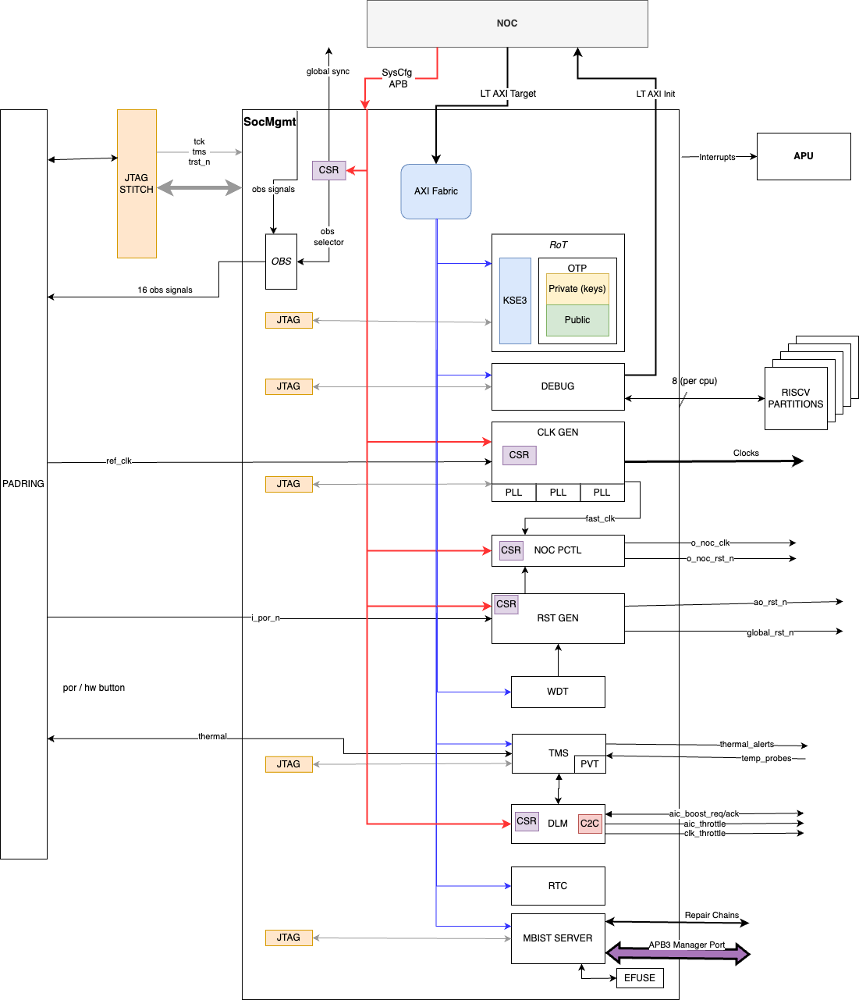
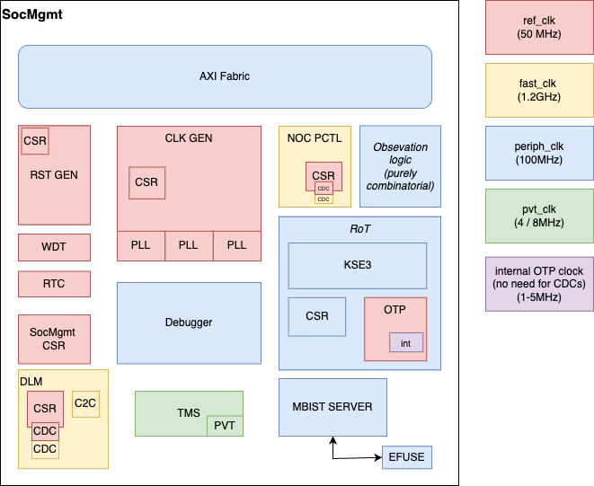
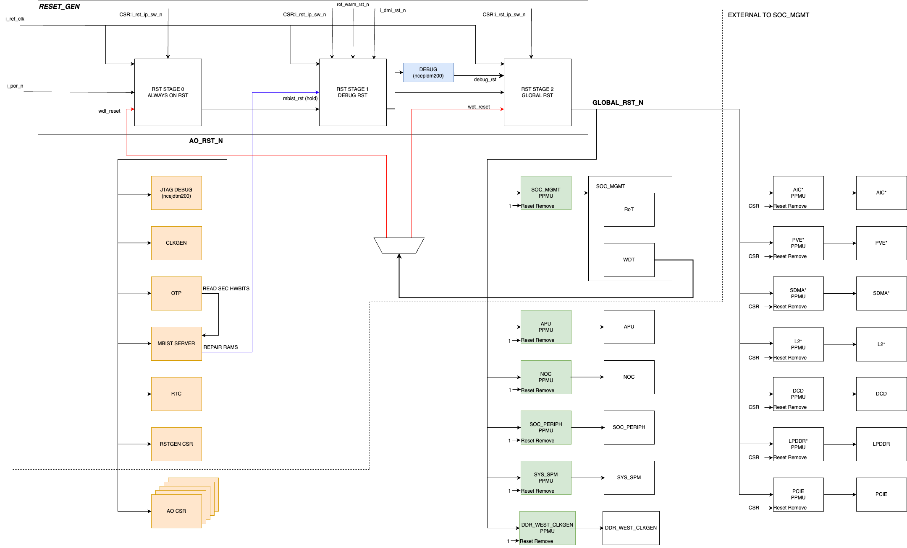
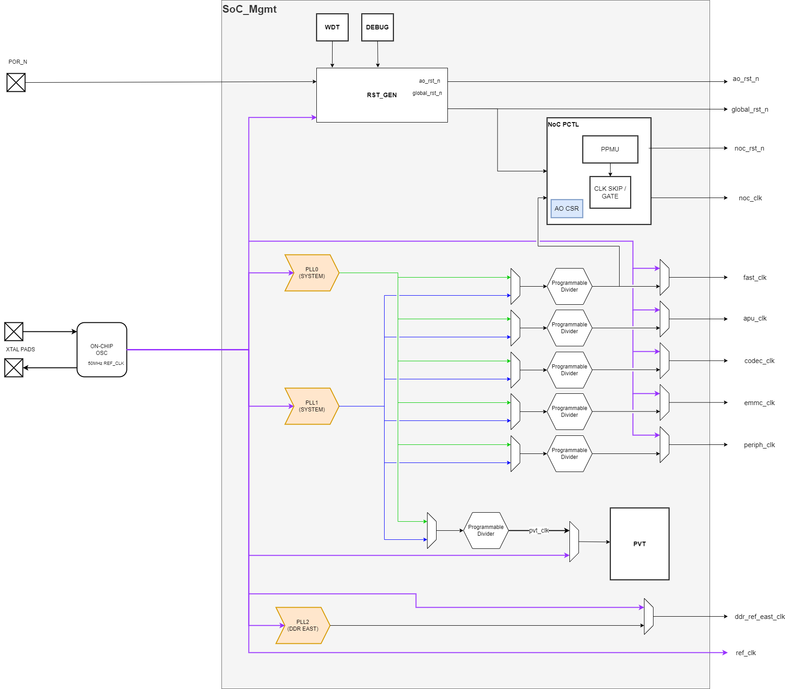

# SOC_MGMT Architecture Spec

## Introduction

### Overview

SOC_MGMT serves as the central hub for system-wide functions, such as booting. It includes system PLLs, reset generation for primary device resets, and the Root of Trust security enclave (RoT). For debugging purposes, there is a watchdog timer (WDT), a system Debug unit, and boot observability. System monitoring is handled by the TMS block, which includes a PVT Sensor and logic to continuously monitor chip temperature using remote probes. System boosting and throttling is handled by the DLM unit. Additionally, SOC_MGMT features a real-time clock timer (RTC) and an MBIST server with EFUSE for RAM repair information.

### System Diagram

#### Block diagram

#### Clock domains

## Architecture

### Architectural Requirements

| Requirement ID    | Criticality | Description |
|-------------------|-------------|-------------|






| {{ id }} | {{ criticality_style }} | {{ requirement.description }} |


### Description of Use Cases

The main use cases of SOC_MGMT are:

- Device Startup
- Debug
- Security Boot
- Cryptographic services
- Device lifecycle management (provisioning, RMA..)
- System Config
- MBIST and Memory Repair
- System monitoring

### Reset Generation / Initialisation

There are three levels of reset within Europa, with the first two levels being provisioned by SOC_MGMT, the third is an individual partition level reset.

The first level is labelled "AO" or "always on". This reset is active for system power and provides a start of day initialisation to the device.

The second level is labelled "Global" reset.  Global reset will be the main reset into all partitions, resetting the Partition Power Management Unit (PPMU). The PPMU is responsible for bringing the partition out of reset, as well as power saving by cutting the root clock during idle times. The PPMU also manages at speed reset.

| Partition       | AO Reset                     | Global Reset         | PPMU Reset Exit    |
| -------------   | -----------------            | -------------------- | ------------------ |
| NOC             | ( AO CSR (sits in SOC_MGMT)) | Everything else      | Automatic ( HW )   |
| APU             | AO CSR                       | Everything else      | Automatic ( HW )   |
| SOC_MGMT        | AO CSR, OTP                  | Everything else      | Automatic ( HW )   |
| SOC_PERIPH      | AO CSR                       | Everything else      | Automatic ( HW )   |
| SYS_SPM         | AO CSR                       | Everything else      | Automatic ( HW )   |
| DDR_WEST_CLKGEN | AO CSR                       | NA                   | Automatic ( HW )   |
| SDMA            | AO CSR                       | Everything else      | SW via AO CSR      |
| L2              | AO CSR                       | Everything else      | SW via AO CSR      |
| PVE             | AO CSR                       | Everything else      | SW via AO CSR      |
| AIC             | AO CSR                       | Everything else      | SW via AO CSR      |
| DCD             | AO CSR                       | Everything else      | SW via AO CSR      |
| LPDDR           | AO CSR                       | Everything else      | SW via AO CSR      |
| PCIE            | AO CSR                       | Everything else      | SW via AO CSR      |

There are 6 partitions expected to automatically remove their resets:
- APU
- SOC_MGMT
- SOC_PERIPH
- NOC
- SYS_SPM
- DDR West Clock Gen

All of these components are relied upon by BOOTROM code to execute the ZSBL software.

#### Diagram

#### Detailed Reset Usage

This can be found in the [System Orchestration for Clocks, Resets and Fences](clock_reset_fencing_spec.md)

### Clock Generation

The system clocks are generated by the sub-module Clock Generator, a component of SoC Management.

There is a single functional primary clock, generated by an internal oscillator and external XTAL.

| Clock Name     | Frequency      |  Source      | Usage                               |
| -------------- | -------------- | ------------ | ----------------------------------- |
| `ref_clk`        | 50MHz          | XTAL Pads    | Reference clock for PLLs and fixed freq clock for timers and other fixed period applications (e.g. OTP FSM). |

The clock generator consists of PLLs and Clock Dividers to generate the required system clocks. To allow more flexibility there are 2 System PLLs which can be chosen for each clock output with a glitchless clock switch and programmable divider. This should allow us to achieve 1.2GHz in critical blocks while also allowing lower frequencies through division or usage of, for example, PLL1 running at a lower frequency. The clock list is as follows:

| Clock Name     | Frequency      |  Source                       | Usage                               |
| -------------- | -------------- | ------------                  | ----------------------------------- |
| `fast_clk`       | 1.2GHz         | SysPLL0                     | Main clock for NOC, PVE, AIC, L2, SYS_SPM, SDMA, and MCU clock in DCD. |
| `apu_clk`        | 1GHz (max)     | SysPLL1                       | Main clock for APU cores, L2 and subsystem. |
| `codec_clk`      | 600MHz         | SysPLL0 or SysPLL1            | Main clock for Decoder and PCIe.    |
| `emmc_clk`       | 200MHz         | SysPLL0 or SysPLL1            | Pin side soft Phy Clock for eMMC    |
| `periph_clk`     | 100MHz         | SysPLL0 or SysPLL1            | Slow speed peripheral clock for slow peripheral and soc management IP |
| `tck`            | 100MHz         | PAD                           | JTAG clock - synchronous across the chip |
| `ssn`            | 100MHz         | PAD                           | DFT clock |
| `test_clk`       | 100MHz         | PAD                           | DFT clock |
| `pvt_clk`        | 4MHz or 8MHz   | SysPLL0 or SysPLL1 or DFT Pad | Reference clock for PVT sensors IP.  |

#### PLL Configuration

The chosen PLL for Europa is the _LeoLSI Integer PLL_.

Its base configuration can be seen below, knowing that SysPLL<0,1> are expected at Architecture definition to be configured for the 1.2GHz target and the DDR PLL to be configured for the 800MHz target.

|           | Min   | Max  | fast_clk | apu_clk | ddr_clk |
| ---       | ----  | ---- | ---      | ---      | ---     |
| **F_in**  | 4     | 300  | 50       | 50       | 50      |
| ---       | ----  | ---- | ---      | ---      | ---     |
| P[5:0]    | 1     | 63   | 5        | 5        | 5       |
| M[9:0]    | 64    | 1023 | 240      | 200      | 160     |
| S[2:0]    | 0     | 7    | 1        | 1        | 1       |
| K         | -     | -    | NA       | NA       | NA      |
| ---       | ----  | ---- | ---      | ---      | ---     |
| F_ref     | 4     | 12   | 10.0     | 10.0     | 10.0    |
| F_vco     | 1600  | 3200 | 2400     | 2400     | 1600    |
| **F_out** | 25    | 3200 | 1200     | 1200     | 800     |

#### Diagram

#### Detailed Clock Usage

This can be found in the [System Orchestration for Clocks, Resets and Fences](clock_reset_fencing_spec.md)

## Inter partition synchronization

Partitions are considered asynchronous to any other partition, except for the following:

### Security Boot

The Kudelsky Root of Trust IP requires the APU to boot and direct it where to find the firmware image.

### Debug

The debugger is similar to the one used in Omega, except that there are a lot more cores on Europa.
It has 3 main interfaces:
- One AXI-M
- One AXI-S
- One AHB DMI device

It is accessible through JTAG using a JTAG2AHB bridge, and through the NoC using the AXI interfaces.

### Cryptographic services

There will be no specific performant (where performant means PCIe line rate) provision for a cryptographic services. Any AES encoding/decoding / dec can be performed via dedicated instructions on the AX65 APU.

The Kudelsky RoT IP has non-performant provision for this feature and this will be used.

### MBIST and Memory Repair

SOC_MGMT will house the DFT logic for controlling MBIST across the device, as well as the EFUSE block holding repair data.

The MBIST logic is reachable through the SocMgmt AXI-S LT port and exposes an APB3 Manager port to the SocMgmt top IO.

### Power Management

No special consideration is given for power management due to the high number of 3rd party IPs and low speed clocks. General good practice around clock gating will be followed for Axelera RTL.

## Functional Description

The SoC Management encompasses a lot of features that can mostly be verified independently and are self contained into a sub-block:
- Clock Generation
- Reset Generation
  - With a Watchdog timer
- Debugger
- Thermal monitoring
- Throttle/Boost
- Real time counter
- MBIST
- Security (RoT)

NOTE: This section should be detailed enough for verification to determine a test plan for the block and it's features.

### Clock and Reset generation

Both of these sub-blocks are controlled through registers (CSRs) accessible through the SysCfg APB port. They are responsible for handling, as the name implies, clock generation and reset generation.

There is also a Watchdog Timer block responsible for triggering a system reset in the case of hanging. This block:
- Is kept running through pings from the APU
- Is connected to both AO reset generation and Global reset generation through a CSR controlled MUX
  - Ideally we will always have it targeting a global reset, but adding this MUX adds a safeguard by which if the global trigger doesn't achieve the expected results, through CSR, it can instead lead to an AO reset (when a timeout occurs). **This has the downside of a longer system boot (since for example the PLLs will need to lock again)**

### Debugger

The debugger is an external IP integrated into the SoC Management block. It provides, as the name implies, debugging capabilities

### Observability

All partitions provide a maximum of 16b of observable signals. These are collected into the SoC Management and through a smart MUX exposed to the exterior. This MUX is controllable through CSR.

There won't be any sequential logic in the path between the observation bus input (wide collecting all partitions' obs signals) and the observation bus output (16b to IO).

### Secure Enclave (RoT)

The secure enclave (RoT) will have a separate document describing it's specification. Nevertheless, some information is provided here.

The RoT sub-block consists of:
- KSE-3 IP
- OTP (including Secure and Host information)
- Always-On registers (used by KSE-3 as well as the host)
- Glue logic needed to guarantee the full operation of all components

Accesses to the secure regions of the RoT are blocked through internal memory map control logic that responds with an error when trying to access regions that are not allowed.

### Monitoring (TMS/DLM)

There is a group of 2 sub-modules responsible for thermal monitoring and throttling control, the TMS and DLM. Through probes and handshake signals these 2 are built to allow us to throttle/shutdown the system when dangerous thermal levels are detected.

Based on the sensors' datasheet ( [link](https://axeleraai.sharepoint.com/sites/AXELERAAI-ResearchandDevelopment/Gedeelde%20documenten/Forms/AllItems.aspx?id=%2Fsites%2FAXELERAAI%2DResearchandDevelopment%2FGedeelde%20documenten%2FResearch%20and%20Development%2Fhw%2Fdoc%2Fvendors%2FTechwidU%2FTechwidU%5Ftu%5Fpvt0501a01%5Fln05lpe%5F4007002%5Fv1%2E00%5Fdatasheet%5Frev1%2E00%2Epdf&parent=%2Fsites%2FAXELERAAI%2DResearchandDevelopment%2FGedeelde%20documenten%2FResearch%20and%20Development%2Fhw%2Fdoc%2Fvendors%2FTechwidU) ) and assuming usage of 8-sample averaging mode we should expect the minimum times for conversion and processing to be:

- Minimum conversion time of temperature/voltage sensing (`@4MHz`)
  - `164/F = 41μs`
- Minimum conversion time of processing sensing (`@8MHz`)
  - `256/F = 32μs`

### Performance Requirements

**TODO** ::  List all measurable performance requirements.

### CSR Details

#### - SoC Management CSRs

#### - Clock Gen
**TODO** ::  Clock generation will change and CSRs will need rework

#### - Reset Gen
| CSR | Description |
| --- | --- |
| `RST_CFG_AO_RST`          |  Reset configuration for stage `ao_rst`.             |
| `RST_SW_AO_RST`           |  Software reset (Active Low) for stage `ao_rst`.     |
| `RST_CFG_DMI_RST`         |  Reset configuration for stage `dmi_rst`.            |
| `RST_SW_DMI_RST`          |  Software reset (Active Low) for stage `dmi_rst`.    |
| `RST_CFG_GLOBAL_RST`      |  Reset configuration for stage `global_rst`.         |
| `RST_SW_GLOBAL_RST`       |  Software reset (Active Low) for stage `global_rst`. |
| `DBNC_TIMER`              |  Debounce Timer.                                     |
| `DBNC_TIMER_PCIE_BTN_RST` |  Debounce Timer for PCIE Button Reset.               |

#### - NoC PCTL
Follows basic PCTL CSRs.

#### - DLM CSRs
**TODO** ::  Still WIP

### Memory Map

**NOTE**: Below tables are subject to change. Source of truth is: [Memory Map](https://git.axelera.ai/prod/europa/-/blob/main/hw/impl/europa/data/memory_map/memory_map.yml?ref_type=heads)

#### - SocMgmt AXI
Absolute addressing with base address of `0x0200_0000`.

| Memory block    | Relative address | Size |
|----|----|----|
| RoT region : rot_kse| `0x0000_0000` | 192KB |
| tms                 | `0x0003_0000` | 64KB |
| RoT region : rot_ao | `0x0004_0000` | 64KB |
| otp_host            | `0x0005_0000` | 64KB |
| rtc                 | `0x0006_0000` | 64KB |
| watchdog            | `0x0007_0000` | 64KB |
| debug               | `0x0008_0000` | 64KB |
| mbist               | `0x0009_0000` | 64KB |

#### - SysCfg APB
Relative addressing with a base address of `0x0500_0000`.

| Memory block    | Absolute address | Size |
|----|----|----|
| `clock_gen`       | `0x0530_0000` | 64KB |
| `reset_gen`       | `0x0531_0000` | 64KB |
| `noc_ao_csr`      | `0x0532_0000` | 64KB |
| `soc_mgmt_ao_csr` | `0x0533_0000` | 64KB |
| `dlm_csr`         | `0x0534_0000` | 64KB |

## Implementation Description

### Clocks and Resets
These are the clocks and resets used internally inside the SoC Management block.

- **Clocks**
| Clock      |  Target Freq  |  Uses                                  |
| ---------- | ------------- | -------------------------------------- |
| `ref_clk`    | 50 MHz        | PLL Reference Clock, OTP static clock, Sys Cfg APB interface, ResetGen, Real Time Counter |
| `periph_clk` | 100 MHz       | RoT, most internal blocks |
| `fast_clk`   | 1.2 GHz       | DLM (and C2C) |
| `tck`        | 100 MHz       | JTAG infrastructure |

- **Resets**
| Reset          | Source          |  Uses                                  |
| ----------     | ------          | -------------------------------------- |
| `i_por_n`      | IO              | Reset gen block |
| `wdt_rst_n`    | Watchdog timer  | Reset gen block |
| `debug_rst_n`  | DBG             | Reset gen block |
| `ao_rst_n`     | Reset gen block | CSRs, PLLs (clock gen), MBIST, output |
| `global_rst_n` | Reset gen block | All other logic, output |

### IO and Interfaces

#### Async
| I/F             | Protocol   | Description |
| ---             | ---        | ---         |
| `PORn`          | Active low | Power on reset from pad                |
| `ao_rst_n`      | Active low | Reset AO CSR in all partitions         |
| `global_rst_n`  | Active low | Reset PPMU in all partitions           |
| `Interrupts`    | Active hi  | Interrupts to APU INTC                 |
| `Debug`         | HART       | Per CPU: 2 out (debugint, resethaltreq), 4 in (hart_unavail, hart_under_reset, stoptime, mtip) |

#### Clocked
| I/F           | Protocol   | Clock            | Description                            |
| ------------- | ---------- | ---------------- | -------------------------------------- |
| NOC In        | AXI4 S     | `periph_clk`       | Inbound LT NOC port                    |
| NOC Out       | AXI4 M     | `periph_clk`       | Outbound LT NOC port                   |
| SysCfg        | APB M      | `ref_clk`          | SysCfg to partition AO CSR             |
| JTAG          | JTAG       | `tck`              | I/F for each JTAG unit: RoT, debug, trace |
| DLM           | Sideband   | `fast_clk`         | Signalling necessary for DLM block (throttle control) |
| TMS           | Sideband   | `fast_clk`         | Signalling necessary for DLM block (throttle control) |

#### More detailed IO

Disregarding clocks and resets, the module has the following interfaces:

 | Interface/Signal prefixing    | Group                    |  Description |
 |---------------------          | ---                      | -------------|
 | `lt_axi_m`                    | NoC Init/Targ interfaces |  AXI LT Initiator       |
 | `lt_axi_s`                    | NoC Init/Targ interfaces |  AXI LT Target          |
 | `syscfg_apb4_s`               | NoC Init/Targ interfaces |  SYSCFG APB Subordinate |
 | `apb3_m`                      | APB3 MBIST Manager port  |  MBIST APB Manager |
 | `o_aic_throttle`              | DLM                      | |
 | `o_clock_throttle`            | DLM                      | |
 | `i_aic_boost_req`             | DLM                      | |
 | `o_aic_boost_ack`             | DLM                      | |
 | `i_throttle`                  | DLM                      | |
 | `o_irq_soc_mgmt_dlm_warning`  | DLM                      | |
 | `o_irq_soc_mgmt_dlm_critical` | DLM                      | |
 | `i_thermal_throttle`          | TMS                      | Thermal throttle override   |
 | `o_thermal_throttle`          | TMS                      | Thermal throttle output to AI cores   |
 | `o_thermal_throttle_warning`  | TMS                      | Thermal warning to pin  |
 | `o_thermal_warning`           | TMS                      | Thermal warning to AIC  |
 | `o_thermal_shutdown`          | TMS                      | Thermal shutdown to pin   |
 | `o_irq_soc_mgmt_tms_throttle` | TMS (IRQ)                | Thermal Interrupt for throttle  |
 | `o_irq_soc_mgmt_tms_warning`  | TMS (IRQ)                | Thermal Interrupt for warning   |
 | `o_irq_soc_mgmt_tms_shutdown` | TMS (IRQ)                | Thermal Interrupt for shutdown  |
 | `o_debugint`                  | Debug                    | |
 | `o_resethaltreq`              | Debug                    | |
 | `o_dmactive`                  | Debug                    | |
 | `i_hart_unavail`              | Debug                    | |
 | `i_hart_under_reset`          | Debug                    | |
 | `i_hart_nonexistent`          | Debug                    | |
 | `o_irq_soc_mgmt`              | IRQs                     | Interrupts         |
 | `o_irq_soc_mgmt_rtc`          | IRQs                     | RTC interrupt      |
 | `o_irq_soc_mgmt_wdt`          | IRQs                     | Watchdog interrupt |
 | `o_irq_soc_mgmt_security`     | IRQs                     | Security interrupt |
 | `i_obs_bus`                   | Observation              | Incoming (from partitions) observation bus |
 | `o_obs_bus`                   | Observation              | Outgoing (to top/IO) observation bus       |
 | `o_global_sync`               | Sideband                 | Global sync |
 | `o_aor_tap_config`            | Testing                  | TAP enable signals from Always-On registers |
 | DFT   signals                 | Testing                  | |
 | MBIST signals                 | Testing                  | |
 | `io_otp_vtdo`                 | Analog (OTP)             | OTP Analog signals to IO PAD |
 | `io_otp_vrefm`                | Analog (OTP)             | OTP Analog signals to IO PAD |
 | `io_otp_vpp`                  | Analog (OTP)             | OTP Analog signals to IO PAD |
 | `io_pvt_ibias_ts`             | Analog (PVT)             | |
 | `io_pvt_vsense_ts`            | Analog (PVT)             | |
 | `io_pvt_test_out_ts`          | Analog (PVT)             | |
 | `io_pvt_vol_ts`               | Analog (PVT)             | |
 | `io_efuse_vqps`               | Analog (eFUSE)           | |
 | `io_efuse_vddwl`              | Analog (eFUSE)           | |
 | `io_pvt_dvdd075a_ts`          | Analog (Power)           | Power pins |
 | `io_pvt_dvss0a_ts`            | Analog (Power)           | Power pins |
 | `io_pvt_avdd18a_ts`           | Analog (Power)           | Power pins |
 | `io_pvt_avss0a_ts`            | Analog (Power)           | Power pins |
 | `io_pvt_avss_gd`              | Analog (Power)           | Power pins |
 | `io_pll_avdd18`               | Analog (Power)           | Power pins |
 | `io_pll_avss`                 | Analog (Power)           | Power pins |
 | `io_pll_dvdd075`              | Analog (Power)           | Power pins |
 | `io_pll_dvss`                 | Analog (Power)           | Power pins |

## Root Of Trust

Documentation regarding the Secure Enclave (Root of Trust) can be found in [RoT Specification](secure_enclave_spec.md)

## Physical Considerations

### Memory Details

Most memories in the SoC Management are located inside the Secure Enclave. Those are:
| Memory    | Size |
| ---       | --- |
| OTP       | Under 8KB |
| KSE3 ROM  | 128KB |
| KSE3 IRAM | 128KB |
| KSE3 DRAM | 16KB |

### Floorplanning considerations

There's an AXI fabric handling the LT AXI-S traffic distribution into several sub-blocks. There is also handling of the SysCfg APB traffic into multiple sub-blocks/CSR.

## DFT

**TODO** :: Most DFT documentation needs to be written/discussed and will be added in this document at a later date

### PLL Control
**TODO** :: Need to specify how we will be handling this (@yassine / @redouan)

### Clock/Reset control
**TODO** :: Need to specify how we will be handling this

### Non-Tessent JTAG TAPs
**TODO**

### Isolation of analog IPs during DFT test
**TODO** :: Cover IPs such as PVT/OTP/ etc..

### Security bypass of TAP ctrl
**TODO** :: Define JTAG TAP control bypass for security
