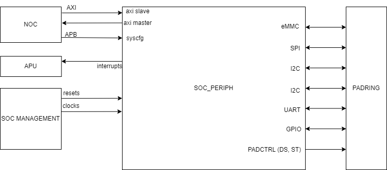
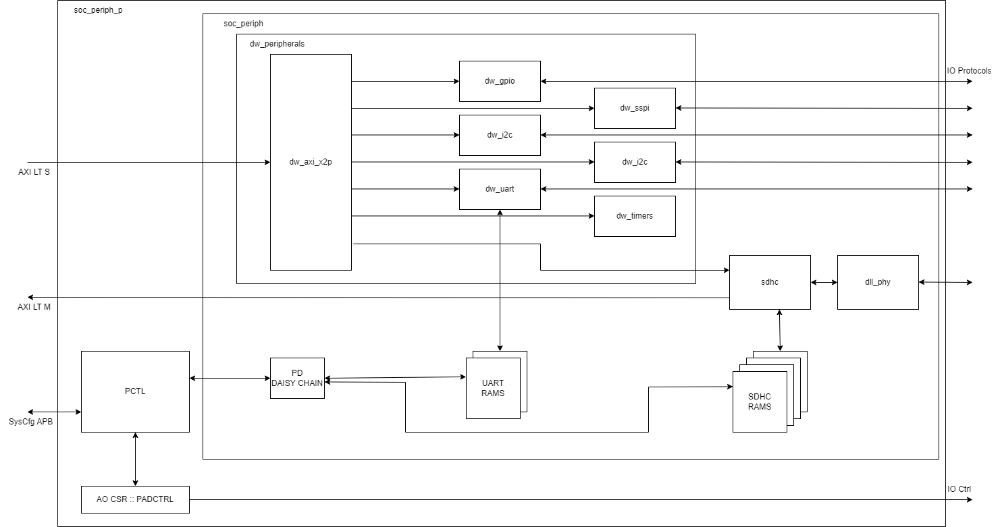

# SOC_PERIPH Architecture Spec

## Introduction

### Overview

The SOC_IO block contains all slow protocol IO peripheral IP. Where functional IO do not go to one of these IP, the signalling will route directly to the driving / receiving IP which may be outside of SOC_PERIPH - e.g. i_ext_throttle will wire directly to SOC_MGMT where the TMS IP resides.

There are some complex timing exceptions associated with IO timings so separating these out early for a PD visibility as well as better placement near the relevant pads should help close out build.

### System Diagram

## Architecture

## Architectural Requirements

| Requirement ID        | Criticality | Owner | Description |
|-----------------------|-------------|-------|-------------|






| {{ id }} | {{ criticality_style }} | {{ requirement.owner }} | {{ requirement.description }} |


### Description of Use Cases

The use cases for this block will be about the low performance system IO. Here is a list of the main use cases:

- Device Booting
- PMIC Control
- Debug Interfacing via I2C or UART
- Sampling and Setting of board level pseudo static signals.

#### Booting

There is no internal CPU to boot but the SOC_PERIPH block is critical for device boot. The first and second stage boot loaders and linux image with uboot will be placed in a non volatile memory access via the eMMC peripheral. There are no performance goals associated with boot other than best effort boot time.
This amount of external non volatile storage required is beween 8GB and 64GB. This will allow a well featured version of linux to run on the APU cluster.

#### PMIC Control

The PMIC (power management integrated circuit) will be controlled via the I2C or SPI peripherals. Expect peeks and pokes to the peripheral. Low bandwdith in the most part but there may be a desire to monitor and tweak the core power rail to achieve better power efficiency.

#### Debug Interfacing via the I2C or UART

The primary interface for this is the JTAG, I2C and UART are other options. UART will be used on the SkyRay platform. Expect peek and pokes to the peripherals in question.

#### Sampling and Setting of board level pseudo static signals.

The GPIO block is responsible for odd signalling between device and board, typically static control. Input changes can require an interrupt to be generated.

## Functional Description

All functional modules in this block are from a 3rd party IP provider.
Most are provided by Synopsys, with the exception of eMMC which is provided by Cadence.

Documentation for these IP can be found here:

| IP                | Documentation |
| --------          | ------------- |
| dw_spi            | [DW_apb_ssi_databook.pdf](../../../../hw/impl/europa/blocks/soc_periph/docs/DW_apb_ssi_databook.pdf) |
| dw_i2c            | [DW_apb_i2c_databook.pdf](../../../../hw/impl/europa/blocks/soc_periph/docs/DW_apb_i2c_databook.pdf) |
| dw_timers         | [DW_apb_timers_databook.pdf](../../../../hw/impl/europa/blocks/soc_periph/docs/DW_apb_timers_databook.pdf) |
| dw_uart           | [DW_apb_uart_databook.pdf](../../../../hw/impl/europa/blocks/soc_periph/docs/DW_apb_uart_databook.pdf) |
| dw_gpio           | [DW_apb_gpio_databook.pdf](../../../../hw/impl/europa/blocks/soc_periph/docs/DW_apb_gpio_databook.pdf) |
| sdhc controller   | [cdns_sdhc_user_guide.pdf](../../../../hw/vendor/cadence/cdns_sdhc/r002v1p1/docs/cdns_sdhc_user_guide.pdf) |
| sdhc phy          | [cdn_ip6185_1990_dll_phy_user_guide.pdf](../../../../hw/vendor/cadence/cdns_ip6185_1990_dll_phy/r007v1p1/docs/cdn_ip6185_1990_dll_phy_user_guide.pdf) |

Support documentation:
- [DW_axi_x2p_databook.pdf](../../../../hw/impl/europa/blocks/soc_periph/docs/DW_axi_x2p_databook.pdf) |

### Special considerations

Narrow (lower than 32b) AXI accesses (through AXI-S LT) to the fabric are unsupported and will result in an error.

### Performance Requirements

There are no performance requirements for this block.

### CSR Details

_*Silver TODO*_ : Insert a table of CSR and memory maps.

## Implementation Description

- Standard connectivity to NOC for AMBA interfaces.
- Primary Clocks and Resets from SOC_MGMT.
- Interrupts go to the APU system peripheral interrupt controller.
- All other signals to the IO / PADRING for slow speed peripheral accesses and pad control.

### Block Diagram

Block Diagram detailing the full interface and the internal architecture.

### Clocks and Resets

#### Clocks

| Clock          | Frequency |
| -----          | --------- |
| `i_ref_clk`    | 50MHz     |
| `i_periph_clk` | 100MHz    |
| `i_emmc_clk`   | 200MHz    |
| `i_spi_clk_in` | 10~20MHz  |

#### Resets
- `i_global_rst_n`
- `i_ao_rst_n`

### IO and Interfaces

#### NOC I/F

- AXI-S LT interface for AXI accesses
- APB4-S Interface (SysCfg) for system config APB accesses (PCTL/CSRs/PADCtrl)

#### Slow IO Protocols

- I2C (x2)
- SPI
- UART
- GPIO
- eMMC

#### Interrupts

- Interrupts to platform interrupt controller (APU)
- Minimise IP interrupts (e.g. reduce existing 17 of I2C to a single interrupt) => 1 per IP.
  - I2C0
  - I2C1
  - SPI
  - UART
  - GPIO
  - TIMER
  - EMMC

#### PAD Control

- Pad ctrl signals to padring
- Drive Strength:
  - JTAG
  - UART
  - SPI
  - I2C
  - GPIO
  - OBS
  - DFT
  - EMMC
- Schmitt Trigger Control
  - CLK
  - RST
  - SPI
  - UART
  - I2C
  - GPIO
  - EMMC

### Physical Considerations

#### Memory Details

| RAM Type     | Width (sub word) | Depth | Num Insts | Usage   |
| ------------ | ---------------- | ----- | --------- | ------- |
| SRAM (2port) | 10 (10)          | 16    | 1         | UART RX |
| SRAM (2port) | 8 (8)            | 16    | 1         | UART TX |
| SRAM (1port) | 64 (64)          | 256   | 4         | SDHC (emmc) controller |

#### Floorplanning considerations

- Large Buses connected to which sub blocks.

#### Special DFT Requirements

Are there any structures that DFT need to be aware of?

### Timing Exceptions

If your constraints need an exception, draw the logic, the named cells and the exception that falls out.

