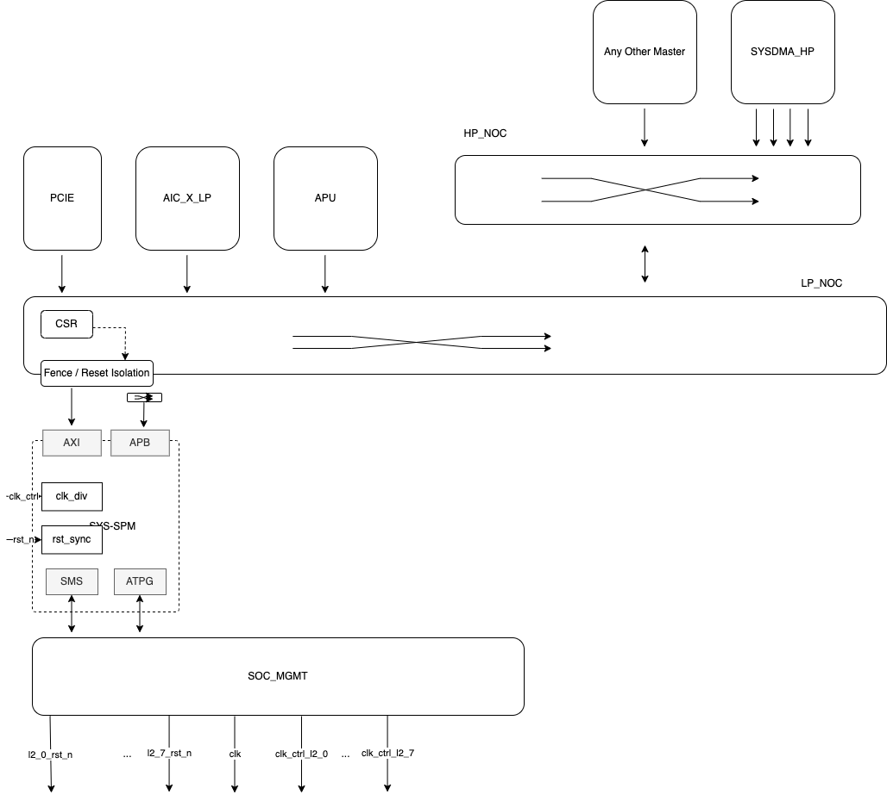

# SYS-SPM

Ownership [Spyridoula Koumousi](https://axeleraai.atlassian.net/wiki/people/62610e829e7c190069e821bc?ref=confluence)

This page will gather all the requirements and the architecture for the SYS-SPM block as well as it’s integration into the Europa system.

*   [Requirements](https://axeleraai.atlassian.net/wiki/spaces/archrd/pages/385843577/Template#Requirements)
    
*   [Block Definition](https://axeleraai.atlassian.net/wiki/spaces/archrd/pages/385843577/Template#Block-Definition)
    
    *   [Block Description](https://axeleraai.atlassian.net/wiki/spaces/archrd/pages/385843577/Template#Block-Description)
        
    *   [Block Diagram](https://axeleraai.atlassian.net/wiki/spaces/archrd/pages/385843577/Template#Block-Diagram)
        
    *   [Block Interfaces](https://axeleraai.atlassian.net/wiki/spaces/archrd/pages/385843577/Template#Block-Interfaces)
        
*   [Block Integration](https://axeleraai.atlassian.net/wiki/spaces/archrd/pages/385843577/Template#Block-Integration)
    
*   [Description of use-cases](https://axeleraai.atlassian.net/wiki/spaces/archrd/pages/385843577/Template#Description-of-use-cases)
    
    *   [General Description](https://axeleraai.atlassian.net/wiki/spaces/archrd/pages/385843577/Template#General-Description)
        
    *   [Memory Usage](https://axeleraai.atlassian.net/wiki/spaces/archrd/pages/385843577/Template#Memory-Usage)
        
    *   [Booting](https://axeleraai.atlassian.net/wiki/spaces/archrd/pages/385843577/Template#Booting)
        
    *   [Configuration](https://axeleraai.atlassian.net/wiki/spaces/archrd/pages/385843577/Template#Configuration)
        
    *   [Runtime Interactions](https://axeleraai.atlassian.net/wiki/spaces/archrd/pages/385843577/Template#Runtime-Interactions)
        
    *   [Power management](https://axeleraai.atlassian.net/wiki/spaces/archrd/pages/385843577/Template#Power-management)
        

## Architectural Requirements

| Requirement ID        | Criticality | Owner | Description |
|-----------------------|-------------|-------|-------------|






| {{ id }} | {{ criticality_style }} | {{ requirement.owner }} | {{ requirement.description }} |


## Block Definition

### Block Description

### Block Diagram

### Block Interfaces

The main interface is a half duplex AXI4 interface that is connected to the NoC.

The AXI4 features and characteristics of the INTF are described in the table below.

| **Interface characteristics** | **Interface Information** |
| --- | --- |
| Bus Protocol | AXI4 |
| Port Data Width | 64  |
| Address Width | 23  |
| Address Alignment | Aligned and Unaligned support |
| Max Burst Length | INCR: 256  WRAP:16  FIXED: 16 |
| Burst Type | INCR, FIXED, WRAP |
| Burst size | 1 to 128 |
| Transaction Attributes | None, Modifiable, Bufferable  Read-allocate Write-allocate |
| Burst Cross Boundary | 4K  |
| Exclusives | Supported |
| Narrow Bursts | Supported |
| Byte Enable Usage | Supported |
| Read Response Interleaving | Not supported |
| Write Interleaving | Not supported |
| Write Response | Posted |
| Read-Write Ordering | Not supported |
| Performance details |     |
| Max Outstanding Transactions | TBD this will be sized based on the fabrics/DMAs max outs tnx |
| Read/Write Bandwidth | 9.6GB/sec |

## Block Integration

The SYS-SPM shall be integrated at the top level of the Europa SoC and it should be reachable by all managers in the system such as APU, PCIE, SDMAs,PVE, AICORE CPUs etc. More precisely it should be connected to the LP NoC interconnect in order to provide low latency access to the most critical managers such as the APU. The diagram below illustrates how the SYS-SPM module is connected in the system.

The diagram should highlight any other integration aspects:

*   Connection of the block to the toplevel LP NoC:
    

*   Connection of the block to the soc-mgmt module:
    
    *   Clock interface
        
    *   Test interface
        
    *   RST connections
        
    *   rst isolation requirements and integration with the NoC Fencing mechanism
        

## Description of use-cases

### General Description

The SYS-SPM will act as the main control data memory for the Europa SoC.

The SYS-SPM memory will be used to store (1) CPU programs (2) PCIE control data and descriptors , (3) TLB pagetables , (4) SW tokens , (5) linked lists for SDMA transfers and other control data.

Almost all the above data (1)-(3) and (5) will be precompiled data placed in the DDR. The APU will prefetch them to the SYS-SPM in order to make them available to the APU and the other AICORE CPUs. The data will be preloaded into the SYS-SPM in advance of its usage to minimize latency and eliminate reliance on the DDR. The SYS-SPM will be the memory to use for all intercore communication for task handling as well as debugging. The SYS-SPM can also be used from all CPUs in the system to boot data from ( APU and AICORE CPUs).

The following data transfers are considered default scenarios and they are optimised to achieve peak throughput in uncongested scenarios (half duplex bandwidth of the link should be maxed out, when only one transfer is active) and optimised for maximum throughput in fully congested scenarios (when all possible transfers are active):

*   Data will be transferred between the DDR<->SYS-SPM via **SDMA** transfers
    
*   Data will be transferred from the PCIE ↔︎ SYS-SPM via **PCIE** transfers
    
*   Data will be transferred from the L2 ↔︎SYS-SPM via **SDMA** transfers
    
*   Data will be transferred from the APU ↔︎ SYS-SPM via direct access.
    
*   Data will be transferred from the AICORE CPUs ↔︎ SYS-SPM via direct access.
    
*   Data will be transferred from the SYS-SPM ↔︎ AICORE SPM via SDMA transfer.
    
*   Data will be transferred from the SYS-SPM ↔︎ PCIE via SDMA transfer (??)
    

In order to accommodate all the above scenarios the SYS-SPM shall be reachable by all master in the LP and HP NoC fabric.

##### Exclusives

In addition, it also shall support exclusive accesses from all cores in the system, including the host, to support exchanging of mutexes/semaphores. The exclusive monitor shall be placed on the NIU of the target within the Arteris NoC.

The exclusive monitor shall be setup in order to track a single exclusive PA per possible CPU initiator.

##### ECC

Similar to Triton the SYS-SPM shall be SECDEC ECC protected. Single bit errors should be corrected in-flight while 2 -bit errors should raise an IRQ. Both single and double bit errors should be reported to the CPU via a status CSR.

In more detail, an 8-bit ECC code will be generated per 64-bit of data. The ECC code will be written upon every write (full or partial). In a case of partial write, a RmW ( read-modify-write operation) is needed in order to calculate the correct ECC code based on the previous stored data and the newly partial write.

Upon reading the memory the ECC code will be decoded and if the syndrome is different than 0 that will indicate the presence of an ECC error. If the error is 1-bit then the error can be corrected in flight by the dedicated logic. If the error is 2 bit then an IRQ should be raised. In both cases the error needs to be reported via an ERROR interface to a CSR.

The CPU might choose to mask the IRQ and unmask it only when it needs it.Upon reading the ECC status info from the register the CPU should clear the reported errors.

In case of multiple errors between CPU reads then the severity of the error should be raised to the one of the error with the highest severity and a field of the status CSR should be updated to indicate that there have been multiple errors.

Fields of the CSR to be updated:

| **CSR field** |     | **CSR field description** |
| --- | --- | --- |
| ECC error | 1-bit | An ECC error has been reported.  0: no error present  1: an error has been seen |
| ECC error type | 1-bit | 0: single bit error ( CORRECTABLE)  1: Double bit error ( UNRECOVERABLE) |
| ECC multiple errors seen | 1-bit | 0: only one error seen  1: multiple errors seen  only valid if ECC error=1 |
| ECC error index | 20-bit | 64-bit aligned memory address in which the error occurred. |
| ECC error syndrome | 7-bit | The ECC error syndrome. SW ca n calculate the location of the error based on the syndrome. |

### Memory Usage

| **Data Type** | **Description** | **Comment** |
| --- | --- | --- |
| 1   | APU program |     |
| 2   | AICORE CPU programs | Double buffering of control programs improves performance as it reduces dependency on DDR |
| 3   | TLB pagetables for APU/AICORE CPUs |     |
| 4   | PCIE descriptors | Linked list items for PCIE DMA |
| 5   | SW tokens exchanged between APU/DEC/PVEs/AICOREs |     |
| 6   | Misc control data |     |

### Booting

No booting requirements for the SYS-SPM module.

### Configuration

*   The SYS-SPM memory is configured during platform configuration by the APU system controller by writing to it’s local register space over APB, following the global block configuration strategy in [https://git.axelera.ai/prod/europa/-/issues/74](https://git.axelera.ai/prod/europa/-/issues/74).
    
*   The following items are configured:
    
    *   Light Sleep/Deep Sleep/Shut Down Modes
        
    *   SRAM settings
        
    *   …
        

### Runtime Interactions

### Power management

*   The SYS-SPM memory uses local automated clock gating on all internal pipeline registers and local memories. This mechanism is on by default and cannot be en- or disabled.
    
*   The clock of the SYS-SPM memory as a whole can be modulated or disconnected using the global power modulation strategy [https://git.axelera.ai/prod/europa/-/issues/77](https://git.axelera.ai/prod/europa/-/issues/77)
