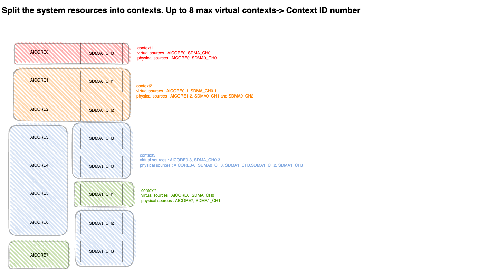
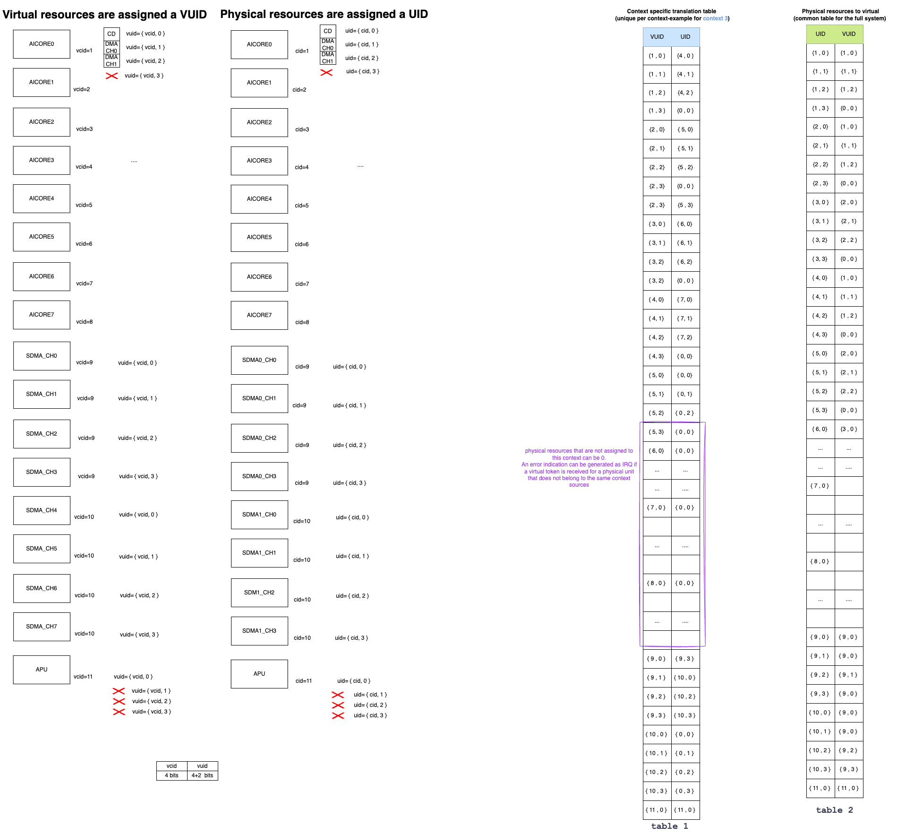
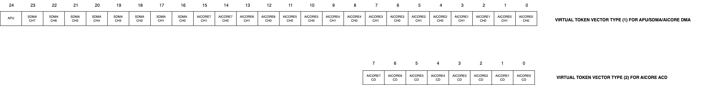
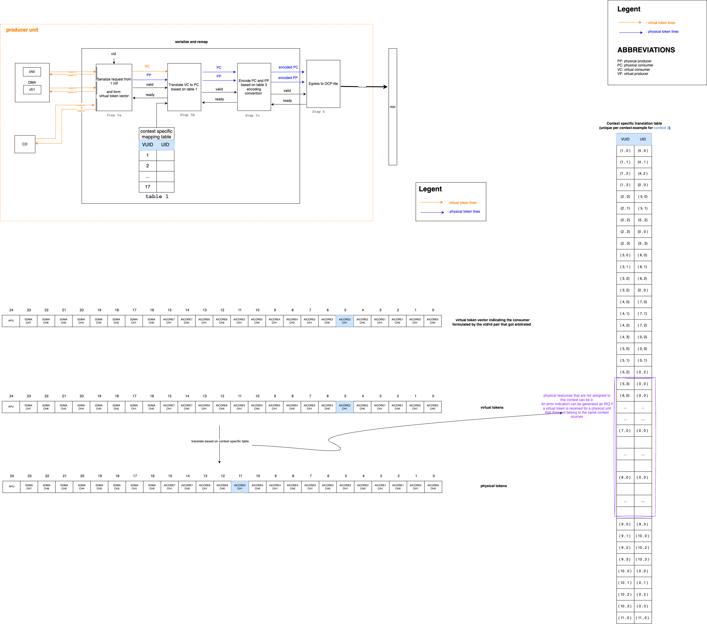
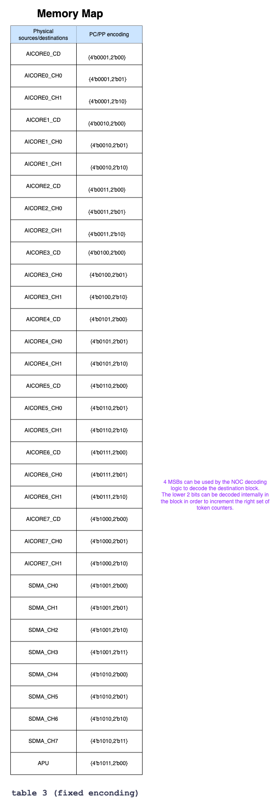
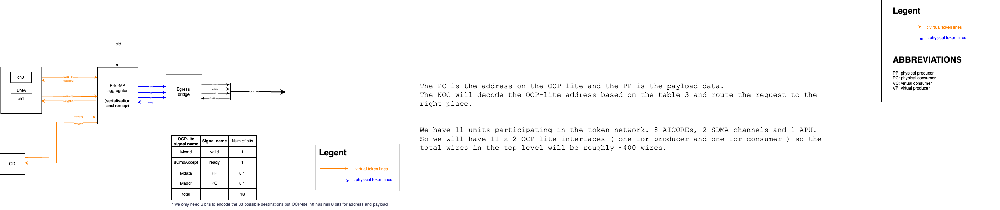
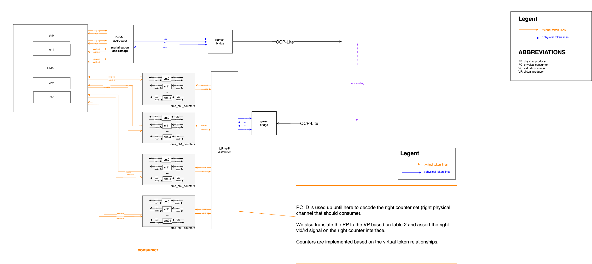
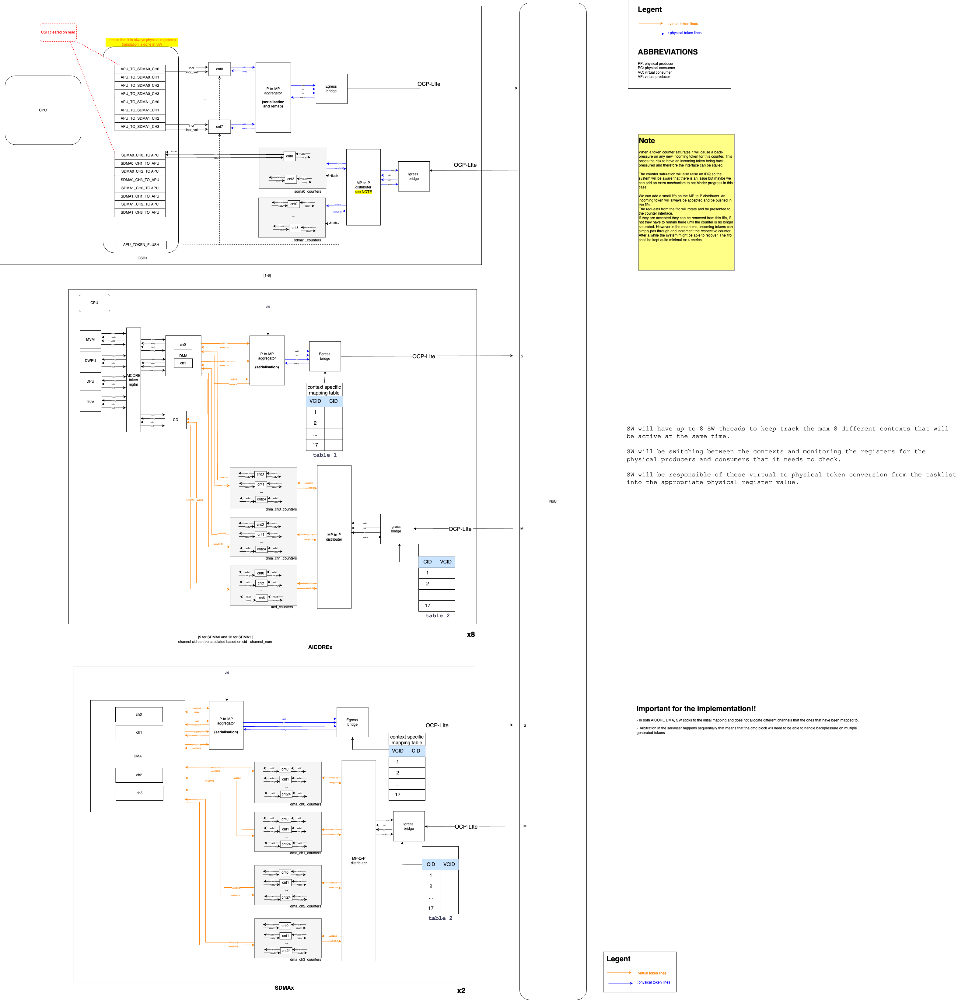

# TOP TOKEN NETWORK

Owner [Spyridoula Koumousi](https://axeleraai.atlassian.net/wiki/people/62610e829e7c190069e821bc?ref=confluence)

> [!WARNING]
> This page is under construction.

This page will gather all the requirements and the architecture for the Top token manager block as well as it’s integration into the Europa system.

*   [Requirements](https://axeleraai.atlassian.net/wiki/spaces/archrd/pages/385843577/Template#Requirements)

*   [Block Definition](https://axeleraai.atlassian.net/wiki/spaces/archrd/pages/385843577/Template#Block-Definition)

    *   [Block Description](https://axeleraai.atlassian.net/wiki/spaces/archrd/pages/385843577/Template#Block-Description)

    *   [Block Diagram](https://axeleraai.atlassian.net/wiki/spaces/archrd/pages/385843577/Template#Block-Diagram)

    *   [Block Interfaces](https://axeleraai.atlassian.net/wiki/spaces/archrd/pages/385843577/Template#Block-Interfaces)

*   [Block Integration](https://axeleraai.atlassian.net/wiki/spaces/archrd/pages/385843577/Template#Block-Integration)

*   [Description of use-cases](https://axeleraai.atlassian.net/wiki/spaces/archrd/pages/385843577/Template#Description-of-use-cases)

    *   [General Description](https://axeleraai.atlassian.net/wiki/spaces/archrd/pages/385843577/Template#General-Description)

    *   [Memory Usage](https://axeleraai.atlassian.net/wiki/spaces/archrd/pages/385843577/Template#Memory-Usage)

    *   [Booting](https://axeleraai.atlassian.net/wiki/spaces/archrd/pages/385843577/Template#Booting)

    *   [Configuration](https://axeleraai.atlassian.net/wiki/spaces/archrd/pages/385843577/Template#Configuration)

    *   [Runtime Interactions](https://axeleraai.atlassian.net/wiki/spaces/archrd/pages/385843577/Template#Runtime-Interactions)

    *   [Power management](https://axeleraai.atlassian.net/wiki/spaces/archrd/pages/385843577/Template#Power-management)

## Requirements

| Requirement ID        | Criticality | Owner | Description |
|-----------------------|-------------|-------|-------------|






| {{ id }} | {{ criticality_style }} | {{ requirement.owner }} | {{ requirement.description }} |


## Block Definition

### Intent Description

The need to synchronize memory usage and avoid RaW and WaR hazards on the shared memories motivates the introduction of synchronization techniques in the system.

The system will be able to support both SW token based and HW token based synchronization techniques. However the SW synchronization comes with an extra CPU time overhead and performance is reduced. In order to improve performance between HW units that work together on a single workload and share some resources a dedicated HW token network can be implemented.

The APU, AICORE DMA channels, the AICORE ACD units and the SDMA channels will be connected to the top level network as per the table below.

| produces/consumers                 | AIC0-CD | AIC1-CD                                | AIC2-CD | AIC3-CD | AIC4-CD | AIC5-CD | AIC6-CD | AIC7-CD | AIC0-DMA-C0 | AIC0-DMA-C1 | AIC1-DMA-C0 | AIC1-DMA-C1 | AIC2-DMA-C0 | AIC2-DMA-C1 | AIC3-DMA-C0 | AIC3-DMA-C1 | AIC4-DMA-C0 | AIC4-DMA-C1 | AIC5-DMA-C0 | AIC5-DMA-C1 | AIC6-DMA-C0 | AIC6-DMA-C1 |  AIC7-DMA-C0 | AIC7-DMA-C1 | SDMA0-C0 | SDMA0-C1 | SDMA0-C2 | SDMA0-C3 | SDMA1-C0 | SDMA1-C1 | SDMA1-C2 | SDMA1-C3 | APU SW endppoint |
| ---------------------------------- | ------- | -------------------------------------- | ------- | ------- | ------- | ------- | ------- | ------- | ----------- | ----------- | ----------- | ----------- | ----------- | ----------- | ----------- | ----------- | ----------- | ----------- | ----------- | ----------- | ----------- | ----------- | ------------ | ----------- | -------- | -------- | -------- | -------- | -------- | -------- | -------- | -------- | ---------------- |
| AIC0-CD                            |         | x                                      | x       | x       | x       | x       | x       | x       |             |             |             |             |             |             |             |             |             |             |             |             |             |             |              |             |          |          |          |          |          |          |          |          |                  |
| AIC1-CD                            | x       |                                        | x       | x       | x       | x       | x       | x       |             |             |             |             |             |             |             |             |             |             |             |             |             |             |              |             |          |          |          |          |          |          |          |          |                  |
| AIC2-CD                            | x       | x                                      |         | x       | x       | x       | x       | x       |             |             |             |             |             |             |             |             |             |             |             |             |             |             |              |             |          |          |          |          |          |          |          |          |                  |
| AIC3-CD                            | x       | x                                      | x       |         | x       | x       | x       | x       |             |             |             |             |             |             |             |             |             |             |             |             |             |             |              |             |          |          |          |          |          |          |          |          |                  |
| AIC4-CD                            | x       | x                                      | x       | x       |         | x       | x       | x       |             |             |             |             |             |             |             |             |             |             |             |             |             |             |              |             |          |          |          |          |          |          |          |          |                  |
| AIC5-CD                            | x       | x                                      | x       | x       | x       |         | x       | x       |             |             |             |             |             |             |             |             |             |             |             |             |             |             |              |             |          |          |          |          |          |          |          |          |                  |
| AIC6-CD                            | x       | x                                      | x       | x       | x       | x       |         | x       |             |             |             |             |             |             |             |             |             |             |             |             |             |             |              |             |          |          |          |          |          |          |          |          |                  |
| AIC7-CD                            | x       | x                                      | x       | x       | x       | x       | x       |         |             |             |             |             |             |             |             |             |             |             |             |             |             |             |              |             |          |          |          |          |          |          |          |          |                  |
| AIC0-DMA-C0                        |         |                                        |         |         |         |         |         |         |             | (x)         | x           | x           | x           | x           | x           | x           | x           | x           | x           | x           | x           | x           | x            | x           | x        | x        | x        | x        | x        | x        | x        | x        | (x)              |
| AIC0-DMA-C1                        |         |                                        |         |         |         |         |         |         | (x)         |             | x           | x           | x           | x           | x           | x           | x           | x           | x           | x           | x           | x           | x            | x           | x        | x        | x        | x        | x        | x        | x        | x        | (x)              |
| AIC1-DMA-C0                        |         |                                        |         |         |         |         |         |         | x           | x           |             | (x)         | x           | x           | x           | x           | x           | x           | x           | x           | x           | x           | x            | x           | x        | x        | x        | x        | x        | x        | x        | x        | (x)              |
| AIC1-DMA-C1                        |         |                                        |         |         |         |         |         |         | x           | x           | (x)         |             | x           | x           | x           | x           | x           | x           | x           | x           | x           | x           | x            | x           | x        | x        | x        | x        | x        | x        | x        | x        | (x)              |
| AIC2-DMA-C0                        |         |                                        |         |         |         |         |         |         | x           | x           | x           | x           |             | (x)         | x           | x           | x           | x           | x           | x           | x           | x           | x            | x           | x        | x        | x        | x        | x        | x        | x        | x        | (x)              |
| AIC2-DMA-C1                        |         |                                        |         |         |         |         |         |         | x           | x           | x           | x           | (x)         |             | x           | x           | x           | x           | x           | x           | x           | x           | x            | x           | x        | x        | x        | x        | x        | x        | x        | x        | (x)              |
| AIC3-DMA-C0                        |         |                                        |         |         |         |         |         |         | x           | x           | x           | x           | x           | x           |             | (x)         | x           | x           | x           | x           | x           | x           | x            | x           | x        | x        | x        | x        | x        | x        | x        | x        | (x)              |
| AIC3-DMA-C1                        |         |                                        |         |         |         |         |         |         | x           | x           | x           | x           | x           | x           | (x)         |             | x           | x           | x           | x           | x           | x           | x            | x           | x        | x        | x        | x        | x        | x        | x        | x        | (x)              |
| AIC4-DMA-C0                        |         |                                        |         |         |         |         |         |         | x           | x           | x           | x           | x           | x           | x           | x           |             | (x)         | x           | x           | x           | x           | x            | x           | x        | x        | x        | x        | x        | x        | x        | x        | (x)              |
| AIC4-DMA-C1                        |         |                                        |         |         |         |         |         |         | x           | x           | x           | x           | x           | x           | x           | x           | (x)         |             | x           | x           | x           | x           | x            | x           | x        | x        | x        | x        | x        | x        | x        | x        | (x)              |
| AIC5-DMA-C0                        |         |                                        |         |         |         |         |         |         | x           | x           | x           | x           | x           | x           | x           | x           | x           | x           |             | (x)         | x           | x           | x            | x           | x        | x        | x        | x        | x        | x        | x        | x        | (x)              |
| AIC5-DMA-C1                        |         |                                        |         |         |         |         |         |         | x           | x           | x           | x           | x           | x           | x           | x           | x           | x           | (x)         |             | x           | x           | x            | x           | x        | x        | x        | x        | x        | x        | x        | x        | (x)              |
| AIC6-DMA-C0                        |         |                                        |         |         |         |         |         |         | x           | x           | x           | x           | x           | x           | x           | x           | x           | x           | x           | x           |             | (x)         | x            | x           | x        | x        | x        | x        | x        | x        | x        | x        | (x)              |
| AIC6-DMA-C1                        |         |                                        |         |         |         |         |         |         | x           | x           | x           | x           | x           | x           | x           | x           | x           | x           | x           | x           | (x)         |             | x            | x           | x        | x        | x        | x        | x        | x        | x        | x        | (x)              |
| AIC7-DMA-C0                        |         |                                        |         |         |         |         |         |         | x           | x           | x           | x           | x           | x           | x           | x           | x           | x           | x           | x           | x           | x           |              | (x)         | x        | x        | x        | x        | x        | x        | x        | x        | (x)              |
| AIC7-DMA-C1                        |         |                                        |         |         |         |         |         |         | x           | x           | x           | x           | x           | x           | x           | x           | x           | x           | x           | x           | x           | x           | (x)          |             | x        | x        | x        | x        | x        | x        | x        | x        | (x)              |
| SDMA0-C0                           |         |                                        |         |         |         |         |         |         | x           | x           | x           | x           | x           | x           | x           | x           | x           | x           | x           | x           | x           | x           | x            | x           | x        | x        | x        | x        | x        | x        | x        | x        | x                |
| SDMA0-C1                           |         |                                        |         |         |         |         |         |         | x           | x           | x           | x           | x           | x           | x           | x           | x           | x           | x           | x           | x           | x           | x            | x           | x        | x        | x        | x        | x        | x        | x        | x        | x                |
| SDMA0-C2                           |         |                                        |         |         |         |         |         |         | x           | x           | x           | x           | x           | x           | x           | x           | x           | x           | x           | x           | x           | x           | x            | x           | x        | x        | x        | x        | x        | x        | x        | x        | x                |
| SDMA0-C3                           |         |                                        |         |         |         |         |         |         | x           | x           | x           | x           | x           | x           | x           | x           | x           | x           | x           | x           | x           | x           | x            | x           | x        | x        | x        | x        | x        | x        | x        | x        | x                |
| SDMA1-C0                           |         |                                        |         |         |         |         |         |         | x           | x           | x           | x           | x           | x           | x           | x           | x           | x           | x           | x           | x           | x           | x            | x           | x        | x        | x        | x        | x        | x        | x        | x        | x                |
| SDMA1-C1                           |         |                                        |         |         |         |         |         |         | x           | x           | x           | x           | x           | x           | x           | x           | x           | x           | x           | x           | x           | x           | x            | x           | x        | x        | x        | x        | x        | x        | x        | x        | x                |
| SDMA1-C2                           |         |                                        |         |         |         |         |         |         | x           | x           | x           | x           | x           | x           | x           | x           | x           | x           | x           | x           | x           | x           | x            | x           | x        | x        | x        | x        | x        | x        | x        | x        | x                |
| SDMA1-C3                           |         |                                        |         |         |         |         |         |         | x           | x           | x           | x           | x           | x           | x           | x           | x           | x           | x           | x           | x           | x           | x            | x           | x        | x        | x        | x        | x        | x        | x        | x        | x                |
| APU SW endpoint                   |         |                                        |         |         |         |         |         |         | (x)         | (x)         | (x)         | (x)         | (x)         | (x)         | (x)         | (x)         | (x)         | (x)         | (x)         | (x)         | (x)         | (x)         | (x)          | (x)         | x        | x        | x        | x        | x        | x        | x        | x        |                  |
|                                    |         |                                        |         |         |         |         |         |         |             |             |             |             |             |             |             |             |

Extracted from [xlsx file](./attachments/TOP_TOKEN_MGNR.xlsx).

Interaction between units that do not belong to the HW token system (ie PVE, DEC etc) will always be done with SW token exchange via the SYS-SPM.

Interactions between AICOREs and SDMA transfers that operate tasks from the same network can be done both using HW tokens and SW tokens. However it will be most performant if they are synchronized via HW tokens. Interactions between AICOREs in pipelined or non pipelined mode and the APU will be done always via SW token.

The full motivation behind this architectural choice can be found in [Europa synchronization techniques page](https://axeleraai.atlassian.net/wiki/spaces/archrd/pages/383551225/Europa+synchronization+techniques).

Token based synchronisation needs to be by-passable by normal SW task synchronisation and the solution needs to be backwards compatible.

|     | **Producer** | **Consumer** | **Method** |
| --- | --- | --- | --- |
| 1   | AICOREx CPU | AICOREy CPU | SW token |
| 2   | CODEC | APU | SW token |
| 3   | PVE | APU | SW token |
| 4   | APU | any | SW token |
| 5   |     |     |     |
| 6   | AICOREx ACD | AICOREy ACD | HW token |
| 7   | AICOREx ACD | AICOREy DMA0/1 | N/A |
| 8   | AICOREx ACD | SDMA0/1 | N/A |
| 9   |     |     |     |
| 10  | AICOREx DMA0/1 | AICOREy ACD | N/A |
| 11  | AICOREx DMA0/1 | AICOREy DMA0/1 | HW token |
| 12  | AICOREx DMA0/1 | SDMA0/1 | HW token |
| 13  |     |     |     |
| 14  | SDMA0/1 | AICOREx ACD | N/A |
| 15  | SDMA0/1 | SDMA0/1 | HW token |
| 16  | SDMA0/1 | AICORExDMA0/1 | HW token |
| 17  |     |     |     |
| 18  | SDMA0/1 | APU | HW token |
| 19  | APU | SDMA0/1 | HW token |

### Block Description

The top level management network will not be confined within 1 block but the functionality will be distributed among the units that participate in the network.
The AICOREs, SDMAs and APU will contain the necessary logic to be able to generate tokens from each initiator, serialize them and send them to the NOC token network.

Tokens are exchanged between units that belong to the same context. A context is a set of resources that are grouped and execute workload related to the same application.
The number of contexts depends on how many isolated applications are running on the system at the same time. These applications have been compiled by the NN compiler independently.
During compilation the compiler assumes that a number of resources are available and compiles the network for them. However during runtime, the FW might have to deal with multiple contexts and it will map
the existing resources into a context. The concept is shown in the figure below.

During compilation:
- compiler needs X number of cores and DMA channels and chooses always resources 0 to X-1
- compiler is not aware of the precise mapping of SDMA channels into instances. It just knows there are 8 channels available.

During runtime:
- SW knows the number of contexts
- SW allocations physical resources as shown in the drawing into contexts
- APU has SW threads that it monitors all the contexts

The network is compiled assuming some virtual resources. During runtime these need to be mapped to the respective physical resources and the token exchange needs to be translated from the virtual domain to the physical domain.

In order to remap the resources we need to have a mapping between the virtual unit IDs and the physical unit IDs. Each physical resource is characterized by a UID ( unit ID)  and each virtual unit by a VUID. The UID is the physical resource ID and VUID is the ID of the resource in the virtual context. The APU has 1 table that shows the mapping of all physical resources to their virtual mapping and a table for each context which shows the VUID which physical resource does it map to. Both tables are copied in the resources. The VUID and UID are defined as a concatenation of the CID and a unit descriptor.

- SW needs to create 2 type of tables for each resource to allow to be able to remap info from virtual domain to physical and from physical to virtual.
This is because the endpoints on AICORE and SDMAs only interpret virtual tokens but the transport of the tokens from one unit to the other is done in the physical domain so tokens need to be remapped from virtual to physical domain in the producer and they need to be converted from physical to virtual domain on the consumer side.

- SW creates a mapping table of VUID and UID per context (table 2). The respective context table is copied by SW in a HW table ( registers ) in the resource.

- SW creates a mapping table for UID to VUID (table 3) -> this table is unique for the full system and it is copied in every resource in the system (registers)

- These tables need to live in secure register area in the resources that can only be accessed by the APU in secure mode and their info needs to be routed to only the remapping blocks.

The commands containing the tokens are formatted by the compiler and therefore are using sync events between the virtual resources. So the tokens in the token vector are always related to virtual tokens.
There are 2 different token vector formats. One for the DMAs and one for the ACDs.

Each CMD block receives a command to send tokens in the virtual domain.  The APU/SDMA/AICORE DMAs follow token type (1) and ACDs follow token type (2).

The units in the network receive the tokens they need to produce and consume in the form that the compiler sees them aka in the virtual ID format. The CMD block will still consider them as virtual and the same will the counters that track the tokens. However the exchange of the tokens over the NOC will happen in their physical view. The translation from virtual -> physical and physical -> virtual happens with the help of table1 and table 2 prepared by the SW. The image below gives the abstract view of the HW on the producer and consumer side. Please read steps 5 and 6 for more details on this process.

Producer:
- the producer will receive the command with the inter-core tokens that it needs to produce. These tokens will have the form from step 3 and they will indicate which virtual consumer they relate to.

- The CMD block will present the virtual token lines to the serialise and remap block.
The block will arbitrate a single token line and remap it based on the table 1.
- The virtual consumer ID (VC) will be converted into a physical producer (PP) id and a physical consumer (PC) id.
- The physical producer (PP) id will be estimated based on the UID and the interface from which the remap block has received the tokens.
   EXAMPLE: in physical AICORE0, if the token came from the interface to the ACD block then the PP will be equal to 6'd6 according to table 3.
- These will form the the payload and address of the OCP-lite interface respectively (details in the detailed schematic) (see step 5 for details)

NOC:
- The NOC provided OCP-lite connections from all units to all units with posted writes.
- The NOC will use the PC (physical consumer ID) to send the request to the right consumer unit.  (see step 6)

Consumer:
- Once the request arrives in the consumer side the reverse operation needs to happen.
The physical consumer ID and physical producer ID need to be translated based on table 2.
The result will be to find the virtual producer and the virtual consumer.
There will be a set of counters for every physical consumer ( ex physical consumer is the SDMA channel 3 but the virtual ID of this channel is virtual channel 0).
Each physical resource will have an associated set of counters. The counters will keep the relationship of the virtual relationships and the right counter will be incremented and that vld/rdy line will be toggled on the other side towards the command block that is also expecting a virtual token.  (see step 7)

** APU is a SW endpoint and follows a different approach that is discussed below

The following steps describe the process of the serialization and remap block functionalities.

The first step for the serializer is to serialize a request from an incoming interface. In the case of AICORE the 3 interfaces are DMA-CH0, DMA-CH1, ACD. Combined with the CID of the unit we can understand which physical resource was the producer. The PP can be directly encoded based on the encoding from table 3 below.
At the same time we can form the virtual token vector for the consumer based on the vld/rdy lines hat got serialized.

Then the next step is to translate the virtual consumer vector into a physical consumer vector based on the virtual to physical resource mapping for this context ( indicated in table 1).

After the token has been serialized and remapped it needs to be egressed to the OCP-lite interface and mapped to the PP/PC encoding. The NOC will use this mapping in order to decode the partition that needs to be the consumer of the OCP-lite token transac

The APU token generation method is slightly different as the APU does not have a command block and has more control over the payload.
The APU has a register SW endpoint. When the APU needs to generate a token for a specific virtual resource in context Y, it will need to translate in SW the virtual token consumer into a physical token consumer (based on table 1 for  that context Y) and then write to the right physical register ex APU_to_SDMA0_CH0. The physical token will be encoded and transported to the SDMA unit in the physical form. The PP is always the APU. There the SDMA will translate the PP, PC into VP and VC and increment the right counters.  Likewise when the APU is a consumer of a token it will receive the PP, PC info and increment the right set of registers (ex SDMA1_CH3_TO_APU). It is the SW 's responsibility to poll these registers and translate them to the virtual producer based on table 2 and step 1 resource partitioning. (SW always knows which physical resources are assigned to which context and which virtual ID they have in that context).
In summary SW will take care of always converting the virtual compiler tokens to the physical source and destination in order to write or monitor the right register. This has been discussed with SW team and have accepted the complexity.

### Block Diagram

### Error cases

The token management unit is based on a counter receiving the generated tokens and increasing the corresponding counter.

In case a token counter reaches saturation this causes the counter to backpressure any new tokens and raises an IRQ. There is no way to recover in the system other than reset the units that participate in the token network ( AICOREs, SDMAs and APU token related logic).

The AICORE and SDMA reset can be asserted by SW only after their fences have been raised in the NOC. All interfaces should be fenced AXI4 and OCP-Lite.

The APU will be responsible for raising the fences, asserting and de-asserting the reset lines.

The APU will also need to be responsible for flushing the APU related token logic.

### Block Interfaces

*   11 OCP-LITE slave interfaces to provide the produced token information from every AICORE, SDMA and APU.

*   11 OCP-LITE master interfaces to provide the received token information to every AICORE, SDMA and APU.

## Block Integration

Parts of the logic are integrated in different partitions. Logic can be reshared.

## Description of use-cases

### General Description

In order to reduce the interconnect overhead , each block participating in the network shall have a dedicated token exchange interface for token production and one for token consumption. Token exchange between these interfaces will be serialized.

### Booting

There are no special booting requirements for the token management.

### Fencing

The OCP-LITE interfaces shall be fenced in a similar way as all the other AICORE and SDMA interfaces.

The OCP-LITE interfaces can be fenced as well for the APU.

The fence can only be lifted at the same time with the ones of the AICOREs and before the AICOREs or SDMAs start their operation.

The fence of the APU shall be lifted in advance as well. It is the responsibility of SW to make sure that the fences are lifted in a timely manner.

### Configuration

The units that can generate tokens will need to map the virtual consumer into the physical consumer.

The producer ID is always known by the producer core as this can be hardcoded in the instantiation of the module. ( ie AICORE has `cid` field that can be reused , the SDMA will need to have a similar field at the logical wrapper).

### Runtime Interactions

The APU will need to initialize the remapping registers at the start of the runtime phase. It will have to copy the same virtual to physical core information to every AICORE/SDMA before initiating operation in the system.
Tables 1 and 2 shown in the diagram above need to be written by runtime FW and it is the responsibility of SW to do so.
The reset value of the registers dedicated to store these values need to be defined such as assuming that no remapping is happening. This means that physical AICORE0 needs to be mapped to virtual AICORE0 etc.

### Power management

No special power management considerations.

[TOP_TOKEN_MGNR.xlsx](./attachments/TOP_TOKEN_MGNR.xlsx)

