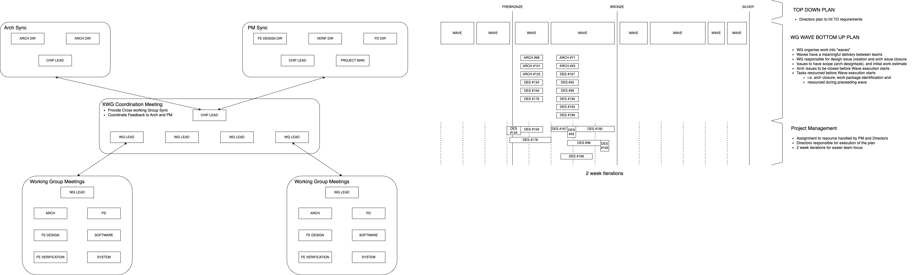

 # Planning Documentation

 This document aims to define the purpose and process of planning in the context of the Europa project.

A simplified presentation can be found [here](./Europa_Planning.pptx)

# Planning

 Effective planning requires the owners to accept they are [responsible](https://dictionary.cambridge.org/dictionary/english/responsibility) and [accountable](https://dictionary.cambridge.org/dictionary/english/accountability#google_vignette) for (and to) the plan.

 On Europa we have 2 types of plan. The format of these plans (.xls, .msp, ....) is the choice of the owners, as long as the purpose of the plan is met.

 |   | [Top-Down](#top-down-plans) | [Bottom-Up](#bottom-up-plans) |
 | - | -------- | --------- |
 | Responsible | Leadership team / directors | Leadership team / Chip Leads / Workgroups / individual contributors |
 | Initial Inputs | Experience, company OKRs | Project plans, specification and individual analysis |
 | Purpose | Provide early, long-term visibility of milestones and resourcing for a team for clear, easy co-ordination across the company | Provide data-driven, execution focused task and assignment plans based on the current, best effort project specifications |
 | Granularity | person-months | person-weeks |
 | Scope / life-time | Months -> Years | Weeks -> Months |

Both types of plan are [living documents](https://en.wikipedia.org/wiki/Living_document) and will be maintained / updated througout the project.
They will be publically visible and will adapt based on changes of requirements, implementation challenges, resource changes, and any number of other external influences. This should not be viewed as indecision or lack of planning. This is the reality of complex projects and essential to long-term success.

There needs to be constant communication between the workgroups and leadership team to ensure both these plans are still accurate and relevant. There will be a back-and-forth between the workgroups and leadership team to ensure resource is available. The leadership team expect the workgroups to be responsible for making them aware of the requested resources. However, equally the workgroups should expect to be challenged on these requests. This could easily be in either direction. i.e. the leadership team may push back on the requested resource and ask for an alternative, lower effort approach. Just as likely though, the leadership team may believe the estimates are optimistic and offer additional resource.

## Top-Down Plans

The top-down plan shall be used for:
1.	Calculating the amount of resource required for a project. Driving decisions such as hiring, contractors and licensing
2.	Balancing resource and effort across multiple parallel projects
3.	Ensuring co-ordination between disciplines at a gross, granular level
4.	Scheduling development and maintenance projects, such as infrastructure and personal development plans within the team

The top-down plans for the silicon teams can be found here:

| Team |
| ---- |
| [Logical Design](https://axeleraai.sharepoint.com/sites/pwa/projectdrilldown.aspx?ProjUid=52521442-97c6-ee11-822a-ac5afc8f51cd) |
| [Design Verification](https://axeleraai.sharepoint.com/:x:/r/sites/AXELERAAI-ResearchandDevelopment/_layouts/15/Doc.aspx?sourcedoc=%7B42C7DECD-ABA6-4A80-97D2-AD14D2E84189%7D&file=Europa%20Verif%20Plan.xlsx&wdOrigin=TEAMS-MAGLEV.p2p_ns.rwc&action=default&mobileredirect=true) |
| [ Physical Design](https://axeleraai-my.sharepoint.com/:x:/g/personal/simon_clemow_axelera_ai/EQABcMt5T5xJn5ZOAONtGxMBbeJ6gunPOOJlxV07Tke7CA?e=2JejAD&wdOrigin=TEAMS-MAGLEV.p2p_ns.rwc&wdExp=TEAMS-TREATMENT&wdhostclicktime=1716193991226&web=1)

## Bottom-Up Plans

To keep these bottom-up plans manageable workgroups will work with waves. Where a wave represents a bucket of activity resulting in a specific delivery – likely to be handed to another team. E.g. “AICore Hello World”.

For simplicity [GitLab Iterations](https://docs.gitlab.com/ee/user/group/iterations/) (averaging 2 weeks) can be used to define and track these waves (a wave will likely span more than a 2 week iteration). A representative diagram is attached to this mail (thanks Matt).
 
Depending on the stage of the project and / or numerous other inputs a wave may be focused predominantly on enabling a future PD milestone, or un-gating a tranche of verification activity. The chip leads will work with the leadership team to balance these conflicts and ensure their respective teams are adequately enabled.

- Workgroups identify a set of architectural issues needing to be closed to fully specify the wave and identify tasks for each discipline required to consider the defined delivery complete
- The workgroup and leadership team work together to ensure
    - Resource is allocated
    - Individuals add time estimates for their assigned deliverables
    - Resources aren’t over-allocated or under-allocated across multiple workgroups
- The leadership and program management teams are responsible for tracking the execution of the waves and adapting where required
- Chip-Leads help co-ordinate
    - Working across workgroups to help with communication and consistency
    - Bridging across architecture and design teams to help resolve / close issues in advance of a given wave
    - Provide the link between workgroups and leadership / program management teams anticipating upcoming challenges and conflicts

There needs to be constant communication between the workgroups, chip-leads and leadership team to ensure both these plans are still accurate and relevant. There will be a back-and-forth between the workgroups and leadership team to ensure resource is available. The leadership team expect the workgroups / chip-leads to be responsible for making them aware of the requested resources. However, equally the workgroups should expect to be challenged on these requests. This could easily be in either direction. i.e. the leadership team may push back on the requested resource and ask for an alternative, lower effort approach. Just as likely though, the leadership team may believe the estimates are optimistic and offer additional resource or guidance.

# Reporting
 
Planning is pointless unless everyone is aware and engaged with the plan.
 
A general rule to follow is - we should all take responsibility for pushing information outwards. We cannot expect everyone to come to us with requests. In addition, with a rapidly growing team, Teams and email are good for announcements, but not reference. We should be using and publicising versioned documentation for reference information like schedules, plans and specifications.
 
By having the workgroups and individuals engaged with the bottom-up plan, we all share the responsibility for schedule and delivery. Through effective tracking and reporting we all share the accountability to this plan.
 
 
- Annoucements from workgroups shall be reported [here](https://teams.microsoft.com/l/channel/19%3Aecff5025167949628e5d65ed5c36ce7d%40thread.tacv2/Working%20Group%20Coordination?groupId=aaf687d0-44fc-4c25-b000-4fc1365fa4b9&tenantId=&ngc=true)
 
Chip leads are responsible for, working with the workgroups, messaging key information, such as milestones. Releases in Omega were haphazard and inconsistent across blocks. We are aiming to be simpler and more obvious with what “done” means to everyone. The chip leads will be responsible for owning this definition. As this is often most relevant to the design team (due to the delivery to both PD and DV), Matt has already started with this challenge from an LD view.

- A [certification flow](https://teams.microsoft.com/l/channel/19%3Aecff5025167949628e5d65ed5c36ce7d%40thread.tacv2/Working%20Group%20Coordination?groupId=aaf687d0-44fc-4c25-b000-4fc1365fa4b9&tenantId=&ngc=true) has been developed. This is responsible for validating a design milestone checklist
- Chip leads will arrange a review before each milestone to confirm the certificate and review the delivery (including any waivers)

The DV team already have git project boards and milestone issues assigned. As the disciplines have unique requirements, this is ok for now. As the project progresses, we should not be afraid to take best practises and refine the process.
 
- Workgroups can / should maintain their existing internal communication channels (Teams, [Confluence](https://axeleraai.atlassian.net/wiki/spaces/Silicon/pages/506396736/Europa+working+groups)…)
 
- Regular (likely weekly) status summary will be collated across all workgroups and sent out to the wider team
 
This will provide links to an up-to-date status for each workgroup, not minutes. Chip leads will be co-ordinating this but will require the help of all workgroups. It will act as a reference, not a diary, and as such information may remain unchanged week to week in certain areas. A key part of this report will be to ensure milestone dates are always visible and people are informed as and when changes are made.
 
- We will use the regular update meeting to provide an update across workgroups
 
We must all be responsible for deciding when and at what level we need to engage with wider workgroups and programs. We all need to understand the difference between opinion and input and trust those who have been given responsibility to deliver. With good reason / information we should all feel empowered to provide important information to a workgroup and / or the project leadership, but we can’t confuse this with discussion or opinion.
 
In parallel to the workgroups:
 
- The project leadership will provide regular, discipline specific updates
 
These will allow the leadership team and individuals to highlight priorities, problems, and progress to the wider team. An example from the DV team can be seen here, but the format / content of these are individual choice.
 
# Tracking
 
Tracking is the responsibility of both the workgroups and leadership team. The intent is always the same:
 
- Provide clarity to all team members on their specific responsibilities and deliverables
- Provide clarity to and from the leadership and wider team on progress and risk associated with deliverables / milestones
 
With good tracking we can:
 
- Adapt resources (people, licenses…) dynamically to cover the wider requirements of the overall project
- Make information based technical decisions
- Make better predictions for future projects, such as Titania
 
Tracking is not there to:
 
- Blame people for missing targets
- Criticize initial effort estimates
 
Not tracking and providing a clear path towards a wave / deliverable is not an option. For consistency and simplicity [GIT issue time estimation and tracking](https://docs.gitlab.com/ee/user/project/time_tracking.html) will be used to automate the tracking. For reference, an example from the DV team can be seen [here](https://git.axelera.ai/ai-dv-team/dv-europa-planning/cva6v/-/boards/107) with associated report [here](https://git.axelera.ai/ai-dv-team/dv-europa-planning/reports/-/blob/main/DVProjects/CVA6V/dv_project.md?ref_type=heads).
 
As workgroups are fully engaged with defining waves, they should expect to understand the reasons for progress (good and bad) and propagate this information to the leadership and program management teams.
 
Everyone must remember that we are all engineers, including the leadership team. We understand that things can go well or badly on a particular task or project for a huge number of different reasons. This is understood and expected. If it’s open and clear, we can all work together to address issues. It’s only difficult when this information is too late or too inaccurate to take effective action. 
 
# Requirements and Specifications
 
The section above is focused on how we can help each other by being clear on our status, expectations, and deliverables. However, it’s equally important to understand and empathise with those provided to us.
 
- Designer / Verification do not expect frozen architectural specifications. However, we need to be clearer.
 
    - Many features / choices are captured in verbose, meandering git issues. At this stage of the project this can no longer be accepted. As such we need to make some simple adjustments in process and mindset.
 
    - Not making a decision is as bad, if not worse, than making the wrong decision. The time for open discussion is over. Requirements / specifications must reflect to Plan-of-Record and object. We understand we shouldn’t be blindly tied to a decision if subsequent information tells us we got it wrong but now we should choose a path and commit.

    - Requirements and specifications need to be clear. We must move away from issues containing discussion. Final decisions should be clear, and the history of the conversation archived for history. The visible / publicised documents must reflect decisions. The design team stated their plan is to move specifications into Git (where it is versioned).

- To help with this Git issues should be closed when a decision is made (we can always re-open if required)
 
- We should expect architectural (from the architecture team) and micro-architectural (from the design team) specifications. This is a big simplification, but ….
    - Architectural specifications – the WHAT
    - Micro-architectural specification – the HOW

- We all need to take responsibility to be productive. If you are blocked due to lack of a deliverable - work with the working groups, chip leads and leadership team to get it resolved. 
 
