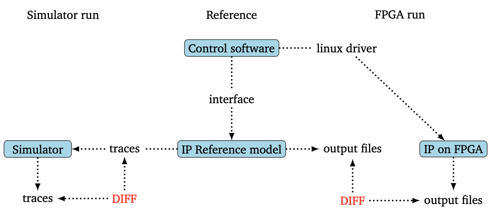
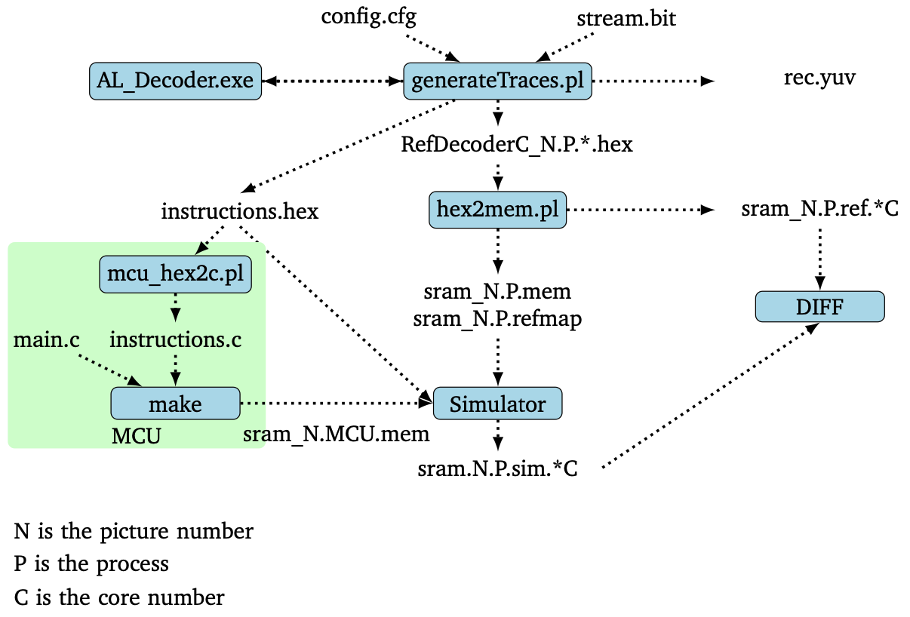
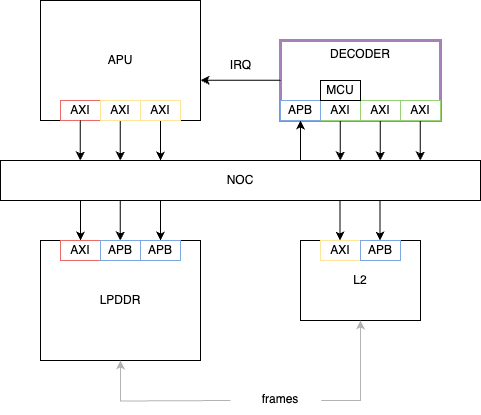

# Decoder Verification Specification

## Introduction

### Overview

A decoder was introduced in the Europa project. The aim is to offload the decoding process from the host thus reducing the computing requirements of it, allowing to use lower-end hosts such as Raspberry Pi and Arduino.
The decoder is an IP from Allegro DVT. It has 3 AXI interfaces, two are connected to the MF of the NOC for the data flow and one to the LTF for control, and 1 APB interface connected the LTF of the NOC for configurations. The IP in composed of 2 decoder cores and an MCU that works in pair with the application processors of the APU to configure and control the decoder cores.
The IP being already verified, the verification will focus on the integration verification and the performance verification.


### Ownership
Who to contact for information

|  Team              | Contact         |
| ------------------ | --------------- |
| ***Architecture*** | @stefan.mach|
| ***Design***       | @leonidas.katselas|
| ***Verification*** | @stephane.gros|

### Reference
Where to find the design documentation

| Team               | Specification |
| ------------------ | ------------- |
| ***Architecture*** |[Arch Spec](https://doc.axelera.ai/prod/europa/latest/europa_architecture/blocks/dcd/dcd_block_spec/)|
| ***Design***       |[Block Spec]()|

### Project Planning and Tracking
Where to find project plans and trackers

|   | Link |
| - | ---- |
| ***Plan*** |[Gitlab Issues Board](https://git.axelera.ai/ai-dv-team/dv-europa-planning/CODEC/-/issues/?sort=created_date&state=all&first_page_size=20)|
| ***Issues*** |[Gitlab Open Issues](https://git.axelera.ai/ai-dv-team/dv-europa-planning/CODEC/-/issues/?sort=created_date&state=opened&first_page_size=20)|

## Verification strategy

The Decoder is a verified IP, therefor our main focus are the integration verification and the performance verification.
The goal of the integration verification is to make sure the IP is properly connected, that it is accessible and that it can access the resources it needs.
On the other hand the goal of the performance verification it to detect architectural issues that would lead to bottleneck for instance.

In the document integration.pdf from the IP delivery, Allegro DVT describes a validation flow. It consists in 2 methods to run tests. One is targeting the RTL simulation and the other one FPGA or emulation.

On the one hand, the reference model from Allegro DVT can generate traces that consists of SRAM buffers for input frames, reference frames and MCU code, and an file with instructions (start/end frame, register writes, IRQ waits).
The execution of theses test consists in loading memory and dumping it according to the instructions.
Then at the end of the simulation, an off-line comparison is made between the reference frames and the dumped ones.
Allegro refers to these test as "Custom tests".
On our side will refer to them as "baremetal tests". In fact, we'll convert the traces to C code to be able to execute the tests using the APU at system level.

On the other hand, tests are can be run using a linux driver and communicate with the reference model to generate output files used for comparison, at the end of the test.

In addition, Allegro DVT is providing a testplan with conformance tests that can give us a baseline for our verification.

## Block Level Testbench

As the integrator of the IP we need to replace the RAM instances by our own memory cuts.
The block level testbench allows us to quickly check that our memory cuts are well integrated.
Allegro DVT is providing a list of custom tests for that purpose.
Then we will re-use the testbench provided by Allegro as well, an just substitue their top DUT by ours.
By doing so, it allows to run all their tests as is, even the pre-built ones.

## System level testbench
#### Overview

The decoder is connected to the rest of the system through the NOC, except for the interrupt line that is directly connected to the APU, and the JTAG interface that is connected to another TAP.
It has 3 AXI master interfaces, one for the MCU and two for the decoder cores, and 1 APB slave interface for configuration.
The testbench described below can be use for both baremetal tests and linux tests.
As said earlier, the baremetal tests are the result of the conversion of a custom test in C. More on that subject here: [Baremetal tests](/sw/scripts/decoder/README.md)

#### Diagram


#### How to Run
TODO
How to check out and run

```
git clone etc.
source ....
cd ...
make ...
```
#### Regressions
TODO
Which regressions to run

| Regression | Description | Source | Link |
| ---------- | ----------- | ------ | ---- |
| regression | description | [Link to Source]() | [Last CI Run]()|

#### Metrics / Coverage Plan

##### Tests

The tests are divided in the following categories:
- RAM integration tests: they are tests provided by Allegro DVT to validate the integration of our own memory cuts in the IP. They are run at block level.
- Integration tests: it contains baremetal tests and simple linux tests. They are sanity tests to validate the integration of the IP to the rest of the system. The baremetal tests are based on the one provided by Allegro DVT and the linux tests aim at validating the SW stack before running performance and applicative testcases.
- Performance tests: the performances tests aim at verifying the performance targetted by running heavier workloads than the integration tests. There are both baremetal and linux tests.
- Power/Clock tests: Allegro DVT also provides tests for power and clock.
- Debug tests: tests using the JTAG interface

[Testlist](https://git.axelera.ai/prod/europa/-/blob/main/verifsdk/tests_uvm_dcd.yaml)

##### Coverage

All architectural requirements must be covered by at least one test or one cover item. A requirement is verified when all tests linked to it are pass and all coverage items linked to it are covered.
The metrics we'll look at are:
- toggle coverage on interface of the decoder. We aim 100% coverage.
- toggle coverage on a subset of the interface of the other subsystems involved, such as APU, DDR, L2 for instance. The aim is only to validate there was activity.
- several features should be covered by function coverpoints. Example: DECODER_PERF_DEC_200_0 to cover the 32 outstanding transactions (unless we assume it's enough to measure the throughput).
- Every tests doing some decoding should measure the performance and report it.

[Metrics](https://git.axelera.ai/prod/europa/-/blob/main/verifsdk/metrics/dcd_metrics.yaml)

## Formal Proofs
TODO
### Overview
Description of any formal environments

### How To Run

```
git clone etc.
source ....
cd ...
make ...
```

#### Regressions
Which regressions to run

| Regression | Description | Source | Link |
| ---------- | ----------- | ------ | ---- |
| regression | description | [Link to Source]() | [Last CI Run]()|

#### Metrics / Coverage Plan
VPlan / Verification IQ excel / csv file

- [Link]()

## System Level Testcases
Tests to be run at top level / Veloce

| Testcase   | Description | Source | Link |
| --------   | ----------- | ------ | ---- |
| testcase   | description | [Link to Source]()| [Last CI Run]()|
