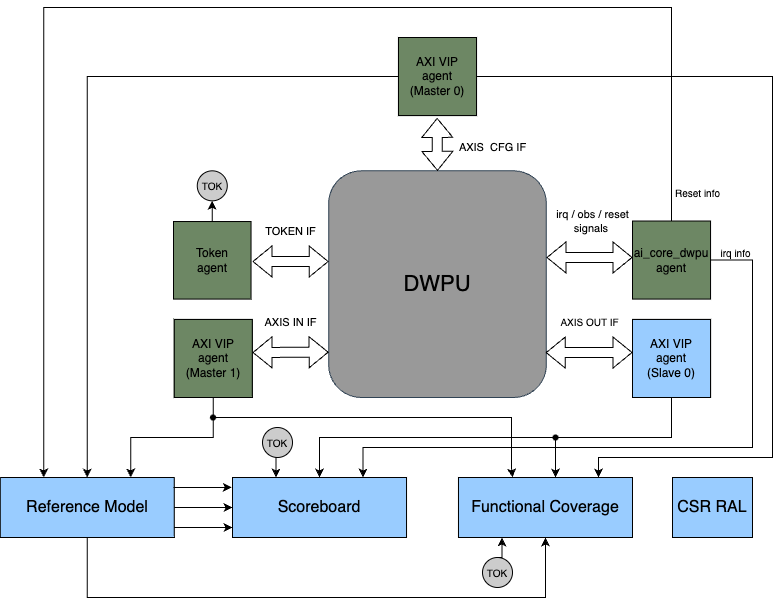
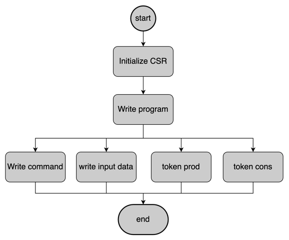
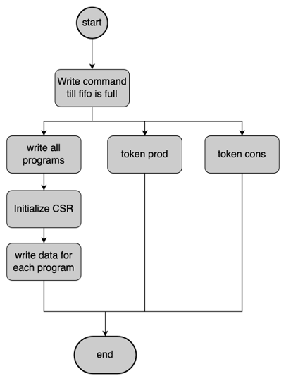

# DWPU Verification Document

## Introduction

### Overview
The aim of this document is to explain how the DWPU inside AI CORE will be tested

### Ownership

|  Team              | Contact         |
| ------------------ | --------------- |
| ***Architecture*** | Stefan Mach |
| ***Design***       | Wolfgang Rönninger |
| ***Verification*** | Jorge Carvalho |

### Reference
Where to find the design documentation

| Team               | Specification |
| ------------------ | ------------- |
| ***Architecture*** |[Arch Spec](https://doc.axelera.ai/prod/europa/0.0/documentation/ip/dwpu/)|
| ***Design***       |[Block Spec](https://doc.axelera.ai/prod/europa/0.0/documentation/ip/dwpu/)|

### Project Planning and Tracking
Where to find project plans and trackers

|   | Link |
| - | ---- |
| ***Plan*** |[Gitlab Issues Board](https://git.axelera.ai/ai-dv-team/dv-europa-planning/AIC-DWPU/-/issues/)|
| ***Issues*** |[Gitlab Open Issues](https://git.axelera.ai/prod/europa/-/issues/?sort=closed_at_desc&state=opened&label_name%5B%5D=block%3Aaic%3Adwpu&label_name%5B%5D=bug%3A%3Adesign&first_page_size=100)|

## Block Level Testbenches

### Testbench 1
#### Overview
This testbench aims to test DWPU block and it uses UVM testbench structure to verify it.

Components used:
 - AXI VIPs to send and monitor data
 - DWPU agent for side band channels
 - token agent for token lines
 - scoreboard, refmodel, and functional coverage for predict and compare data

#### Diagram


#### Reference model
This component receives data from:
 - DWPU agent sideband signals information (reset information)
 - Configuration AXI VIP monitor (CSR information)
 - Input data stream AXI VIP monitor

With the inputs received, the reference model sends the predictions to scoreboard. Namelly:
  - Output data stream
  - Interruptions
  - Token information

#### Sequence stimuli types
There are two types of stimuli, usual case of normal programming and the case of fifo full testcases.

##### Usual case


In this case the CSR and the program are written first and then, in parallel are sent the command and the input data.

##### Fifo full case


In this case, first, the commands are written to the command FIFO until it's full. Only after, the program, the CSR (to enable execution) and the data are sent sequencially.

#### How to Run
```
git clone git@git.axelera.ai:prod/europa.git europa_repo
cd europa_repo
source .env-default-modules
cd hw/ip/dwpu/default/dv/sim
#run testcase
make run_vsim UVM_TESTNAME=ai_core_dwpu_standard_test
#run merge request regression
make regress_vsim REGRESS_VERIFSDK_LABEL=HW_IP_DWPU_DV_SIM_MERGE_REQUEST REGRESS_VERIFSDK_PLATFORM=uvm.HW_IP_DWPU_DEFAULT_DV_SIM
#run nightly regression
make regress_vsim REGRESS_VERIFSDK_LABEL=HW_IP_DWPU_DV_SIM_NIGHTLY_TEST REGRESS_VERIFSDK_PLATFORM=uvm.HW_IP_DWPU_DEFAULT_DV_SIM
#run weekly regression
make regress_vsim REGRESS_VERIFSDK_LABEL=HW_IP_DWPU_DV_SIM_WEEKLY_TEST REGRESS_VERIFSDK_PLATFORM=uvm.HW_IP_DWPU_DEFAULT_DV_SIM
```
#### Regressions

| Regression | Description | Source | Link |
| ---------- | ----------- | ------ | ---- |
| Merge | Runs ai_core_dwpu_standard_test which verifies that DWPU basic datapath scenarios are working without errors | [Link to Source](https://git.axelera.ai/prod/europa/-/blob/main/verifsdk/tests_uvm_dwpu.yaml) | [Last CI Run](https://git.axelera.ai/prod/europa/-/jobs/1333435)|
| Nightly | Subset of testcases that make sure the basic functionality of DWPU is working without errors | [Link to Source](https://git.axelera.ai/prod/europa/-/blob/main/verifsdk/tests_uvm_dwpu.yaml) | [Last CI Run](https://git.axelera.ai/prod/europa/-/pipeline_schedules)|
| Weekly | All testcases implemented to test DWPU block | [Link to Source](https://git.axelera.ai/prod/europa/-/blob/main/verifsdk/tests_uvm_dwpu.yaml) | [Last CI Run](https://git.axelera.ai/prod/europa/-/pipeline_schedules)|

#### Metrics / Coverage Plan
- [Testlist](https://git.axelera.ai/prod/europa/-/blob/main/verifsdk/tests_uvm_dwpu.yaml)
- [Metrics](https://git.axelera.ai/prod/europa/-/blob/main/verifsdk/metrics/dwpu_metrics.yaml)

## Formal Proofs (TODO)
### Overview
Description of any formal environments

### How To Run

```
git clone etc.
source ....
cd ...
make ...
```

#### Regressions
Which regressions to run

| Regression | Description | Source | Link |
| ---------- | ----------- | ------ | ---- |
| regression | description | [Link to Source]() | [Last CI Run]()|

#### Metrics / Coverage Plan
VPlan / Verification IQ excel / csv file

- [Link]()

## System Level Testcases (TODO)
Tests to be run at top level / Veloce

| Testcase   | Description | Source | Link |
| --------   | ----------- | ------ | ---- |
| testcase   | description | [Link to Source]()| [Last CI Run]()|
