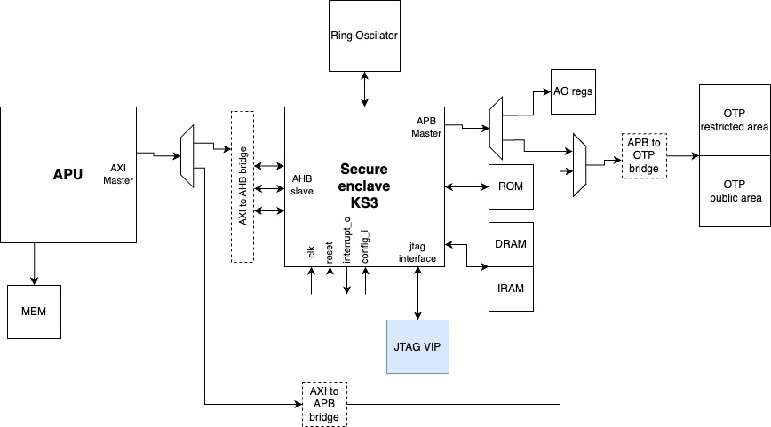

# Security Verification Plan

## Introduction

### Overview
The aim of this document is to specify how and what will be verified regarding security on Europa project.


### Ownership
Who to contact for information

|  Team              | Contact         |
| ------------------ | --------------- |
| ***Architecture*** | Matt Moris |
| ***Design***       | Abhishek Maringanti |
| ***Verification*** | Jorge Carvalho |

### Reference (TODO)
Where to find the design documentation

| Team               | Specification |
| ------------------ | ------------- |
| ***Architecture*** |[Arch Spec](https://git.axelera.ai/prod/europa/-/issues/200)|
| ***Design***       |[Block Spec]()|

### Project Planning and Tracking (TODO)
Where to find project plans and trackers

|   | Link |
| - | ---- |
| ***Plan*** |[Gitlab Issues Board](https://git.axelera.ai/ai-dv-team/dv-europa-planning/SECURITY/-/issues/2)|
| ***Issues*** |[Gitlab Open Issues]()|

## Block Level Testbench

### Secure boot Testbench
#### Overview
The aim of this testcase is to verify that integration of secure enclave is correctly implemented.
In the image below what we see is the security enclave (from Kudelski) connected to APU through AXI (needs confirmation because KSE3 only has AHB connection) to be able to check if the code that will be ran on CPU RAM (Linux) is correctly signed. The code is stored in Flash and it will be copied to CPU RAM if it is correctly signed.

#### Pre-requisites
 - steps for a full secure boot clarified [link documentation](TODO)
 - Linux image signed [link gitlab issue](TODO)
 - KSE 3 ROM [link gitlab issue](TODO)
 - Testbench environment structure created to allow KSE3 testing [link gitlab issue](TODO)
 - List of scenarios to be tested [link list of scenarios](TODO)
 
#### Diagram


#### How to Run (TODO)
How to check out and run

```
git clone etc.
source ....
cd ...
make ...
```
#### Testcases (Block level)

| Testcase   | Description | Source | Link |
| --------   | ----------- | ------ | ---- |
| sec_sanity_test | Verify that compiles and runs a simple command using KSE 3 | [Link to Source]()| [Last CI Run]()|
| sec_register_test | Verify that all register are accessible and compliant with the specification | [Link to Source]()| [Last CI Run]()|
| sec_apu_otp_access_test | Verify that APU can access only the OTP host area with different sizes (8, 16 and 32 bits) | [Link to Source]()| [Last CI Run]()|
| sec_performance_test | Verify the time that takes to decrypt/encrypt a determinated amount of data | [Link to Source]()| [Last CI Run]()|
| sec_kse_debug_access_test | Verify that debug is only open when in WAFER_TEST, WAFER_PERSO and RMA stages | [Link to Source]()| [Last CI Run]()|
| sec_kse_open_debug_infield_test | Verify that is possible to open debug during infield operations using challenge interface command (needs confirmation) | [Link to Source]()| [Last CI Run]()|

##### Links to sub-sets of testscases
Below are the links to sub-sets of the testcases that are related with KSE 3 block specifically
 - [SW tests for KSE 3](sw_tests_kse3_verif_plan.md)
 - [Lifecycle and accesses](lifecycle_access_verif_plan.md)

#### Regressions (TODO)
| Regression | Description | Source | Link |
| ---------- | ----------- | ------ | ---- |
| regression | description | [Link to Source]() | [Last CI Run]()|

#### Metrics / Coverage Plan

- [https://git.axelera.ai/prod/europa/hw/impl/europa/blocks/soc_mgmt/dv/docs/vplan/security_vplan.csv](security_vplan)


## Top Level Testcases

| Testcase   | Priority | Description | Source | Link |
| --------   | -------- | ----------- | ------ | ---- |
| unsec_boot | HIGH |Unsecure boot is done successfully | [Link to Source]()| [Last CI Run]()|
| sec_boot   | HIGH |Secure boot is done successfully | [Link to Source]()| [Last CI Run]()|
| sec_jtag_otp_access_test | TBD | Verify that is possible to read and write OTP using JTAG interface | [Link to Source]()| [Last CI Run]()|
| sec_infield_repair_sanity_test | TBD | Verify that with infield repair is possible to repair errors that exist on memories. Verify that when repair is being done, no secret information is present on memories | [Link to Source]()| [Last CI Run]()|
| sec_encrypt_data_from_pcie  | Nice to have | Data (ex: AI Models) is moved encrypted and authenticated to AIPU DDR from external via PCIe. Then Data received is verified and decrypted by Root-of-Trust and write it unencrypted to DDR  | [Link to Source]()| [Last CI Run]()|
| sec_encrypt_data_from_sd | Nice to have | Data (ex: AI Models) is moved encrypted and authenticated to AIPU DDR from AIPU SD Card. Then Data received is verified and decrypted by Root-of-Trust and written, decrypted, to DDR  | [Link to Source]()| [Last CI Run]()|
| sec_encrypt_aipu_to_aipu_data | Nice to have | Data is moved encrypted and authenticated from one AIPU DDR to other AIPU DDR. Then Data received is verified and decrypted by Root-of-Trust and written, decrypted, to DDR | [Link to Source]()| [Last CI Run]()|
