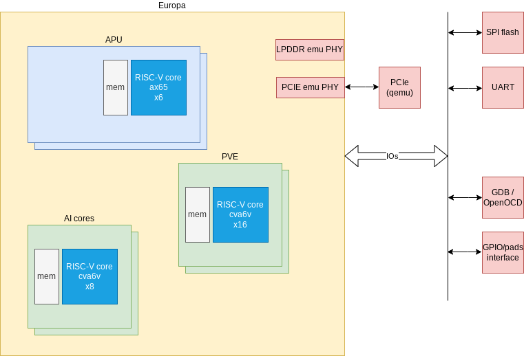
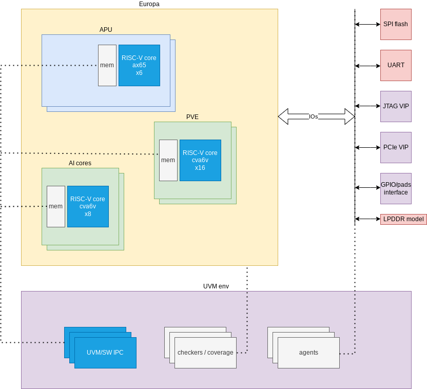

# Top-level Verification Plan

## Introduction

### Overview
Top-level work package in Europa focuses on:

- top-level DUT
- interactions between the top-level IPs and subsystems
- top-level IPs not already covered in other work packages

The tests will be written in C and executed on the CPUs in order to be as close as possible to the real life usage.

### Ownership
Who to contact for information

| Team               | Contact           |
| ------------------ | ---------------   |
| ***Architecture*** | Bert Moons        |
| ***Design***       | Yi Lu             |
| ***FW***           | Jovin Langenegger |
| ***Verification*** | Antoine Madec     |

### Reference
Where to find the design documentation

| Team                    | Specification                                                                                                                             |
| ------------------      | -------------                                                                                                                             |
| ***Architecture***      | [Arch Spec](https://axeleraai.atlassian.net/wiki/spaces/archrd/pages/338984981/Europa+Top+Level+Architecture)                             |
| ***Design***            | N/A                                                                                                                                       |
| ***FW***                | [FW activities](https://axeleraai.atlassian.net/wiki/spaces/SOFTWARE/pages/612663378/Europa+Activities+Map+workshop#Activities-Map)       |
| ***Typical Use Cases*** | [Top-level acceptance tests](https://axeleraai.atlassian.net/wiki/spaces/archrd/pages/605716520/Europa+Architecture+E2E+acceptance+tests) |

### Project Planning and Tracking
Where to find project plans and trackers

|                       | Link                                                                                                  |
| -                     | ----                                                                                                  |
| ***Plan Verif***      | [Gitlab Issues Board](https://git.axelera.ai/ai-dv-team/dv-europa-planning/TOP-MISC/-/issues)         |
| ***Top Issues***      | [Gitlab Open Issues](https://git.axelera.ai/prod/europa/-/issues/?label_name%5B%5D=block%3Atop)       |
| ***Veloce Issues***   | [Gitlab Open Issues](https://git.axelera.ai/prod/europa/-/issues/?label_name%5B%5D=veloce)            |
| ***Verifsdk Issues*** | [Gitlab Open Issues](https://git.axelera.ai/prod/europa/-/issues/?label_name%5B%5D=verifsdk%3A%3A%2a) |

## Testbenches

Goals:

1. run C tests in simulation and Veloce through [Verifsdk](https://git.axelera.ai/prod/europa/-/tree/main/verifsdk?ref_type=heads)
2. have full/partial top-level DUTs (speeds up simulation and reduces Veloce board usage)
3. reuse the same hdl_top.sv for both simulation/Veloce
4. reuse the same hdl_top.sv for all top-level DUTs

### Veloce vs Simulation
- speed: Veloce runtime is 1000x times faster, simulation compilation is 3x faster
- debug: simulation waveform generation is easier, turn around time is faster
- Veloce only features: run gdb/OpenOCD, Qemu PCIe tests, interractive UART
- simulation only features: X propagation, trigger UVM magic from C code, run analog models (PLL, PVT, etc)

### Testbench: Veloce
#### Overview
The Veloce should be preferred to the simulation when possible since it is way faster.

See [Veloce vs Simulation](#veloce-vs-simulation)

|                | Link                                                                                                                       |
| -              | ----                                                                                                                       |
| Documentation  | [Veloce userguide](https://doc.axelera.ai/prod/europa/latest/user_guide/veloce/)                                           |
| Available DUTs | [top-level DUTs](https://git.axelera.ai/prod/europa/-/tree/main/hw/impl/europa/emulation/input/compilation?ref_type=heads) |
| SW documentation | [Verifsdk](https://git.axelera.ai/prod/europa/-/tree/main/verifsdk?ref_type=heads)                                         |

#### Diagram

#### How to Run
See [Veloce userguide](https://doc.axelera.ai/prod/europa/latest/user_guide/veloce/#run)

#### Regressions
See [Veloce userguide](https://doc.axelera.ai/prod/europa/latest/user_guide/veloce/#regressions)

#### Metrics / Coverage Plan
TODO: add coverage

### Testbench: Simulation
#### Overview
The simulation platform should only be used:

- when playing with analog models (PLL, PVT, etc)
- when UVM magic is needed (backdoor read, UVM sequence, etc)
- in CI: to check X propagation
- for quick debug on small tests

See [Veloce vs Simulation](#veloce-vs-simulation)

|                | Link                                                                                                              |
| -              | ----                                                                                                              |
| Documentation  | [Simulation doc](https://git.axelera.ai/prod/europa/-/blob/main/docs/flow_docs/flows/simulation.md?ref_type=head) |
| Available DUTs | [top-level DUTs](https://git.axelera.ai/prod/europa/-/tree/main/hw/impl/europa/dv?ref_type=heads)                 |
| SW documentation | [Verifsdk](https://git.axelera.ai/prod/europa/-/tree/main/verifsdk?ref_type=heads)                                |

#### Diagram

#### How to Run
See [top-level simulation](https://doc.axelera.ai/prod/europa/latest/user_guide/top_level_simulation/#run)

#### Regressions
See [top-level simulation](https://doc.axelera.ai/prod/europa/latest/user_guide/top_level_simulation/#regressions)

#### Metrics / Coverage Plan
TODO: add coverage

## Formal Proofs
After talking with Manuel Oliveira, it is currently blocked by the following issues:

- https://git.axelera.ai/prod/europa/-/issues/592
- https://git.axelera.ai/prod/europa/-/issues/593
