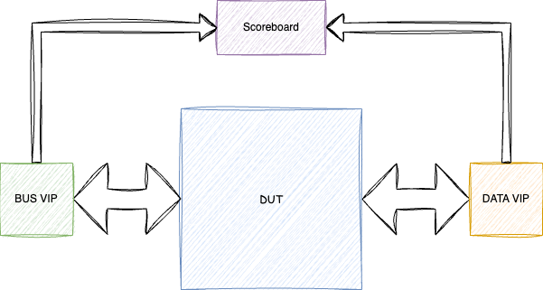

# Verification Specification Template

## Introduction

### Overview
Describe the scope and purpose of the work package

 - Which projects does this work package belong to?
 - Where in system / chip is it located?
 - What are the high level use-cases?


### Ownership
Who to contact for information

|  Team              | Contact         |
| ------------------ | --------------- |
| ***Architecture*** | |
| ***Design***       | |
| ***Verification*** | |

### Reference
Where to find the design documentation

| Team               | Specification |
| ------------------ | ------------- |
| ***Architecture*** |[Arch Spec]()|
| ***Design***       |[Block Spec]()|

### Project Planning and Tracking
Where to find project plans and trackers

|   | Link |
| - | ---- |
| ***Plan*** |[Gitlab Issues Board]()|
| ***Issues*** |[Gitlab Open Issues]()|

## Block Level Testbenches

### Testbench 1
#### Overview
Description of purpose and style of Testbench

#### Diagram


#### How to Run
How to check out and run

```
git clone etc.
source ....
cd ...
make ...
```
#### Regressions
Which regressions to run

| Regression | Description | Source | Link |
| ---------- | ----------- | ------ | ---- |
| regression | description | [Link to Source]() | [Last CI Run]()|

#### Metrics / Coverage Plan
VPlan / Verification IQ excel / csv file

This section should link to at least a testlist and a list the metrics, both should be a machine readable yaml files.
The testlist must be named test_fw_<block_name>.yaml or test_uvm_<block_name> and be located in $REPO_ROOT/verifsdk/. It describes a list of tests that can be linked to requirements and that can also be used for regressions. The file format is detailed in the following [README](/verifsdk/README.md).
The metrics file must me named metrics_<block_name>.yaml and be located in $REPO_ROOT/verifsdk/metrics. It describes a list of various metrics such as covergroups, performance and more. The goal is to be able to describe a metric and link it to requirements. The file format is detailed in the following [README](/verifsdk/metrics/README.md).

- [Link]()

## Formal Proofs
### Overview
Description of any formal environments

### How To Run

```
git clone etc.
source ....
cd ...
make ...
```

#### Regressions
Which regressions to run

| Regression | Description | Source | Link |
| ---------- | ----------- | ------ | ---- |
| regression | description | [Link to Source]() | [Last CI Run]()|

#### Metrics / Coverage Plan
VPlan / Verification IQ excel / csv file

- [Link]()

## System Level Testcases
Tests to be run at top level / Veloce

| Testcase   | Description | Source | Link |
| --------   | ----------- | ------ | ---- |
| testcase   | description | [Link to Source]()| [Last CI Run]()|
