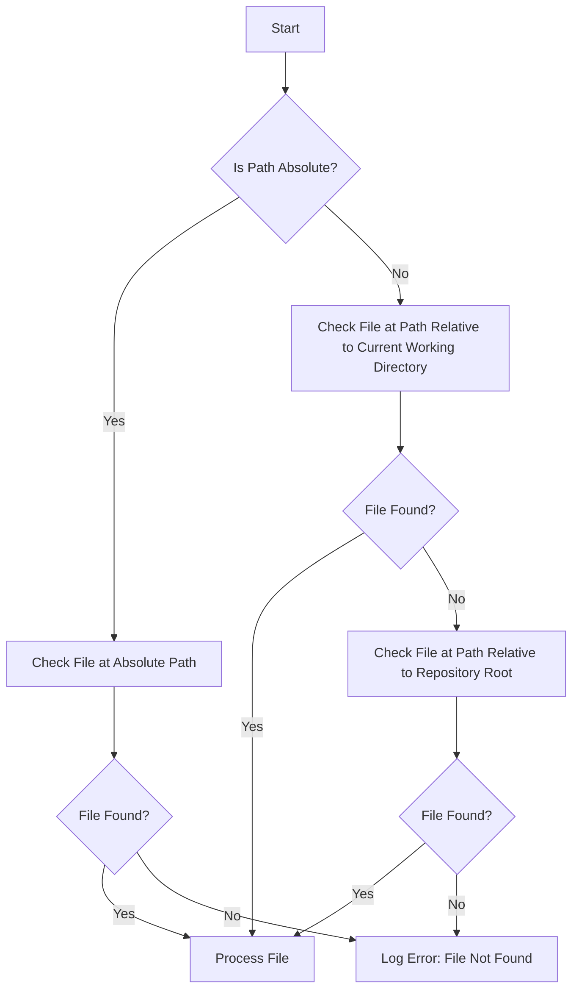

# Verible Formatter Script

The verible formatter script provides a command line interface to format Verilog source files using the Verible formatter. It is designed to operate within a Git repository, allowing for selective formatting of files based on specific criteria such as inclusion lists, exclusion lists, and file types.

## Features

- Selective Formatting: Allows formatting specific files, all files, or files defined in allowlists.
- In-Place Formatting: Option to overwrite original files with formatted content.
- Diff Display: Shows differences between original and formatted files.
- CST Display: Prints the Concrete Syntax Tree (CST) for debugging purposes.

## Prerequisites

- Python 3.x
- Git installed and accessible from the command line
- Verible Verilog formatter installed and accessible from the command line

## Installation

Ensure that the script has executable permissions:

```bash
chmod +x verible_format.py
```

## Usage

Run the script from the command line, specifying options as needed:

```bash
./verible_format.py [options]
```

### Command Line Options

- `-q`, `--quiet`: Suppresses all output except for errors and warnings. Useful for reducing noise in automated environments.
- `-v`, `--verbose`: Enables detailed debug messages, providing insight into the script's operations for troubleshooting.
- `--show-diff`: Displays differences between the original and formatted files if there are any changes.
- `--show-cst`: Outputs the CST of the processed files, aiding in debugging formatting issues.
- `--progress`: Shows a progress bar indicating the number of files processed relative to the total.
- `--inplace`: Formats files directly, overwriting the original files. Use with caution; backing up files or using version control is recommended.
- `-l`, `--allowlist`: Restricts formatting to files specified in a predefined allowlist (`verible_format_allowlist.txt`).
- `-af`, `--allowlist-file` : Path to the allow list file (default: `hw/scripts/gen_files/verible_format_allowlist.txt`).
- `-i`, `--ignore`: Ignores files specified in a predefined ignore list (`verible_format_ignore.txt`).
- `-if`,`--ignore-file` : Path to the ignore file list (default: `hw/scripts/gen_files/verible_format_ignore.txt`).
- `-a`, `--all`: Formats all `.sv` and `.svh` files found in the repository.
- `-f`, `--files`: Specifies one or more files to format. Accepts space-separated file paths.

### Examples

Format specific files and show diffs:

```bash
./verible_format.py --show-diff -f path/to/file1.sv path/to/file2.sv
```

Format all repository files in place and show progress:

```bash
./verible_format.py --inplace --progress --all
```

Use allowlist and ignore files in verbose mode:

```bash
./verible_format.py --verbose --allowlist --ignore
```

## File Path Resolution

The script handles file path resolution in a manner to accommodate both absolute and relative paths. This ensures that users can specify file paths according to their convenience, whether running the script from the repository's root or any other directory.

This flowchart effectively illustrate how the script processes different types of file paths when attempting to locate and possibly manipulate files:



### Absolute Paths

When a file path provided to the script is absolute, the script attempts to access the file directly at the specified location. If the file does not exist at that location, an error is logged stating that the file could not be found.

Example:

Assuming `/home/user/projects/my_project/src/module.sv` is an absolute path:

```bash
./verible_format.py --files /home/user/projects/my_project/src/module.sv
```

If `/home/user/projects/my_project/src/module.sv` exists, it will be formatted. If it does not, the script logs an error message.

### Relative Paths

If the path provided is relative, the script first checks if the file exists at the specified path relative to the current working directory. If the file is not found, the script then attempts to resolve this path relative to the top-level directory of the repository. This is particularly useful when the script is invoked from a different directory within the repository.

Example:

Assuming the script is run from `/home/user/projects/my_project/` and the repository root is also `/home/user/projects/my_project/`:

```bash
./verible_format.py --files src/module.sv
```

1. The script first checks for `/home/user/projects/my_project/src/module.sv`.
2. If not found, and the repository root is detected as `/home/user/projects/my_project/`, it checks for `/home/user/projects/my_project/src/module.sv` again but using the repository root as the base for the relative path.

This dual-path checking mechanism ensures that the file is located regardless of the directory from which the script is executed, as long as the path is correct relative to either the current directory or the repository root.

### How to Add a File to the Ignore List

If you want to skip a certain file, you can do so by adding to the ignore list. By default, this file is located at `hw/scripts/gen_files/verible_format_ignore.txt`. Add the relative path from repository root for the file you wish to ignore. Each file path should be on a new line.

For example:

```plaintext
# Add files to be ignored here
relative/path/to/ignore_file1.sv
```

Save the file and run the script with the `-i` or `--ignore` option.
You can also provide your own ignore list by writing it to a file and providing it by `-if` or `--ignore-file` option.

### Tips for Specifying Paths

- Always verify the current directory when using relative paths to avoid errors.
- Use absolute paths for clarity and to avoid dependency on the script?s execution directory, especially in automated environments.

## Logging

The script supports several logging levels, which can be controlled with the `-q` (quiet) and `-v` (verbose) options:

- ERROR: Shows only critical errors that prevent the script from running.
- WARNING: Displays warnings that might affect the operation but do not halt the script.
- INFO: General information about script operations (default level).
- DEBUG: Detailed logs useful for diagnosing problems or understanding the script's behavior.

## Notes

- Ensure that the Verible formatter (`verible-verilog-format`) is correctly installed and included in your system's PATH.
- It is advisable to run the script in a test environment or on a branch when using the `--inplace` option to prevent data loss.
