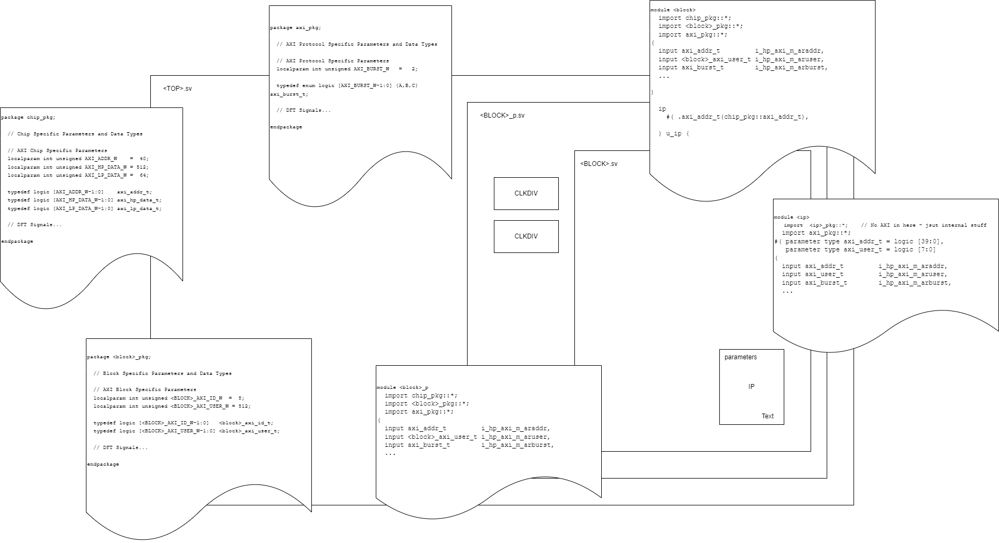

## Source

The style guide incorporates discussion from within the design team across sync meetings, teams chats and the following git issues:


| Issue Num | Synopsis                                                                  |
| --------- | ------------------------------------------------------------------------- |
|   #113    | [IO Naming Convention](https://git.axelera.ai/prod/europa/-/issues/113)   |
|   #231    | [Updates for Lint Check](https://git.axelera.ai/prod/europa/-/issues/231) |


## Naming Rules

### Affixes

Affixes are used in several places to give guidance to intent. The following table lists the affixes that have special meaning.

| Affix(es)         | Type   | Area           | Intent                                                                                          |
| ----------------- | ------ | -------------- | ----------------------------------------------------------------------------------------------- |
| `i_`, `o_`, `io_` | prefix | signal name    | Module inputs, outputs, and bidirectionals                                                      |
| u_                | prefix | instance name  | Module naming when instancing                                                                   |
| _e                | suffix | typedef        | Enumerated types                                                                                |
| _t                | suffix | typedef        | Other typedefs, including signal clusters                                                       |
| _n                | suffix | signal name    | Active low signal                                                                               |
| _n, _p            | suffix | signal name    | Differential pair, active low and active high                                                   |
| _d, _q            | suffix | signal name    | Input and output of register                                                                    |
| _q2,_q3, etc      | suffix | signal name    | Pipelined versions of signals; _q is one cycle of latency, _q2 is two cycles, _q3 is three, etc |
| g_                | prefix | generate label | Where hierarchy is introduced on a generate for / if statement                                  |
| unused_           | prefix | signal name    | Indicate that a signal is expected to be unloaded (but driven).                                 |

When multiple affixes are necessary use the following guidelines:

Guidance suffixes are added together and not separated by additional _ characters (_nq not _n_q)
If the signal is active low _n will be the first suffix.

### Clocks and Resets

Suffix with _clk or _rst (_rst_n for active low).

e.g. i_clk, i_fast_clk, fast_clk.

e.g. por_rst_n, i_por_rst_n


### I/O Data Types


- struct types not allowed at the top level
- wire for clocks and resets in all blocks (simulator performance reasons)
- logic for other uni-directional signals

### Short Names

| Short Name | Description |
| ---------- | ----------- |
| en         | enable      |
| en_n       | disable     |
| clr        | clear       |
| set        | set         |
| inc        | increment   |
| dec        | decrement   |
| ptr        | pointer     |


### Interface Naming

Convention: `[io]_<name>_<protocol>_[ms]_<signal>`


- io: I/O prefix
- name: optional? short name to differentiate ports

Up to the block owner to decide what makes sense
It's fine to not include a name if it doesn't make sense for that block


Protocol: `_axi_`, `_apb_`,  `_ahb_` etc

- [`ms`]: for Manager or Subordinate
- signal: awaddr, arvalid etc

#### Examples
AI Core has 3 AXI Managers (2x512b + 1x64b) + 1 AXI Subordinate, they could be named like:


| Interface      | Naming example           |
| -------------- | ------------------------ |
| 512b Manager 0 | o_init_hp_0_axi_m_wstrb  |
| 512b Manager 1 | i_init_hp_1_axi_m_rvalid |
| 64b Manager    | o_init_lp_axi_m_arcache  |
| Subordinate    | i_targ_lp_axi_s_awaddr   |


L2 has only 1 AXI Manager so it could ommit the name completely: o_axi_s_bvalid

Codec has 3 AXI Managers: 2 of them are used for transferring decoder data + 1 is used for fetching RISC-V instructions (mcu - microcontroller unit in the spec), so could be like:

| Interface         | Naming example       |
| ----------------- | -------------------- |
| Decoder Manager 0 | o_dec_0_axi_m_rready |
| Decoder Manager 1 | i_dec_1_axi_m_bvalid |
| RISC-V Manager    | i_mcu_axi_m_rdata    |


## Signal Declarations

The use of typedefs is encouraged as it allows easy casting to instruct tools that overflow bits in arithmetic evaluations are not required.

```systemverilog
typedef logic [COUNT_W-1:0] count_t;

always_comb count_d = count_t'(count_q + count_t'(1));
```

## SV Constructs

### `always_ff`, `always_comb`

Use always_ff and always_comb statements instead of always @ and assign.

Only use assign statements where signals are inouts or have multiple drivers.


### Case Statements

The use of priority and unique is mandated.

By default, provide a Default Case. Avoiding this will require signoff. Must be fully described and on a critical path.

Use case inside rather than `casex`, `casez`.

### Parameter vs Localparam

Parameters in Packages.

Localparams in Modules.

## Packages

### Prefixing

Packages require prefixing to allow wildcard importing without clashing.

| Package | Examples                                          |
| ------- | ------------------------------------------------- |
| axi_pkg | parameter AXI_....=...; , typedef .... axi_..._t; |
| pve_pkg | parameter PVE_....=...; , typedef .... pve_....t; |

### Packages and their contents

Package contents should align with their scope.

| Package       | Scope                                                                                                                                                                                                                        |
| ------------- | ---------------------------------------------------------------------------------------------------------------------------------------------------------------------------------------------------------------------------- |
| `chip_pkg`    | Contains parameters, types, funcs for a chip implementation, i.e. used inside /hw/impl/                                                                                                                                      |
| `<block>_pkg` | Contains parameters, types, funcs for the block implementation. Can contain block variations of chip parameters e.g. `AXI_DATA_W` (`chip_pkg`) with `<BLK>_AXI_DATA_W` in `<block>_pkg` where the block owns the restriction |
| `<ip>_pkg`    | Contains internal-only parameters, types, funcs for the ip. Anything implementation specific e.g. AXI_DATA_W - needs to be part of the module parameters so they can be set where the IP is instanced.                       |
| `axi_pkg`     | For all AXI specific protocol standard, invariant parameters, types, and enums.                                                                                                                                              |


