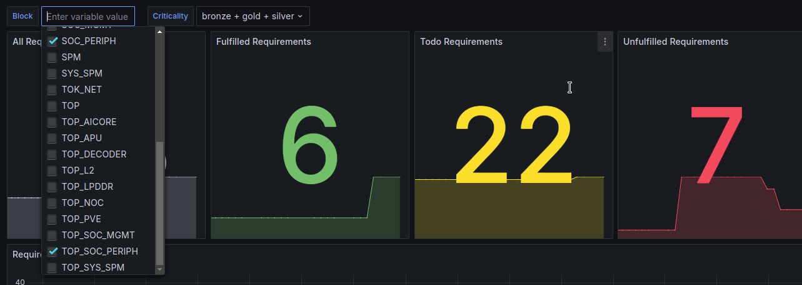
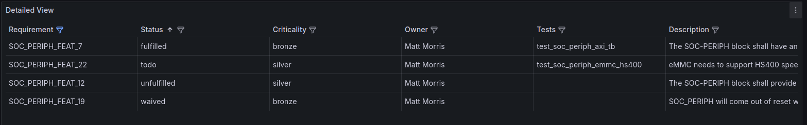
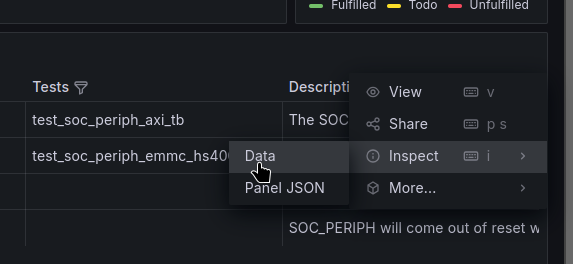
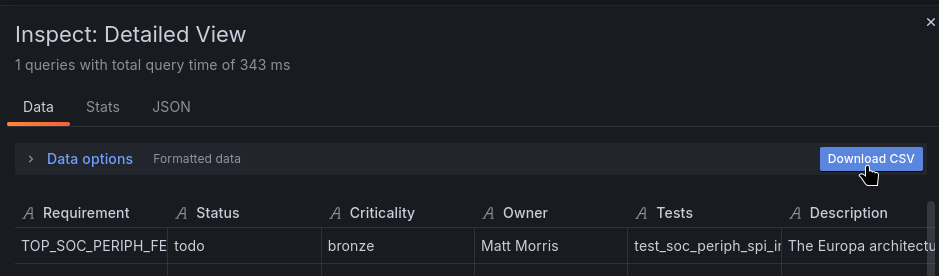

# 📒 Architectural Requirements

Architectural Requirements and [Top-level Coverage](https://doc.axelera.ai/prod/europa/latest/user_guide/top_level_coverage/) are the main metrics we use at top-level.

## Dashboard

### Filtering

Architectural requirements coverage is displayed in [a Grafana dashboard](https://grafana.htz1.axelera.ai/d/edu0ed95y0xkwe/verifsdk-requirements?orgId=1). Each subsystem possess block-level and top-level requirements. In the dashboard, one must select both to display the full coverage.



### Status

A requirement can have four states:

- *unfulfilled*: no test is linked to it.
- *todo*: tests are linked to it, but at least one of them has the label TODO, meaning it is not implemented yet.
- *fulfilled*: None of the tests linked have the TODO label.
- *waived*: Requirement has been [waived](https://doc.axelera.ai/prod/europa/latest/user_guide/requirement_links/#waive-requirements).



### Export

You can export the requirements displayed in the **Detailed View** panel to CSV format by clicking the three dots in the top-right corner and selecting **Inspect->Data**.



Then click on **Download CSV**.



**The number of tests per requirement is capped at 64 in Grafana**.

## Link tests to requirements

### Architectural requirements location

Requirements are located inside [docs/europa_archirecture/**/architectural_requirements.yaml](https://git.axelera.ai/prod/europa/-/tree/main/docs/europa_architecture) files.

For a given subsystem:

- block-level requirements are in `docs/europa_archirecture/<susbsystem name>/architectural_requirements.yaml`
- top-level requirements are in `docs/europa_archirecture/architectural_requirements.yaml`

### YAML testlist

Requirement IDs are the concatenation of the `prefix`, `block`, `category` , `optional_description` and `index` fields. For example, the following requirement will have the ID **TOP_SOC_PERIPH_FEAT_SPI_0**.

```yaml
  -
    prefix: TOP
    block: SOC_PERIPH
    category: FEAT
    optional_description: SPI
    index: 0
    description: "The Europa architecture shall have a SPI interface as part of the SOC-PERIPH block."
    criticality: bronze
    owner: Matt Morris
```

To link a test to a requirement, add its ID to the test's `requirement_ids` attribute:

```yaml
  - name: test_soc_periph_spinor_preload
    description: "Verify that SPINOR softmodel can be preloaded and accessed"
    requirement_ids: [TOP_SOC_PERIPH_FEAT_SPI_0, SOC_PERIPH_FEAT_SPI_0]
    owner: Jerome Sauger
    # ...
```

If you want to indicate the fact that a test is ongoing/planned but not yet finished, you can add the `TODO` label. Any requirement tied to it will be shown as TODO.

```yaml
  - name: test_soc_periph_spi_quad
    description: "Test that SPI interface can perform read and writes in quad mode to a slave. Different flavours of flash shall be tested."
    requirement_ids: [SOC_PERIPH_FEAT_SPI_0]
    labels: [TODO]
    # ....
```
## Waive requirements

If some requirements cannot be covered in verification or are out of scope, they can be waived. To waive a requirement, add it to a file called `architectural_requirement_verif_waivers.yaml`. Good practice is to locate it in the same directory as the file you're waiving requirements from. You can find an example [here](https://git.axelera.ai/prod/europa/-/tree/main/docs/europa_architecture/blocks/soc_periph).

For each discarded requirement, you must specify:

- its id
- the reason it is waived
- who waived it

```yaml
  -
    requirement_id: SOC_PERIPH_FEAT_21
    description: "SW constraint partially covered by the EMMC PHY, since it needs to be reset to be reprogrammed."
    owner: Jerome Sauger
```

## Tips

### Locally check the requirements coverage for a block

You can check the coverage of a block by calling `check_architectural_requirements -v --req_block <BLOCK_NAME>` from the command line.
This will output the coverage of top-level and block-level requirements:

```bash
❯ check_architectural_requirements -v --req_block SOC_PERIPH

-- waived (3/38)
[SOC_PERIPH_FEAT_19] (bronze) SOC_PERIPH will come out of reset without software intervention.
-> Covered by the spike testbench: no specific reset procedure is put in place.
[SOC_PERIPH_FEAT_21] (bronze) eMMC Speed grade change can only happen when eMMC is quiescent (SW contraint).
-> SW constraint partially covered by the EMMC PHY, since it needs to be reset to be reprogrammed.
[SOC_PERIPH_FEAT_23] (bronze) SOC_PERIPH requires reF_clk of 50MHz - SDHC min clock requirements.
-> Design requirement, not covered by verification

-- fulfilled (11/38)
[SOC_PERIPH_FEAT_7] (bronze) The SOC-PERIPH block shall have an AXI4 sub-ordinate interface to allow access to all the peripherals.
[SOC_PERIPH_FEAT_9] (bronze) The SOC-PERIPH block shall have an AXI4-to-APB bridge and fabric to allow access to the GPIO, I2C, UART, SPI, eMMC and timers peripherals.
# ...
[TOP_SOC_PERIPH_FEAT_TIMER_6] (bronze) The Europa architecture shall have timers as part of the SOC-PERIPH block.
[TOP_SOC_PERIPH_FEAT_UART_2] (bronze) The Europa architecture shall have an UART interface as part of the SOC-PERIPH block.

-- todo (15/38)
[SOC_PERIPH_FEAT_10] (silver) The SOC-PERIPH block shall have a SysCfg APB interface to allow access to the AO CSRs of the PAD control peripherals.
[SOC_PERIPH_FEAT_11] (bronze) The SOC-PERIPH block shall have an interrupt line per peripheral to inform the system of errors.
# ...
[TOP_SOC_PERIPH_FEAT_I2C_1] (bronze) The Europa architecture shall have two I2C interfaces as part of the SOC-PERIPH block.
[TOP_SOC_PERIPH_FEAT_PAD_5] (silver) The Europa architecture shall have a PAD controller as part of the SOC-PERIPH block.

-- unfulfilled (9/38)
[SOC_PERIPH_FEAT_12] (silver) The SOC-PERIPH block shall provide between 8GB and 64GB of non volatile external storage.
[SOC_PERIPH_FEAT_13] (silver) The SOC-PERIPH block shall provide debug platforms over I2C or UART as per Omega.
# ...
[TOP_SOC_PERIPH_CONN_0] (silver) The SOC-PERIPH peripherals shall be reachable by all initiators as indicated in the NOC connectivity matrix.
[TOP_SOC_PERIPH_FEAT_7] (bronze) The SOC-PERIPH block shall have an AXI4 sub-ordinate interface to allow access to all the peripherals.

```

For extra filtering options, check `check_architectural_requirements --help`.

### Postponing requirements

By default, most requirements have been defined for bronze.
If you feel they target a higher level of maturity, don't hesitate to move them to silver or gold,
open an MR and assign the relevant stakeholders as reviewers. They will be happy to oblige.


